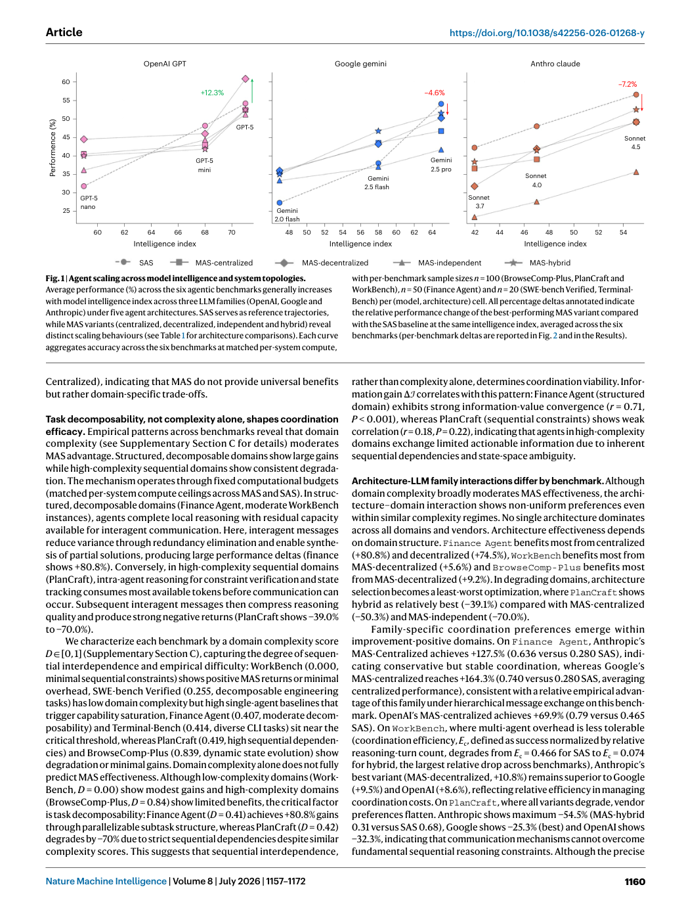
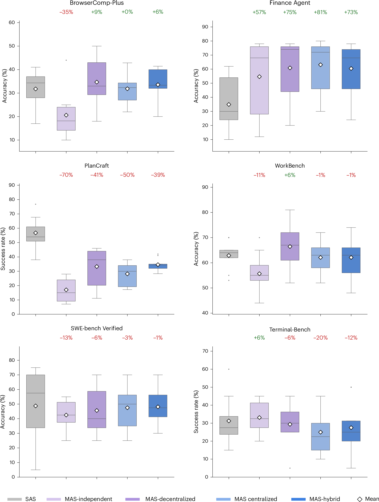
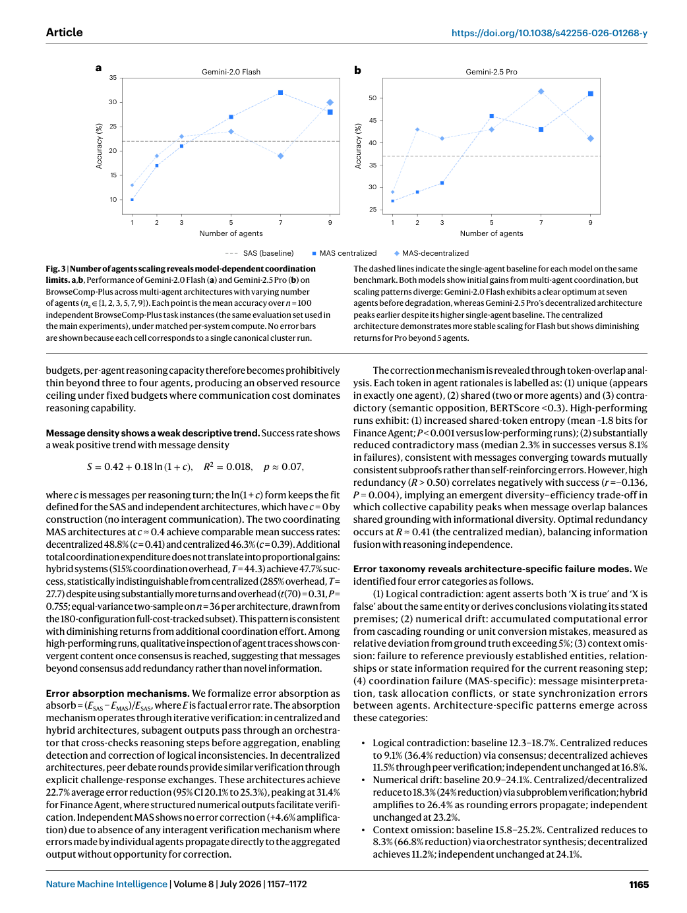

# Paper Card: Capable language models can outgrow the benefits of collaboration

**Language: English**

> Source coverage: Full paper with all main-text figures and tables
>
> Extraction confidence: High
>
> Locator mode: page-grounded
>
> Primary analytical lens: Methods
>
> Secondary analytical lens: Resource / benchmark
>
> Context verification: Official Nature Machine Intelligence article checked on 2026-08-07
>
> Card completeness: Complete relative to the main paper

## Terminology Ledger

| Canonical term | Meaning | Boundary used here |
|---|---|---|
| SAS | single-agent system | One model completes the full task |
| MAS | multi-agent system | Independent, centralized, decentralized, or hybrid topology |
| matched per-system compute | One compute ceiling per system | MAS agents share the system budget |
| capability-saturation threshold | Empirical rule near 45% | A tested selection heuristic, not a universal law |

## 01 Basic Information

- [Paper] Yubin Kim, Kai Gu, Chanwoo Park et al.; *Nature Machine Intelligence* 8, 1157–1172 (2026), published 24 July 2026. [Paper: PDF p. 1]
- [Paper] DOI: [10.1038/s42256-026-01268-y](https://doi.org/10.1038/s42256-026-01268-y).
- [Paper] Controlled comparison and predictive modelling across 260 configurations, three LLM families, and six agentic benchmarks. [Paper: PDF pp. 2–3]
- [Paper] The Version of Record is shared under CC BY-NC-ND 4.0. [Paper: PDF p. 20]

## 02 One-Sentence Summary

[Analysis] Under matched prompts, tools, and per-system compute, multi-agent benefit depends on task decomposability, the single-agent baseline, and coordination topology; effects range from +80.8% to −70.0%, so adding agents is not a generally beneficial intervention. [Paper: PDF pp. 3–5, Figures 1–2]

## 03 Research Question

- [Paper] When does MAS coordination improve or degrade performance relative to SAS on interactive tasks? [Paper: PDF pp. 1–3]
- [Paper] Can measured efficiency, overhead, redundancy, and error amplification predict the best topology? [Paper: PDF pp. 2, 6–8]
- [Analysis] The decisive question is whether measurable task–architecture properties support prospective selection rather than post-hoc explanation.

## 04 Research Background and Development Path

1. [Paper] Static benchmarks omit sustained environmental interaction. [Paper: PDF p. 2]
2. [Paper] Prior MAS comparisons often confound architecture with prompts, tools, or compute. [Paper: PDF p. 2]
3. [Paper] This study fixes those factors, varies topology and model capability, and records process metrics. [Paper: PDF pp. 2–3]
4. [Analysis] The transferable shift is from ranking systems to identifying reproducible task–architecture fit.

## 05 Core Pain Points Identified by the Paper

| Pain point | Manifestation | Explanation | Evidence |
|---|---|---|---|
| Heterogeneous benefit | The same MAS helps some tasks and harms others | Decomposability and coordination cost are misaligned | [Paper: PDF p. 5, Figure 2] |
| Unfair comparison | More agents can imply more tokens/calls | Budgets and tools are not matched | [Paper: PDF pp. 2, 19] |
| Endpoint-only reporting | Failure propagation remains invisible | Trace metrics are omitted | [Paper: PDF pp. 2, 7–8] |
| Weak cross-domain prediction | Within-domain selection is stronger than absolute transfer | Few benchmark clusters and domain shift | [Paper: PDF pp. 8, 16] |

## 06 Core Idea

- [Paper] Surface method: compare SAS and four MAS topologies under a shared system budget and fit a linear model with prespecified interactions. [Paper: PDF pp. 2–3, 7]
- [Paper] Core insight: coordination is costly information compression with possible error propagation; it pays only when task structure provides sufficient parallel value. [Paper: PDF pp. 2, 5]
- [Analysis] General lesson: report performance, cost, and error propagation together.

## 07 Method Overview

Six interactive task domains are evaluated with prompts, tool interfaces, and total system compute fixed. Model capability, agent count, and communication topology vary; outputs include success, cost, coordination metrics, and predicted topology. [Paper: PDF pp. 2–3, 18–19]

*Figure 1 establishes the overall scaling view before the paper disaggregates results by benchmark. [Paper: PDF p. 4, Figure 1]*

Flow: select task/model → run five topologies → collect success, tokens, messages, and traces → compute coordination metrics → cross-validate architecture selection.

## 08 Core Module Breakdown

| Module | Function | Input/output | Isolation evidence | Boundary |
|---|---|---|---|---|
| SAS | No-coordination reference | One trajectory→result | Reference for every relative change | No diversity search |
| Independent MAS | Parallel ensemble without messages | Independent trajectories→aggregation | Isolates ensemble effect | Shared runtime state may remain |
| Centralized | Orchestrator decomposition/verification | Sub-results→central synthesis | Lower error amplification than independent | Adds a bottleneck |
| Decentralized | Peer information fusion | Messages→joint result | Helps selected tool-heavy tasks | High communication cost |
| Hybrid | Hierarchy plus lateral communication | Multi-level messages→result | Most complex condition | Highest average turn count |

[Paper: PDF pp. 6, 18–19, Table 1]

## 09 Essential Formulas and Symbols

- [Paper] Equation 1, task error amplification: `A_e^task = E_MAS / E_SAS`; values above 1 indicate net error amplification. [Paper: PDF p. 18]
- [Paper] Equation 2, coordination overhead: `O = (T_MAS − T_SAS) / T_SAS × 100%`. [Paper: PDF p. 19]
- [Paper] Agent-count experiment: `T = 2.72(n + 0.5)^1.724`, an empirical fit within the tested configurations. [Paper: PDF p. 9, Figure 3]
- [Paper] Table 2 gives the full predictive coefficients; Table 3 defines the six benchmark settings. [Paper: PDF pp. 7, 10, Tables 2–3]

## 10 Experimental Design and Evidence Chain

| Experiment | Claim tested | Result | Supported conclusion | Unsupported stronger conclusion |
|---|---|---|---|---|
| Six-domain topology comparison | Is MAS generally better? | Finance Centralized +80.8%; PlanCraft Independent −70.0% | Benefit depends on task–topology fit | MAS is generally superior |
| 260-configuration model | Can metrics guide selection? | CV R² 0.373; ACI R² 0.413; 87% within-domain selection | There is usable within-domain signal | Accurate prediction in unseen domains |
| ~45% rule | Does a high SAS baseline reduce headroom? | Direction matched in 94% of 16 added cells | Useful empirical screen | Universal threshold established |
| Agent-count scaling | Is more monotonically better? | Optima differ between two Gemini models | Best count is model/topology dependent | More agents are always better |

[Paper: PDF pp. 5–9, Figures 2–3]

*Figure 2 combines absolute distributions with relative changes; its primary message is heterogeneity, not a global ranking. [Paper: PDF p. 5, Figure 2]*

*Figure 3 shows different peaks on the same benchmark, ruling out a model-free prescription for team size. [Paper: PDF p. 9, Figure 3]*

## 11 Correct Interpretation of the Conclusions

- [Paper] Compute is matched per system, so MAS divides the total budget across agents. [Paper: PDF p. 19]
- [Paper] The 87% figure is for held-out configurations within tested domains; leave-one-domain-out R² is −2.09. [Paper: PDF p. 8]
- [Paper] Several tool-count and interaction effects do not survive conservative cluster-robust correction and are presented as directional. [Paper: PDF pp. 2–3, 8]

## 12 Limitations Explicitly Acknowledged by the Authors

| Limitation | Manifestation | Proposed direction | Source |
|---|---|---|---|
| Limited domain coverage | Six tasks; n=20 cells for SWE/Terminal | Add embodied, multi-user, and long-horizon tasks | [Paper: PDF pp. 12–13] |
| Limited team heterogeneity | Mostly shared base architectures and prompts | Study specialized models and roles | [Paper: PDF p. 12] |
| Prompts not model-optimized | A common prompt supports control | Test architecture-specific tuning | [Paper: PDF p. 12] |
| Weak extrapolation | Few benchmark clusters | Validate after adding domains | [Paper: PDF pp. 8, 13] |

## 13 Critical Analysis

| [Analysis] Observation | Why it matters | Test | Basis |
|---|---|---|---|
| System-budget matching also thins per-agent reasoning | Coordination cost and individual-capacity loss may mix | Report both system-matched and per-agent-matched curves | [Paper: PDF p. 19] |
| Only six clusters support regression inference | Coefficients and thresholds may be unstable | Add domains and preregister external validation | [Paper: PDF pp. 7–8] |
| Success semantics differ by domain | A pooled mean can hide scale differences | Pair standardized effects with raw endpoints | [Paper: PDF pp. 10, 19] |

## 14 Knowledge Learned

- Agent-derived knowledge candidate: use matched small multiples that show distributions, means, and relative change.
- Agent-derived knowledge candidate: keep null outputs, incorrect outputs, cost, and error propagation as separate endpoints.
- Agent-derived knowledge candidate: distinguish within-domain selection from cross-domain prediction and clinical transfer.

## 15 Connections to related research

[Analysis] This paper can inform evidence organization and figure design in related research; its tasks, data, metrics and conclusions cannot be transferred directly to other application domains.

## 16 Open questions

[Analysis] Future work should validate the reported method on independent datasets and report uncertainty, failure cases, and distribution shifts transparently.
