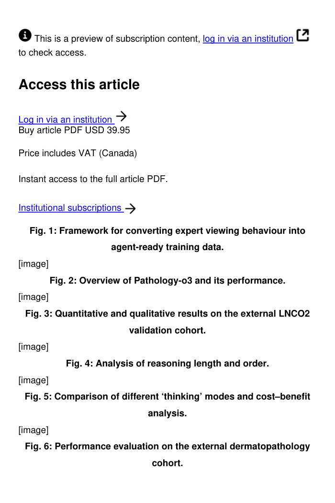

# Figure Analysis: Pathology-CoT: learning visual chain-of-thought agents from expert whole-slide image diagnosis behaviour

This companion analyses the source visuals embedded in the English Paper Card. Assets are unchanged PDF page views; no figure was regenerated.

## Figure 1

- **Argumentative role:** Framework for converting expert viewing behaviour into agent-ready training data. [image]
- **Panel / visual logic:** Read the panel labels, axes, legends, and uncertainty marks before comparing conditions. The page view is retained so the full caption and neighbouring interpretation remain visible.
- **Reusable design:** Preserve a one-to-one mapping among workflow stage, comparison, metric, and claim.
- **Boundary:** This visual supports only the conditions and endpoints stated in the source; it does not establish transfer beyond the evaluated setting.
- **Locator:** [Paper: PDF p. 4, Figure 1]

## Figure 2

- **Argumentative role:** Overview of Pathology-o3 and its performance. [image]
- **Panel / visual logic:** Read the panel labels, axes, legends, and uncertainty marks before comparing conditions. The page view is retained so the full caption and neighbouring interpretation remain visible.
- **Reusable design:** Preserve a one-to-one mapping among workflow stage, comparison, metric, and claim.
- **Boundary:** This visual supports only the conditions and endpoints stated in the source; it does not establish transfer beyond the evaluated setting.
- **Locator:** [Paper: PDF p. 4, Figure 2]

## Figure 3

- **Argumentative role:** Quantitative and qualitative results on the external LNCO2 validation cohort. [image]
- **Panel / visual logic:** Read the panel labels, axes, legends, and uncertainty marks before comparing conditions. The page view is retained so the full caption and neighbouring interpretation remain visible.
- **Reusable design:** Preserve a one-to-one mapping among workflow stage, comparison, metric, and claim.
- **Boundary:** This visual supports only the conditions and endpoints stated in the source; it does not establish transfer beyond the evaluated setting.
- **Locator:** [Paper: PDF p. 4, Figure 3]

## Figure 4

- **Argumentative role:** Analysis of reasoning length and order. [image]
- **Panel / visual logic:** Read the panel labels, axes, legends, and uncertainty marks before comparing conditions. The page view is retained so the full caption and neighbouring interpretation remain visible.
- **Reusable design:** Preserve a one-to-one mapping among workflow stage, comparison, metric, and claim.
- **Boundary:** This visual supports only the conditions and endpoints stated in the source; it does not establish transfer beyond the evaluated setting.
- **Locator:** [Paper: PDF p. 4, Figure 4]

## Figure 5

- **Argumentative role:** Comparison of different ‘thinking’ modes and cost–benefit analysis. [image]
- **Panel / visual logic:** Read the panel labels, axes, legends, and uncertainty marks before comparing conditions. The page view is retained so the full caption and neighbouring interpretation remain visible.
- **Reusable design:** Preserve a one-to-one mapping among workflow stage, comparison, metric, and claim.
- **Boundary:** This visual supports only the conditions and endpoints stated in the source; it does not establish transfer beyond the evaluated setting.
- **Locator:** [Paper: PDF p. 4, Figure 5]

## Figure 6

- **Argumentative role:** Performance evaluation on the external dermatopathology cohort.
- **Panel / visual logic:** Read the panel labels, axes, legends, and uncertainty marks before comparing conditions. The page view is retained so the full caption and neighbouring interpretation remain visible.
- **Reusable design:** Preserve a one-to-one mapping among workflow stage, comparison, metric, and claim.
- **Boundary:** This visual supports only the conditions and endpoints stated in the source; it does not establish transfer beyond the evaluated setting.
- **Locator:** [Paper: PDF p. 4, Figure 6]

## Cross-figure reading rule

Read workflow figures before performance figures, then connect every visual comparison to its metric, evaluation population, and claim boundary. Visual density is evidence organisation, not independent proof of generality.