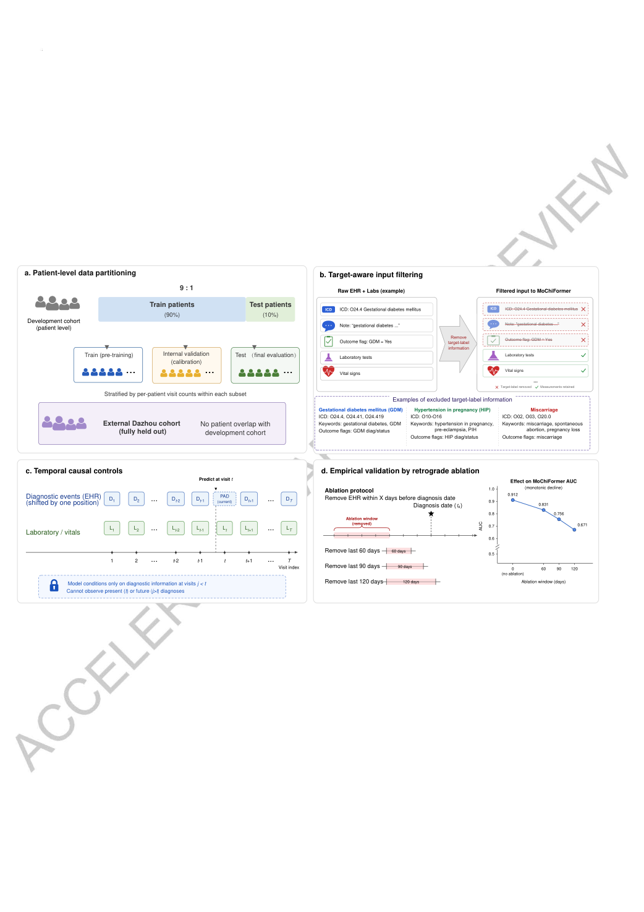
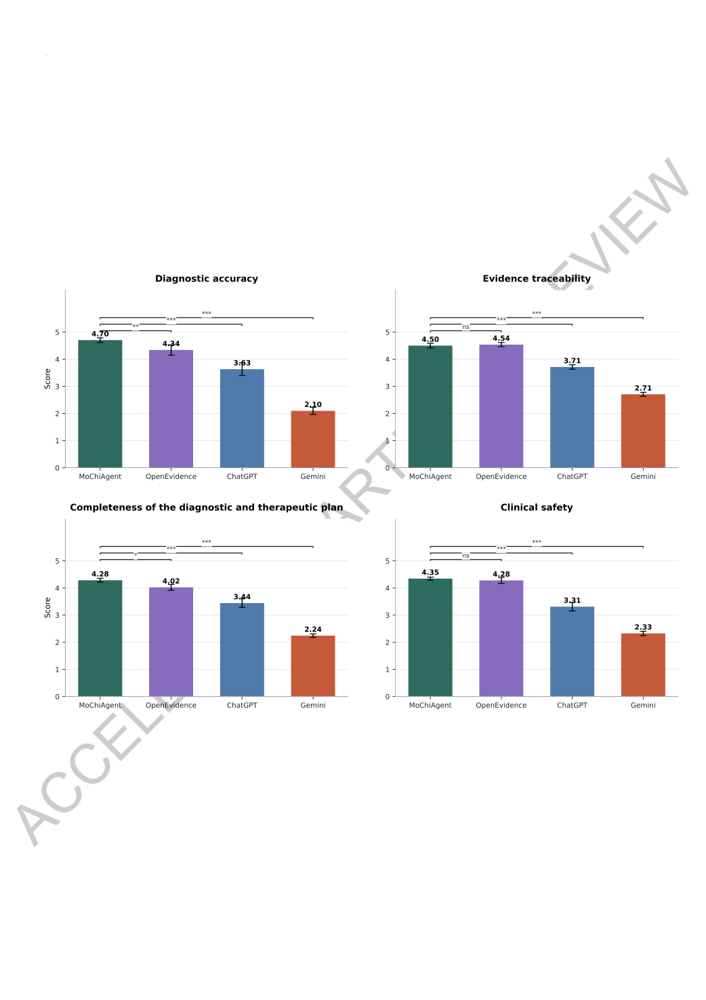
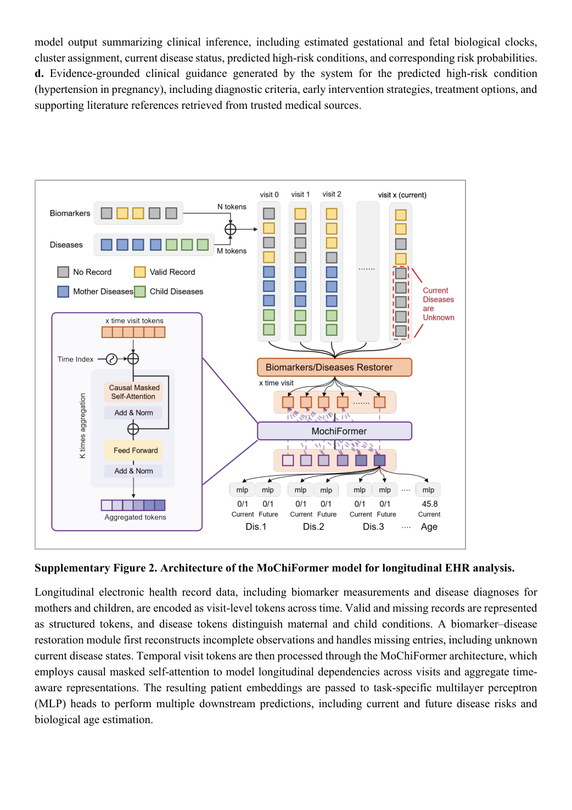
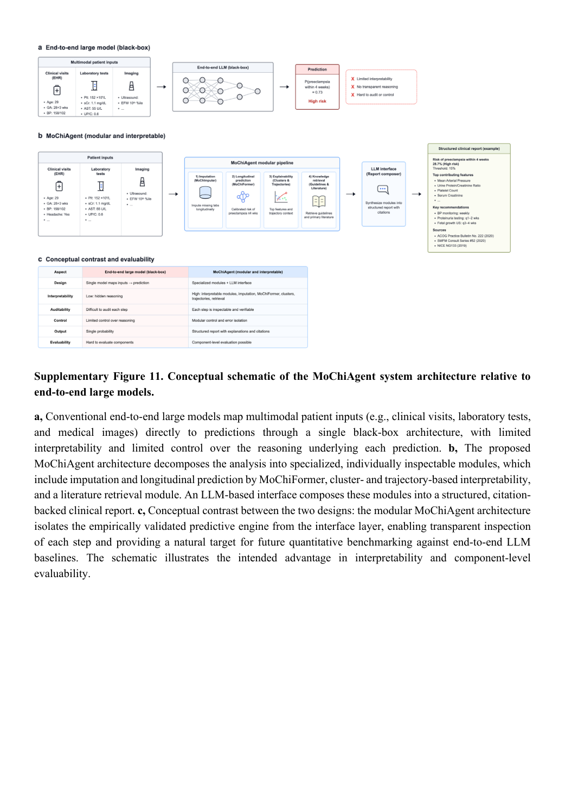

# MoChiAgent: figure-by-figure analysis

> Figures are faithful page renders from the official *Nature Medicine* Accelerated Article Preview. Each entry separates the question, visual encoding, supported result and claim boundary.

## Figure 1 — System overview (PDF p.59)

- **Question:** How are longitudinal mother–infant EHRs converted into a prediction- and evidence-bearing clinical report?
- **Encoding:** Panel a shows the end-to-end flow, b separates four tool families, and c unifies pregnancy and infancy on a timeline.
- **Result:** The numerical engine, LLM report layer, retrieval and visualization are distinct components.
- **Boundary:** This is a conceptual architecture; it does not establish independent accuracy, safety or citation fidelity for any component.

## Figure 2 — Age estimation, SHAP and developmental trajectories (PDF p.60)

- **Question:** Does the representation capture fetal, gestational and infant developmental stage and associated variables?
- **Encoding:** Panels a–f plot observed versus predicted age, g–i are SHAP summaries, and j–m show UMAP/pseudotime flows.
- **Result:** Internal correlations are strong, while external error increases; external gestational-age (R^2=.57) is a notable transport loss.
- **Boundary:** Predicting chronological age does not automatically validate an independent biological-age construct; visual UMAP continuity is not proof of a developmental mechanism.

## Figure 3 — Maternal phenotype clusters and risk (PDF p.61)

- **Question:** Do clusters discovered in development data separate disease risk in held-out patients?
- **Encoding:** Panel a is a cluster-by-disease hazard-ratio heatmap; b–i compare outcome rates in the highest and lowest risk quartiles.
- **Result:** Several maternal disorders show substantial stratification, supporting prognostic information in the representation.
- **Boundary:** Eight two-proportion Z tests are unadjusted; model-defined risk groups are not causal or treatment-response subtypes.

## Figure 4 — Current diagnosis and future prediction (PDF p.62)

- **Question:** Does multi-task disease discrimination persist internally and externally?
- **Encoding:** Maternal and infant AUROC/F1 are separated by cohort and current/future task.
- **Result:** Current-disease discrimination generally exceeds future prediction, while external discrimination remains substantial overall.
- **Boundary:** Text rendering is partly garbled in this preview, so labels and values require text/table confirmation. AUROC alone does not establish threshold-level clinical utility.

## Figure 5 — Cross-generational risk and maternal-information gain (PDF p.63)

- **Question:** Are maternal phenotypes associated with infant outcomes, and does maternal EHR improve infant prediction?
- **Encoding:** Panel a is a maternal-cluster-by-infant-disease HR heatmap; b–i compare high/low risk groups; j–k compare infant-only with infant-plus-mother AUC.
- **Result:** Hazard ratios for neonatal jaundice and blood disease are about 2.8, and several AUCs improve when maternal data are added.
- **Boundary:** This is observational association. Shared environment, healthcare use and coding can confound it; causality is not established.

## Figure 6 — Example end-to-end report (PDF p.64)

- **Question:** How are tool outputs assembled into a clinician-readable report?
- **Encoding:** Panel a connects query, EHR, restoration, MoChiFormer, literature matching and report; b shows risk, threshold, SHAP features, monitoring suggestions and literature.
- **Result:** The format exposes key intermediate evidence and is structurally auditable.
- **Boundary:** The example's 18.7% risk, 15% threshold and recommendations are not universal validated rules, and the phrase “all statements supported” is not a sentence-level citation audit.

## Extended Data Figure 5 — Leakage-control protocol (PDF p.69)

- **Value:** This goes beyond non-overlapping train/test data. It combines patient-level splitting, deletion of target ICD codes/keywords/outcome flags, temporal shifting for current diagnosis, and declining AUC as 30–120 days before diagnosis are removed.
- **Boundary:** Laboratory and vital-sign proxies may be legitimate predictors or near-label surrogates. Retrograde ablation reduces but cannot exhaust proxy leakage.

## Extended Data Figure 7 — Physician scoring (PDF p.71)

- **Result:** MoChiAgent exceeds OpenEvidence on accuracy and completeness and is close on traceability and safety; GPT-5.5 and Gemini 3.1 Pro score lower.
- **Inference unit:** 25 cases, with six specialist ratings averaged for each case/system before paired testing.
- **Audit issue:** Source values span 0–5 despite “five-point” wording; SEM is calculated over case means; tie/zero handling for Wilcoxon is unspecified; at least 12 comparisons are unadjusted.
- **Condition issue:** Baselines lack tools while MoChiAgent has a specialist predictor and retrieval. This is a package comparison, not an equal-permission foundation-model comparison.

## Supplementary Figure 2 — MoChiFormer architecture (SI p.2)

- **Structure:** Laboratory and disease tokens feed restoration, causal masked temporal self-attention and multi-task MLP heads.
- **Key point:** One shared representation supports current/future disease and age tasks, but diagrammed module boundaries are not equivalent to separately measured ablations.

## Supplementary Figure 11 — Modular versus end-to-end black box (SI p.13)

- **Authors' claim:** A modular design is more interpretable, controllable and amenable to component-level evaluation.
- **Appropriate use:** Treat the figure as a design principle and benchmark blueprint.
- **Not established:** The paper does not show that modularity outperforms an end-to-end LLM under matched inputs, backbone, tools and budgets.
