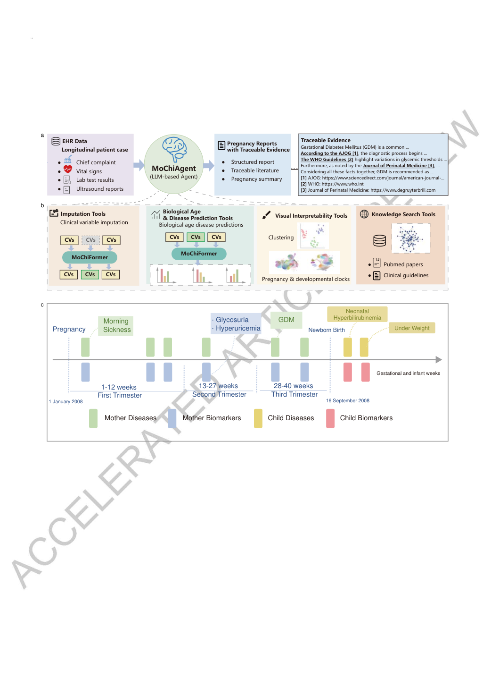
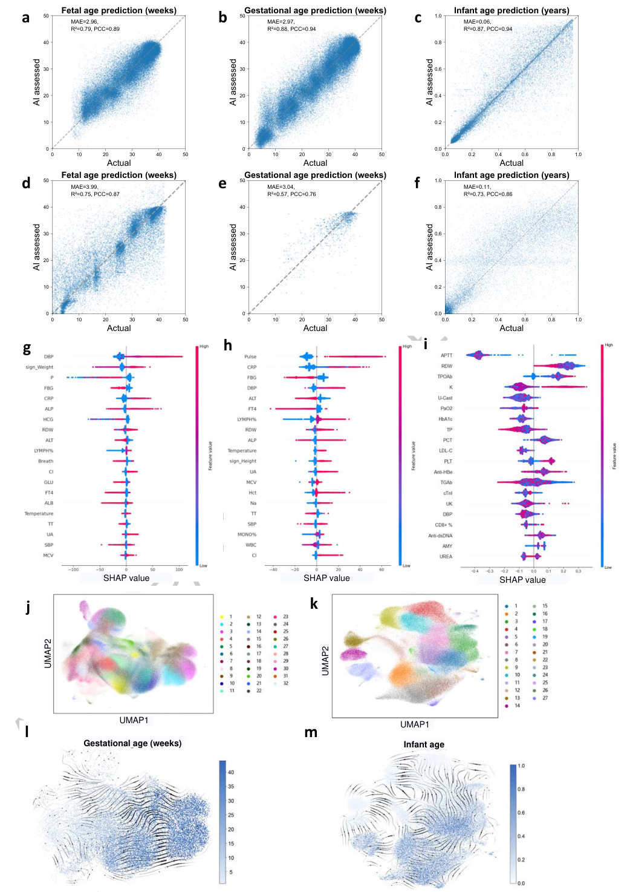
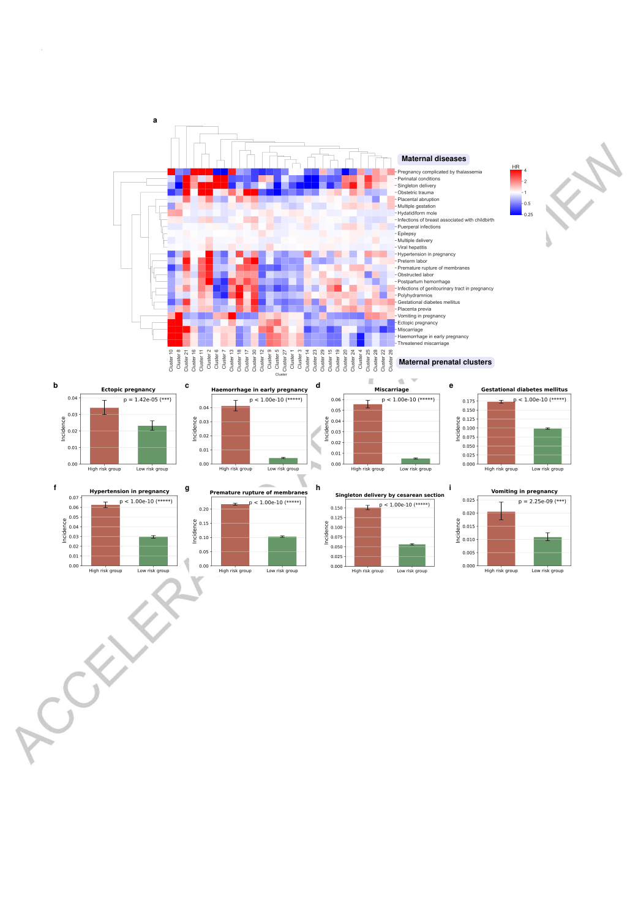
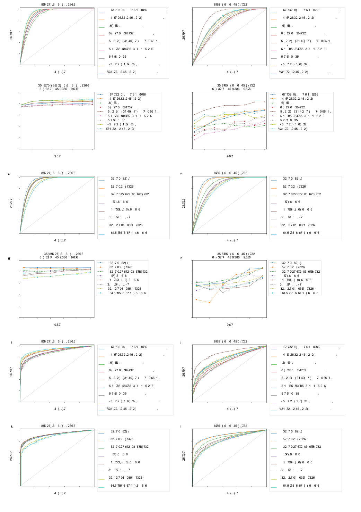
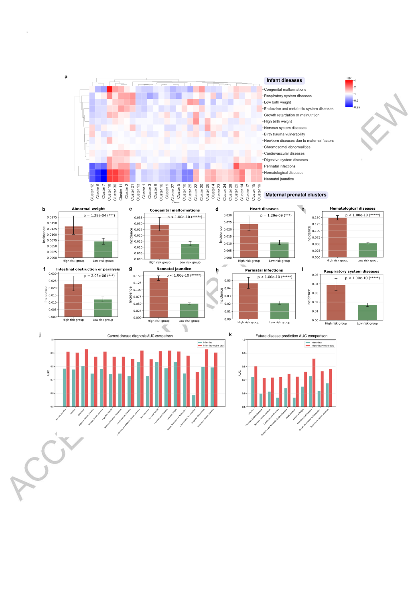
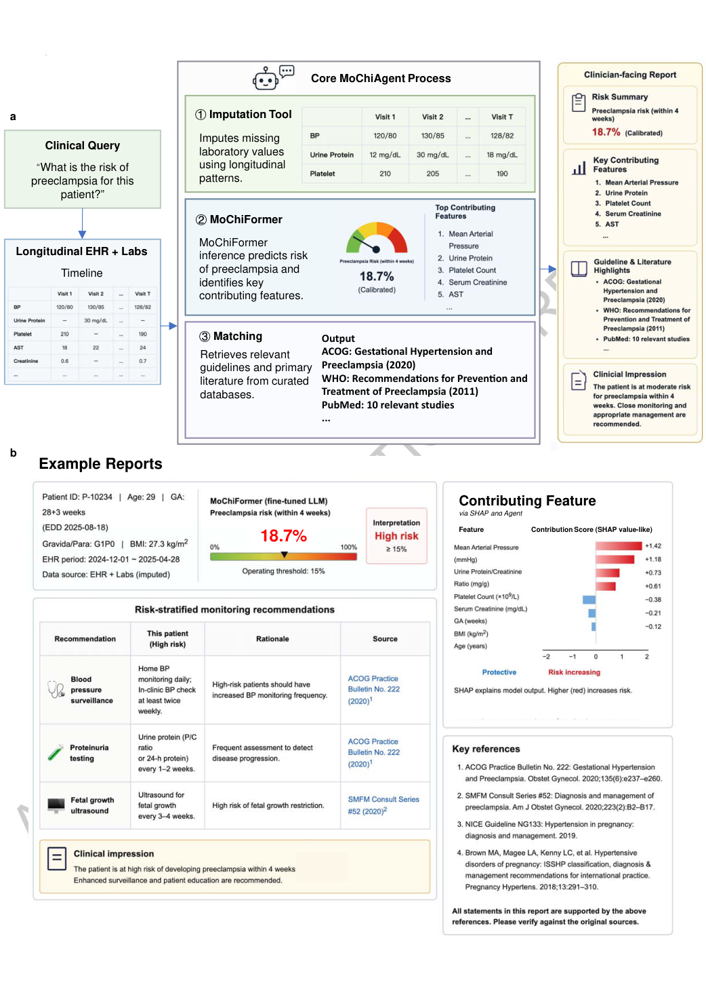

# Deep-Reading Paper Card: MoChiAgent

> **Source coverage:** Full paper + Supplementary Information + Reporting Summary + supplementary tables + physician-rating source data  
> **Extraction confidence:** High for the main paper and SI; the image-based Reporting Summary was visually checked  
> **Locator mode:** page-grounded; `PDF p.` refers to the physical page in the official Accelerated Article Preview  
> **Primary analytical lens:** Methods / system  
> **Secondary analytical lens:** Clinical / population  
> **Context verification:** Targeted external check, not a systematic review  
> **Card completeness:** Complete relative to the supplied source package  
> **Version:** *Nature Medicine* Accelerated Article Preview, published 4 September 2026; the Version of Record may change pagination or presentation

### Terminology ledger

| Term | Meaning used in this card |
|---|---|
| MoChiAgent | Mother–Child AI Agent: the full modular interface combining prediction, interpretation, retrieval and report generation |
| MoChiFormer | The longitudinal EHR representation and prediction engine inside MoChiAgent |
| Longitudinal EHR | Repeated structured visits containing laboratory values, vital signs, diagnoses and related events |
| Agent-interface pilot | The offline specialist review of generated reports for 25 enriched cases; not a live clinical trial |
| Held-out internal evaluation | Patient-level internal test data excluded from training and tuning |

## 01 Basic information

| Field | Details |
|---|---|
| Title | *Prediction of maternal and infant outcomes from longitudinal electronic health records with a Mother-Child AI agent* |
| Authors | Liu S, Zheng W, Kang J, et al.; International Consortium of Digital Twins in Healthcare and Medicine |
| Journal / year | *Nature Medicine*, 2026, Accelerated Article Preview |
| DOI | [10.1038/s41591-026-04694-y](https://doi.org/10.1038/s41591-026-04694-y) |
| System | Mother–Child AI Agent (MoChiAgent); core predictor: MoChiFormer |
| Domain | Longitudinal EHR, maternal and infant risk prediction, biological/developmental age, clinical AI agents |
| Data | Three hospitals in China; two for development/internal evaluation and Dazhou Central Hospital for external evaluation |
| Code | [peterzheng98/mochiagent](https://github.com/peterzheng98/mochiagent); the paper also lists MUST code |
| Data access | Individual clinical records are privacy-restricted; de-identified data may be requested from the corresponding author [Paper: PDF p.58] |
| Read on | 8 September 2026 |
| Relevance to biomedical agents | A close precedent for modular clinical-agent design and for separating predictor validation from interface evaluation; it does not validate dental implant planning cases, endpoints or thresholds |

## 02 One-sentence summary

The study trains a hierarchical Transformer on longitudinal maternal–infant EHRs to learn visit-level and cross-visit representations for restoration, age estimation, present-disease classification and future-disease prediction, then wraps that predictor in a modular agent that can invoke interpretation and retrieval tools; the strongest evidence concerns the retrospective MoChiFormer predictor, whereas the full MoChiAgent interface is evaluated only through an offline six-specialist review of 25 enriched cases. [Paper: PDF p.14; PDF pp.25–27; PDF pp.43–58]

## 03 Research question

- **Concrete question:** Can routinely collected longitudinal EHRs integrate sparse, multi-visit and multi-task information across pregnancy, delivery and infancy into a system that restores missing values, predicts outcomes, stratifies risk and produces evidence-grounded reports?
- **Why it matters:** Perinatal risk evolves with gestational age and accumulating visits. Cross-sectional models discard this temporal evidence and usually separate maternal and infant records. [Paper: PDF pp.14–16]
- **Gap identified by the authors:** Prior approaches commonly cover limited endpoints, depend on costly tests or imaging, or lack longitudinal interpretability and mother–child linkage. [Paper: PDF p.14]
- **Precisely stated question:** Can one longitudinal representation support missing-value restoration, biological/developmental-clock estimation, current and future disease prediction, phenotype discovery and maternal-to-infant risk stratification, while remaining usable through a modular clinical interface?

## 04 Background and development path

| Stage | Typical approach | Strength | Limitation | Role in this paper |
|---|---|---|---|---|
| Single-endpoint clinical models | Structured features plus regression or conventional machine learning | Transparent, task-specific | Weak use of long trajectories, missingness and shared multi-task information | Baseline motivation |
| Medical sequence models | RETAIN, BEHRT, Med-BERT | Learn visit sequences | Often designed for one population or task and not explicitly mother–infant coupled | Restoration/prediction comparators |
| Multi-task longitudinal representation | Within-visit encoder plus causal temporal decoder | Shares information across time and tasks | Retrospective and potentially sensitive to coding and site workflow | MoChiFormer's empirical core |
| Modular clinical agent | Predictor plus trajectories, explanations, retrieval and LLM report composition | Closer to clinical workflow; components can in principle be audited | The agent layer lacks prospective workflow validation | MoChiAgent prototype |

The first three stages are supported by the main experiments. The claim that modularity is preferable to an end-to-end black box is primarily a design argument in Supplementary Figure 11, not a controlled head-to-head ablation. [Paper: Supplementary PDF p.13]

## 05 Core problems identified by the paper

| Problem | Observable manifestation | Cause or authors' explanation | Evidence |
|---|---|---|---|
| Sparse and missing EHR values | Laboratory tests are not collected at every visit | Clinical measurement is need-driven | Restoration comparisons: binary mean F1 about 0.50 and AUC about 0.79; continuous mean PCC about 0.39 [Paper: PDF pp.16–17; PDF p.66] |
| Underused longitudinal information | Early-pregnancy prediction is weaker | Risk signals accumulate over gestation | Maternal future-outcome mean AUROC rises from about 0.64 at week 14 to about 0.77 with the complete sequence [Paper: PDF p.21; PDF p.68] |
| Label-leakage risk | Same-visit diagnoses, keywords or outcome flags may reveal the endpoint | Recorded diagnoses and prediction targets share data provenance | Patient-level splitting, target filtering, diagnosis shifting and retrograde window deletion [Paper: PDF pp.22–23, 47–55; PDF p.69] |
| Fragmented mother–infant information | Infant risk may depend on the maternal trajectory | The two generations are often modelled separately | Maternal clusters associate with infant outcomes; some infant AUCs improve when maternal EHR is added [Paper: PDF pp.23–25; PDF p.63] |
| Poor workflow fit of isolated probabilities | A number alone lacks provenance, interpretation and actionability | Predictor and clinical interaction layer are disconnected | Four tool families and a report template [Paper: PDF pp.25–27, 43–45; PDF p.64] |

## 06 Central idea

1. **Surface-level method:** Encode variables within each visit, aggregate visits with a causal temporal Transformer, and attach task heads for restoration, age and disease outcomes.
2. **Deeper design:** Separate shared longitudinal representation learning from downstream clinical tasks, then separate the validated predictor from explanation, retrieval and report generation.
3. **[Analysis] Transferable principle:** A clinical agent requires three distinct answers: whether its numerical modules are valid, whether the assembled system is reliable, and whether using it improves clinical decisions. A global Likert score cannot substitute for all three.

## 07 Method overview

Figure 1a follows the path from longitudinal EHR to a traceable pregnancy report; 1b separates restoration, age/disease prediction, visual interpretation and knowledge retrieval; 1c places maternal and infant events on a shared timeline. It is an architecture diagram, not performance evidence. [Paper: PDF p.59]

**Input-to-output flow:**

`maternal/infant laboratory values, vital signs, diagnoses and structured events over repeated visits`  
→ value binning, categorical encoding, missingness markers and target-label filtering  
→ within-visit Transformer  
→ GPT-2-style causal temporal modelling across visits  
→ restoration, fetal/gestational/infant age, current disease, future disease and shared representation  
→ PCA/UMAP/Leiden, trajectories and SHAP  
→ knowledge retrieval plus LLM tool routing/report composition  
→ clinician-facing risks, evidence, explanations and suggestions.

The visit encoder uses 2 layers, 12 heads, hidden size 768, feed-forward size 3,072 and dropout 0.1. The temporal module is a 12-layer GPT-2 with 12 heads, an 8,192-token/visit maximum and FlashAttention-2. Pretraining uses 200 epochs (Adam, learning rate (10^{-3}), weight decay (10^{-6})); fine-tuning uses 100 epochs and learning rate (10^{-4}). [Paper: PDF pp.47–55; Supplementary PDF pp.1–2]

## 08 Core modules

| Module | Function | Input → output | Supporting evidence | What removal would mean |
|---|---|---|---|---|
| Visit encoder | Models relations among variables within a visit | Visit tokens → visit embedding | Methods [Paper: PDF pp.47–53] | `[Measured, indirect]` Classifiers/XGBoost/SVM without the learned embedding are weaker, but this is not a clean layer ablation [Paper: PDF p.70] |
| Temporal decoder | Aggregates history causally | Visit embeddings → time-aware patient embedding | Methods and window deletion [Paper: PDF pp.50–55; PDF pp.67–69] | `[Measured, indirect]` Removing 30–120 days before diagnosis progressively lowers AUROC; this tests available history, not architectural deletion |
| Restoration heads | Reconstruct missing variables | Masked features → restored values | Restoration experiments [Paper: PDF pp.16–17; PDF p.66] | `[Measured]` Compared with XGBoost, KNN, summary statistics and medical Transformers; downstream safety is not established |
| Disease and age heads | Convert shared representation to endpoints | Patient embedding → probability or age | Figures 2 and 4 [Paper: PDF pp.60, 62] | `[Measured, indirect]` Common-input baselines are weaker, with heterogeneous gains across tasks |
| Cluster and trajectory analysis | Finds phenotypes, pseudotime and risk groups | Embedding → cluster/trajectory/hazard ratio | Figures 2, 3 and 5; SI Figures 3–10 | `[Expected]` Prediction heads remain, but population-level interpretation is lost; no complete ablation is reported |
| Knowledge retriever | Retrieves papers/guidance | Query or condition → passages/citations | Agent Methods and Figure 6 [Paper: PDF pp.43–45; PDF p.64] | `[Expected]` Traceability should fall; the retriever is not separately benchmarked |
| LLM interface | Routes tools and composes structured reports | Query plus tool outputs → report | Agent Methods and SI Figure 11 | Called a prototype scaffold; no independent benchmark of routing or citation correctness is reported |

## 09 Essential equations and notation

### 9.1 Pretraining reconstruction objective

For masked features (M), the model combines categorical cross-entropy, continuous-variable mean-squared error and a weighted regularisation term:

\[
\mathcal{L}_{pre}=\mathcal{L}_{cat}+\mathcal{L}_{num}+\beta\mathcal{L}_{KL}.
\]

Here, \(\mathcal{L}_{cat}\) reconstructs discrete variables, \(\mathcal{L}_{num}\) reconstructs continuous values and \(\beta\) weights regularisation. Intuitively, the model first learns how a longitudinal record coheres before learning a clinical endpoint. [Paper: PDF pp.50–53]

### 9.2 Multi-disease fine-tuning

\[
\mathcal{L}_{fine}=\frac{1}{N}\sum_{i=1}^{N}\sum_{d=1}^{D}
\mathcal{L}_{BCE}(y_{i,d},\hat y_{i,d}).
\]

(N) is the number of eligible samples, (D) the number of disease tasks, and (y) and (\hat y) the observed label and predicted probability. The paper additionally uses focal loss for imbalance, MSE for age and a pairwise relation loss to preserve relative relationships. [Paper: PDF pp.51–53]

### 9.3 Physician scores and paired inference

For case (c), system (s), criterion (d) and six raters (j):

\[
\bar r_{c,s,d}=\frac{1}{6}\sum_{j=1}^{6}r_{c,s,d,j}.
\]

The authors then apply a Wilcoxon signed-rank test to 25 paired case-level differences, (\bar r_{c,MoChi,d}-\bar r_{c,baseline,d}). [Paper: PDF pp.25–27; PDF pp.44–45]

Using cases rather than 150 physician-by-case observations as independent units is directionally appropriate. However, the zero-difference rule, tied-rank handling, exact-versus-asymptotic algorithm and multiplicity policy are unspecified, preventing exact reproduction of all reported P values.

## 10 Experimental design and evidence chain

### Data, split and comparisons

- Development sources: 1,064,733 mothers with 3,682,209 visits and 393,375 infants with 719,390 visits; total 1,458,108 participants and 4,401,599 visits.
- External cohort: 75,816 mothers with 263,452 visits and 14,418 infants with 23,192 visits at a third hospital.
- Patients are first divided into 90% development and 10% held-out internal testing. A tuning/calibration subset equivalent to 10% of the full cohort is then held out from development, yielding the 80% training, 10% tuning and 10% internal-test display in Extended Data Figure 1. Representations and clusters are fixed in the training–tuning cohort before held-out projection. [Paper: PDF pp.43–49, 57; PDF p.65]
- Baselines include a classifier without the learned embedding, XGBoost and SVM; restoration additionally compares KNN, mean/median imputation, RETAIN, BEHRT and Med-BERT.
- Metrics include AUROC, maximum-F1 point on the precision–recall curve and macro-averages; age MAE/R²/PCC; calibration/Brier score; decision curves; and bootstrap 95% confidence intervals.

Internal fits are tighter than external fits; external gestational-age (R^2) falls from 0.88 to 0.57. SHAP and two-dimensional trajectories are interpretive views, not proof of a biological mechanism. [Paper: PDF pp.17–19; PDF p.60]

Training-defined clusters and top/bottom risk quartiles separate outcomes in held-out data. Eight two-proportion Z tests are not multiplicity-adjusted, and data-driven phenotypes are not causal subtypes. [Paper: PDF pp.18–21; PDF p.61]

The figure summarizes maternal and infant internal/external AUROC and F1. Some labels are garbled in the preview rendering, so values should be checked against text, legends and source tables rather than transcribed from the image alone. [Paper: PDF pp.20–24; PDF p.62]

Maternal clusters associate with infant outcomes, and adding maternal EHR improves some infant AUCs. This is a transgenerational association, not causal evidence; shared healthcare use, coding and social context remain possible confounders. [Paper: PDF pp.23–25; PDF p.63]

The example makes the risk estimate, operating threshold, contributing features, suggestions and literature visible. The displayed 18.7% risk, 15% threshold and recommendations are illustrative, not universally validated rules; “all statements supported” is not a sentence-level citation audit. [Paper: PDF p.64]

| Experiment | Claim tested | Main result | What it supports | What it does not support | Source |
|---|---|---|---|---|---|
| Missing-value restoration | A shared representation can restore sparse variables | Binary mean F1 ≈0.50, AUC ≈0.79; continuous mean PCC ≈0.39 | Aggregate superiority to listed baselines under the authors' tasks | Safe individual use of every imputed variable | PDF pp.16–17; ED Fig.2 |
| Age/developmental clocks | Representations contain developmental-stage signal | Internal fetal-age MAE 2.96 weeks/R² .79; gestational age 2.97 weeks/.88; infant age .06 years/.87; all decline externally | Age-related state can be estimated and partly transfers | Measurement of an independent causal “biological age” | PDF pp.17–19; Fig.2 |
| Current/future diseases | One representation supports multiple endpoints | External maternal current AUROC .870–.934 and future .700–.867; infant current .864–.916 and future .801–.908 | Discrimination persists at a third hospital | Readiness for deployment or uniformly good calibration | PDF pp.20–24; Fig.4 |
| Leakage controls | Performance is not entirely direct target disclosure | Patient split, target filtering, diagnosis shift and 30/60/90/120-day deletion; AUROC falls as history is removed | Pre-diagnosis history contains predictive information | Elimination of all proxy leakage or measurement-trigger bias | PDF pp.22–23, 47–55; ED Fig.5 |
| Cluster risk | Learned embeddings enable reproducible stratification | Fixed clusters and held-out high/low groups separate several outcomes | Phenotypes are prognostically associated | Stable biological subtypes or treatment targets | PDF pp.18–21, 57; Fig.3 |
| Cross-generational risk | Maternal EHR adds information for infant outcomes | Neonatal jaundice HR 2.81 (2.60–3.03), blood disease HR 2.83 (2.62–3.05); selected AUCs improve | Maternal trajectory is informative | A maternal-cluster causal effect | PDF pp.23–25; Fig.5 |
| 25-case physician review | Whether full reports are preferred offline | Six blinded perinatal specialists; MoChiAgent accuracy 4.70, traceability 4.50, completeness 4.28 and safety 4.35 | High average ratings on enriched difficult cases and performance close to OpenEvidence on traceability/safety | Clinical benefit, safety non-inferiority, deployment readiness or superiority under equal tools | PDF pp.25–27, 44–45; ED Fig.7; source data |

### Deep audit of the scoring design

The Methods call all four criteria—diagnostic accuracy, evidence traceability, management-plan completeness and clinical safety—a **five-point Likert scale**. The released workbook actually contains values **0, 1, 2, 3, 4 and 5**. Across all systems and raters, the four criteria contain 32, 4, 10 and 6 zero-valued ratings, respectively. Treating zero as a valid score exactly reproduces the published means. This is a substantive coding/description inconsistency: the authors should state whether zero is the lowest anchor, “not assessable,” missing, or no credit.

Recomputing case-level means and using a standard SciPy Wilcoxon implementation reproduces the direction but not every reported P value. For diagnostic accuracy, MoChiAgent versus GPT-5.5 gives (2.44\times10^{-5}) under one common automatic implementation versus (4.77\times10^{-7}) in the paper; versus OpenEvidence gives 0.0181 versus 0.0066. Exact mode gives still another result. The numerical means are reproducible, but exact significance values require the software version, zero/tie settings and exact/approximate choice.

Other limitations of the scoring design are important:

- Four criteria × three baselines imply at least 12 hypothesis tests, with no reported multiplicity correction.
- Rubric anchors, rater training and inter-rater reliability are not reported.
- Cases were enriched for diagnostic difficulty or clinical importance rather than sampled at clinical prevalence.
- Baselines were evaluated **without tool access**, whereas MoChiAgent used MoChiFormer and retrieval; this compares system packages, not equally equipped LLMs.
- Ratings measure expert impressions of reports—not patient outcomes, changed decisions, time, alert burden or observed safety events.

## 11 Correct interpretation of the conclusions

- **Task scope:** Multi-endpoint longitudinal EHR prediction and phenotype analysis; not medical imaging, multimodal bedside monitoring or autonomous treatment.
- **Reference labels:** Mostly EHR diagnosis and outcome codes, which partly reflect documentation behaviour rather than an independently re-adjudicated gold standard.
- **End-to-end status:** MoChiFormer is extensively quantified. Tool routing, citation correctness and report factual consistency are not separately benchmarked. The Methods call the LLM interface a prototype deployment scaffold. [Paper: PDF pp.43–45]
- **Historical-data dependence:** All performance evidence is retrospective; external validation is a single third hospital within China.
- **Thresholds:** Disease thresholds maximise F1 in the validation cohort. The authors acknowledge that deployment thresholds must reflect prevalence, workflow, resources and false-positive/false-negative costs. [Paper: PDF pp.55–56]
- **Boundary statement:** MoChiFormer shows strong multi-task discrimination and risk stratification on patient-separated internal data and retrospective data from a third Chinese hospital. MoChiAgent demonstrates a modular way to expose those results, but it has not shown net clinical benefit or real-world safety.

## 12 Limitations explicitly acknowledged by the authors

| Limitation | Manifestation | Future direction | Source |
|---|---|---|---|
| Geographic/system scope | All hospitals are in China; populations and EHR structures may differ elsewhere | Broader multi-centre and cross-regional validation | PDF pp.26–27 |
| Completeness and workflow variation | Visit frequency, testing practice and missingness vary by site | Validate more systems and model site effects | PDF p.26 |
| Limited modalities | Inputs are mainly structured laboratory and EHR variables | Add notes, imaging, medications and social determinants | PDF p.26 |
| Limited individual explanation | SHAP and trajectories explain only part of deep representations | Stronger patient-level explanation | PDF p.26 |
| Small full-agent evaluation | 25 cases and six perinatal specialists | More sites, cases, reviewers and baselines | PDF pp.26–27 |
| Non-deployment threshold | Current thresholds maximise validation F1 | Prospective local thresholds using prevalence/resources/error costs | PDF pp.55–56 |
| Unknown prospective utility | No live decisions, outcomes, safety, human-factors, alert-fatigue, fairness, governance or updating study | Prospective deployment evaluation | PDF p.27 |

## 13 Critical analysis

| `[Analysis]` observation | Concern or alternative explanation | Why it matters | How to test | Basis |
|---|---|---|---|---|
| Scale description conflicts with source data | “Five-point” but values span 0–5; zero is undefined | Changes mean interpretation and reproducibility | Publish anchors/data dictionary and reanalyse under a prespecified zero rule | ED Fig.7 workbook and Methods |
| Common Wilcoxon settings do not reproduce all P values | Tie/zero/algorithm choice omitted | Exact significance is unauditable | Release analysis code, package versions, `zero_method`, `method` and multiplicity plan | Independent recalculation |
| Baseline permissions are unequal | MoChiAgent has a specialist predictor and retrieval; LLM baselines do not | Cannot attribute gain to agent architecture or backbone quality | Factorial, same-backbone study toggling MoChiFormer, retrieval, explanation and template under matched context budgets | PDF p.25; Methods pp.44–45 |
| Pilot endpoint is soft | Global Likert anchors and reliability are unreported | Style/length may inflate ratings while rare severe errors remain hidden | Error-level rubric, fact verification, citation support, critical-error rate and case/rater mixed models | ED Fig.7 and workbook |
| Multiple comparisons are uncontrolled | At least 12 system contrasts plus cluster comparisons | Chance findings become more likely | Prespecify primary endpoints; Holm/FDR adjustment; report effects and CIs | Results and Reporting Summary |
| External validation remains within one national ecosystem | Coding, guidelines and referral processes may be shared | Limits cross-country and cross-vendor transportability | Cross-country, temporal and EHR-vendor validation with site recalibration | ED Table 1 |
| “Biological age” may be overinterpreted | Direct age proxies and healthcare utilisation may dominate | Predicting chronological age is not establishing latent ageing biology | Test age residuals against independent outcomes and remove direct proxies | Figure 2 and Methods |
| Registration does not map one-to-one to this study | NCT06791486 describes a general retrospective EHR biological-age study, not clearly every maternal–infant agent analysis | Weakens protocol traceability | Compare registration history and timestamped prespecified analyses to the paper | [NCT06791486](https://clinicaltrials.gov/study/NCT06791486) |
| Reporting Summary contains ambiguous form entries | “Clinical data” marked n/a; random split wording differs from deterministic patient split in the paper | Formal reporting can be misread | Publish a corrected checklist and the deterministic splitting algorithm | Reporting Summary pp.2–3 |

## 14 Knowledge extracted

### Agent-derived knowledge candidates

1. **Leakage control is a four-layer barrier:** patient splitting, target filtering, temporal shifting and retrograde window ablation. The last step demonstrates how performance decays as near-diagnosis evidence is removed rather than merely asserting that leakage is absent.
2. **Learn clusters before touching held-out data:** fit PCA/UMAP/Leiden and centroids in training/tuning data, then only project held-out patients and assign them to fixed centroids.
3. **Evaluate predictor, interface and clinical action separately:** AUROC/calibration/decision curves belong to the predictor; citation support, factual fidelity and severe-error rates belong to the interface; clinical net benefit is a third layer.
4. **Risk thresholds are use-case parameters:** maximum F1 is a validation trade-off, not an automatic clinical alert threshold.
5. **Case-level pairing is a good start, but rater structure still matters:** an ordinal or cumulative-link mixed model can estimate the system effect while modelling case and rater variability and reporting agreement.

## 15 Connections to established guidance

- [TRIPOD+AI](https://www.bmj.com/content/385/bmj-2023-078378) emphasizes transparent reporting of data, development and evaluation and clear separation of training, tuning and test data. Patient separation, temporal sensitivity analyses and released code are strengths here; scale coding and statistical implementation remain incompletely specified.
- [PROBAST+AI](https://www.bmj.com/content/388/bmj-2024-082505) evaluates prediction-model quality, risk of bias and applicability rather than equating a high AUROC or high-impact venue with trustworthiness. The external cohort and leakage controls reduce some concerns, but endpoint definitions, missingness, calibration transport and applicability require outcome-specific assessment.
- [DECIDE-AI](https://www.nature.com/articles/s41591-022-01772-9) concerns early live clinical evaluation of AI decision support and emphasizes clinical performance, safety, human factors and workflow. The 25-case offline report review is therefore best described as a preclinical/interface pilot, not deployment validation.
- **AgentClinic**, an audited card in this collection, frames agent performance as a system result involving doctor model, patient environment, tools and coordinator. The same boundary applies here: MoChiAgent's tool permissions and specialist predictor are experimental conditions, not invisible constants behind a model name.

## 16 Research ideas

### Agent-derived research candidates

#### A. Component-attributable clinical-agent benchmark

- **Starting point:** MoChiAgent scores well, but baseline tool permissions are unequal.
- **Hypothesis:** Benefit can be decomposed into the longitudinal predictor, retriever, explainer and LLM composer, including their interactions.
- **Increment over this paper:** Replace “system A versus model B” with factorial ablations using the same cases and evidence budget.
- **Initial method:** Fix one LLM and toggle MoChiFormer, retrieval, SHAP/cluster context and structured report template; preserve full process logs.
- **Validation:** Hard-fact accuracy, citation support, critical safety errors, completeness, time and cost; paired case analysis with case/rater mixed effects.
- **Failure modes:** Component changes may alter prompt length and create unintended context-budget confounding; token budgets must be matched.
- **Innovation status:** `partially checked`; general component attribution is established, but it has not been completed for this system and setting.

#### B. Dual-track endpoint: ordinal quality plus critical-error gate

- **Starting point:** The 0–5 coding is unclear, and global Likert means can hide rare catastrophic errors.
- **Hypothesis:** Separating anchored ordinal quality from a non-compensatory critical-error indicator improves reproducibility and safety sensitivity.
- **Increment over this paper:** Publish anchors for every criterion and add an independently adjudicated hard safety gate.
- **Initial method:** Two-round expert Delphi to define the rubric; blinded evaluation of 50–100 cases; two raters for critical errors plus adjudication.
- **Validation:** Weighted kappa/ICC, ordinal mixed models, critical-error rate and paired bootstrap confidence intervals.
- **Failure modes:** High expert burden and inadequate power when severe errors are rare.
- **Innovation status:** `prior-art checked` at the principle level; the proposed disease-specific rubric remains unvalidated.

#### C. Three-level transport evaluation: predictor → interface → clinical action

- **Starting point:** External AUROC does not establish interface reliability or better clinical action.
- **Hypothesis:** Site shift affects each layer differently: coding/base risk affects the predictor, language/guidelines affect the interface, and workflow affects action.
- **Increment over this paper:** Replace a single external-discrimination result with three explicit deployment gates.
- **Initial method:** Cross-country temporal validation with recalibration; report-level citation and factuality audit on the same cases; silent prospective deployment followed by a small live study.
- **Validation:** Discrimination, calibration and decision curves; citation-support rate; changed decisions, time, overrides and safety events.
- **Failure modes:** Endpoint coding may not harmonize across sites, and workflow intervention can induce selection bias.
- **Innovation status:** `partially checked`; aligned with TRIPOD+AI, PROBAST+AI and DECIDE-AI but requires setting-specific implementation.

---

## Accessible primary and contextual sources

- [Nature Medicine article](https://www.nature.com/articles/s41591-026-04694-y)
- [Official MoChiAgent code](https://github.com/peterzheng98/mochiagent)
- [ClinicalTrials.gov NCT06791486](https://clinicaltrials.gov/study/NCT06791486)
- [TRIPOD+AI](https://www.bmj.com/content/385/bmj-2023-078378)
- [PROBAST+AI](https://www.bmj.com/content/388/bmj-2024-082505)
- [DECIDE-AI](https://www.nature.com/articles/s41591-022-01772-9)
