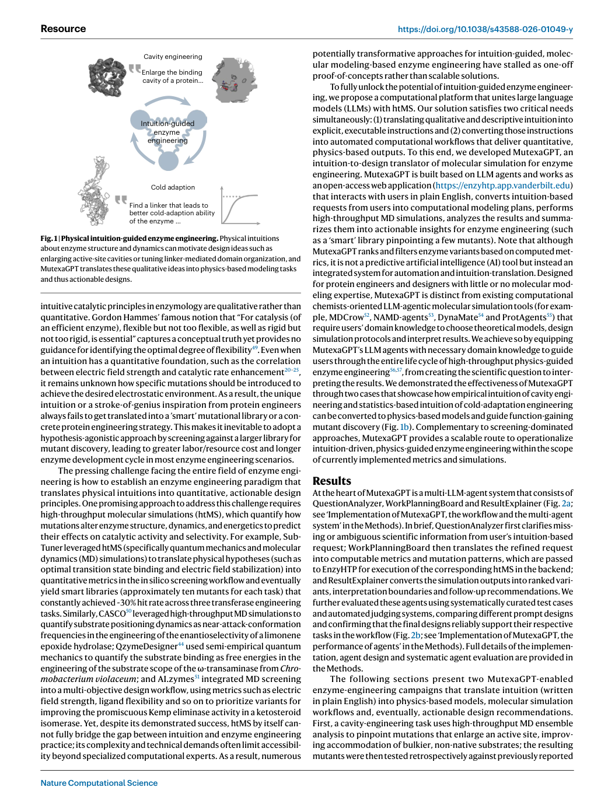
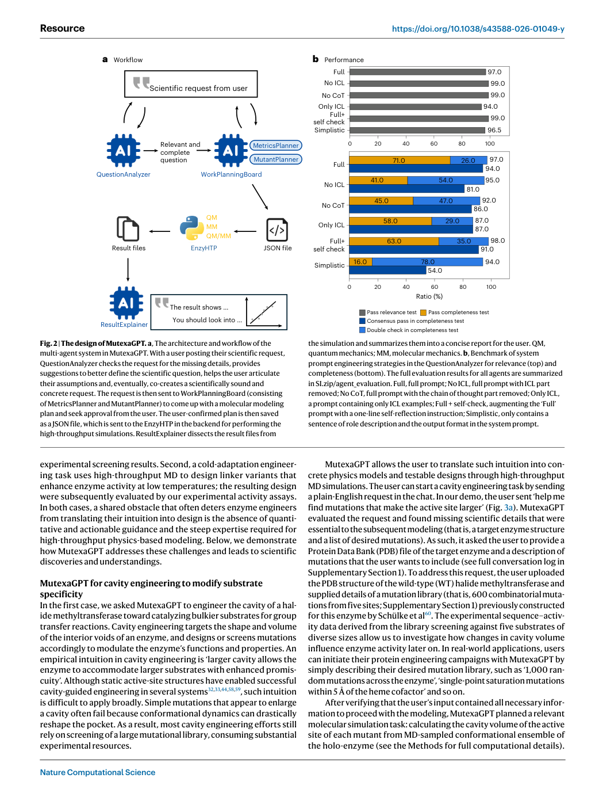
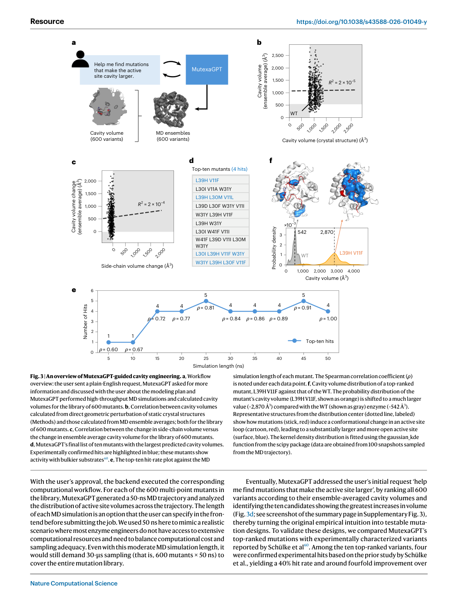
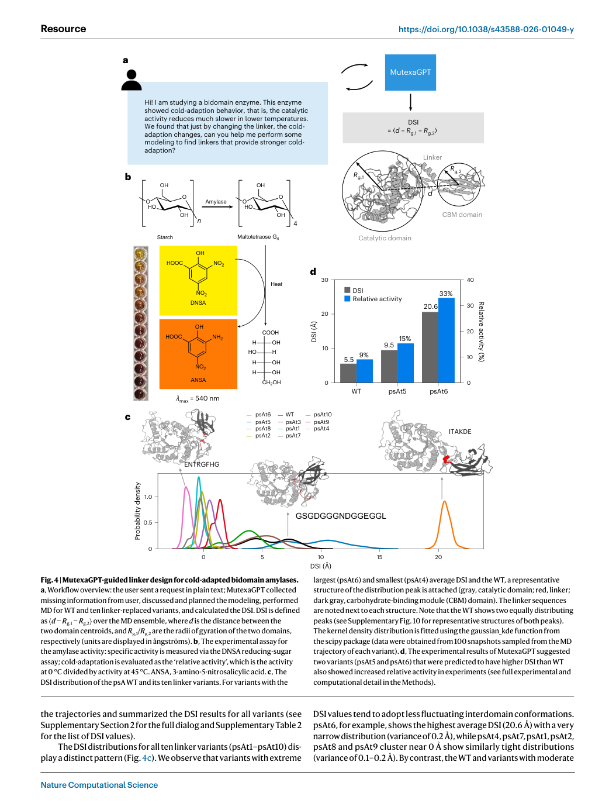

# MutexaGPT: an intuition-to-design translator for physics-based enzyme engineering

> **Source coverage:** Full main article; Supplementary Information was identified but not exhaustively re-analysed
> **Extraction confidence:** High for the main article
> **Locator mode:** page-grounded (`PDF p.` denotes the physical page in the official PDF)
> **Primary analytical lens:** Methods / system
> **Secondary analytical lens:** Discovery / experimental validation
> **Context verification:** Targeted external check
> **Card completeness:** Complete relative to the main article

## 01 Basic Information

- **Title:** MutexaGPT: an intuition-to-design translator for physics-based enzyme engineering
- **Authors:** Qianzhen Shao, Yinjie Zhong, Sebastian Stull, Xinchun Ran, Ning Ding, Kieran Nehil-Puleo, Ruizhe Yao, Han Xu & Zhongyue J. Yang
- **Affiliation:** Vanderbilt University, USA
- **Venue / year:** *Nature Computational Science*, 2026 (Resource)
- **DOI:** [10.1038/s43588-026-01049-y](https://doi.org/10.1038/s43588-026-01049-y)
- **Article:** [Nature](https://www.nature.com/articles/s43588-026-01049-y)
- **Code:** [ChemBioHTP/EnzyHTP-GPT](https://github.com/ChemBioHTP/EnzyHTP-GPT)
- **Web application:** [enzyhtp.app.vanderbilt.edu](https://enzyhtp.app.vanderbilt.edu/)
- **Paper type:** Multi-agent scientific workflow with retrospective and prospective experimental validation
- **Keywords:** LLM agent, enzyme engineering, molecular dynamics, high-throughput molecular simulation, human–AI interaction
- **Reading date:** 2026-09-20

### Terminology ledger

| Canonical term | Meaning used in this card |
|---|---|
| MutexaGPT | The complete multi-agent intuition-to-design platform |
| htMS | High-throughput molecular simulations executed through EnzyHTP |
| QuestionAnalyzer | Dialogue agent that checks relevance and elicits missing scientific information |
| WorkPlanningBoard | MetricsPlanner plus MutantPlanner; converts an approved request into executable JSON |
| ResultExplainer | Agent that interprets simulation outputs, states boundaries and recommends follow-up work |
| DSI | Domain separation index for the two-domain amylase |

## 02 One-Sentence Summary

[Paper] MutexaGPT turns a protein engineer's plain-English intuition into a user-approved, EnzyHTP-executable molecular-simulation workflow and ranked variant proposals; a 600-variant retrospective cavity task yielded four known hits in its top ten, while two prospectively tested linker variants improved relative low-temperature activity by 1.7-fold and 3.7-fold. [Paper: PDF pp. 3–7, Figures 2–4]

## 03 Research Question

- **Concrete problem:** Physical intuition in enzyme engineering is often qualitative, whereas mutation selection requires explicit metrics, simulation protocols and actionable libraries. [Paper: PDF pp. 1–2, Introduction]
- **Why it matters:** Without an operational translation layer, teams either need specialist computational expertise or revert to broad experimental screening. [Paper: PDF pp. 1–2]
- **Why prior tools are insufficient:** Existing molecular-simulation agents primarily assist users who already know which model and protocol to request; the intended users here may lack that expertise. [Paper: PDF p. 2]
- **Question:** Can a conversational multi-agent system reliably elicit missing design information, map biological intuition to physics-based metrics, execute htMS and return bounded, experimentally useful variant priorities?

## 04 Research Background and Development Path

| Stage | Representative approach | Advantage | Limitation motivating MutexaGPT |
|---|---|---|---|
| Rational enzyme engineering | Structural or mechanistic intuition | Small, interpretable design spaces | Intuition is commonly qualitative and not directly executable |
| Directed evolution / screening | Large mutation libraries | Does not require a complete mechanistic model | Experimental cost and long cycles increase with library size |
| Physics-guided htMS | MD, QM and free-energy workflows | Converts mechanisms into quantitative metrics | Specialist setup, compute and interpretation requirements |
| LLM-assisted simulation | Tool-using molecular-simulation agents | Automates parts of modelling | Often assumes the user already specifies the scientific model and protocol |
| MutexaGPT | Dialogue → metric/library planning → EnzyHTP → bounded explanation | Moves part of the modelling expertise into the interaction layer | Limited to supported metrics and current foundation-model reliability |

[Paper-framed; targeted external verification only] This development path follows the paper's positioning; the Nature article, code release and open web application were independently checked. [Paper: PDF pp. 1–2; [Nature article](https://www.nature.com/articles/s43588-026-01049-y)]

## 05 Core Pain Points Identified by the Paper

| Pain point | Manifestation | Author explanation | Evidence |
|---|---|---|---|
| Underspecified intent | Users omit the enzyme, mutation library or target property | Scientific ideas arrive as conversational, incomplete requests | QuestionAnalyzer benchmark includes relevant/irrelevant and complete/underspecified cases [Paper: PDF pp. 9–10] |
| Intuition–metric gap | “Larger cavity” or “better cold adaptation” is not an executable protocol | Qualitative ideas require physically meaningful surrogate metrics | Cavity volume and DSI case studies [Paper: PDF pp. 3–7, Figures 3–4] |
| Workflow expertise | Force fields, restraints, masks and HPC settings are difficult for non-specialists | htMS is technically demanding and site-dependent | WorkPlanningBoard and downloadable scripts/configuration [Paper: PDF p. 9] |
| Interpretation risk | A computed metric can be mistaken for biological proof | Simulation outputs require explicit scope and uncertainty statements | ResultExplainer is prompted to state what each metric does and does not establish [Paper: PDF p. 9] |

## 06 Core Idea

1. **Surface method:** A web-based multi-agent orchestration layer around EnzyHTP.
2. **Core insight:** The decisive interface is not free-form answer generation but an approval-gated compilation process: vague intuition is progressively converted into a typed, inspectable JSON plan before simulation. [Paper: PDF pp. 3 and 9, Figure 2]
3. **[Analysis] General lesson:** In scientific agents, interaction quality should be evaluated as specification recovery and executable-state correctness—not only as conversational helpfulness.

## 07 Method Overview

*Figure 1 frames the two translation targets: cavity enlargement and linker-mediated cold adaptation. It establishes the paper's problem-to-design argument rather than a performance result. [Paper: PDF p. 2, Figure 1]*

*Figure 2 shows the human-in-the-loop workflow and QuestionAnalyzer prompt study. The user approves the modelling plan before EnzyHTP execution; the lower panel demonstrates that prompt design materially affects specification recovery. [Paper: PDF p. 3, Figure 2]*

**Data flow**

`plain-English intuition + optional PDB/library` → `QuestionAnalyzer clarification` → `MetricsPlanner + MutantPlanner` → `user approval` → `EnzyHTP htMS` → `structured result JSON` → `ResultExplainer` → `ranked variants + scope/limitations + follow-up recommendations`

- **Training:** No new foundation model is trained; agents are configured through system prompts, chain-of-thought scaffolding and in-context examples. [Paper: PDF pp. 9–10]
- **Tools:** EnzyHTP connects to MD/QM/biophysics software and either Vanderbilt ACCRE or user-local HPC resources. [Paper: PDF p. 9]
- **Assumptions:** The requested biological property can be mapped to a supported physical metric; the simulation protocol and sampling are adequate; the uploaded structure/library are valid. [Paper: PDF pp. 7–9]

## 08 Core Module Breakdown

| Module | Function | Why needed | Input → output | Supporting evidence | Effect of removal |
|---|---|---|---|---|---|
| QuestionAnalyzer | Rejects irrelevant requests and elicits missing enzyme, mutation and property information | Prevents malformed jobs | User request → complete scientific specification | 200 curated inquiries; full prompt 97.0% relevance and 71.0% strict completeness [Paper: PDF pp. 9–10, Figure 2b] | Measured: removing ICL or reasoning scaffolds sharply lowers strict completeness |
| MetricsPlanner | Maps the objective to supported metrics and fills protocol parameters | Bridges biological intent and physics | Specification → metric/model configuration | 200 cases; 91% mean pass rate [Paper: PDF p. 10] | Expected: unsupported or underspecified simulation plans |
| MutantPlanner | Encodes the mutation library in EnzyHTP syntax | Makes variant enumeration executable | Library description → mutation pattern | 50 balanced cases; 95% success [Paper: PDF p. 10] | Expected: incorrect candidate set |
| EnzyHTP backend | Executes the approved simulation and analysis | Produces physics-based evidence | JSON plan → trajectories/metrics/metadata | Two end-to-end campaigns [Paper: PDF pp. 3–9] | No quantitative design ranking |
| ResultExplainer | Aligns results to the question and constrains interpretation | Reduces overclaiming | Result JSON → report and priorities | 100 payloads; 99% met both criteria [Paper: PDF pp. 9–10] | Expected: raw metrics without actionable or bounded interpretation |

## 09 Essential Formulas and Symbols

**Extraction note:** The automated PDF inventory labels two numbered prose fragments as “Equation 1” and “Equation 3”; inspection of PDF p. 9 confirms that these are list items rather than mathematical equations. They are therefore excluded from the formula analysis rather than reproduced as false equations. [Paper: PDF p. 9, Equation 1 / Equation 3 extraction candidates]

### Domain separation index

\[
\mathrm{DSI}=\left\langle d-R_{g,1}-R_{g,2}\right\rangle_{\mathrm{MD}}
\]

where (d) is the distance between domain centroids and (R_{g,1},R_{g,2}) are the domains' radii of gyration. DSI estimates interdomain separation over the MD ensemble; it is a design surrogate, not cold activity itself. [Paper: PDF p. 6, Figure 4a]

### Relative cold activity

\[
\mathrm{Relative\ activity}=\frac{A_{0^\circ\mathrm{C}}}{A_{45^\circ\mathrm{C}}}
\]

This assay-derived outcome is used to test whether DSI-prioritized variants show improved cold adaptation. [Paper: PDF p. 7, Results]

## 10 Experimental Design and Evidence Chain

*Figure 3 links the 600-variant MD screen to retrospective activity labels. Static-structure volume and side-chain-volume shortcuts are essentially uncorrelated with MD ensemble cavity volume, while four of the ten MD-ranked candidates are known hits. [Paper: PDF pp. 4–5, Figure 3]*

*Figure 4 connects DSI-based prioritization to wet-lab activity measurements for psAt5 and psAt6. It supports a prospective design-use claim for these two variants, not general validation across enzyme families. [Paper: PDF pp. 6–7, Figure 4]*

| Experiment | Claim tested | Comparison / conditions | Result | Supported conclusion | Unsupported stronger conclusion | Source |
|---|---|---|---|---|---|---|
| QuestionAnalyzer prompt study | Structured prompts recover missing specifications | Six prompt designs; 200 manually reviewed inquiries; three runs | Full prompt: 97.0% relevance, 71.0% strict completeness, 97.0% including harmless re-checks, 94.0% consensus | ICL plus reasoning scaffolds improve this curated clarification task | General conversational safety in open scientific use | [Paper: PDF pp. 9–10, Figure 2b] |
| Other-agent benchmarks | Planning and explanation modules perform their labelled tasks | MetricsPlanner 200 cases; MutantPlanner 50; ResultExplainer 100 | 91%, 95% and 99% pass, respectively | Strong performance on curated, manually labelled module tests | Independent end-to-end correctness under distribution shift | [Paper: PDF p. 10] |
| Cavity engineering | MD ensemble cavity volume can enrich active variants | 600 combinatorial variants; 50-ns MD each; retrospective experimental labels | 4/10 known hits, 40% hit rate, ~4× baseline; ≥15 ns retained four hits | MD-guided ranking enriched known hits in this library | Prospective 40% hit rate or universal superiority | [Paper: PDF pp. 4–5, Figure 3] |
| Shortcut comparison | Static geometry is an inadequate substitute | Static versus MD cavity volume; side-chain versus MD cavity change | (R^2\approx2\times10^{-5}) and (2\times10^{-4}) | Dynamic ensemble effects matter for this cavity task | MD is necessary for every enzyme-design target | [Paper: PDF p. 5, Figure 3b,c] |
| Linker engineering | Higher DSI can prioritize cold-adapted variants | WT + ten linker variants modelled; psAt5 and psAt6 assayed at 0 °C and 45 °C; three biological replicates | 1.7× and 3.7× higher relative activity than WT | Two prospective designs improved the chosen assay outcome | Broad causal law that DSI controls cold adaptation | [Paper: PDF pp. 6–8, Figure 4] |

## 11 Correct Interpretation of the Conclusions

- MutexaGPT is an **automation and intuition-translation system**, not a learned predictor of enzyme activity. [Paper: PDF pp. 2 and 7]
- The user remains in the loop: the plan is discussed and approved before compute is launched. [Paper: PDF pp. 3 and 9]
- The cavity result is retrospective against an existing screened library; only the linker study contains new prospective wet-lab testing, and that testing covers two prioritized variants. [Paper: PDF pp. 3–7]
- Module benchmarks use curator-generated, manually reviewed cases and LLM-assisted judges; they test defined module behaviours rather than downstream biological truth. [Paper: PDF pp. 9–10]
- Compute is material: the full cavity campaign uses 30 μs aggregate MD sampling. [Paper: PDF p. 4]

**Bounded conclusion:** The study shows that an approval-gated multi-agent interface can compile qualitative enzyme-engineering requests into reproducible htMS workflows and produce useful priorities in two demonstrations; it does not establish autonomous discovery across arbitrary properties or enzymes.

## 12 Limitations Explicitly Acknowledged by the Authors

| Limitation | Specific manifestation | Author-proposed direction | Source |
|---|---|---|---|
| Supported-metric boundary | If a property cannot map to an EnzyHTP-computable metric, the system cannot give a physically grounded simulation answer | Return an explicit unsupported-property notice; add new metrics and software interfaces | [Paper: PDF p. 7, Discussion] |
| Limited collaborator-level reasoning | The system mainly corrects statements, elicits missing information and maps properties to metrics | Generate alternative hypotheses, adapt multi-step workflows and integrate heterogeneous evidence | [Paper: PDF p. 7, Discussion] |
| Foundation-model reliability and uncertainty | Complex open-ended reasoning, self-evaluation and uncertainty quantification remain immature | Improve models, uncertainty methods and multimodal workflow data | [Paper: PDF p. 7, Discussion] |
| Prompt anchoring | Rich prompts may reduce flexibility on atypical or out-of-distribution requests | Future evaluation beyond the included interaction schema | [Paper: PDF p. 10, Methods] |

## 13 Critical Analysis

| [Analysis] Observation | Potential issue | Why it matters | How to test | Basis |
|---|---|---|---|---|
| LLM components and physics backend are evaluated mostly separately | High module pass rates may not multiply into end-to-end reliability | A single planning error can waste substantial compute or mis-rank variants | Prospective blinded tasks scored from request to assay, with technical failures separated | [Paper: PDF pp. 9–10] |
| Curator and judge agents share the LLM ecosystem | Synthetic-case style and judge preferences may favour the production prompts | Reported pass rates may overestimate deployment robustness | Add independent domain-expert scoring and naturally occurring requests | [Paper: PDF pp. 9–10] |
| Prospective evidence is narrow | Two tested designs cannot estimate a stable hit rate | Generalization across targets and metrics is uncertain | Multi-enzyme prospective cohort with preregistered top-k criteria and all candidates assayed | [Paper: PDF pp. 6–7] |
| User approval is a safety boundary but not evaluated | Users may approve plausible yet flawed plans | Interaction can transfer rather than remove modelling risk | Measure expert/non-expert approval errors with seeded protocol faults | [Paper: PDF pp. 3 and 9] |

## 14 Knowledge Learned

### Agent-derived knowledge candidates

- Treat clarification as a measurable module with explicit missing-field labels.
- Insert a typed, human-approved intermediate representation before expensive scientific execution.
- Export scripts, parameters and site configuration so an agentic workflow remains reproducible outside the chat interface.
- Pair every computational design metric with a statement of what it does **not** measure.
- Separate module accuracy, end-to-end execution success and experimental utility.

## 15 Connections to Existing Knowledge

- [External] The paper's approval-gated design aligns with broader human-in-the-loop safety patterns: the user sees and approves an executable plan rather than merely accepting prose. The connection is architectural, not evidence that approval alone ensures safety.
- [External] MutexaGPT differs from autonomous laboratory agents by keeping wet-lab execution outside the platform; its autonomy is concentrated in specification, simulation and interpretation. [Nature article](https://www.nature.com/articles/s43588-026-01049-y)
- [Analysis] The workflow is closely analogous to a compiler: natural-language intent is parsed, type-checked through clarification, lowered into a structured representation and executed by a deterministic backend.

## 16 Research Ideas

### Agent-derived research candidates

#### A. Approval-calibration benchmark

- **Origin:** User approval is central but unevaluated. [Paper: PDF pp. 3 and 9]
- **[Hypothesis]:** Showing counterfactual consequences and uncertainty with each plan will reduce erroneous approvals by non-specialists without materially increasing abandonment.
- **Delta:** Compare plain plan approval with plan + uncertainty + counterfactual failure preview.
- **Validation:** Seed protocol errors and unsupported properties; randomize expert and non-expert users; measure unsafe approvals, correction rate, time and trust calibration.
- **Failure modes:** Explanations may overwhelm users; users may over-trust quantified uncertainty.
- **Innovation status:** Unverified; prior-art search required.

#### B. End-to-end biological utility benchmark

- **Origin:** Module tests and biological demonstrations are not yet joined into one prospective evaluation.
- **[Hypothesis]:** A preregistered MutexaGPT top-k pipeline will outperform budget-matched expert-only selection on verified hit yield while preserving reproducibility.
- **Delta:** Freeze prompts, supported metrics, compute budget and top-k rule before seeing assay outcomes.
- **Validation:** Multiple enzyme families; blinded expert baseline; assay every selected candidate; primary endpoint hit yield, with compute cost and technical-failure rate as co-endpoints.
- **Failure modes:** Surrogate metrics may not transfer; assay noise or structure quality may dominate.
- **Innovation status:** Unverified; prior-art search required.
