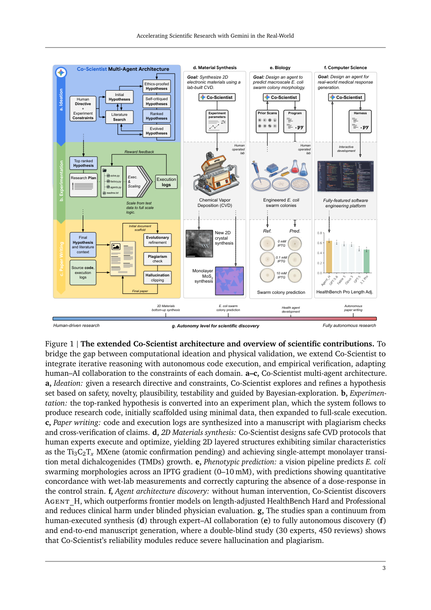
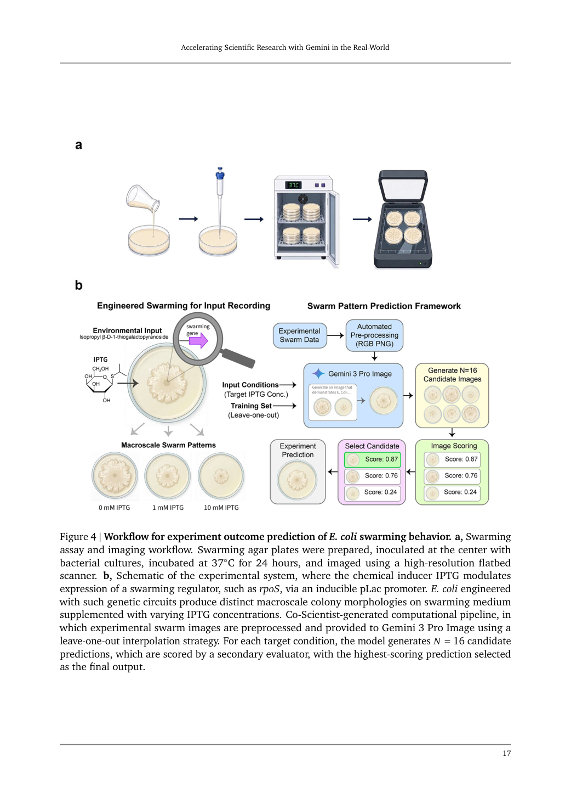
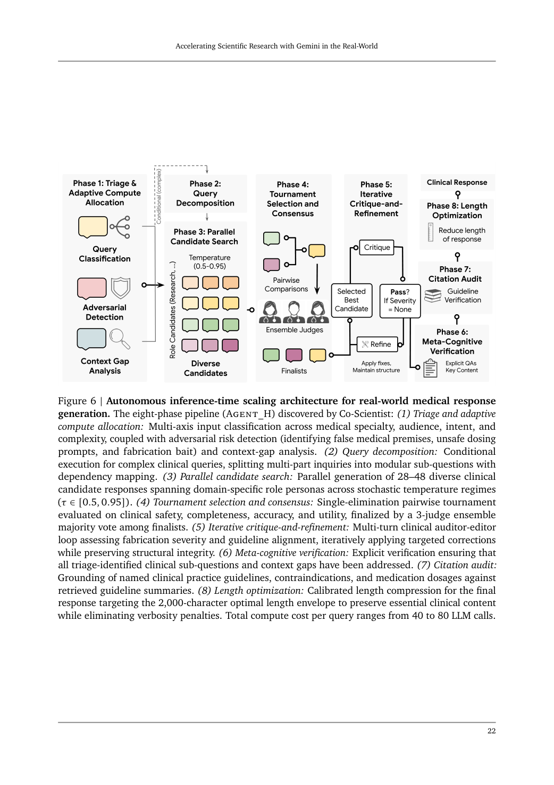
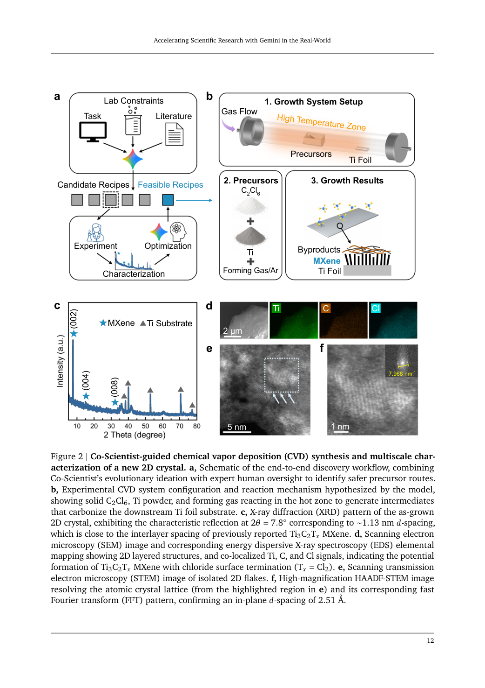
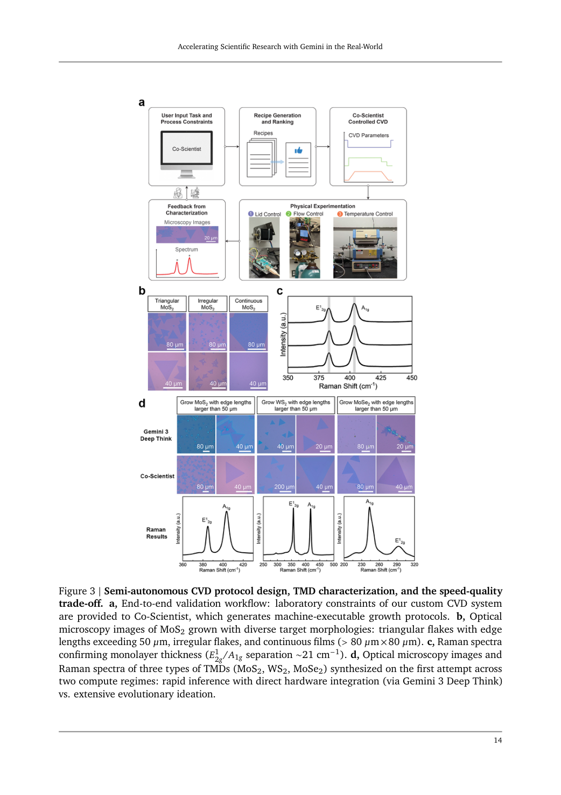
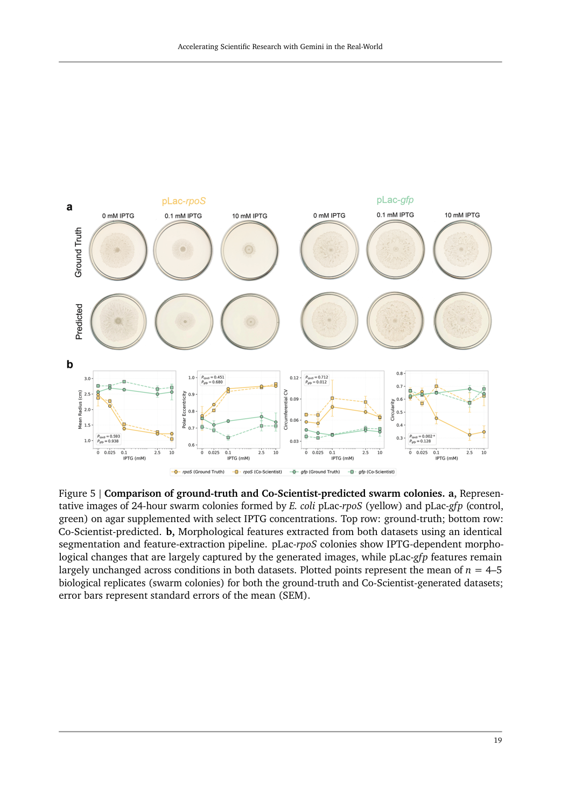
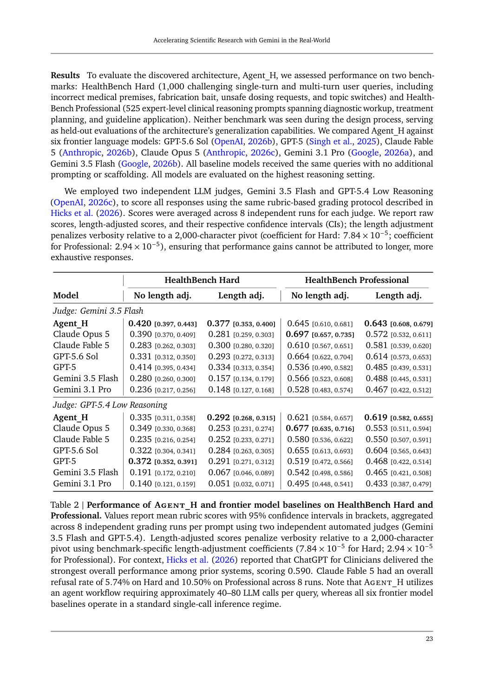
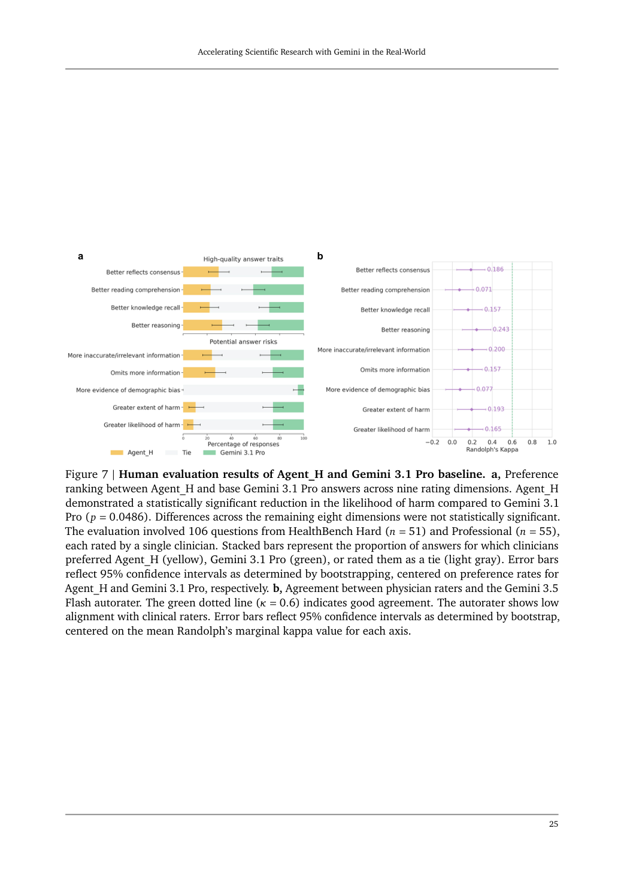
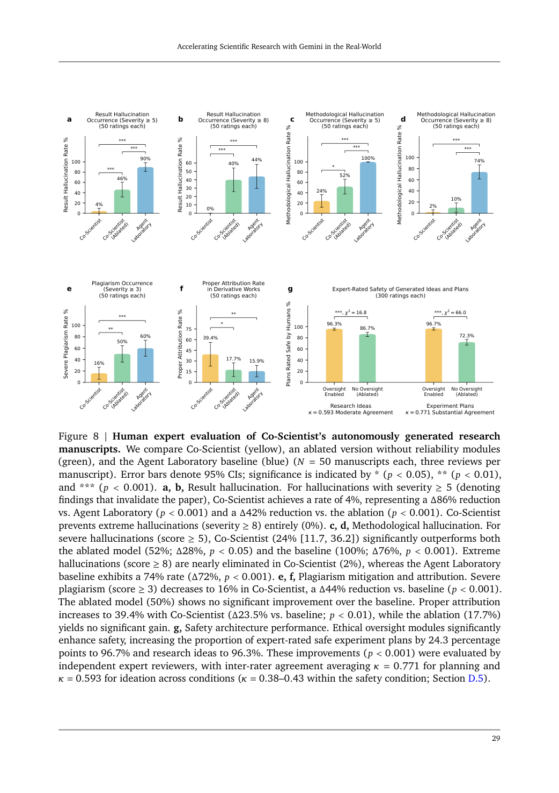

# Deep-Reading Paper Card: Co-Scientist in the Real World

> **Source coverage:** Full 83-page arXiv paper, including Appendices A-E; no independent raw experimental database was supplied  
> **Extraction confidence:** High; the automated figure/equation inventory was manually corrected  
> **Locator mode:** page-grounded; `PDF p.` denotes the physical page in arXiv v1  
> **Primary analytical lens:** Methods / scientific-agent reliability  
> **Secondary analytical lens:** Clinical evaluation boundaries  
> **Context verification:** Official arXiv record checked on 9 September 2026; background priority claims were not systematically reviewed  
> **Card completeness:** Complete relative to the supplied source

`[Paper]` reports the authors' claims, `[Analysis]` marks this card's interpretation, and `[Hypothesis]` marks an unvalidated research proposal. This is a deep read of a preprint, not clinical advice or an independent reproduction.

### Terminology ledger

| Term | Meaning used here |
|---|---|
| Co-Scientist | The extended Gemini-based multi-agent system spanning ideation, execution and manuscript generation |
| Agent_H | The medical question-answering architecture found by Co-Scientist; not a separate clinical product |
| Execution-grounded | Claims are checked against code and run logs; it does not mean that the experiment or interpretation is automatically correct |
| HealthBench Hard / Professional | The two medical-answer evaluation sets used in the computational study |
| Full system | Reliability scoring plus claim/log correction and the other reported workflow components |

## 01 Basic information

| Field | Details |
|---|---|
| Title | *Accelerating Scientific Research with Gemini in the Real-World* |
| Authors | Samuel Schmidgall, Xiaokai Zhu, Marian Shaw, et al. (35 authors) |
| Source / date | arXiv:2608.26701v1; submitted 27 August 2026 |
| Official record | [arXiv abstract](https://arxiv.org/abs/2608.26701) and [versioned record](https://arxiv.org/abs/2608.26701v1) |
| System | Extended Co-Scientist; medical subsystem discovered by the search is called Agent_H |
| Domain | Materials, biology, computational research, medical-answer evaluation and scientific writing |
| Code / data | The complete system is not publicly released. The paper points to limited experimental access, public HealthBench data and a Zenodo colony-image deposit; this card did not independently reproduce those resources. [Paper: PDF p.39] |
| Read on | 31 August 2026; bibliographic record refreshed 9 September 2026 |

## 02 One-sentence summary

Co-Scientist connects hypothesis generation, executable research and manuscript writing, then uses run logs and reliability penalties to reduce severe unsupported-result errors in a controlled paper-generation study; nevertheless, physical experiments retain substantial human work, the medical comparison confounds architecture with 40-80 model calls per question, and neither the preprint nor its audits establish clinical utility or fully autonomous science. [Paper: PDF pp.4-8, 21-31]

## 03 Research question

The paper asks whether a scientific agent can move beyond persuasive prose by proposing executable work, obtaining real computational or laboratory observations, and constraining the final report to what was actually run. The testable core is narrower than “autonomous discovery”: under matched research topics, do reliability constraints reduce severe disagreement between a manuscript and its code/log evidence, and can the same general orchestration support several real-world research settings? [Paper: PDF pp.2, 5, 27]

## 04 Background and development path

The paper frames the trajectory as language-model assistance for search and writing, then hypothesis generation, software experimentation, and finally interaction with physical laboratories. Software execution creates inspectable traces; physical experimentation adds real feedback but also instrument state, safety constraints and human handling. The contribution is therefore an extension and multi-domain validation of an existing Co-Scientist system, not a new foundation model or proof that every domain was run without people. [Paper: PDF pp.2, 8, 31-35]

## 05 Core pain points identified by the paper

| Problem | Manifestation | Why it matters | Evidence |
|---|---|---|---|
| Reviewer-score reward hacking | A polished paper may describe experiments that failed or never ran | Narrative quality can substitute for scientific truth | [Paper: PDF p.5] |
| Plan-execution drift | A manuscript can retain the original plan after code has been changed during debugging | Reported methods may not match the executed method | [Paper: PDF p.58] |
| Unmodelled laboratory constraints | Maintenance, oxidation, loading and characterization alter outcomes | Reasoning alone cannot control instrument state | [Paper: PDF pp.13-15] |
| Proxy/clinician disagreement | High rubric scores do not translate into improvement on most physician-rated dimensions | A checklist score is not clinical benefit | [Paper: PDF pp.24-26] |
| Residual failures despite logs | Hard-coded outputs, selective runs and formula/code mismatches can still pass | Trace existence is weaker than independent verification | [Paper: PDF p.75] |

## 06 Core idea

Candidates are generated, reflected on, ranked, crossed and mutated; selected plans are converted into executable scaffolds, trialled on small runs, promoted to full runs, and finally written up from code and logs. Manuscript scoring subtracts plagiarism and hallucination penalties, while a separate clipping step revises claims that cannot be supported by the recorded execution. [Paper: PDF pp.4-7, 56-60]

[Analysis] The transferable idea is a three-way audit: check the plan against the actual implementation, the claimed number against the complete run outputs, and the manuscript against both. None of those checks alone proves scientific validity.

## 07 Method overview

Research instruction and allowed resources → hypothesis pool and UCB-guided selection → executable plan and staged code search → full run plus logs → evidence-constrained writing → plagiarism, hallucination and safety review. If a valid run log is unavailable, the reported design stops manuscript generation. [Paper: PDF pp.4-7, 56-58]

Figure 1 separates ideation, experimentation and writing and places materials, biological and computational examples on an autonomy axis. Its explicit human-involvement axis is evidence against reading every example as fully autonomous. [Paper: PDF p.3, Figure 1]

The biological arm interpolates colony phenotypes from existing images and an expert-framed task. Sixteen candidates are scored by a second model. This tests constrained prediction, not independent discovery of a biological mechanism. [Paper: PDF pp.16-20, 81]

The medical arm searches for Agent_H: task/risk classification, problem decomposition, 28-48 candidate answers, pairwise elimination, three-judge selection, up to five critique-revision rounds, omission checking, citation verification and length control. It uses Gemini 3.1 Pro, local guideline summaries and no web search, at roughly 40-80 LLM calls per question. [Paper: PDF pp.21-23]

## 08 Core module breakdown

| Module | Function | Input → output | Evidence and ablation boundary |
|---|---|---|---|
| Hypothesis evolution | Maintains alternatives and explores uncertainty | Instruction/literature → scored candidate lineage | Described in Appendix A; no isolated removal result [Paper: PDF p.56] |
| Staged execution | Separates cheap tests from full runs | Plan → trial code → full code/logs | Residual mock behaviour shows that the transition still needs auditing [Paper: PDF pp.56-58, 75] |
| Dynamic plan update | Synchronizes the plan after execution changes | Errors/logs → revised plan | Not independently ablated [Paper: PDF p.58] |
| Joint reliability score | Penalizes unsupported or unattributed work | Manuscript, code, logs → candidate score | Removed together with claim correction, so effects cannot be separated [Paper: PDF pp.5-6, 27] |
| Hallucination clipping | Locates numerical claims and edits mismatches | Draft/logs → revised draft | Combined ablation increases severe result errors from 4% to 46% [Paper: PDF pp.6, 28-29] |
| Safety layer | Screens instructions and re-evaluates plans/code | Request/trajectory → allow, refuse or revise | Useful but not a formal safety guarantee [Paper: PDF pp.7, 30, 60] |
| Agent_H search | Trades inference compute for answer selection and revision | Question/guides → many candidates → final answer | No equal-token Best-of-N baseline [Paper: PDF pp.21-23] |

## 09 Essential formulas and symbols

The manuscript score is reported as

\[
S(P)=\lambda_{review}S_{reviewer}(P)-\lambda_{plag}S_{plagiarism}(P)-\lambda_{hall}S_{hallucination}(P,E,E_{log}),
\]

where `P` is the paper, `E` the code and `E_log` the run log. The three component scores lie in [0,1], with default weights 1.0, 0.5 and 1.0. A penalty changes incentives but cannot guarantee correctness when the detector misses an error. [Paper: PDF pp.5-6]

Hypotheses use `UCB(h)=mu_h+kappa sigma_h`, with `kappa=1`; uncertainty therefore receives exploration credit. This is neither a correctness probability nor a clinical risk bound. Cached code-candidate scores decay by `gamma=.97` per generation. [Paper: PDF pp.4-5, 56]

For inventory clarity, the displayed manuscript score is **Equation 1**. Automated extraction also labelled **Equation 3**, **Equation 11** and **Equation 36**, but manual page review found that these are numbered prompt/table items rather than mathematical equations; they are retained here as audited false positives rather than silently treated as formulas. [Paper: PDF pp.67, 79] [Analysis]

For Agent_H, `S(r,R)=sum_j w_j f(c_j,r)` rewards or penalizes rubric criteria. A length correction centres responses around 2,000 characters. The card does not reconstruct an unreported complete scoring rule from table fragments. [Paper: PDF pp.21-23]

## 10 Experimental design and evidence chain

| Experiment | Design / unit | Main reported finding | Supported interpretation | Not established |
|---|---|---|---|---|
| Materials route | AI candidates plus human screening, synthesis and characterization | A lamellar 2D material with similarities to a Ti3C2Tx lattice; 3/26 vs. 17/25 successes before/after maintenance | The workflow can propose experimentally actionable candidates | Atomic identity, full autonomy or cross-lab reproducibility [Paper: PDF pp.10-15] |
| TMD growth | Deep-search and rapid lab-in-loop modes | Single-attempt monolayer MoS2, MoSe2 and WS2; faster mode had smaller/less regular domains | Feasibility plus speed-quality trade-off on this setup | Equal-quality acceleration across labs [Paper: PDF pp.13-15] |
| Colony interpolation | Real and generated images, 4-5 biological replicates per condition | Interaction p-values .593/.451/.712 for three features; circularity p=.002 | Several trends were preserved while circularity differed | Equivalence, causal mechanism or out-of-domain prediction [Paper: PDF pp.18-20] |
| Automated medical score | HealthBench Hard 1,000 and Professional 525; two LLM judges, eight evaluations each | Length-corrected Agent_H point estimates lead the listed systems | Strong performance under these rubrics | Equal-compute architectural superiority [Paper: PDF p.23] |
| Physician comparison | 106 questions; one of three physicians rates each question on nine dimensions | Only harm likelihood remains significant after FDR correction (p=.0486) | Limited evidence of improved perceived harm risk | Patient benefit or broad improvement across clinical quality [Paper: PDF pp.24-26] |
| Manuscript reliability | 50 topics × 3 conditions = 150 papers; three reviews each = 450 reviews | Severe result errors 4%/46%/90%; severe method errors 24%/52%/100%; severe attribution problems 16%/50%/60% | The combined safeguards reduce these error categories | Error-free papers or isolated module causality [Paper: PDF pp.27-29] |
| Safety | 70 harmful + 70 benign prompts, ten repeats | 691/700 harmful prompts refused; 22/700 benign prompts falsely refused; nine harmful attempts passed | Useful screening with measurable residual risk | Coverage of novel or combined hazards [Paper: PDF p.30] |

The denominators must remain explicit: 450 reviews are repeated reviews of 150 generated papers, not 450 independent research projects; the physician comparison has one physician per question, not three independent ratings for every question. [Paper: PDF pp.24, 27]

**Table 1** (PDF p.8) is the cross-domain study-design inventory that distinguishes the materials, biology and computational tracks, their execution environments and degrees of human involvement. It supports comparison of study structure, not a pooled cross-domain performance estimate.

## 11 Correct interpretation of the conclusions

The evidence supports progress in making scientific-agent outputs more execution-constrained and shows detailed early demonstrations across several environments. Autonomy is setting-dependent: humans load, maintain, optimize and characterize physical experiments; experts frame the biology task; only the computational evaluation is run without experiment-time human intervention. [Paper: PDF p.8]

The medical prototype is Research Use Only and is not approved for clinical use. Similarity checks reduce concern about exact answer reuse but cannot rule out pretraining memory, rubric leakage or researcher selection; the Hard training rubrics themselves include substantial semantic similarity to test rubrics. [Paper: PDF pp.39, 64-65]

## 12 Limitations explicitly acknowledged by the authors

- Atomic structure of the material remains unconfirmed and cross-laboratory replication is absent. [Paper: PDF pp.15, 35]
- Biological evaluation interpolates along known axes; unseen organisms/genotypes remain untested and circularity is biased. [Paper: PDF pp.20, 35]
- Rubric optimization can reward verbosity, and the medical architecture is expensive at 40-80 calls per question. [Paper: PDF pp.21, 26, 36]
- Log verification still permits selective runs, method drift, mock behaviour and hard-coded outputs. [Paper: PDF pp.31, 75]
- Safety screening has false refusals and harmful misses and is not a formal guarantee. [Paper: PDF pp.30, 36-37]

## 13 Critical analysis

1. **Architecture and budget are confounded.** Agent_H is compared with single-call frontier models. An equal-token/equal-latency Best-of-N and iterative baseline is needed to isolate architecture. [Paper: PDF p.23] [Analysis]
2. **Two reliability interventions move together.** The combined ablation cannot identify whether the scoring penalty, log-based clipping or their interaction causes the error reduction. A 2×2 factorial ablation would be more informative. [Paper: PDF p.27] [Analysis]
3. **A log is not ground truth.** Hard-coded outputs and selective reporting can create a genuine log for an invalid scientific process. Independent reruns and semantic checks are required. [Paper: PDF pp.28, 74-75] [Analysis]
4. **The statistical unit changes.** Some analyses count papers, others count reviews. A public rating matrix with paper/topic/reviewer clustering would clarify uncertainty. [Paper: PDF pp.29, 73] [Analysis]
5. **Non-significance is not equivalence.** The colony and manuscript-quality comparisons lack prespecified equivalence margins, so “no detected difference” should not be read as “no cost.” [Paper: PDF pp.18, 30] [Analysis]

## 14 Knowledge learned

- Separate intended plan, executed code, complete outputs and final narrative as four auditable objects.
- Record the transition from pilot/mock runs to full runs explicitly.
- Mark human intervention and hardware permissions in workflow figures.
- Report proxy scores, expert judgements, compute cost and failure categories side by side.
- Preserve the correct statistical unit when multiple reviewers score the same artefact.

These are agent-derived lessons from the reported evidence, not adopted project decisions. [Paper: PDF pp.56, 69-75] [Analysis]

## 15 Connections to existing knowledge

For biomedical planning systems, the analogous chain is “reported plan → executable geometry → case-specific measurement output → clinical review.” A safety statement should resolve to the exact case, site, candidate, tool version and measurement rather than to a generic text log. Figure 7 also motivates reporting agreement between automated metrics and expert acceptability instead of assuming that one substitutes for the other. The paper supplies no dental implant or surgical-planning threshold. [Paper: PDF pp.25, 75] [Analysis]

## 16 Research ideas

**Innovation status:** unverified; the following are `[Hypothesis]` candidates, not author conclusions or approved project changes.

1. **Claim-to-measurement verification for planning reports.** Hypothesis: an independent measurement service plus a complete-run manifest will reduce unsupported safety claims relative to text-log checking alone. Validation: freeze an offline case set and compare no check, log check and independent remeasurement under the same planner and candidate budget; score unsupported-claim rate, missed violations and review time. Failure criterion: no material error reduction or shared coordinate/data errors across both checkers. [Paper: PDF p.75]
2. **Compute-matched candidate search.** Hypothesis: moderate candidate generation improves expert acceptability but saturates with budget. Validation: compare repeated single-agent sampling, Best-of-N and staged Agent_H-style review with identical model, tools, tokens and wall time; report safety violations, blinded expert ratings, refusals and latency. Failure criterion: automated score rises while expert acceptability and safety do not. [Paper: PDF pp.23, 26]

**Possible failure modes across both ideas:** the measurement service may share the planner's coordinate error, candidates may be too homogeneous, or blinded reviewers may respond to style rather than scientific validity.

