# Figure-by-figure analysis: CoDaS

These are faithful full-page views from arXiv:2604.14615v2. Every main and appendix figure was manually opened. Full pages are retained when two figures share a page so that captions, scales and surrounding context are not lost.

## Figure 1 — problem, workflow and evaluation summary

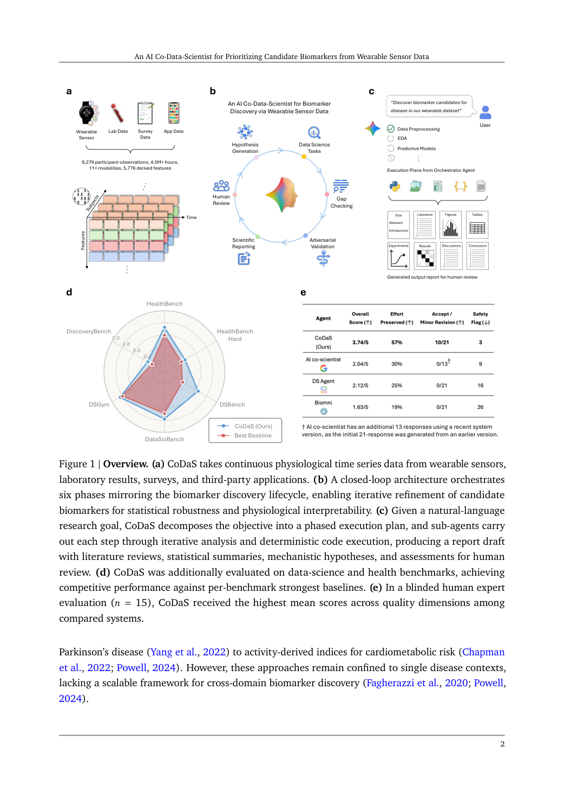

The page combines input scale, the agent loop, user-to-report flow, six benchmark axes and human review. It is a roadmap, not a single score: 9,279 means observations, the radar axes are heterogeneous, 57% is content retention and 10/21 is accept-or-minor. [Paper: PDF p.2]

## Figure 2 — five high-level stages and shared resources

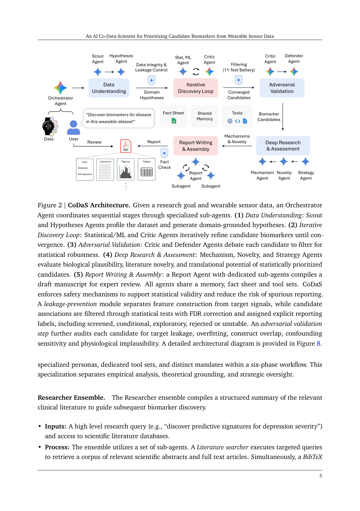

The diagram separates data understanding, statistical/ML iteration, validation/adversarial review, literature work and reporting around a Fact Sheet, shared memory and tools. Shield icons communicate intended controls, not zero leakage or perfect implementation. [Paper: PDF p.5]

## Figure 3 — two sleep-instability associations

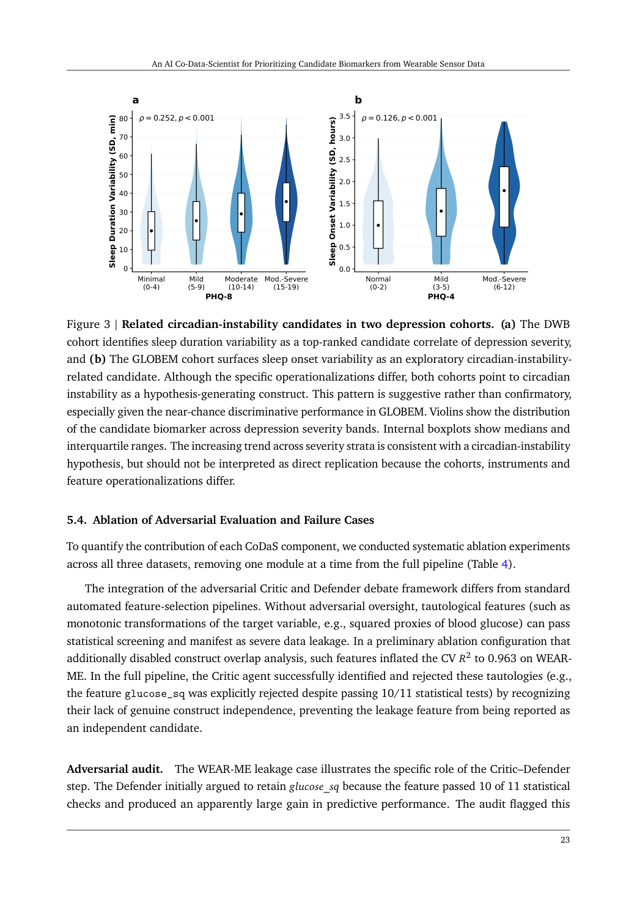

DWB uses sleep-duration SD versus PHQ-8 (`rho=.252`); GLOBEM uses sleep-onset SD versus PHQ-4 (`rho=.126`). Distribution overlap is large. This supports a related circadian-instability theme, not identical-measure replication, a diagnostic threshold or causality. [Paper: PDF p.23]

## Figure 4 — report quality, editorial recommendation and forced ranking

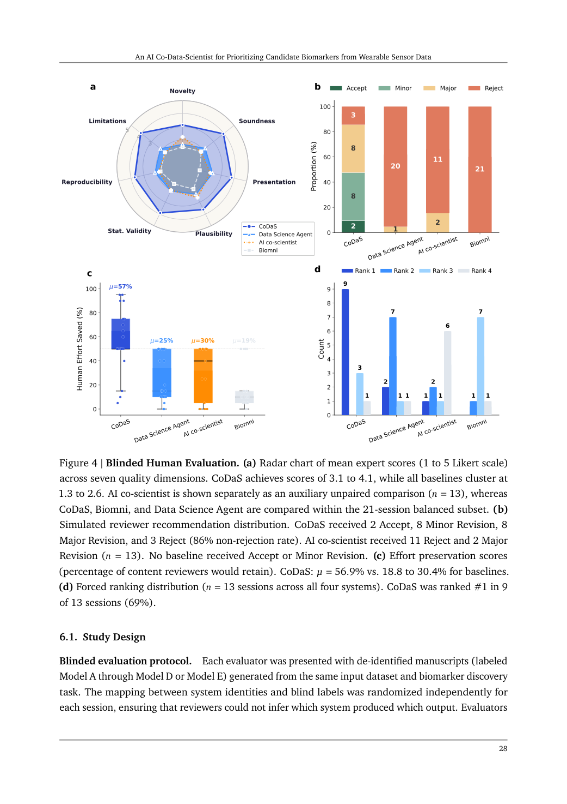

CoDaS has a mean quality score of 3.74/5, recommendations of 2 accept/8 minor/8 major/3 reject and nine first-place ranks in 13 forced comparisons. Forced ranking guarantees a winner, and 18/21 non-reject must not replace 10/21 accept-or-minor. [Paper: PDF p.28]

## Figure 5 — estimated human workload

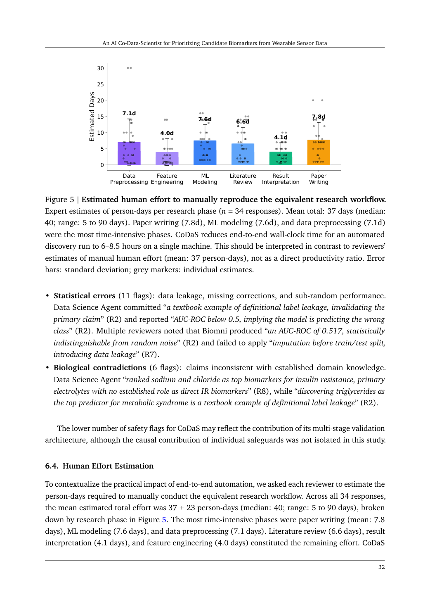

Thirty-four responses estimate six phases and a total of 37±23 person-days, range 5-90. This is an opinion survey, not a randomized measurement of actual human-versus-agent time. [Paper: PDF p.32]

## Figure 6 — three non-interchangeable agreement coefficients

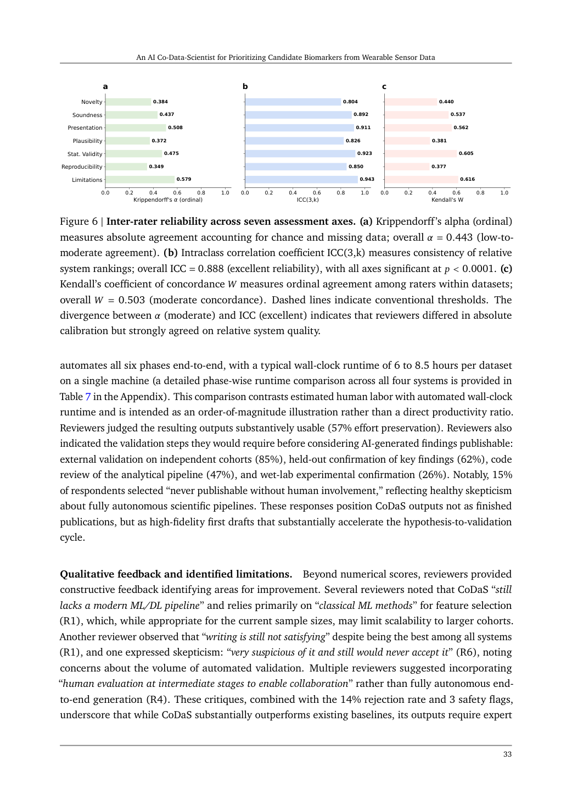

Overall ordinal alpha is .443, ICC(3,k) .888 and Kendall W .503. Average-rater reliability can be high while absolute individual ratings vary; the plotted reference lines are author conventions, not universal thresholds. [Paper: PDF p.33]

## Figure 7 — clinician agreement and candidate disagreement

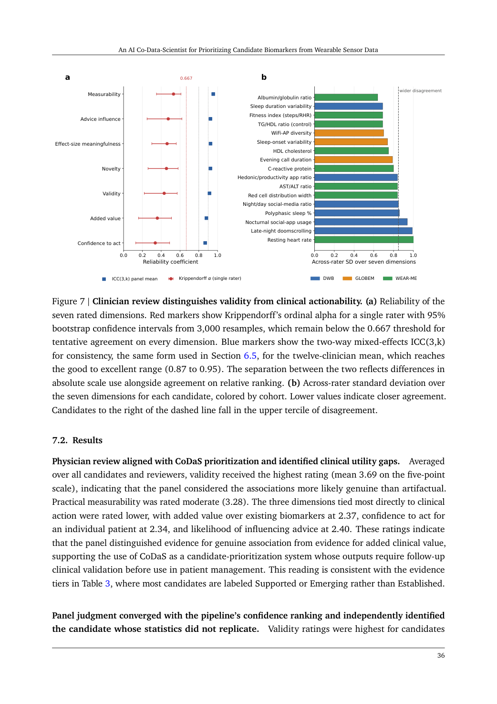

Ordinal alpha with bootstrap intervals is shown beside 12-rater-average ICC and candidate-level rating dispersion. The dispersion is not an effect-size standard error, and lower disagreement does not prove biological truth. [Paper: PDF pp.36, 67]

## Figure 8 — detailed stage and data flow

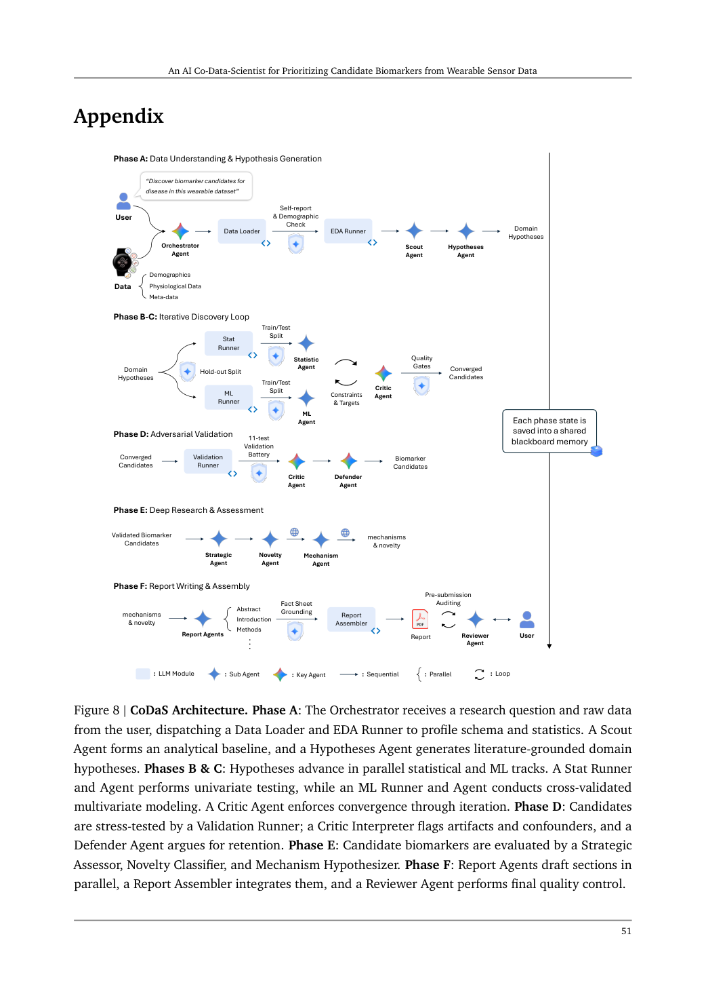

This is the best implementation-oriented map: deterministic runners, LLM interpreters, Critic loops, validation, parallel reporting and persistent state are distinct. It still does not show a complete runtime DAG or prove that every outer-loop decision is isolated from held-out feedback. [Paper: PDF p.51]

## Figure 9 — six benchmark results

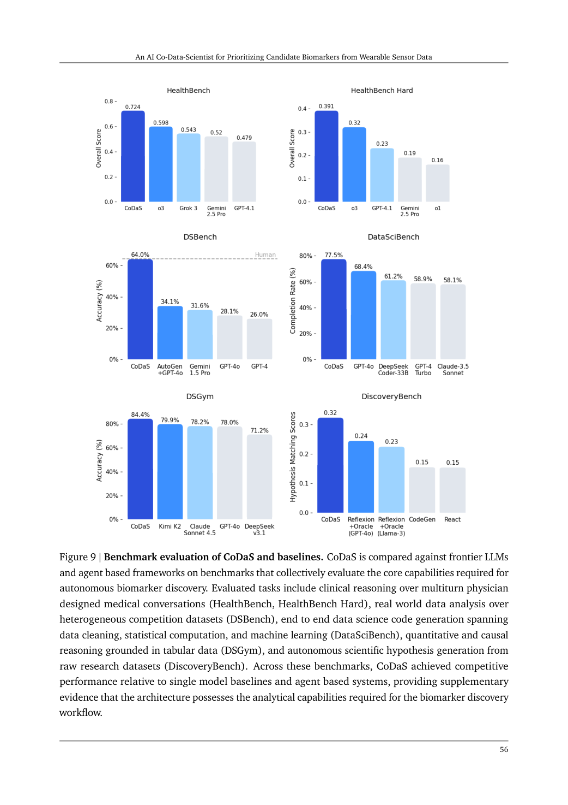

Each benchmark has its own unit and comparator. The figure has no uncertainty bars and the systems differ in model, tools, feedback and budget. The radar/point estimates should not be merged into a clinical score. [Paper: PDF pp.25, 56]

## Figure 10 — expert profile form

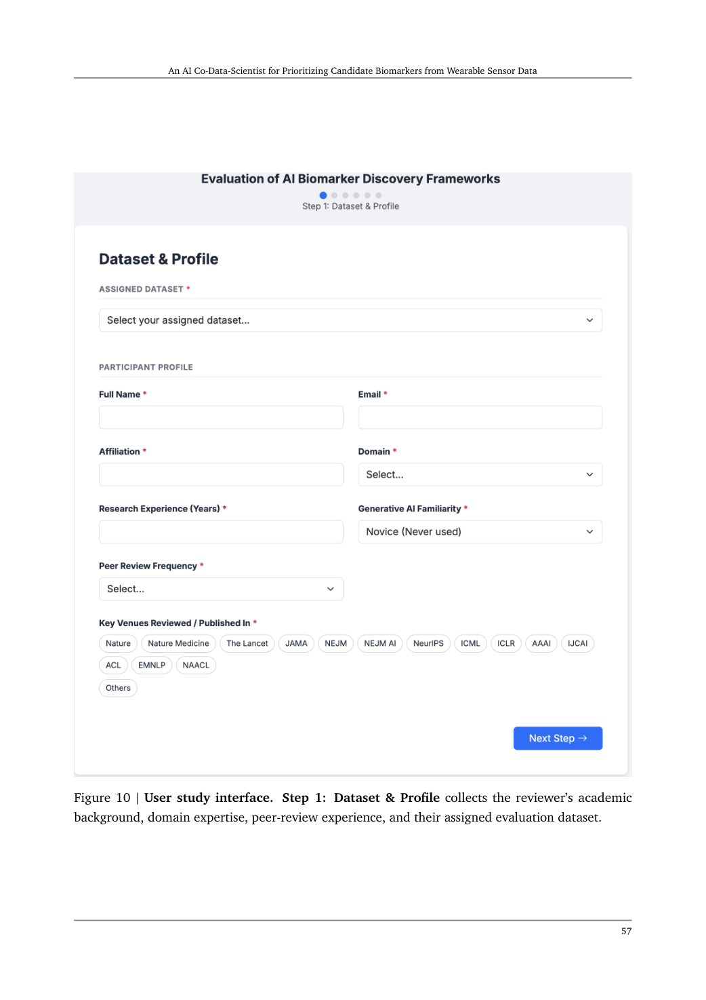

The form records affiliation, expertise, generative-AI familiarity and reviewing experience. An empty form proves collection capability, not the final distribution of expertise or equal suitability for every cohort. [Paper: PDF p.57]

## Figure 11 — anonymized review instructions

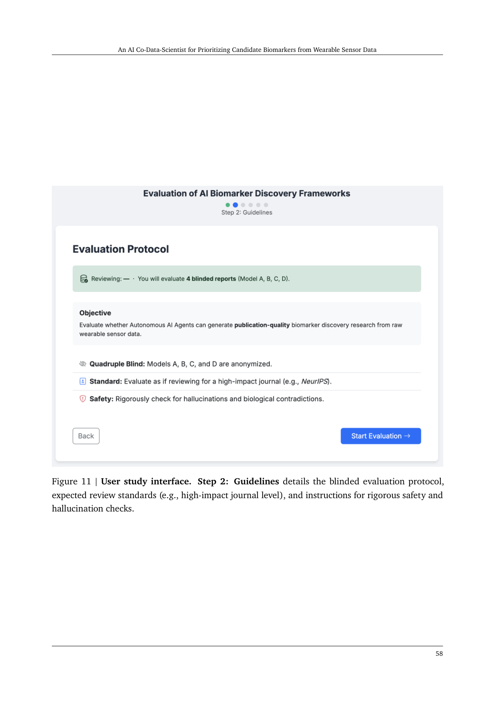

Four anonymous reports are judged under high-level-journal instructions with hallucination and biological-consistency checks. “Quadruple blind” visually refers to four anonymized systems and does not establish four independent layers of blinding. [Paper: PDF p.58]

## Figure 12 — paper beside anchored quality scales

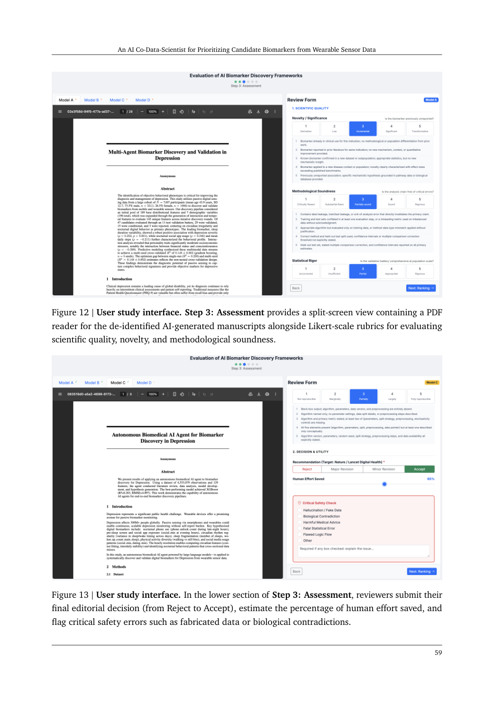

Novelty, methodological soundness, statistical rigor and related 1-5 items are visible beside the manuscript. Selected values in the screenshot are interface examples, not additional observations. [Paper: PDF p.59]

## Figure 13 — recommendation, safety flags and effort field

Editorial recommendation and several error/safety flags are separated, which is good measurement design. However, the interface wording “Human Effort Saved” conflicts with the paper's operational definition as willingness to retain content. [Paper: PDF pp.28, 59]

## Figure 14 — forced four-system ordering

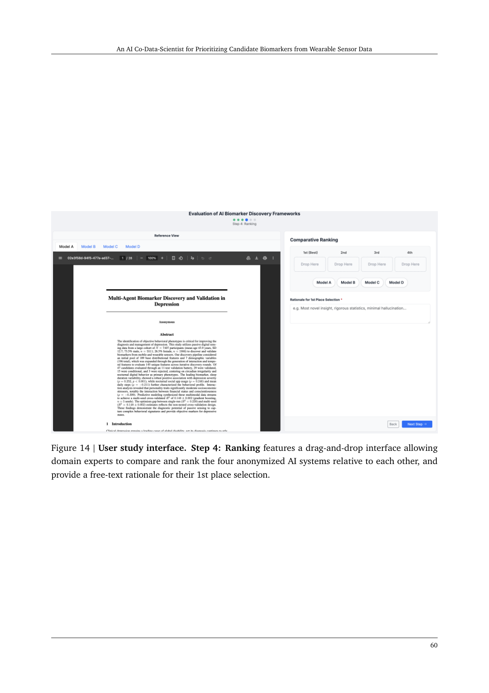

Four anonymous outputs must occupy first through fourth place. With no tie/all-unacceptable option, a first-place rate must be reported together with absolute quality and reject/safety outcomes. [Paper: PDF p.60]

## Figure 15 — workload anchor and endpoint-label mismatch

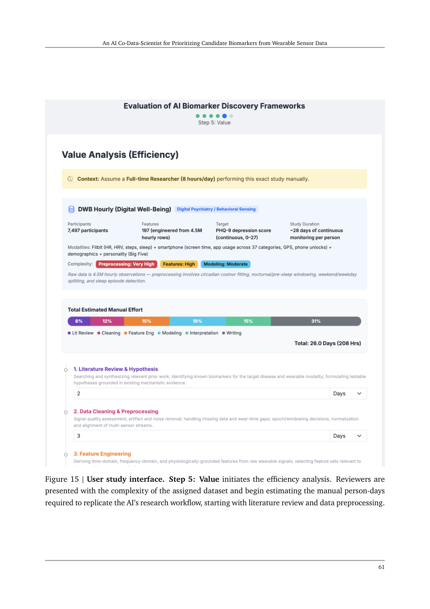

The form gives DWB workload anchors but labels the outcome PHQ-9 (0-27), whereas the main analysis uses PHQ-8 (0-24). The PDF cannot determine which version each reviewer saw or quantify any resulting bias. [Paper: PDF pp.13, 61, 64]

## Figure 16 — requested follow-up validation

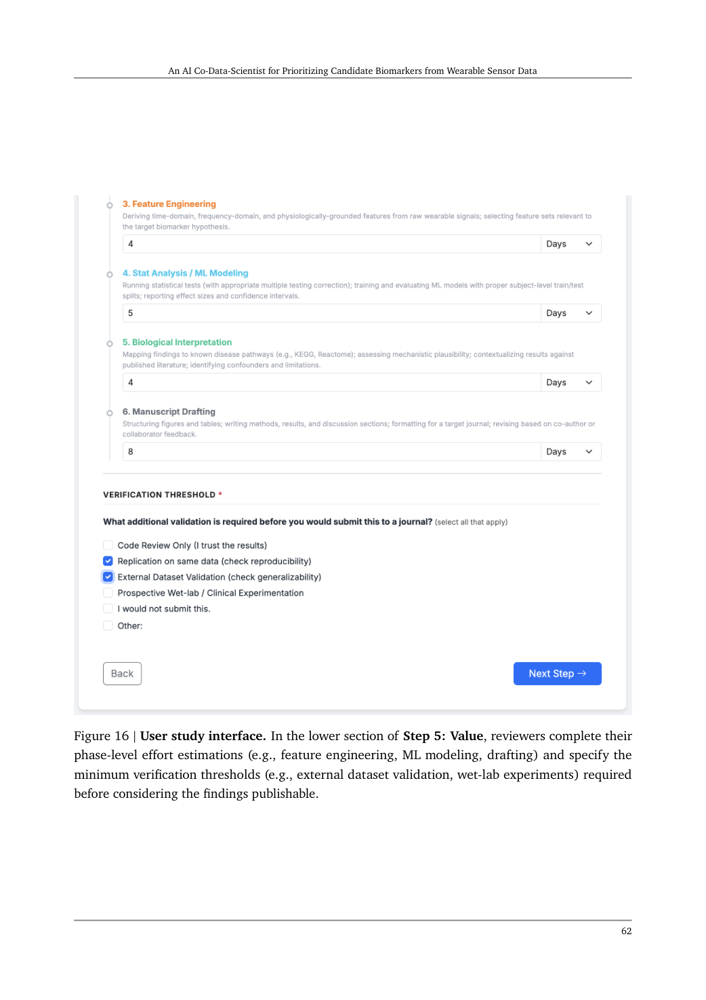

Reviewers can request code review, same-data replication, external data or prospective validation. Checked example boxes are not response frequencies; requests for validation do not mean that validation was completed. [Paper: PDF p.62]

## Figure 17 — open feedback

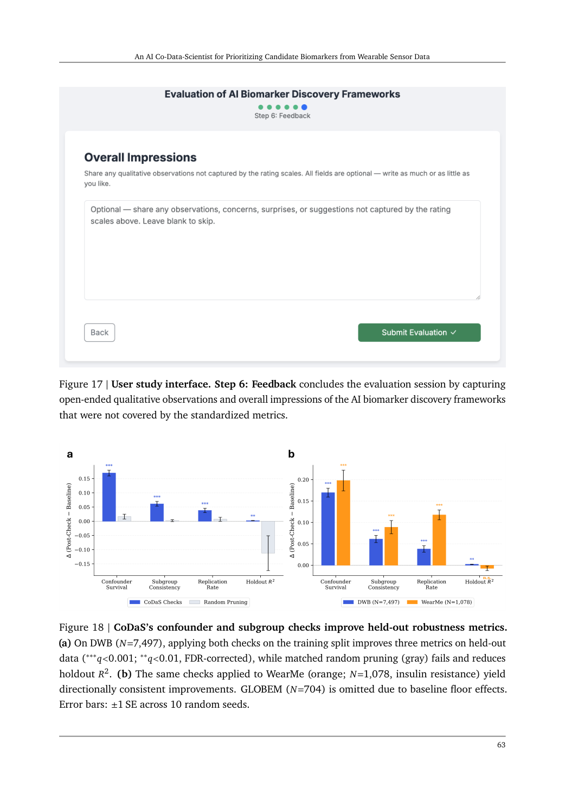

The free-text field preserves issues outside the scales, but an empty interface gives no participation, coding reliability or saturation evidence. [Paper: PDF p.63]

## Figure 18 — two checks evaluated on held-out data

Two checks improve several robustness measures, but held-out R² changes only +.002 in DWB and -.007 (not significant) in WEAR-ME; GLOBEM is omitted because of a floor effect. This tests two mechanisms, not the complete 11-check pipeline or clinical benefit. [Paper: PDF pp.53-55, 63, 66]

