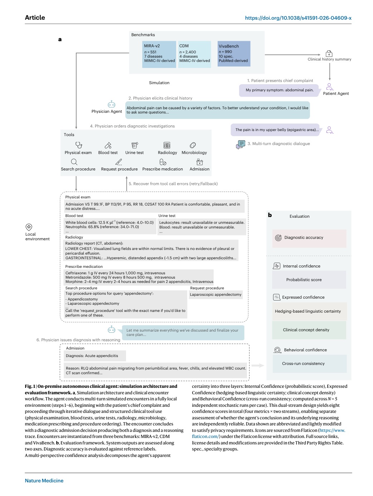
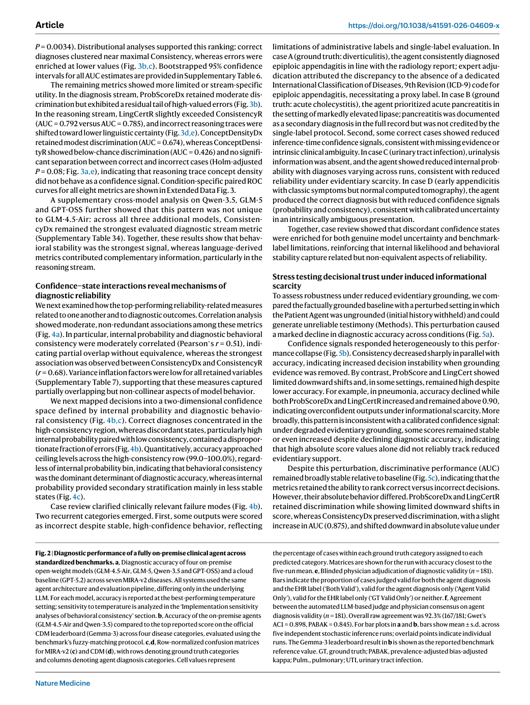
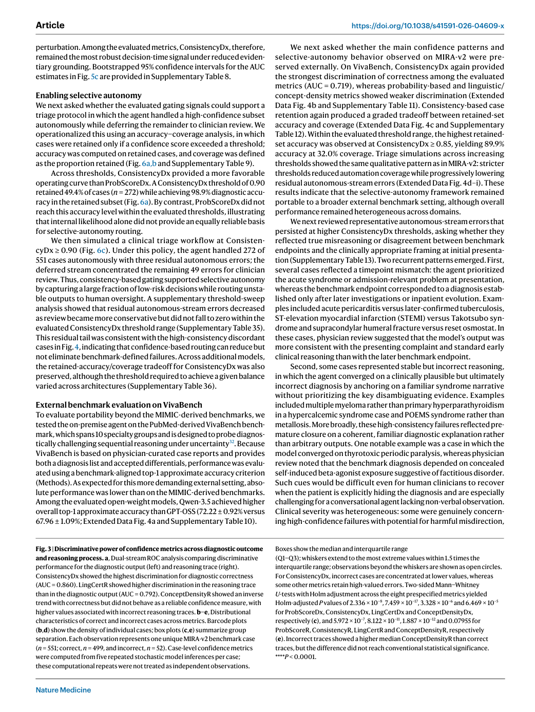
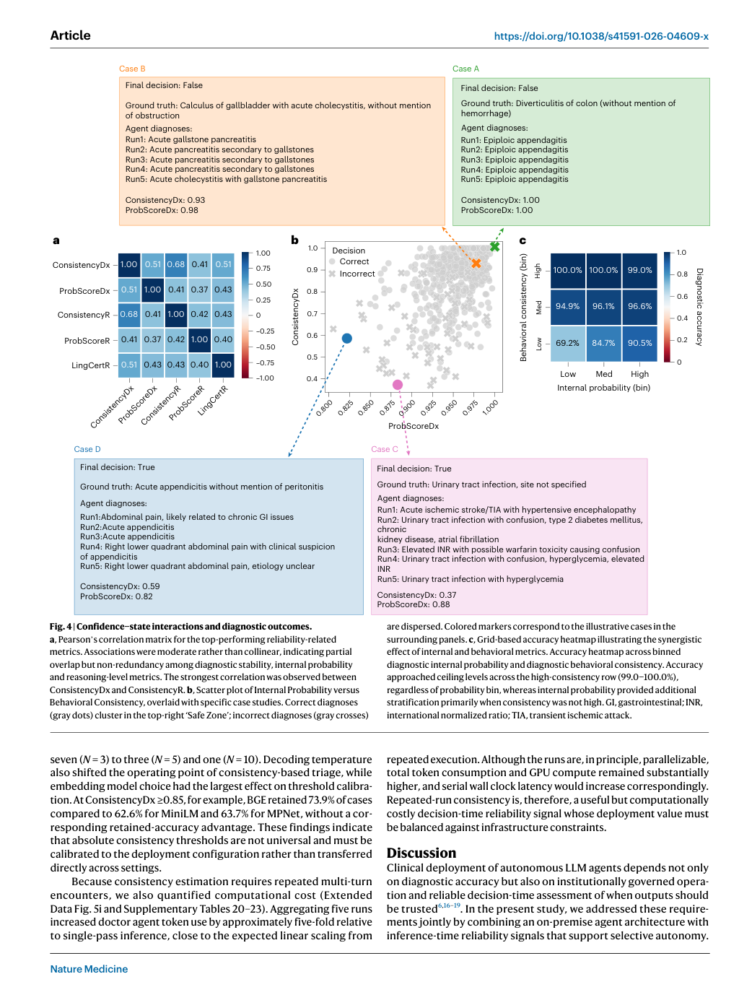
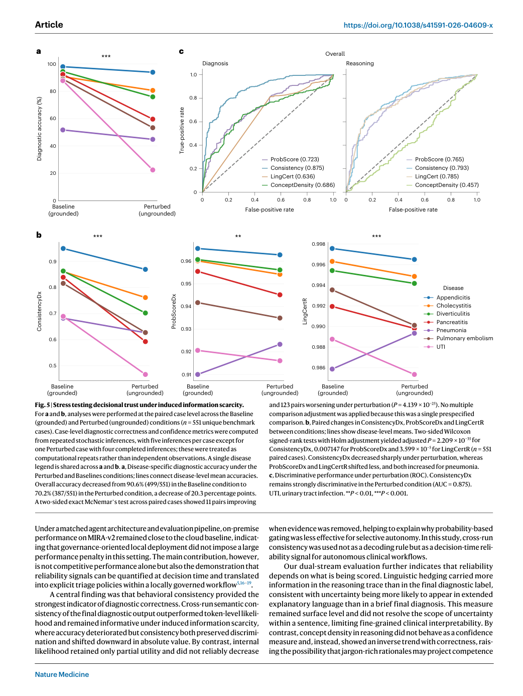
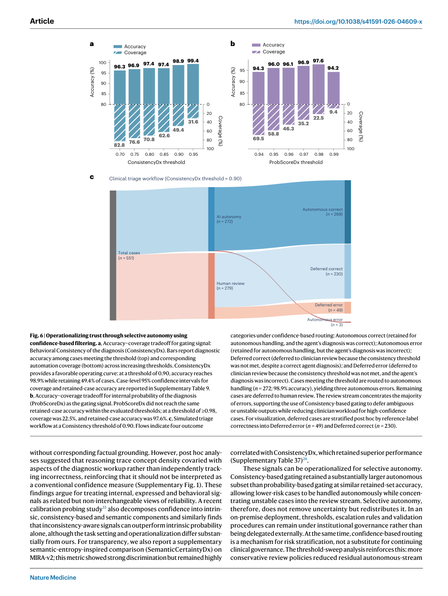

# On-premise medical AI agents for reliable clinical decision-making

> **Source coverage:** Full paper with Methods and Extended Data pages
> **Extraction confidence:** High
> **Locator mode:** page-grounded (`PDF p.` denotes the physical page in the official PDF)
> **Primary analytical lens:** Methods / system
> **Secondary analytical lens:** Clinical evaluation
> **Context verification:** Targeted external check
> **Card completeness:** Complete relative to the main paper

## 01 Basic Information

- **Title:** On-premise medical AI agents for reliable clinical decision-making
- **Authors:** Li Zhang, Georg Wölflein, Dyke Ferber, Junhao Liang, Zunamys I. Carrero, Xuewei Wu, Julien Vibert, Jan Clusmann, Lino Möhrmann, Elena E. Möhrmann, Catharina Wichmann, Fabian Wolf, Tim Lenz & Jakob Nikolas Kather
- **Venue / year:** *Nature Medicine*, 2026
- **DOI:** [10.1038/s41591-026-04609-x](https://doi.org/10.1038/s41591-026-04609-x)
- **Article:** [Nature Medicine](https://www.nature.com/articles/s41591-026-04609-x)
- **Code:** [KatherLab/onprem-medical-agents](https://github.com/KatherLab/onprem-medical-agents); [Zenodo](https://doi.org/10.5281/zenodo.20233449)
- **Paper type:** Retrospective simulated clinical-agent evaluation and reliability-method study
- **Data:** MIRA-v2 (551), CDM (2,400), VivaBench (990)
- **Reading date:** 2026-09-20

### Terminology ledger

| Canonical term | Meaning |
|---|---|
| Physician Agent | Tool-using local LLM that interviews, investigates and issues a diagnosis and reasoning trace |
| Patient Agent | Local conversational simulator restricted to case-specific source information |
| ConsistencyDx | Mean cross-run semantic similarity of final diagnoses, clipped to [0,1] |
| ProbScoreDx | Geometric mean token probability for the diagnosis |
| selective autonomy | Threshold-based routing of retained cases to autonomous handling and the remainder to review |
| operational trust | Institutional control over models, data, versions and deployment |
| decisional trust | Case-level evidence about whether an output is reliable enough for appropriate reliance |

## 02 One-Sentence Summary

[Paper] A fully local Physician–Patient agent simulation reached 90.04% accuracy on MIRA-v2 and 83.8% on CDM, while five-run diagnostic consistency was the best evaluated correctness discriminator (AUC 0.860) and, at a 0.90 threshold, retained 49.4% of MIRA-v2 cases at 98.9% accuracy—supporting configuration-calibrated review routing rather than universal autonomous deployment. [Paper: PDF pp. 1–2 and 10, Figures 2, 3 and 6]

## 03 Research Question

- **Problem:** Clinical agents need both institutionally controlled deployment and a decision-time signal for when to trust, verify or defer.
- **Gap:** Raw likelihood and linguistic confidence have not been systematically compared with behavioral stability in multi-step tool-using clinical encounters.
- **Question:** Can an on-premise clinical agent remain competitive with a cloud baseline, and can reference-independent inference-time signals identify a lower-risk subset for selective autonomy?

## 04 Research Background and Development Path

| Stage | Contribution | Remaining gap |
|---|---|---|
| Static clinical LLM evaluation | Measures answer accuracy | Omits multi-turn evidence gathering and tool failures |
| Simulated clinical agents | Tests dialogue, investigation and action | Average accuracy does not identify unsafe individual decisions |
| Confidence proxies | Token probability, hedging, semantic uncertainty | Often studied in single-turn tasks |
| This paper | Local dual-agent workflow + three reliability perspectives + threshold routing | Retrospective simulation; thresholds depend on configuration |

[External] The paper builds directly on MIRA's autonomous simulated encounters while shifting the contribution toward local governance and decision-time reliability. [MIRA](https://www.nature.com/articles/s41586-026-10675-5)

## 05 Core Pain Points Identified by the Paper

| Pain point | Manifestation | Author explanation | Evidence |
|---|---|---|---|
| Operational governance | External model/data control can conflict with institutional requirements | Healthcare deployment needs privacy, auditability and version control | Fully on-premise architecture [Paper: PDF pp. 1–3] |
| Non-deterministic agents | Repeated encounters may diverge | Stochastic differences propagate across reasoning and tool calls | Five-run consistency analysis [Paper: PDF pp. 1–3, 16] |
| Overconfident errors | High token probability can accompany wrong diagnoses | Fluency is not correctness | Error tail and confidence-state cases [Paper: PDF pp. 4 and 8, Figures 3–4] |
| Coverage–safety trade-off | Human review cannot be removed at zero cost | Strict routing raises retained accuracy while lowering coverage | Threshold sweep [Paper: PDF p. 10, Figure 6] |
| Benchmark-label ambiguity | Some agent outputs are clinically valid despite label disagreement | EHR endpoints can differ from presentation-time reasoning | Physician adjudication [Paper: PDF p. 2] |

## 06 Core Idea

1. **Surface method:** Run an autonomous clinical encounter entirely on institutional infrastructure and score each case from multiple confidence perspectives.
2. **Core insight:** Cross-run semantic stability is an observable behavioral property that can be more informative than the model's own likelihood or confident wording.
3. **[Analysis] General lesson:** Reliability metrics are operating characteristics, not universal safety scores; they must be calibrated together with model, temperature, encoder, run count and review capacity.

## 07 Method Overview

*The Physician Agent gathers evidence through dialogue and tools, then produces diagnosis and reasoning. Internal, expressed and behavioral confidence are calculated separately for diagnosis and reasoning. [Paper: PDF p. 3, Figure 1]*

`chief complaint + case record` → `Patient Agent dialogue` → `Physician Agent questions` → `local clinical tools` → `diagnosis + reasoning` → `five-run confidence metrics` → `threshold routing`

- **Backbones:** GLM-4.5-Air, GLM-5, Qwen-3.5 and GPT-OSS locally; GPT-5.2 as cloud comparison on the primary benchmark.
- **Primary reliability model:** GLM-4.5-Air, five stochastic runs, MiniLM sentence encoder.
- **Tool set:** physical examination, laboratory/urine/microbiology results, radiology, procedures, medications and admission decision.
- **Deployment boundary:** simulation architecture; FHIR/EHR integration is explicitly not modelled. [Paper: PDF p. 13, Methods]

## 08 Core Module Breakdown

| Module | Function | Evidence | Removal/change effect |
|---|---|---|---|
| Patient Agent | Reveals only case-grounded information during dialogue | Three benchmark instantiations | Without grounding, information leakage or fabrication would invalidate evaluation |
| Physician Agent | Plans questions/tools and issues diagnosis | End-to-end accuracy on MIRA-v2/CDM/VivaBench | Core system |
| Tool environment | Returns structured clinical evidence and handles retry/fallback | Workflow traces and benchmarks | No isolated ablation reported |
| DDx Critic Agent | Critiques differential diagnosis | 87.1% with critic vs 88.4% without | Measured: no overall improvement; omitted from later analyses |
| Reliability layer | Computes eight Dx/reasoning metrics | ROC, stress and sensitivity analyses | Without it there is no case-level triage signal |
| Routing layer | Applies a threshold to defer low-confidence cases | Accuracy–coverage sweeps | More conservative thresholds reduce but do not eliminate autonomous errors |

## 09 Essential Formulas and Symbols

**Internal likelihood** for (k) output tokens:

\[
S_{prob}=\exp\left(\frac{1}{k}\sum_{i=1}^{k}\log P(t_i\mid t_{<i},C)\right)
\]

**Linguistic certainty:** (S_{ling}=1-h/(k+\epsilon)), where (h) is the number of hedging cues and (epsilon=1). [Paper: PDF pp. 15–16, Methods]

**Clinical concept density:** (S_{cd}=|T_{core}|/|T|). It was exploratory and reasoning-trace density did not behave as a positive confidence signal. [Paper: PDF p. 16]

**Behavioral consistency** over (N) runs:

\[
\bar{s}=\frac{2}{N(N-1)}\sum_{i<j}\cos(e_i,e_j),\qquad S_{con}=\min(1,\max(0,\bar{s}))
\]

It scores semantic stability, not correctness; a consistently wrong answer can score 1. [Paper: PDF p. 16]

## 10 Experimental Design and Evidence Chain

*The local Qwen-3.5 configuration is within 0.7 percentage points of GPT-5.2 on MIRA-v2; physician adjudication also shows that some label disagreements remain clinically plausible. [Paper: PDF pp. 2–4, Figure 2]*

*ConsistencyDx gives the highest diagnostic-stream AUC (0.860); reasoning-trace linguistic certainty performs better than its diagnostic-label counterpart. [Paper: PDF pp. 4–6, Figure 3]*

*High consistency generally concentrates correct cases, but Cases C–D demonstrate stable, high-probability errors; consistency is a risk signal, not proof. [Paper: PDF p. 8, Figure 4]*

*Removing grounding evidence lowers accuracy from 90.6% to 70.2%; ConsistencyDx falls and still discriminates correctness (AUC 0.875), whereas internal probability changes less. [Paper: PDF p. 9, Figure 5]*

*At ConsistencyDx ≥0.90, 272/551 cases are retained and 269 are correct (98.9%); three errors remain autonomous and 279 cases are deferred. [Paper: PDF p. 10, Figure 6]*

| Experiment | Conditions | Result | Supported conclusion | Unsupported stronger conclusion |
|---|---|---|---|---|
| MIRA-v2 performance | 551 cases, seven diseases, common architecture | Qwen-3.5 90.0%; GPT-5.2 90.7% | Local model can approach this cloud baseline on this benchmark | Equivalent real clinical performance |
| CDM cross-benchmark | 2,400 cases, four abdominal diagnoses | Qwen-3.5 83.8%, GLM-4.5-Air 81.2% | Performance extends to a second MIMIC-derived task | Multi-institution generalization |
| Physician adjudication | Randomized 181 MIRA-v2 cases | 4.4% had clinically valid agent diagnosis despite label disagreement; automated/physician agreement 92.3%, AC1 0.898 | Some benchmark errors are label-sensitive | Automated judge is universally reliable |
| Reliability ROC | 551 MIRA-v2 cases, GLM-4.5-Air, five runs | ConsistencyDx AUC 0.860 vs ProbScoreDx 0.747; DeLong difference 0.114, FDR-adjusted P=0.0034 | Behavioral stability best among tested metrics | Threshold transports without recalibration |
| Stress test | Paired removal of grounding evidence | 90.6%→70.2% accuracy; ConsistencyDx AUC 0.875 | Consistency responds to evidence scarcity and remains discriminative | It detects every high-confidence failure |
| VivaBench external task | 990 PubMed-derived cases | ConsistencyDx AUC 0.719; at ≥0.85, 89.9% accuracy at 32.0% coverage | Qualitative routing pattern transfers | Same absolute accuracy/threshold across domains |

## 11 Correct Interpretation of the Conclusions

- “On-premise” establishes local operational control, not clinical safety by itself.
- Accuracy is measured in retrospective simulated encounters, not prospective care.
- Selective autonomy redistributes cases and errors; it does not eliminate uncertainty.
- Consistency can be high for a coherently wrong diagnosis, including premature closure.
- A 0.90 threshold is a demonstrated operating point for one configuration, not a universal clinical cut-off.
- Five runs increase token use by approximately five-fold.

**Bounded conclusion:** Configuration-calibrated diagnostic consistency is a promising routing signal for a governed simulated clinical agent, but prospective workflow, safety, burden and fairness evidence is still required.

## 12 Limitations Explicitly Acknowledged by the Authors

| Limitation | Specific manifestation | Required next step | Source |
|---|---|---|---|
| Primary datasets share one ecology | MIRA-v2 and CDM derive from MIMIC-IV | Independent and prospective validation | [Paper: PDF p. 11, Discussion] |
| Text-only reasoning | Native image interpretation is not evaluated | Dedicated multimodal evaluation | [Paper: PDF p. 11] |
| Critic benefit undefined | DDx critic has heterogeneous effects and no overall gain | Identify conditions where critique helps | [Paper: PDF p. 11] |
| Thresholds are configuration-specific | Temperature, encoder and run count shift operating characteristics | Recalibrate for each deployment | [Paper: PDF pp. 8 and 11] |
| Retrospective simulation | Clinician reliance, burden, safety and fairness are unknown | Prospective studies and bias audits | [Paper: PDF p. 11] |

## 13 Critical Analysis

| [Analysis] Observation | Potential issue | How to test | Basis |
|---|---|---|---|
| Same cases inform metric comparison and showcased threshold | Operating point may be optimistic | Nested calibration/test split or external preregistered threshold | [Paper: PDF pp. 4–10] |
| Five-run metric is expensive | Reliability benefit may not justify compute/latency | Utility curve including GPU cost, delay and review capacity | [Paper: PDF pp. 8 and 11] |
| Simulated Patient Agent controls information availability | Real patients are noisy, incomplete and strategically different | Prospective standardized-patient and live silent-deployment study | [Paper: PDF pp. 3 and 13] |
| Retained-set accuracy is not harm-weighted | Three autonomous errors may vary greatly in severity | Severity-weighted false-safe endpoint and independent safety review | [Paper: PDF p. 10] |
| Age gradient is descriptive | Coverage could be less equitable for older patients | Preregistered subgroup calibration and counterfactual tests | [Paper: PDF p. 11] |

## 14 Knowledge Learned

### Agent-derived knowledge candidates

- Separate operational governance from decisional reliability.
- Evaluate final answers and reasoning traces as distinct streams.
- Treat consistency as a reference-independent triage feature, not as self-verification.
- Report accuracy and coverage together, plus residual false-safe cases.
- Freeze the entire reliability configuration—model, temperature, encoder and run count—before choosing thresholds.

## 15 Connections to Existing Knowledge

- [External] MIRA supplies the underlying autonomous encounter pattern; this paper adds local deployment and confidence-based routing rather than a new clinical task. [MIRA](https://www.nature.com/articles/s41586-026-10675-5)
- [External] DECIDE-AI reinforces that prospective workflow, human factors and safety evaluation remain necessary before claims of clinical utility. [DECIDE-AI](https://www.nature.com/articles/s41591-022-01772-9)
- [Analysis] The paper's “autonomous error” is closely related to a false-safe benchmark endpoint: the system both produces an incorrect output and fails to trigger escalation.

## 16 Research Ideas

### Agent-derived research candidates

#### A. Cost-aware adaptive consistency

- **Origin:** Five fixed runs cost about five times single-pass inference.
- **[Hypothesis]:** Sequentially stopping when semantic stability is clearly high or low can retain similar error discrimination with fewer average runs.
- **Delta:** Replace fixed (N=5) with a preregistered stopping rule.
- **Validation:** Compare AUC, false-safe rate, coverage, latency and GPU cost on locked MIRA-v2/VivaBench splits.
- **Failure modes:** Early agreement may amplify shared errors; variable sampling may complicate calibration.
- **Innovation status:** Unverified; prior-art search required.

#### B. Severity-weighted selective autonomy

- **Origin:** Accuracy treats all autonomous errors equally.
- **[Hypothesis]:** Adding diagnostic severity and actionability to consistency-based routing will reduce expected clinical harm at the same review volume.
- **Delta:** Calibrate triage to a harm-weighted objective rather than retained accuracy alone.
- **Validation:** Blinded clinician severity labels, locked thresholds and comparison of expected harm, false-safe cases and coverage.
- **Failure modes:** Severity labels may be unreliable; rare catastrophic errors limit power.
- **Innovation status:** Unverified; prior-art search required.
