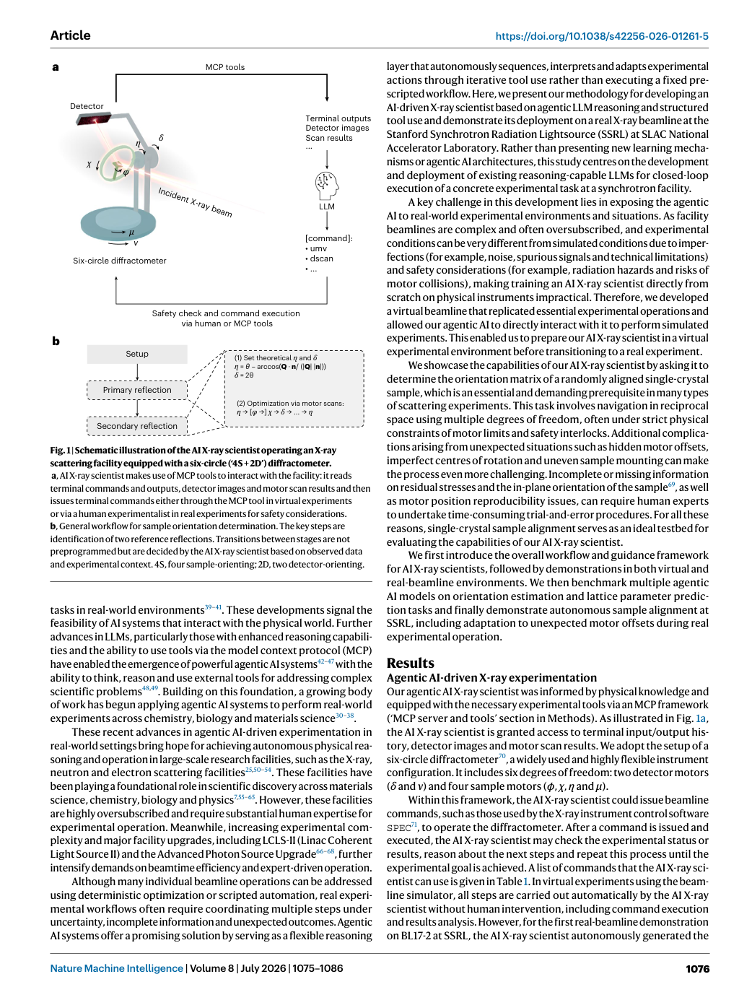

# Figure Analysis: An agentic artificially intelligent X-ray scientist

This companion analyses the source visuals embedded in the English Paper Card. Assets are unchanged PDF page views; no figure was regenerated.

## Figure 1

- **Argumentative role:** Schematic illustration of the AI X-ray scientist operating an X-ray scattering facility equipped with a six-circle (‘4S + 2D’) diffractometer. a, AI X-ray scientist makes use of MCP tools to interact with the facility: it reads terminal commands and outputs, detector images and motor scan results and then
- **Panel / visual logic:** Read the panel labels, axes, legends, and uncertainty marks before comparing conditions. The page view is retained so the full caption and neighbouring interpretation remain visible.
- **Reusable design:** Preserve a one-to-one mapping among workflow stage, comparison, metric, and claim.
- **Boundary:** This visual supports only the conditions and endpoints stated in the source; it does not establish transfer beyond the evaluated setting.
- **Locator:** [Paper: PDF p. 2, Figure 1]

## Figure 2

- **Argumentative role:** Autonomous sample orientation by the AI X-ray scientist in virtual experiments. a, Representative motor scans and detector image acquisitions performed by the AI X-ray scientist during a virtual single-crystal alignment procedure. Circular markers represent raw scan data, solid curves represent
- **Panel / visual logic:** Read the panel labels, axes, legends, and uncertainty marks before comparing conditions. The page view is retained so the full caption and neighbouring interpretation remain visible.
- **Reusable design:** Preserve a one-to-one mapping among workflow stage, comparison, metric, and claim.
- **Boundary:** This visual supports only the conditions and endpoints stated in the source; it does not establish transfer beyond the evaluated setting.
- **Locator:** [Paper: PDF p. 4, Figure 2]

## Figure 3

- **Argumentative role:** Key steps in finding and optimizing the first reference reflection, (0, 0, 6), for the Co3Sn2S2 sample. a–g, Actions taken by the AI X-ray scientist include: capturing a detector image after moving motors η and δ to the theoretical values for the (0, 0, 6) reflection (a); performing an η scan to optimize peak intensity (b);
- **Panel / visual logic:** Read the panel labels, axes, legends, and uncertainty marks before comparing conditions. The page view is retained so the full caption and neighbouring interpretation remain visible.
- **Reusable design:** Preserve a one-to-one mapping among workflow stage, comparison, metric, and claim.
- **Boundary:** This visual supports only the conditions and endpoints stated in the source; it does not establish transfer beyond the evaluated setting.
- **Locator:** [Paper: PDF p. 6, Figure 3]

## Figure 4

- **Argumentative role:** Key steps in finding and optimizing the second reference reflection, (1, 0, 10), from the Co3Sn2S2 sample. This case highlights a challenging scenario where the AI X-ray scientist had no prior knowledge of the in-plane (H–K) orientation, which is a rare setup even in human-led experiments. Meanwhile,
- **Panel / visual logic:** Read the panel labels, axes, legends, and uncertainty marks before comparing conditions. The page view is retained so the full caption and neighbouring interpretation remain visible.
- **Reusable design:** Preserve a one-to-one mapping among workflow stage, comparison, metric, and claim.
- **Boundary:** This visual supports only the conditions and endpoints stated in the source; it does not establish transfer beyond the evaluated setting.
- **Locator:** [Paper: PDF p. 7, Figure 4]

## Cross-figure reading rule

Read workflow figures before performance figures, then connect every visual comparison to its metric, evaluation population, and claim boundary. Visual density is evidence organisation, not independent proof of generality.