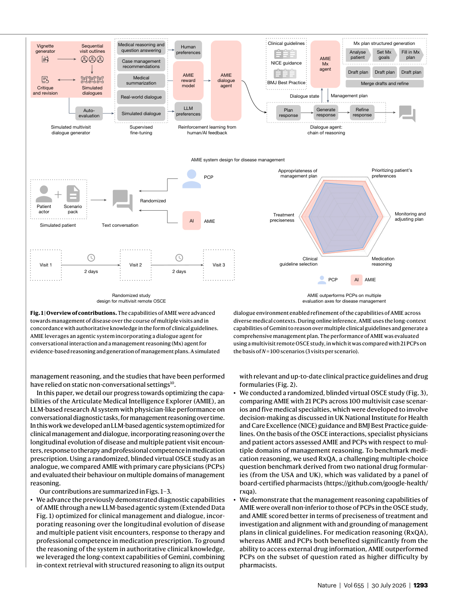
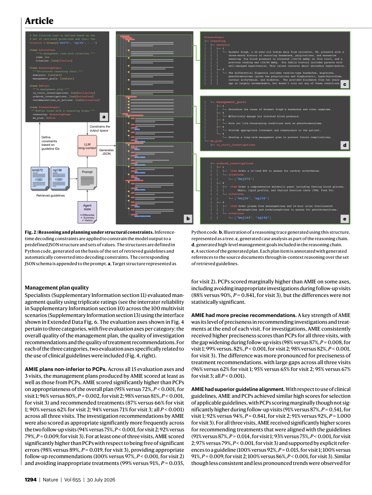
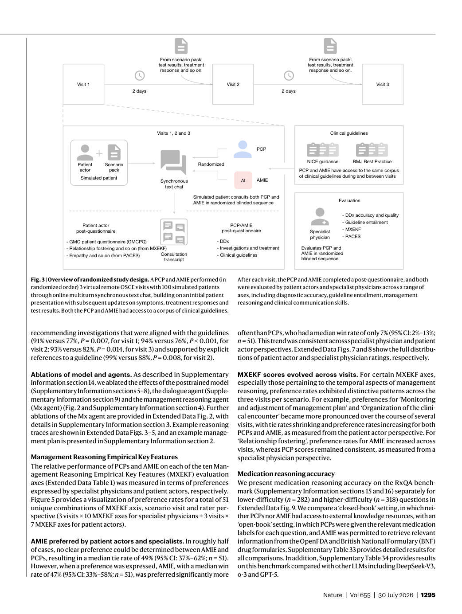
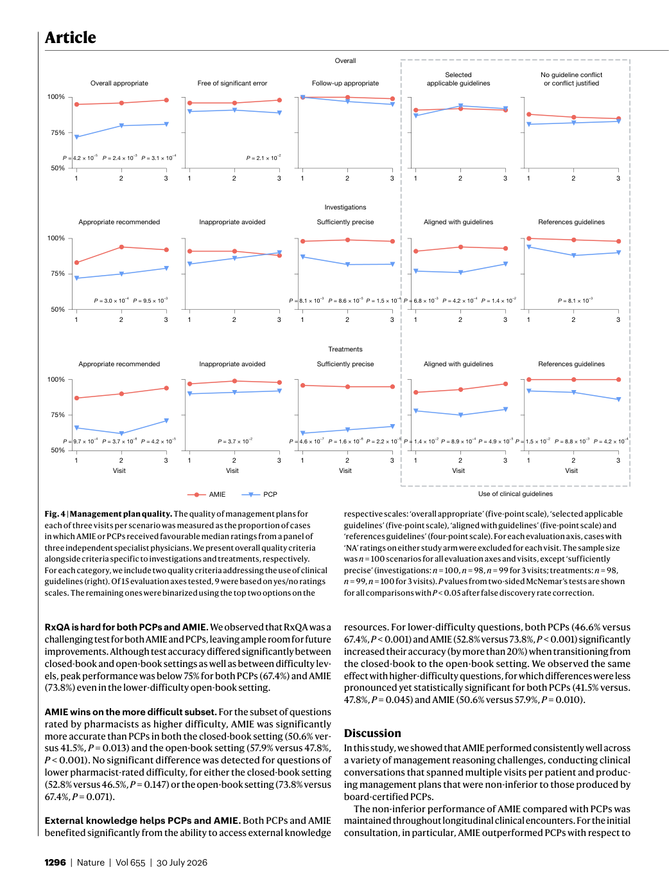
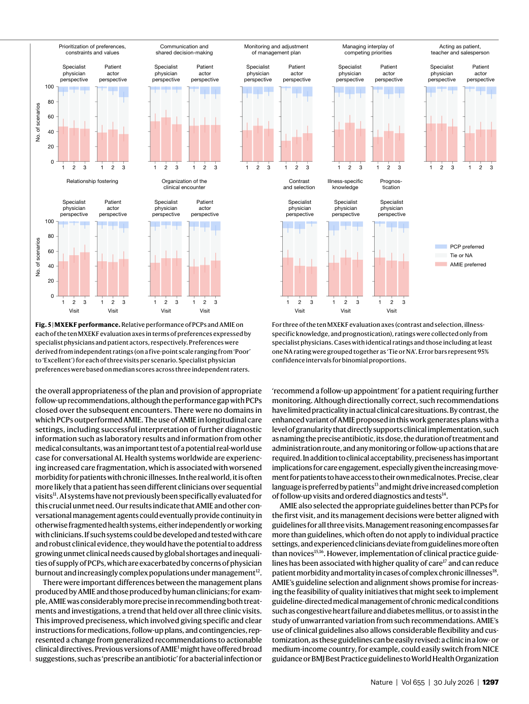

# Figure Analysis: Towards conversational artificial intelligence for disease management

This companion analyses the source visuals embedded in the English Paper Card. Assets are unchanged PDF page views; no figure was regenerated.

## Figure 1

- **Argumentative role:** Overview of contributions. The capabilities of AMIE were advanced towards management of disease over the course of multiple visits and in concordance with authoritative knowledge in the form of clinical guidelines. AMIE leverages an agentic system incorporating a dialogue agent for
- **Panel / visual logic:** Read the panel labels, axes, legends, and uncertainty marks before comparing conditions. The page view is retained so the full caption and neighbouring interpretation remain visible.
- **Reusable design:** Preserve a one-to-one mapping among workflow stage, comparison, metric, and claim.
- **Boundary:** This visual supports only the conditions and endpoints stated in the source; it does not establish transfer beyond the evaluated setting.
- **Locator:** [Paper: PDF p. 2, Figure 1]

## Figure 2

- **Argumentative role:** Reasoning and planning under structural constraints. Inference- time decoding constraints are applied to constrain the model output to a predefined JSON structure and sets of values. The structures are defined in Python code, generated on the basis of the set of retrieved guidelines and
- **Panel / visual logic:** Read the panel labels, axes, legends, and uncertainty marks before comparing conditions. The page view is retained so the full caption and neighbouring interpretation remain visible.
- **Reusable design:** Preserve a one-to-one mapping among workflow stage, comparison, metric, and claim.
- **Boundary:** This visual supports only the conditions and endpoints stated in the source; it does not establish transfer beyond the evaluated setting.
- **Locator:** [Paper: PDF p. 3, Figure 2]

## Figure 3

- **Argumentative role:** Overview of randomized study design. A PCP and AMIE performed (in randomized order) 3 virtual remote OSCE visits with 100 simulated patients through online multiturn synchronous text chat, building on an initial patient presentation with subsequent updates on symptoms, treatment responses and
- **Panel / visual logic:** Read the panel labels, axes, legends, and uncertainty marks before comparing conditions. The page view is retained so the full caption and neighbouring interpretation remain visible.
- **Reusable design:** Preserve a one-to-one mapping among workflow stage, comparison, metric, and claim.
- **Boundary:** This visual supports only the conditions and endpoints stated in the source; it does not establish transfer beyond the evaluated setting.
- **Locator:** [Paper: PDF p. 4, Figure 3]

## Figure 4

- **Argumentative role:** Management plan quality. The quality of management plans for each of three visits per scenario was measured as the proportion of cases in which AMIE or PCPs received favourable median ratings from a panel of three independent specialist physicians. We present overall quality criteria
- **Panel / visual logic:** Read the panel labels, axes, legends, and uncertainty marks before comparing conditions. The page view is retained so the full caption and neighbouring interpretation remain visible.
- **Reusable design:** Preserve a one-to-one mapping among workflow stage, comparison, metric, and claim.
- **Boundary:** This visual supports only the conditions and endpoints stated in the source; it does not establish transfer beyond the evaluated setting.
- **Locator:** [Paper: PDF p. 5, Figure 4]

## Figure 5

- **Argumentative role:** MXEKF performance. Relative performance of PCPs and AMIE on each of the ten MXEKF evaluation axes in terms of preferences expressed by specialist physicians and patient actors, respectively. Preferences were derived from independent ratings (on a five-point scale ranging from ‘Poor’
- **Panel / visual logic:** Read the panel labels, axes, legends, and uncertainty marks before comparing conditions. The page view is retained so the full caption and neighbouring interpretation remain visible.
- **Reusable design:** Preserve a one-to-one mapping among workflow stage, comparison, metric, and claim.
- **Boundary:** This visual supports only the conditions and endpoints stated in the source; it does not establish transfer beyond the evaluated setting.
- **Locator:** [Paper: PDF p. 6, Figure 5]

## Cross-figure reading rule

Read workflow figures before performance figures, then connect every visual comparison to its metric, evaluation population, and claim boundary. Visual density is evidence organisation, not independent proof of generality.