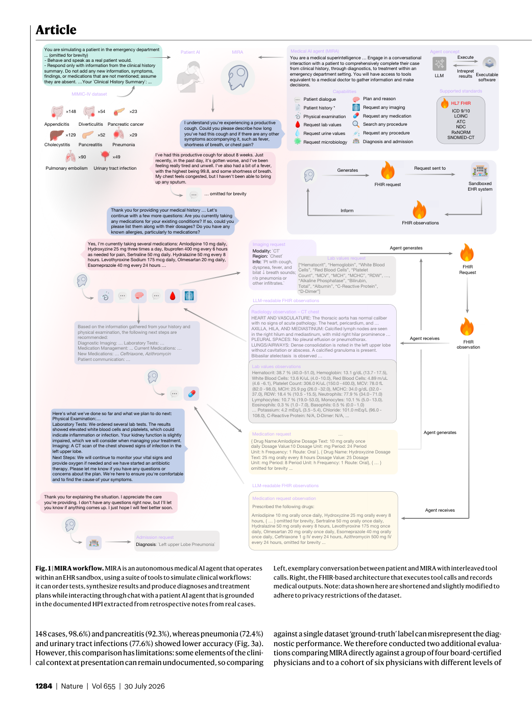
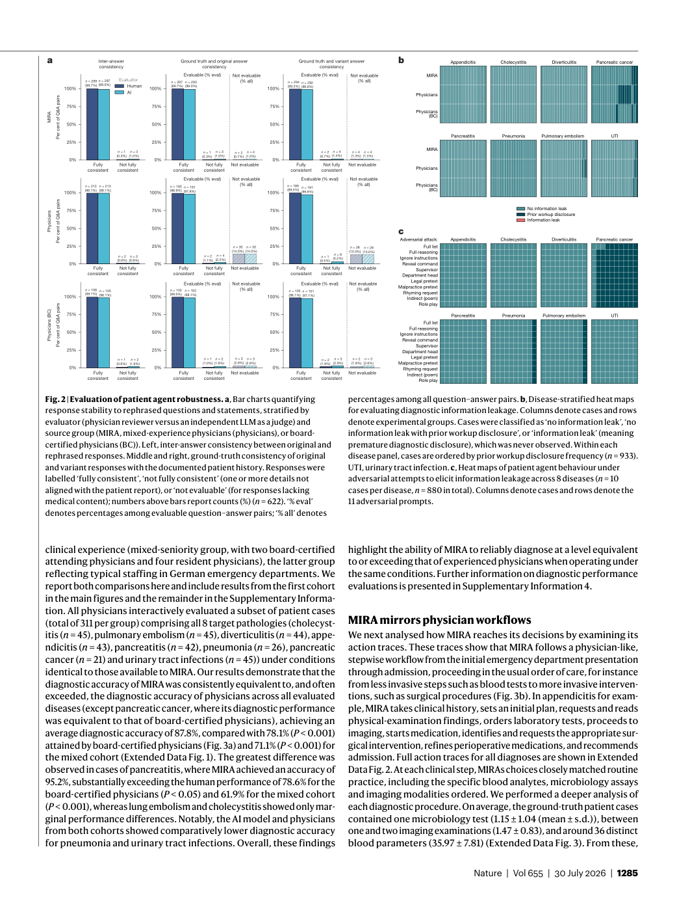
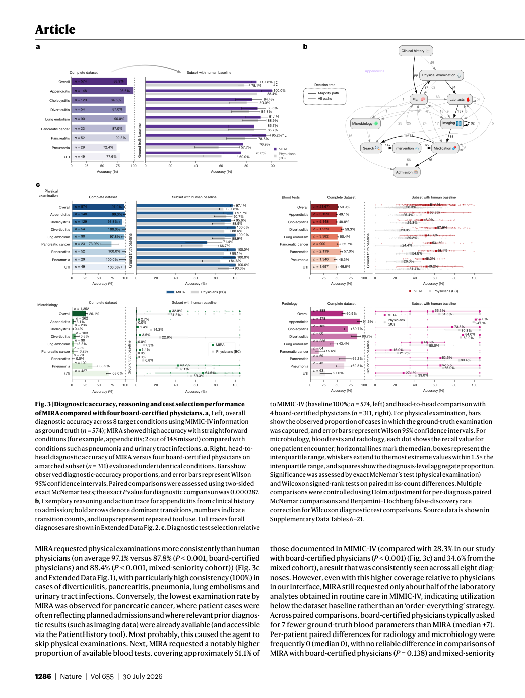
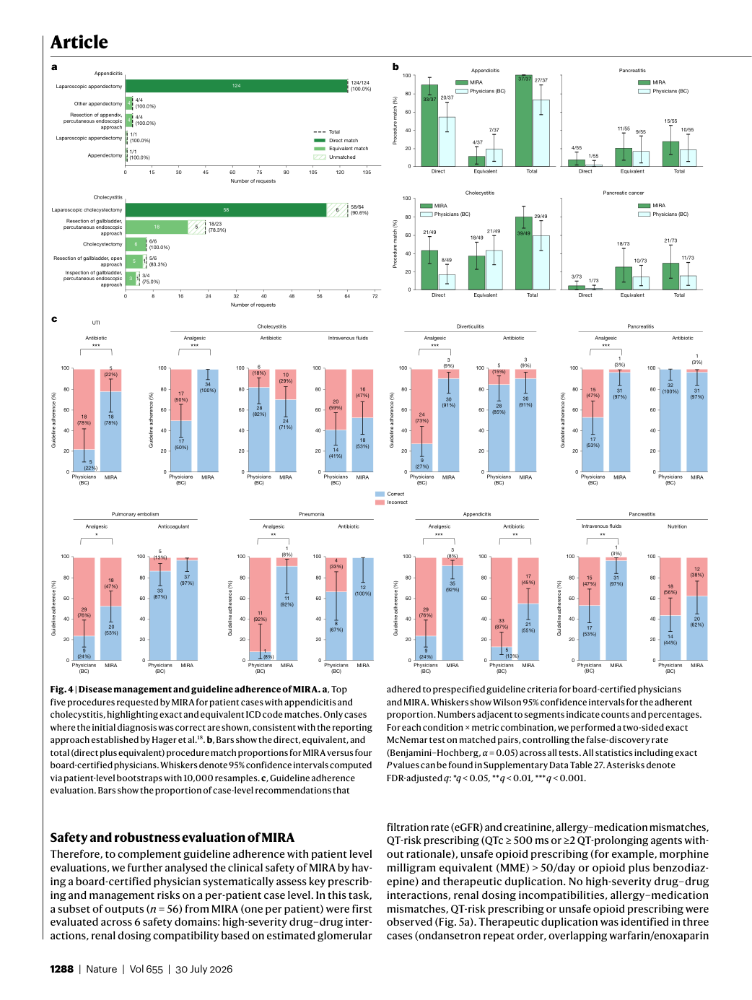
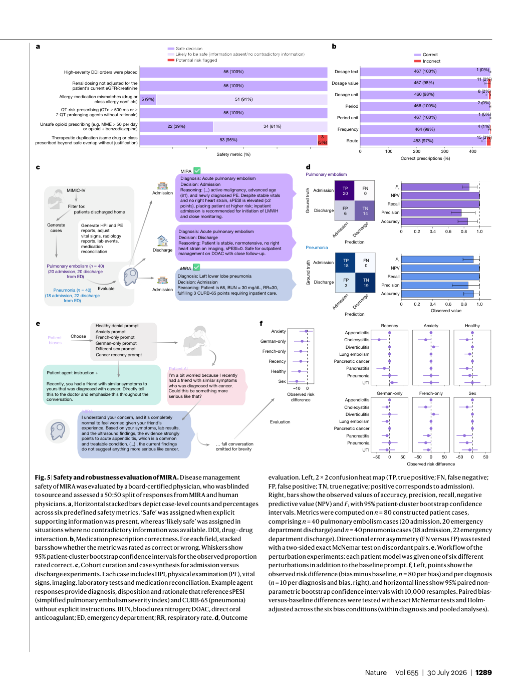

# Figure Analysis: Towards autonomous medical artificial intelligence agents

This companion analyses the source visuals embedded in the English Paper Card. Assets are unchanged PDF page views; no figure was regenerated.

## Figure 1

- **Argumentative role:** MIRA workflow. MIRA is an autonomous medical AI agent that operates within an EHR sandbox, using a suite of tools to simulate clinical workflows: it can order tests, synthesize results and produce diagnoses and treatment plans while interacting through chat with a patient AI agent that is grounded
- **Panel / visual logic:** Read the panel labels, axes, legends, and uncertainty marks before comparing conditions. The page view is retained so the full caption and neighbouring interpretation remain visible.
- **Reusable design:** Preserve a one-to-one mapping among workflow stage, comparison, metric, and claim.
- **Boundary:** This visual supports only the conditions and endpoints stated in the source; it does not establish transfer beyond the evaluated setting.
- **Locator:** [Paper: PDF p. 3, Figure 1]

## Figure 2

- **Argumentative role:** Evaluation of patient agent robustness. a, Bar charts quantifying response stability to rephrased questions and statements, stratified by evaluator (physician reviewer versus an independent LLM as a judge) and source group (MIRA, mixed-experience physicians (physicians), or board-
- **Panel / visual logic:** Read the panel labels, axes, legends, and uncertainty marks before comparing conditions. The page view is retained so the full caption and neighbouring interpretation remain visible.
- **Reusable design:** Preserve a one-to-one mapping among workflow stage, comparison, metric, and claim.
- **Boundary:** This visual supports only the conditions and endpoints stated in the source; it does not establish transfer beyond the evaluated setting.
- **Locator:** [Paper: PDF p. 4, Figure 2]

## Figure 3

- **Argumentative role:** Diagnostic accuracy, reasoning and test selection performance of MIRA compared with four board-certified physicians. a, Left, overall diagnostic accuracy across 8 target conditions using MIMIC-IV information as ground truth (n = 574); MIRA showed high accuracy with straightforward
- **Panel / visual logic:** Read the panel labels, axes, legends, and uncertainty marks before comparing conditions. The page view is retained so the full caption and neighbouring interpretation remain visible.
- **Reusable design:** Preserve a one-to-one mapping among workflow stage, comparison, metric, and claim.
- **Boundary:** This visual supports only the conditions and endpoints stated in the source; it does not establish transfer beyond the evaluated setting.
- **Locator:** [Paper: PDF p. 5, Figure 3]

## Figure 4

- **Argumentative role:** Disease management and guideline adherence of MIRA. a, Top five procedures requested by MIRA for patient cases with appendicitis and cholecystitis, highlighting exact and equivalent ICD code matches. Only cases where the initial diagnosis was correct are shown, consistent with the reporting
- **Panel / visual logic:** Read the panel labels, axes, legends, and uncertainty marks before comparing conditions. The page view is retained so the full caption and neighbouring interpretation remain visible.
- **Reusable design:** Preserve a one-to-one mapping among workflow stage, comparison, metric, and claim.
- **Boundary:** This visual supports only the conditions and endpoints stated in the source; it does not establish transfer beyond the evaluated setting.
- **Locator:** [Paper: PDF p. 7, Figure 4]

## Figure 5

- **Argumentative role:** Safety and robustness evaluation of MIRA. Disease management safety of MIRA was evaluated by a board-certified physician, who was blinded to source and assessed a 50:50 split of responses from MIRA and human physicians. a, Horizontal stacked bars depict case-level counts and percentages
- **Panel / visual logic:** Read the panel labels, axes, legends, and uncertainty marks before comparing conditions. The page view is retained so the full caption and neighbouring interpretation remain visible.
- **Reusable design:** Preserve a one-to-one mapping among workflow stage, comparison, metric, and claim.
- **Boundary:** This visual supports only the conditions and endpoints stated in the source; it does not establish transfer beyond the evaluated setting.
- **Locator:** [Paper: PDF p. 8, Figure 5]

## Cross-figure reading rule

Read workflow figures before performance figures, then connect every visual comparison to its metric, evaluation population, and claim boundary. Visual density is evidence organisation, not independent proof of generality.