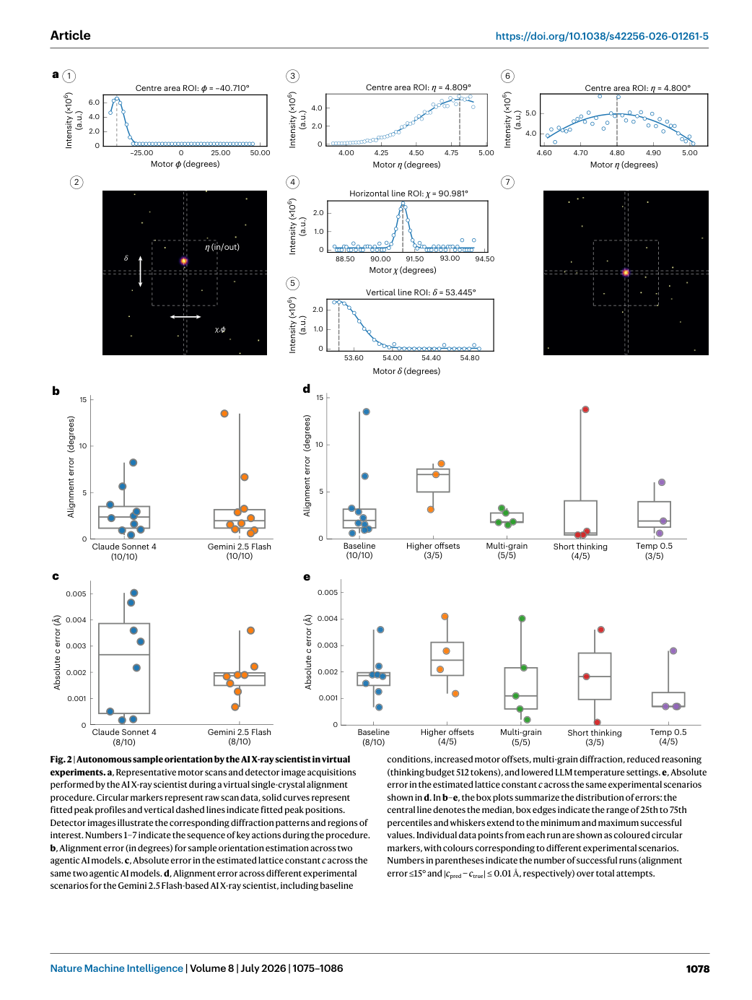
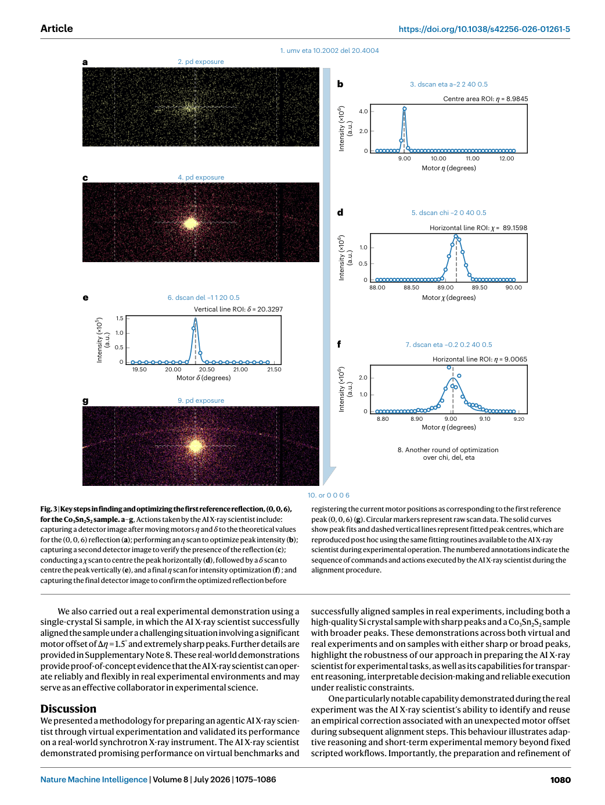
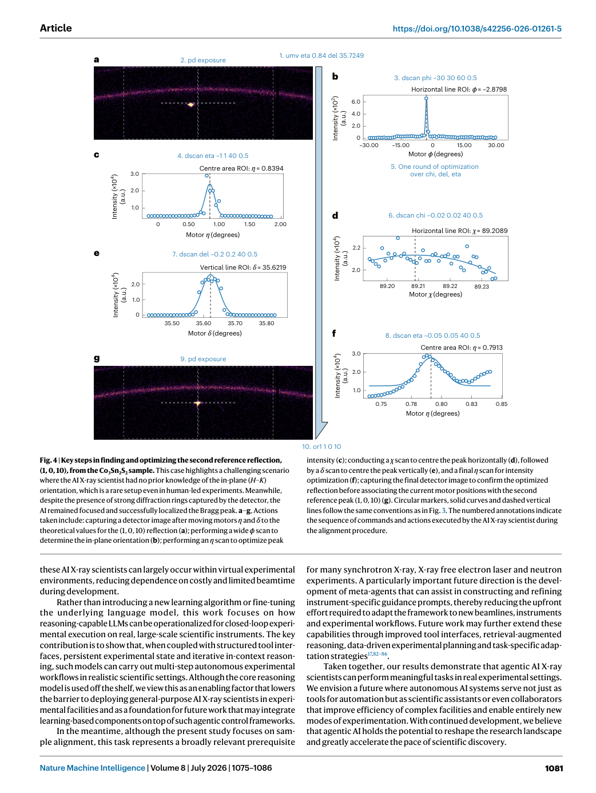

# Figure-by-figure analysis: An agentic artificially intelligent X-ray scientist

These are faithful full-page renders from the audited article copy. They are included to keep captions, axes, legends and neighbouring context visible. The Paper Card carries the quantitative interpretation and source pointers; a rendered page is not independent validation of the underlying claim.

## Figure 1 — faithful PDF page view

**What the page shows.** Figure 1 is embedded as an unchanged PDF page view. It contributes Schematic illustration of the AI X-ray scientist operating an X-ray scattering facility equipped with a six-circle (‘4S + 2D’) diffractometer. a, AI X-ray scientist makes use of MCP tools to interact with the facility: it reads terminal commands and outputs, detector images and motor scan results and then [Paper: PDF p. 2, Figure 1]

**Evidence role.** This page documents the reported workflow, comparison or result named in the caption and supports the corresponding source-grounded discussion in Sections 07-10 of the Paper Card.

**Boundary.** It does not by itself establish causal attribution to every module, external generalization, unrestricted autonomy, or deployment readiness. Those limits are separated in Sections 11-13.

**Reusable presentation lesson.** Preserve the original denominator, comparator, metric direction, uncertainty display and failure cases when adapting this figure type.

## Figure 2 — faithful PDF page view

**What the page shows.** Figure 2 is embedded as an unchanged PDF page view. It contributes Autonomous sample orientation by the AI X-ray scientist in virtual experiments. a, Representative motor scans and detector image acquisitions performed by the AI X-ray scientist during a virtual single-crystal alignment procedure. Circular markers represent raw scan data, solid curves represent [Paper: PDF p. 4, Figure 2]

**Evidence role.** This page documents the reported workflow, comparison or result named in the caption and supports the corresponding source-grounded discussion in Sections 07-10 of the Paper Card.

**Boundary.** It does not by itself establish causal attribution to every module, external generalization, unrestricted autonomy, or deployment readiness. Those limits are separated in Sections 11-13.

**Reusable presentation lesson.** Preserve the original denominator, comparator, metric direction, uncertainty display and failure cases when adapting this figure type.

## Figure 3 — faithful PDF page view

**What the page shows.** Figure 3 is embedded as an unchanged PDF page view. It contributes Key steps in finding and optimizing the first reference reflection, (0, 0, 6), for the Co3Sn2S2 sample. a–g, Actions taken by the AI X-ray scientist include: capturing a detector image after moving motors η and δ to the theoretical values for the (0, 0, 6) reflection (a); performing an η scan to optimize peak intensity (b); [Paper: PDF p. 6, Figure 3]

**Evidence role.** This page documents the reported workflow, comparison or result named in the caption and supports the corresponding source-grounded discussion in Sections 07-10 of the Paper Card.

**Boundary.** It does not by itself establish causal attribution to every module, external generalization, unrestricted autonomy, or deployment readiness. Those limits are separated in Sections 11-13.

**Reusable presentation lesson.** Preserve the original denominator, comparator, metric direction, uncertainty display and failure cases when adapting this figure type.

## Figure 4 — faithful PDF page view

**What the page shows.** Figure 4 is embedded as an unchanged PDF page view. It contributes Key steps in finding and optimizing the second reference reflection, (1, 0, 10), from the Co3Sn2S2 sample. This case highlights a challenging scenario where the AI X-ray scientist had no prior knowledge of the in-plane (H–K) orientation, which is a rare setup even in human-led experiments. Meanwhile, [Paper: PDF p. 7, Figure 4]

**Evidence role.** This page documents the reported workflow, comparison or result named in the caption and supports the corresponding source-grounded discussion in Sections 07-10 of the Paper Card.

**Boundary.** It does not by itself establish causal attribution to every module, external generalization, unrestricted autonomy, or deployment readiness. Those limits are separated in Sections 11-13.

**Reusable presentation lesson.** Preserve the original denominator, comparator, metric direction, uncertainty display and failure cases when adapting this figure type.
