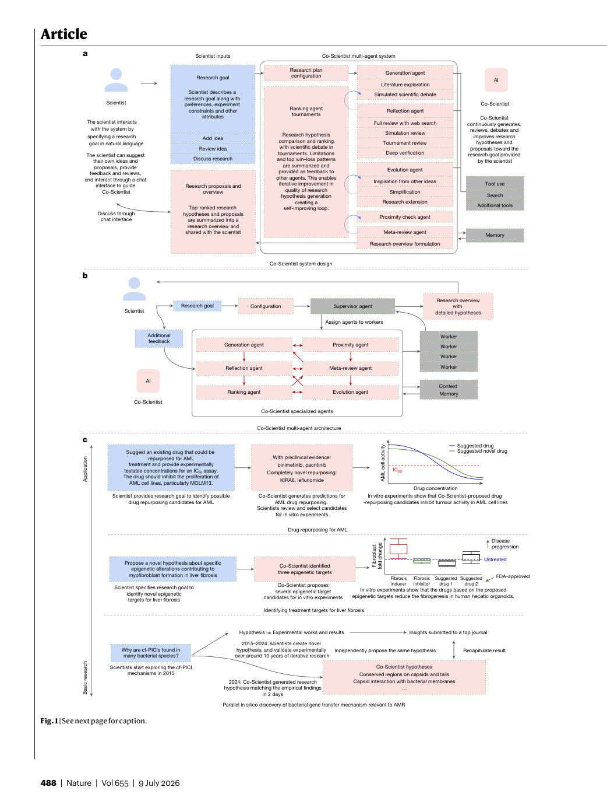
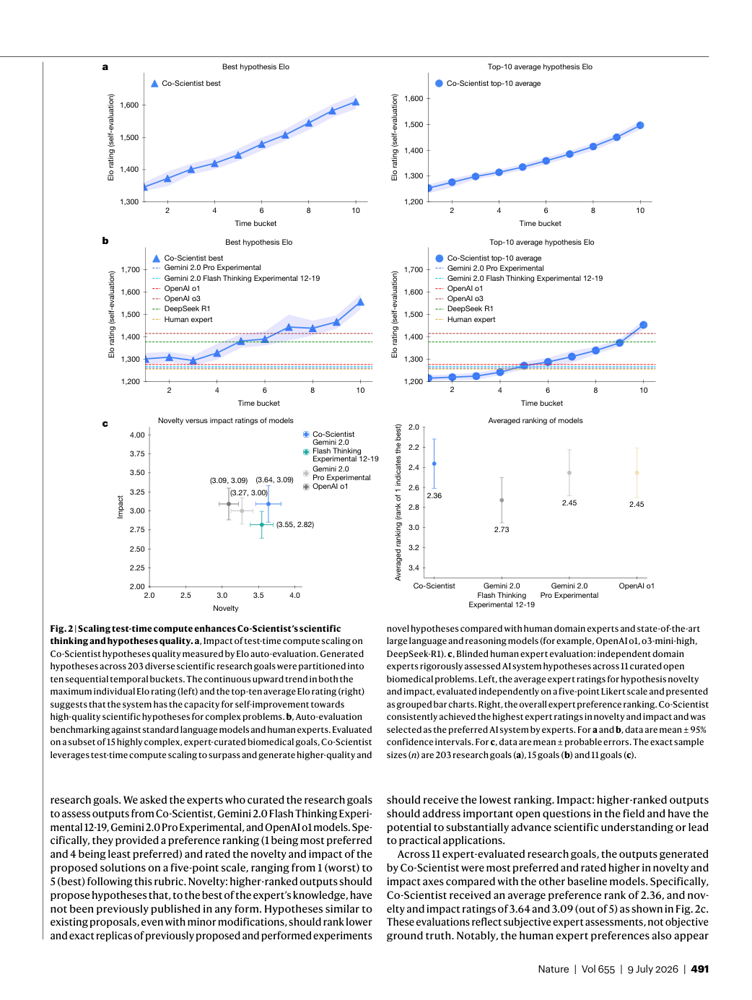
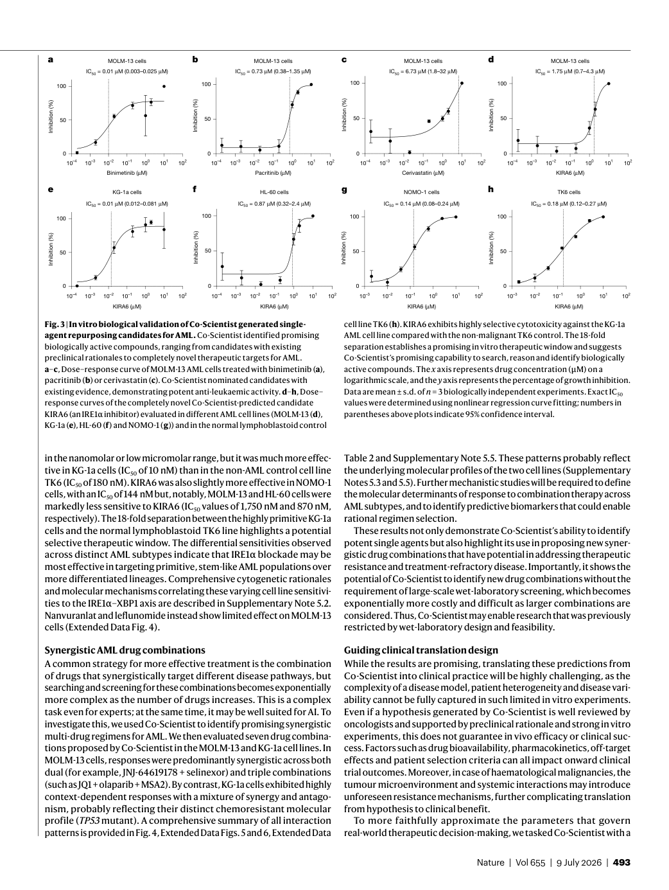
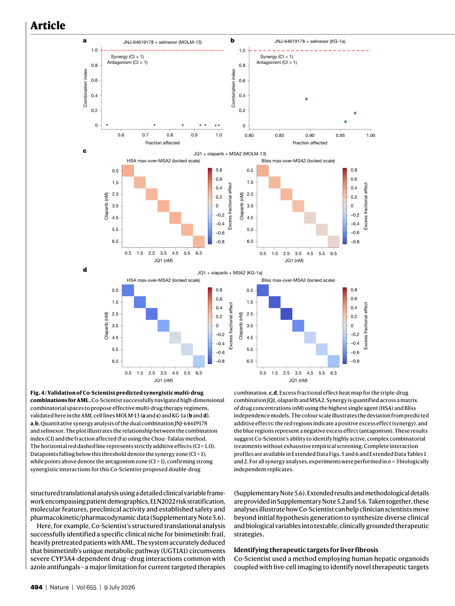

# Figure Analysis: Accelerating scientific discovery with Co-Scientist

This companion analyses the source visuals embedded in the English Paper Card. Assets are unchanged PDF page views; no figure was regenerated.

## Figure 1

- **Argumentative role:** See next page for caption.
- **Panel / visual logic:** Read the panel labels, axes, legends, and uncertainty marks before comparing conditions. The page view is retained so the full caption and neighbouring interpretation remain visible.
- **Reusable design:** Preserve a one-to-one mapping among workflow stage, comparison, metric, and claim.
- **Boundary:** This visual supports only the conditions and endpoints stated in the source; it does not establish transfer beyond the evaluated setting.
- **Locator:** [Paper: PDF p. 2, Figure 1]

## Figure 2

- **Argumentative role:** Scaling test-time compute enhances Co-Scientist’s scientific thinking and hypotheses quality. a, Impact of test-time compute scaling on Co-Scientist hypotheses quality measured by Elo auto-evaluation. Generated hypotheses across 203 diverse scientific research goals were partitioned into
- **Panel / visual logic:** Read the panel labels, axes, legends, and uncertainty marks before comparing conditions. The page view is retained so the full caption and neighbouring interpretation remain visible.
- **Reusable design:** Preserve a one-to-one mapping among workflow stage, comparison, metric, and claim.
- **Boundary:** This visual supports only the conditions and endpoints stated in the source; it does not establish transfer beyond the evaluated setting.
- **Locator:** [Paper: PDF p. 5, Figure 2]

## Figure 3

- **Argumentative role:** In vitro biological validation of Co-Scientist generated single- agent repurposing candidates for AML. Co-Scientist identified promising biologically active compounds, ranging from candidates with existing preclinical rationales to completely novel therapeutic targets for AML.
- **Panel / visual logic:** Read the panel labels, axes, legends, and uncertainty marks before comparing conditions. The page view is retained so the full caption and neighbouring interpretation remain visible.
- **Reusable design:** Preserve a one-to-one mapping among workflow stage, comparison, metric, and claim.
- **Boundary:** This visual supports only the conditions and endpoints stated in the source; it does not establish transfer beyond the evaluated setting.
- **Locator:** [Paper: PDF p. 7, Figure 3]

## Figure 4

- **Argumentative role:** Validation of Co-Scientist predicted synergistic multi-drug combinations for AML. Co-Scientist successfully navigated high-dimensional combinatorial spaces to propose effective multi-drug therapy regimens, validated here in the AML cell lines MOLM-13 (a and c) and KG-1a (b and d).
- **Panel / visual logic:** Read the panel labels, axes, legends, and uncertainty marks before comparing conditions. The page view is retained so the full caption and neighbouring interpretation remain visible.
- **Reusable design:** Preserve a one-to-one mapping among workflow stage, comparison, metric, and claim.
- **Boundary:** This visual supports only the conditions and endpoints stated in the source; it does not establish transfer beyond the evaluated setting.
- **Locator:** [Paper: PDF p. 8, Figure 4]

## Cross-figure reading rule

Read workflow figures before performance figures, then connect every visual comparison to its metric, evaluation population, and claim boundary. Visual density is evidence organisation, not independent proof of generality.