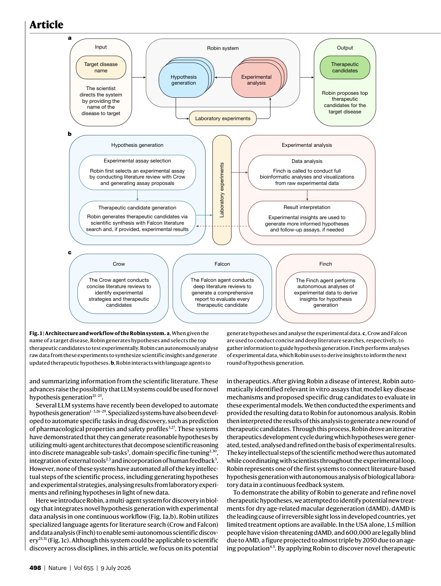
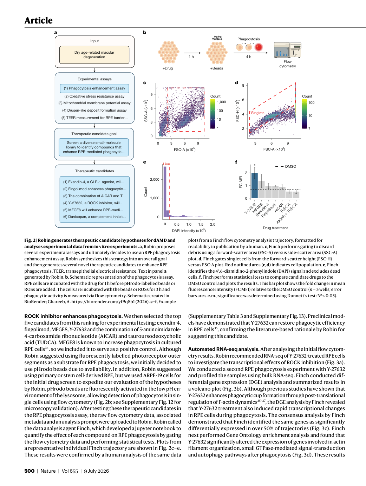
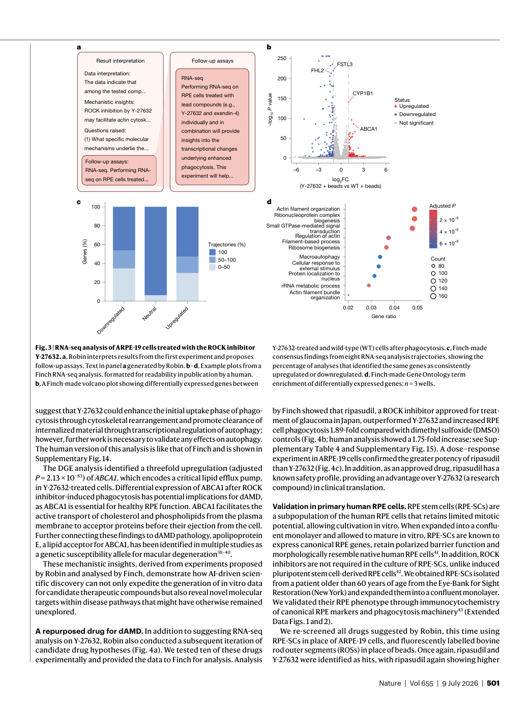
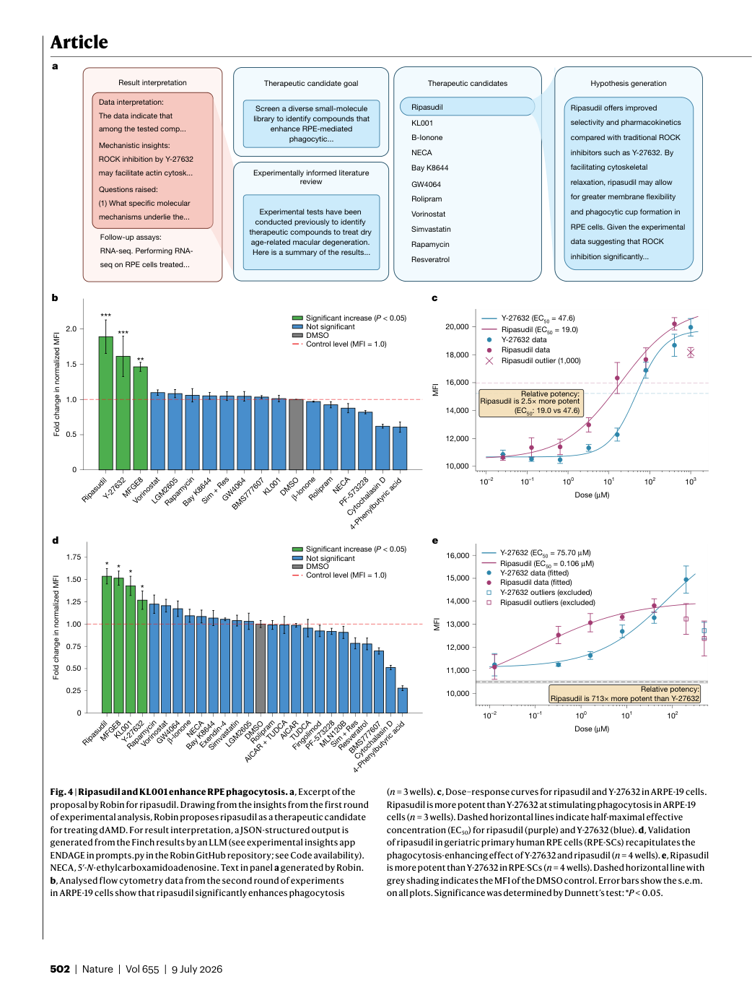

# Figure Analysis: A multi-agent system for automating scientific discovery

This companion analyses the source visuals embedded in the English Paper Card. Assets are unchanged PDF page views; no figure was regenerated.

## Figure 1

- **Argumentative role:** Architecture and workflow of the Robin system. a, When given the name of a target disease, Robin generates hypotheses and selects the top therapeutic candidates to test experimentally. Robin can autonomously analyse raw data from these experiments to synthesize scientific insights and generate
- **Panel / visual logic:** Read the panel labels, axes, legends, and uncertainty marks before comparing conditions. The page view is retained so the full caption and neighbouring interpretation remain visible.
- **Reusable design:** Preserve a one-to-one mapping among workflow stage, comparison, metric, and claim.
- **Boundary:** This visual supports only the conditions and endpoints stated in the source; it does not establish transfer beyond the evaluated setting.
- **Locator:** [Paper: PDF p. 2, Figure 1]

## Figure 2

- **Argumentative role:** Robin generates therapeutic candidate hypotheses for dAMD and analyses experimental data from in vitro experiments. a, Robin proposes several experimental assays and ultimately decides to use an RPE phagocytosis enhancement assay. Robin synthesizes this strategy into an overall goal
- **Panel / visual logic:** Read the panel labels, axes, legends, and uncertainty marks before comparing conditions. The page view is retained so the full caption and neighbouring interpretation remain visible.
- **Reusable design:** Preserve a one-to-one mapping among workflow stage, comparison, metric, and claim.
- **Boundary:** This visual supports only the conditions and endpoints stated in the source; it does not establish transfer beyond the evaluated setting.
- **Locator:** [Paper: PDF p. 4, Figure 2]

## Figure 3

- **Argumentative role:** RNA-seq analysis of ARPE-19 cells treated with the ROCK inhibitor Y-27632. a, Robin interprets results from the first experiment and proposes follow-up assays. Text in panel a generated by Robin. b–d, Example plots from a Finch RNA-seq analysis, formatted for readability in publication by a human.
- **Panel / visual logic:** Read the panel labels, axes, legends, and uncertainty marks before comparing conditions. The page view is retained so the full caption and neighbouring interpretation remain visible.
- **Reusable design:** Preserve a one-to-one mapping among workflow stage, comparison, metric, and claim.
- **Boundary:** This visual supports only the conditions and endpoints stated in the source; it does not establish transfer beyond the evaluated setting.
- **Locator:** [Paper: PDF p. 5, Figure 3]

## Figure 4

- **Argumentative role:** Ripasudil and KL001 enhance RPE phagocytosis. a, Excerpt of the proposal by Robin for ripasudil. Drawing from the insights from the first round of experimental analysis, Robin proposes ripasudil as a therapeutic candidate for treating dAMD. For result interpretation, a JSON-structured output is
- **Panel / visual logic:** Read the panel labels, axes, legends, and uncertainty marks before comparing conditions. The page view is retained so the full caption and neighbouring interpretation remain visible.
- **Reusable design:** Preserve a one-to-one mapping among workflow stage, comparison, metric, and claim.
- **Boundary:** This visual supports only the conditions and endpoints stated in the source; it does not establish transfer beyond the evaluated setting.
- **Locator:** [Paper: PDF p. 6, Figure 4]

## Cross-figure reading rule

Read workflow figures before performance figures, then connect every visual comparison to its metric, evaluation population, and claim boundary. Visual density is evidence organisation, not independent proof of generality.