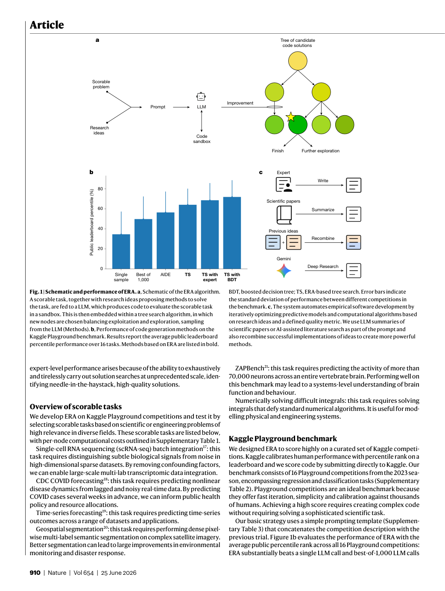
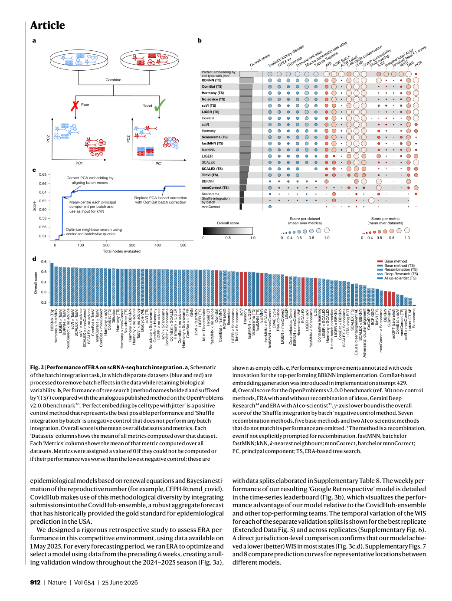
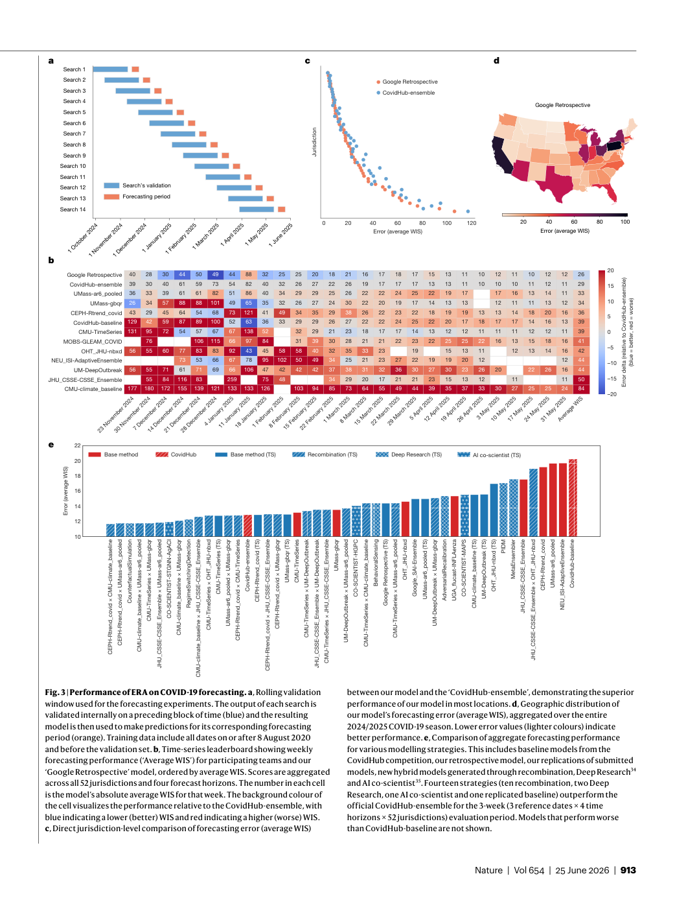

# Figure Analysis: An AI system to help scientists write expert-level empirical software

This companion analyses the source visuals embedded in the English Paper Card. Assets are unchanged PDF page views; no figure was regenerated.

## Figure 1

- **Argumentative role:** Schematic and performance of ERA. a, Schematic of the ERA algorithm. A scorable task, together with research ideas proposing methods to solve the task, are fed to a LLM, which produces code to evaluate the scorable task in a sandbox. This is then embedded within a tree search algorithm, in which
- **Panel / visual logic:** Read the panel labels, axes, legends, and uncertainty marks before comparing conditions. The page view is retained so the full caption and neighbouring interpretation remain visible.
- **Reusable design:** Preserve a one-to-one mapping among workflow stage, comparison, metric, and claim.
- **Boundary:** This visual supports only the conditions and endpoints stated in the source; it does not establish transfer beyond the evaluated setting.
- **Locator:** [Paper: PDF p. 2, Figure 1]

## Figure 2

- **Argumentative role:** Performance of ERA on scRNA-seq batch integration. a, Schematic of the batch integration task, in which disparate datasets (blue and red) are processed to remove batch effects in the data while retaining biological variability. b, Performance of tree search (method names bolded and suffixed
- **Panel / visual logic:** Read the panel labels, axes, legends, and uncertainty marks before comparing conditions. The page view is retained so the full caption and neighbouring interpretation remain visible.
- **Reusable design:** Preserve a one-to-one mapping among workflow stage, comparison, metric, and claim.
- **Boundary:** This visual supports only the conditions and endpoints stated in the source; it does not establish transfer beyond the evaluated setting.
- **Locator:** [Paper: PDF p. 4, Figure 2]

## Figure 3

- **Argumentative role:** Performance of ERA on COVID-19 forecasting. a, Rolling validation window used for the forecasting experiments. The output of each search is validated internally on a preceding block of time (blue) and the resulting model is then used to make predictions for its corresponding forecasting
- **Panel / visual logic:** Read the panel labels, axes, legends, and uncertainty marks before comparing conditions. The page view is retained so the full caption and neighbouring interpretation remain visible.
- **Reusable design:** Preserve a one-to-one mapping among workflow stage, comparison, metric, and claim.
- **Boundary:** This visual supports only the conditions and endpoints stated in the source; it does not establish transfer beyond the evaluated setting.
- **Locator:** [Paper: PDF p. 5, Figure 3]

## Cross-figure reading rule

Read workflow figures before performance figures, then connect every visual comparison to its metric, evaluation population, and claim boundary. Visual density is evidence organisation, not independent proof of generality.