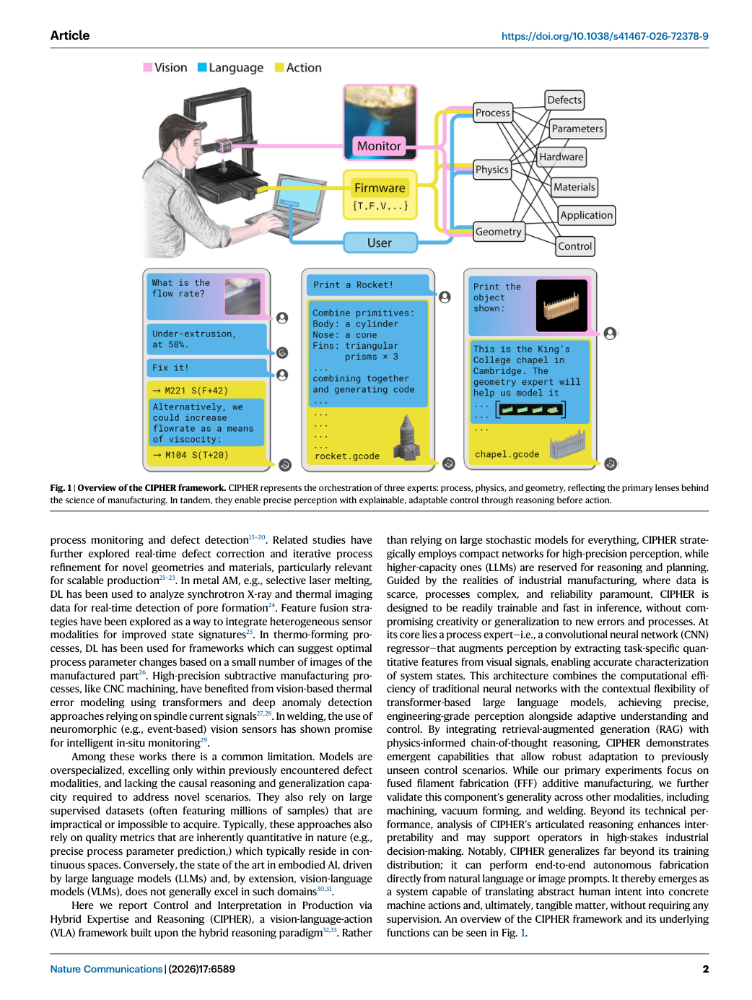
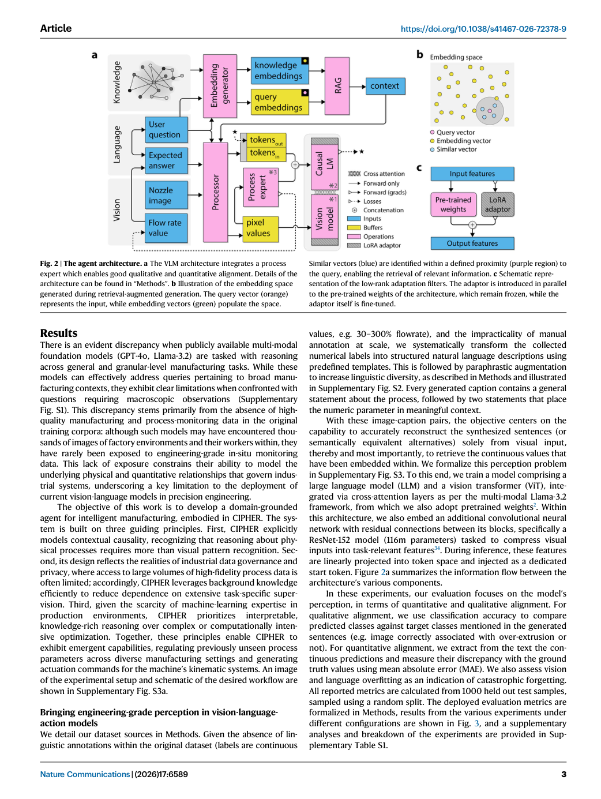
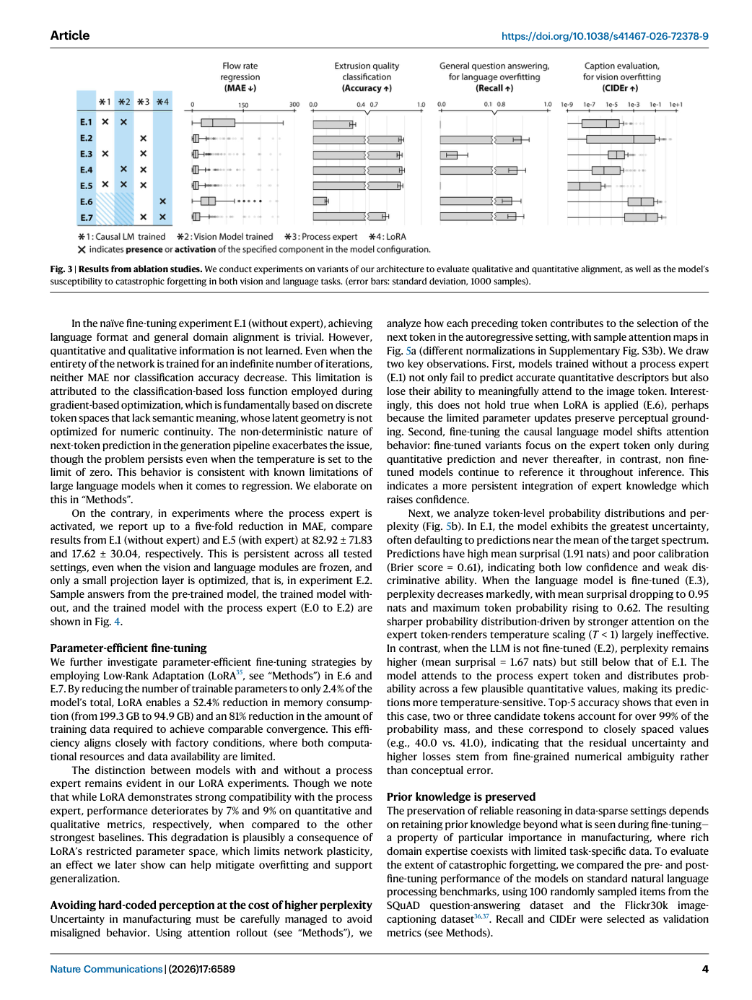
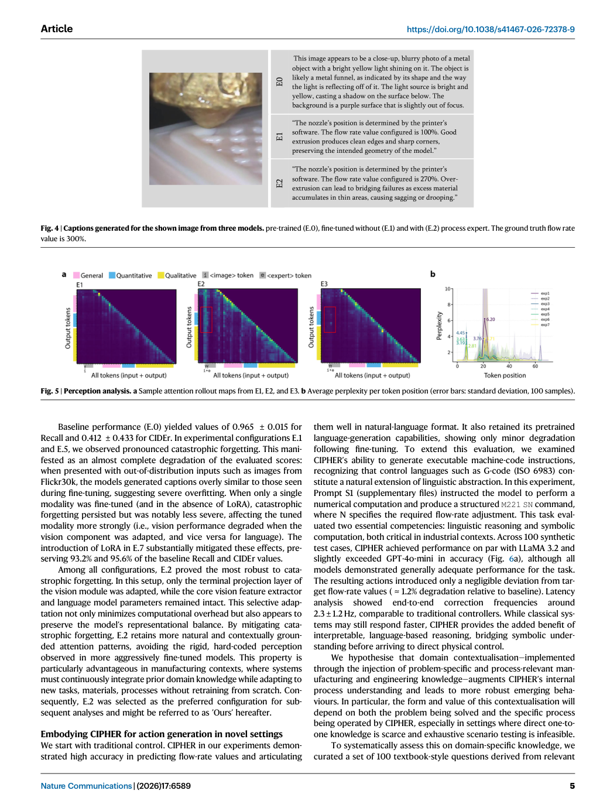
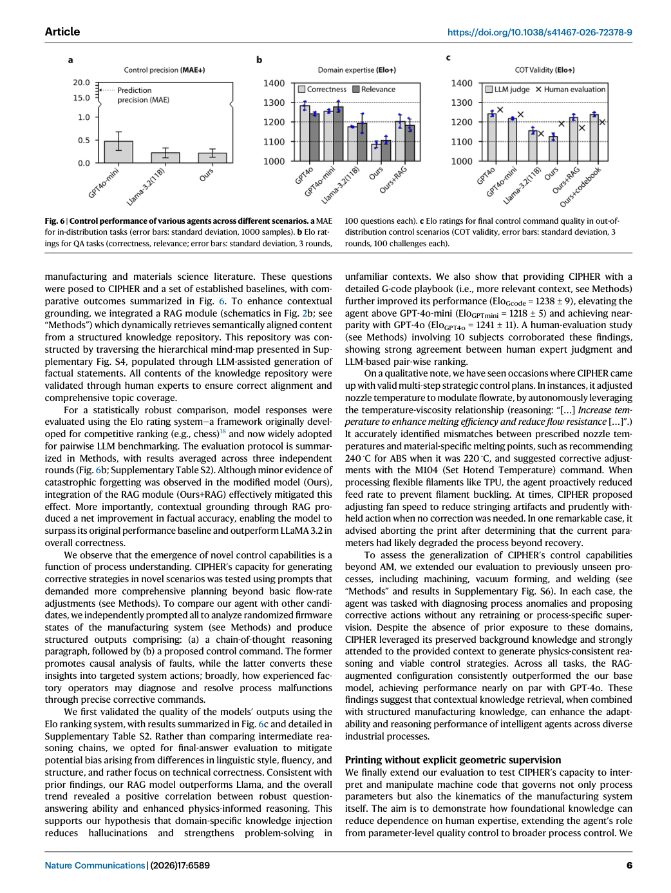
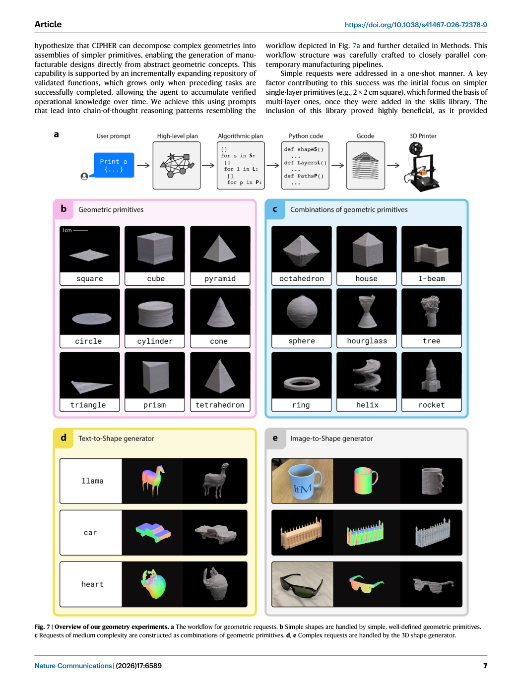

# Figure Analysis: Hybrid reasoning for perception, explanation, and autonomous action in manufacturing

This companion analyses the source visuals embedded in the English Paper Card. Assets are unchanged PDF page views; no figure was regenerated.

## Figure 1

- **Argumentative role:** Overview of the CIPHER framework. CIPHER represents the orchestration of three experts: process, physics, and geometry, reflecting the primary lenses behind the science of manufacturing. In tandem, they enable precise perception with explainable, adaptable control through reasoning before action.
- **Panel / visual logic:** Read the panel labels, axes, legends, and uncertainty marks before comparing conditions. The page view is retained so the full caption and neighbouring interpretation remain visible.
- **Reusable design:** Preserve a one-to-one mapping among workflow stage, comparison, metric, and claim.
- **Boundary:** This visual supports only the conditions and endpoints stated in the source; it does not establish transfer beyond the evaluated setting.
- **Locator:** [Paper: PDF p. 2, Figure 1]

## Figure 2

- **Argumentative role:** The agent architecture. a The VLM architecture integrates a process expert which enables good qualitative and quantitative alignment. Details of the architecture can be found in “Methods”. b Illustration of the embedding space generated during retrieval-augmented generation. The query vector (orange)
- **Panel / visual logic:** Read the panel labels, axes, legends, and uncertainty marks before comparing conditions. The page view is retained so the full caption and neighbouring interpretation remain visible.
- **Reusable design:** Preserve a one-to-one mapping among workflow stage, comparison, metric, and claim.
- **Boundary:** This visual supports only the conditions and endpoints stated in the source; it does not establish transfer beyond the evaluated setting.
- **Locator:** [Paper: PDF p. 3, Figure 2]

## Figure 3

- **Argumentative role:** Results from ablation studies. We conduct experiments on variants of our architecture to evaluate qualitative and quantitative alignment, as well as the model’s susceptibility to catastrophic forgetting in both vision and language tasks. (error bars: standard deviation, 1000 samples).
- **Panel / visual logic:** Read the panel labels, axes, legends, and uncertainty marks before comparing conditions. The page view is retained so the full caption and neighbouring interpretation remain visible.
- **Reusable design:** Preserve a one-to-one mapping among workflow stage, comparison, metric, and claim.
- **Boundary:** This visual supports only the conditions and endpoints stated in the source; it does not establish transfer beyond the evaluated setting.
- **Locator:** [Paper: PDF p. 4, Figure 3]

## Figure 4

- **Argumentative role:** Captions generated for the shown image from three models. pre-trained (E.0), fine-tuned without (E.1) and with (E.2) process expert. The ground truth flow rate value is 300%.
- **Panel / visual logic:** Read the panel labels, axes, legends, and uncertainty marks before comparing conditions. The page view is retained so the full caption and neighbouring interpretation remain visible.
- **Reusable design:** Preserve a one-to-one mapping among workflow stage, comparison, metric, and claim.
- **Boundary:** This visual supports only the conditions and endpoints stated in the source; it does not establish transfer beyond the evaluated setting.
- **Locator:** [Paper: PDF p. 5, Figure 4]

## Figure 5

- **Argumentative role:** Perception analysis. a Sample attention rollout maps from E1, E2, and E3. b Average perplexity per token position (error bars: standard deviation, 100 samples).
- **Panel / visual logic:** Read the panel labels, axes, legends, and uncertainty marks before comparing conditions. The page view is retained so the full caption and neighbouring interpretation remain visible.
- **Reusable design:** Preserve a one-to-one mapping among workflow stage, comparison, metric, and claim.
- **Boundary:** This visual supports only the conditions and endpoints stated in the source; it does not establish transfer beyond the evaluated setting.
- **Locator:** [Paper: PDF p. 5, Figure 5]

## Figure 6

- **Argumentative role:** Control performance of various agents across different scenarios. a MAE for in-distribution tasks (error bars: standard deviation, 1000 samples). b Elo rat- ings for QA tasks (correctness, relevance; error bars: standard deviation, 3 rounds, 100 questions each). c Elo ratings for final control command quality in out-of-
- **Panel / visual logic:** Read the panel labels, axes, legends, and uncertainty marks before comparing conditions. The page view is retained so the full caption and neighbouring interpretation remain visible.
- **Reusable design:** Preserve a one-to-one mapping among workflow stage, comparison, metric, and claim.
- **Boundary:** This visual supports only the conditions and endpoints stated in the source; it does not establish transfer beyond the evaluated setting.
- **Locator:** [Paper: PDF p. 6, Figure 6]

## Figure 7

- **Argumentative role:** Overview of our geometry experiments. a The workflow for geometric requests. b Simple shapes are handled by simple, well-defined geometric primitives. c Requests of medium complexity are constructed as combinations of geometric primitives. d, e Complex requests are handled by the 3D shape generator.
- **Panel / visual logic:** Read the panel labels, axes, legends, and uncertainty marks before comparing conditions. The page view is retained so the full caption and neighbouring interpretation remain visible.
- **Reusable design:** Preserve a one-to-one mapping among workflow stage, comparison, metric, and claim.
- **Boundary:** This visual supports only the conditions and endpoints stated in the source; it does not establish transfer beyond the evaluated setting.
- **Locator:** [Paper: PDF p. 7, Figure 7]

## Cross-figure reading rule

Read workflow figures before performance figures, then connect every visual comparison to its metric, evaluation population, and claim boundary. Visual density is evidence organisation, not independent proof of generality.