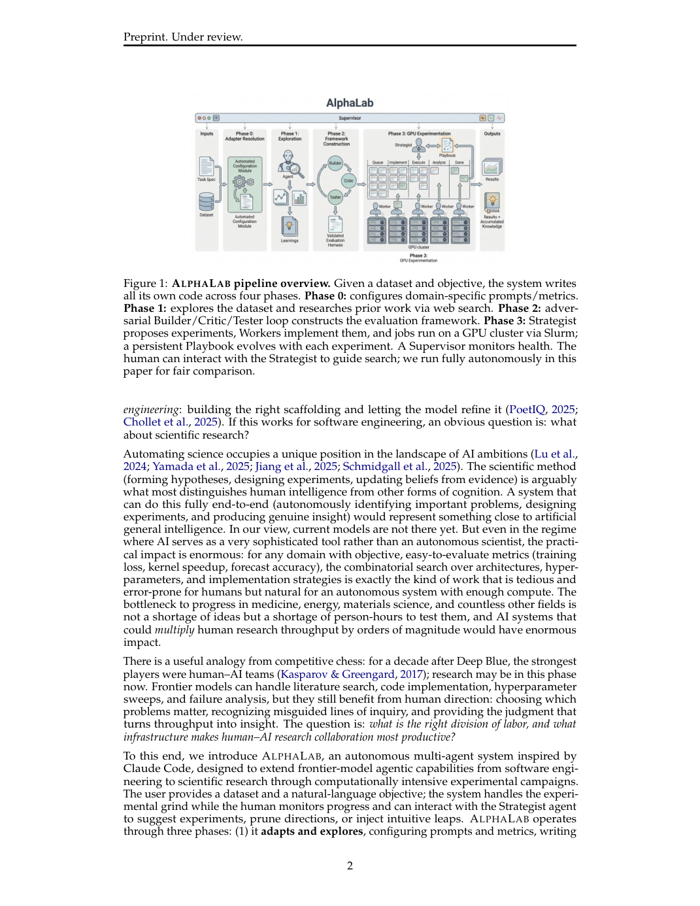
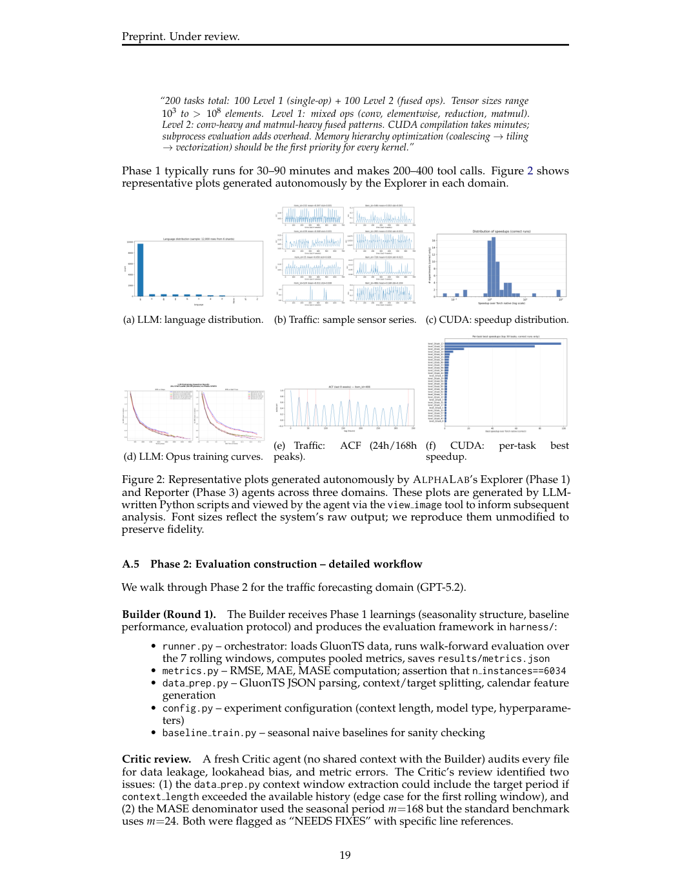
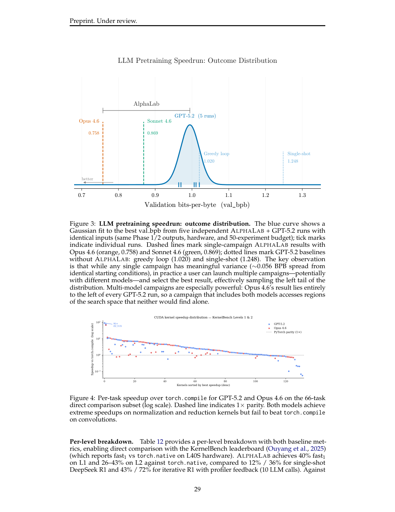
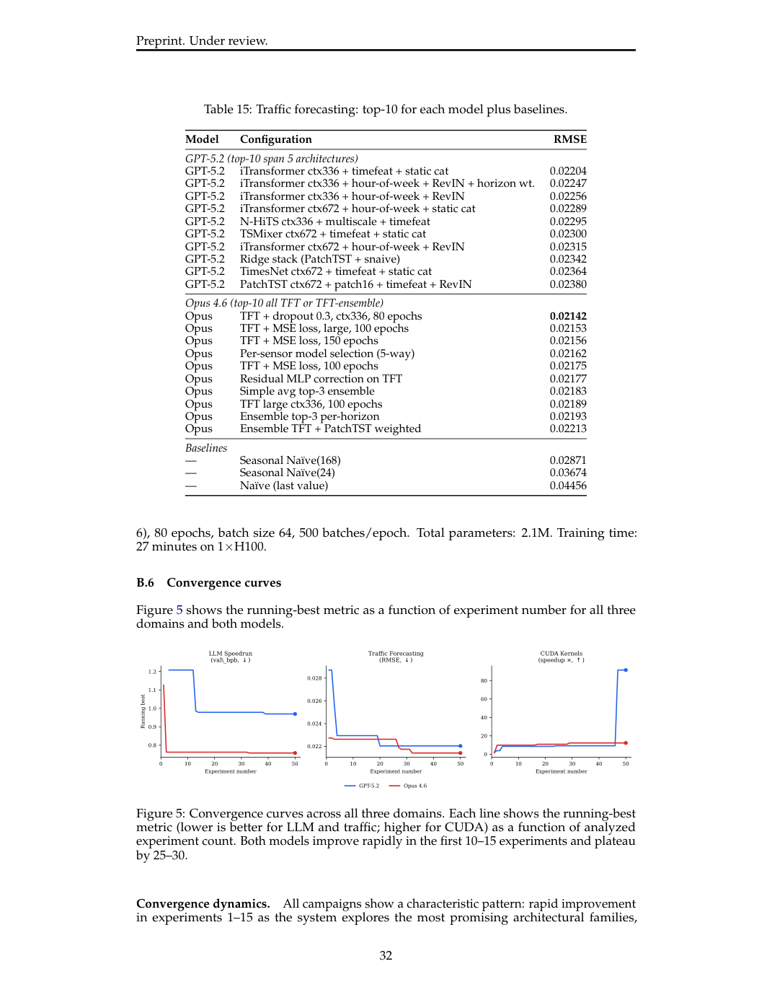
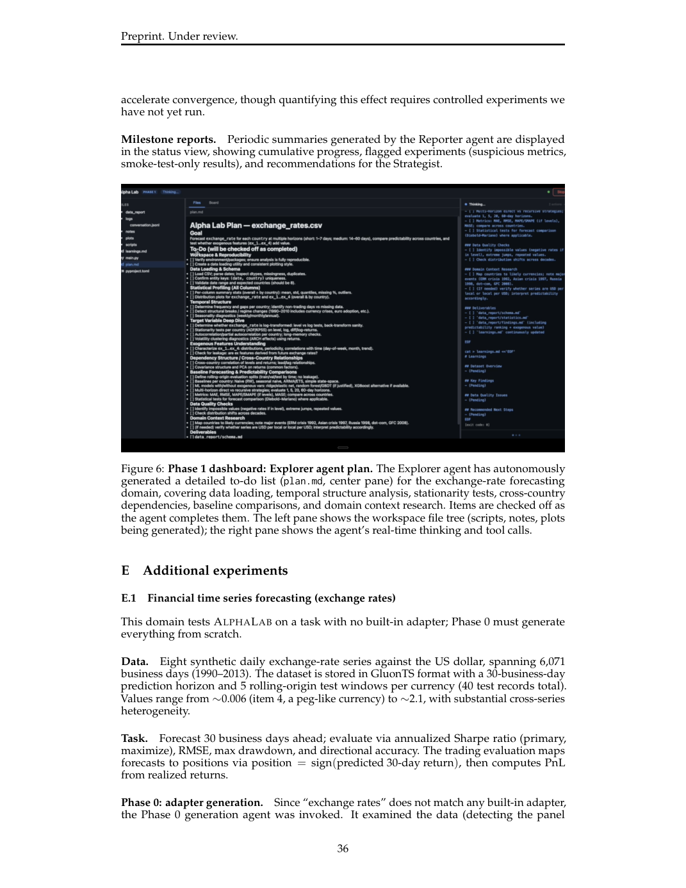
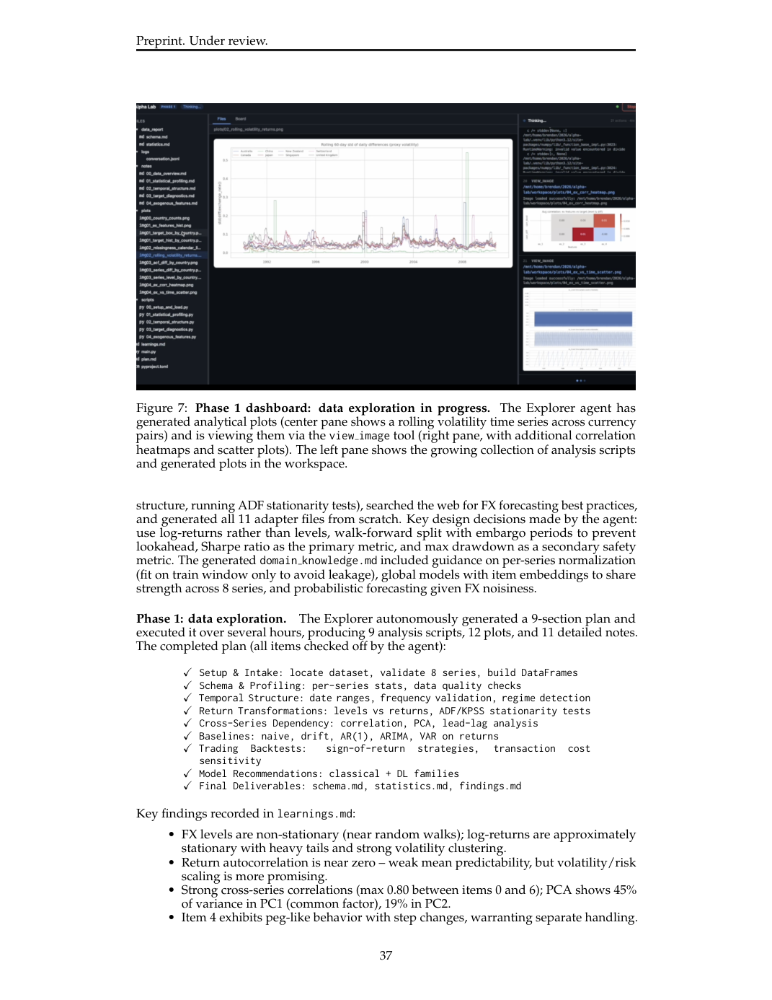
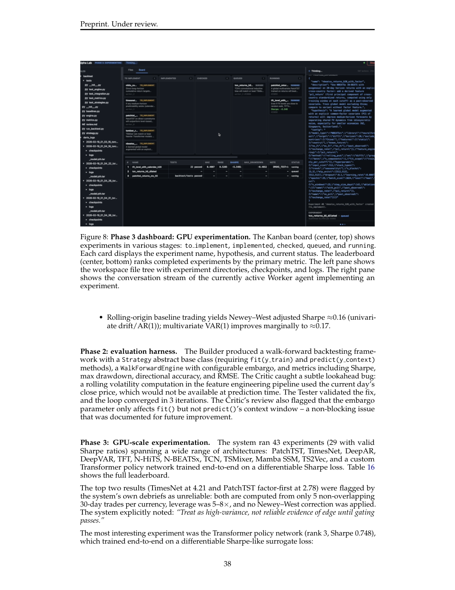
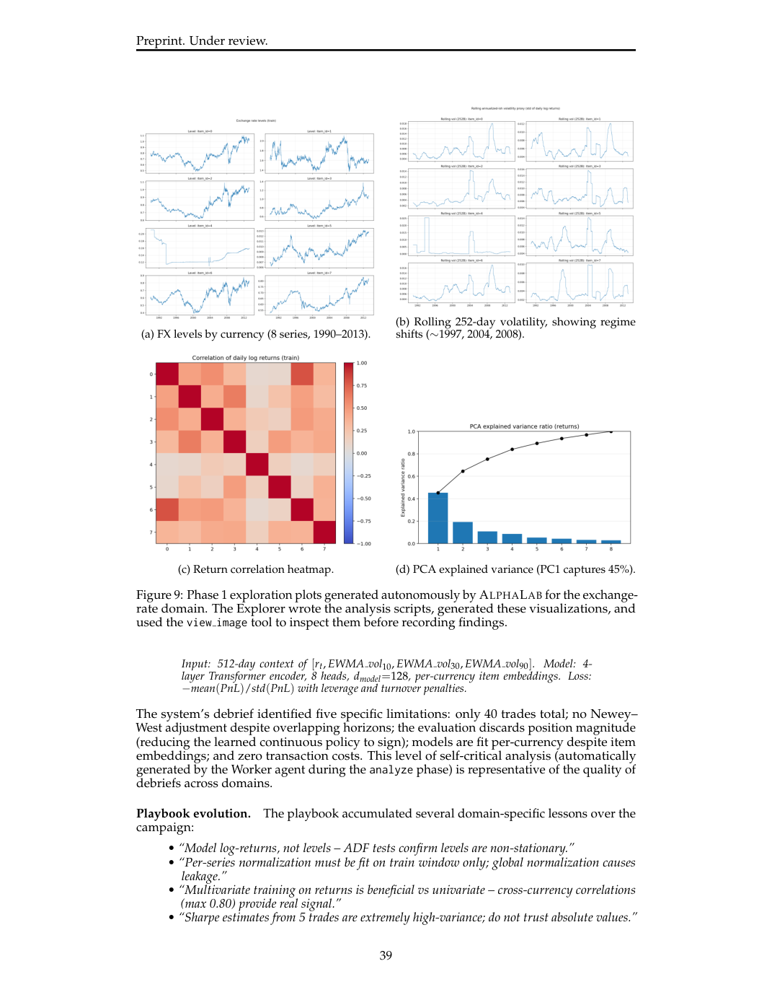
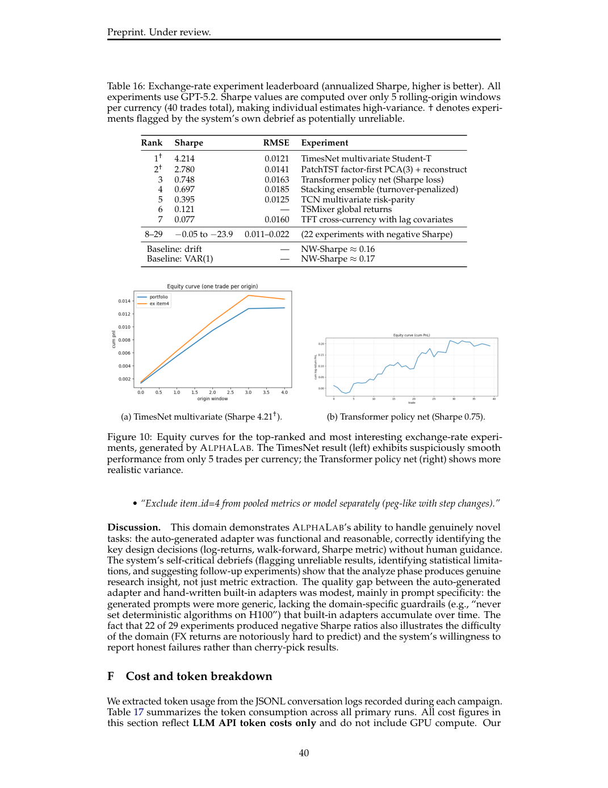

# Figure Analysis: AlphaLab: Autonomous Multi-Agent Research Across Optimization Domains with Frontier LLMs

This companion analyses the source visuals embedded in the English Paper Card. Assets are unchanged PDF page views; no figure was regenerated.

## Figure 1

- **Argumentative role:** ALPHALAB pipeline overview. Given a dataset and objective, the system writes all its own code across four phases. Phase 0: configures domain-specific prompts/metrics. Phase 1: explores the dataset and researches prior work via web search. Phase 2: adver- sarial Builder/Critic/Tester loop constructs the evaluation framework. Phase 3: Strategist
- **Panel / visual logic:** Read the panel labels, axes, legends, and uncertainty marks before comparing conditions. The page view is retained so the full caption and neighbouring interpretation remain visible.
- **Reusable design:** Preserve a one-to-one mapping among workflow stage, comparison, metric, and claim.
- **Boundary:** This visual supports only the conditions and endpoints stated in the source; it does not establish transfer beyond the evaluated setting.
- **Locator:** [Paper: PDF p. 2, Figure 1]

## Figure 2

- **Argumentative role:** Representative plots generated autonomously by ALPHALAB’s Explorer (Phase 1) and Reporter (Phase 3) agents across three domains. These plots are generated by LLM- written Python scripts and viewed by the agent via the view image tool to inform subsequent analysis. Font sizes reflect the system’s raw output; we reproduce them unmodified to
- **Panel / visual logic:** Read the panel labels, axes, legends, and uncertainty marks before comparing conditions. The page view is retained so the full caption and neighbouring interpretation remain visible.
- **Reusable design:** Preserve a one-to-one mapping among workflow stage, comparison, metric, and claim.
- **Boundary:** This visual supports only the conditions and endpoints stated in the source; it does not establish transfer beyond the evaluated setting.
- **Locator:** [Paper: PDF p. 19, Figure 2]

## Figure 3

- **Argumentative role:** LLM pretraining speedrun: outcome distribution. The blue curve shows a Gaussian fit to the best val bpb from five independent ALPHALAB + GPT-5.2 runs with identical inputs (same Phase 1/2 outputs, hardware, and 50-experiment budget); tick marks indicate individual runs. Dashed lines mark single-campaign ALPHALAB results with
- **Panel / visual logic:** Read the panel labels, axes, legends, and uncertainty marks before comparing conditions. The page view is retained so the full caption and neighbouring interpretation remain visible.
- **Reusable design:** Preserve a one-to-one mapping among workflow stage, comparison, metric, and claim.
- **Boundary:** This visual supports only the conditions and endpoints stated in the source; it does not establish transfer beyond the evaluated setting.
- **Locator:** [Paper: PDF p. 29, Figure 3]

## Figure 4

- **Argumentative role:** Per-task speedup over torch.compile for GPT-5.2 and Opus 4.6 on the 66-task direct comparison subset (log scale). Dashed line indicates 1× parity. Both models achieve extreme speedups on normalization and reduction kernels but fail to beat torch.compile on convolutions.
- **Panel / visual logic:** Read the panel labels, axes, legends, and uncertainty marks before comparing conditions. The page view is retained so the full caption and neighbouring interpretation remain visible.
- **Reusable design:** Preserve a one-to-one mapping among workflow stage, comparison, metric, and claim.
- **Boundary:** This visual supports only the conditions and endpoints stated in the source; it does not establish transfer beyond the evaluated setting.
- **Locator:** [Paper: PDF p. 29, Figure 4]

## Figure 5

- **Argumentative role:** Convergence curves across all three domains. Each line shows the running-best metric (lower is better for LLM and traffic; higher for CUDA) as a function of analyzed experiment count. Both models improve rapidly in the first 10–15 experiments and plateau by 25–30.
- **Panel / visual logic:** Read the panel labels, axes, legends, and uncertainty marks before comparing conditions. The page view is retained so the full caption and neighbouring interpretation remain visible.
- **Reusable design:** Preserve a one-to-one mapping among workflow stage, comparison, metric, and claim.
- **Boundary:** This visual supports only the conditions and endpoints stated in the source; it does not establish transfer beyond the evaluated setting.
- **Locator:** [Paper: PDF p. 32, Figure 5]

## Figure 6

- **Argumentative role:** Phase 1 dashboard: Explorer agent plan. The Explorer agent has autonomously generated a detailed to-do list (plan.md, center pane) for the exchange-rate forecasting domain, covering data loading, temporal structure analysis, stationarity tests, cross-country dependencies, baseline comparisons, and domain context research. Items are checked off as
- **Panel / visual logic:** Read the panel labels, axes, legends, and uncertainty marks before comparing conditions. The page view is retained so the full caption and neighbouring interpretation remain visible.
- **Reusable design:** Preserve a one-to-one mapping among workflow stage, comparison, metric, and claim.
- **Boundary:** This visual supports only the conditions and endpoints stated in the source; it does not establish transfer beyond the evaluated setting.
- **Locator:** [Paper: PDF p. 36, Figure 6]

## Figure 7

- **Argumentative role:** Phase 1 dashboard: data exploration in progress. The Explorer agent has generated analytical plots (center pane shows a rolling volatility time series across currency pairs) and is viewing them via the view image tool (right pane, with additional correlation heatmaps and scatter plots). The left pane shows the growing collection of analysis scripts
- **Panel / visual logic:** Read the panel labels, axes, legends, and uncertainty marks before comparing conditions. The page view is retained so the full caption and neighbouring interpretation remain visible.
- **Reusable design:** Preserve a one-to-one mapping among workflow stage, comparison, metric, and claim.
- **Boundary:** This visual supports only the conditions and endpoints stated in the source; it does not establish transfer beyond the evaluated setting.
- **Locator:** [Paper: PDF p. 37, Figure 7]

## Figure 8

- **Argumentative role:** Phase 3 dashboard: GPU experimentation. The Kanban board (center, top) shows experiments in various stages: to implement, implemented, checked, queued, and running. Each card displays the experiment name, hypothesis, and current status. The leaderboard (center, bottom) ranks completed experiments by the primary metric. The left pane shows
- **Panel / visual logic:** Read the panel labels, axes, legends, and uncertainty marks before comparing conditions. The page view is retained so the full caption and neighbouring interpretation remain visible.
- **Reusable design:** Preserve a one-to-one mapping among workflow stage, comparison, metric, and claim.
- **Boundary:** This visual supports only the conditions and endpoints stated in the source; it does not establish transfer beyond the evaluated setting.
- **Locator:** [Paper: PDF p. 38, Figure 8]

## Figure 9

- **Argumentative role:** Phase 1 exploration plots generated autonomously by ALPHALAB for the exchange- rate domain. The Explorer wrote the analysis scripts, generated these visualizations, and used the view image tool to inspect them before recording findings. Input: 512-day context of [rt, EWMA vol10, EWMA vol30, EWMA vol90]. Model: 4-
- **Panel / visual logic:** Read the panel labels, axes, legends, and uncertainty marks before comparing conditions. The page view is retained so the full caption and neighbouring interpretation remain visible.
- **Reusable design:** Preserve a one-to-one mapping among workflow stage, comparison, metric, and claim.
- **Boundary:** This visual supports only the conditions and endpoints stated in the source; it does not establish transfer beyond the evaluated setting.
- **Locator:** [Paper: PDF p. 39, Figure 9]

## Figure 10

- **Argumentative role:** Equity curves for the top-ranked and most interesting exchange-rate experi- ments, generated by ALPHALAB. The TimesNet result (left) exhibits suspiciously smooth performance from only 5 trades per currency; the Transformer policy net (right) shows more realistic variance.
- **Panel / visual logic:** Read the panel labels, axes, legends, and uncertainty marks before comparing conditions. The page view is retained so the full caption and neighbouring interpretation remain visible.
- **Reusable design:** Preserve a one-to-one mapping among workflow stage, comparison, metric, and claim.
- **Boundary:** This visual supports only the conditions and endpoints stated in the source; it does not establish transfer beyond the evaluated setting.
- **Locator:** [Paper: PDF p. 40, Figure 10]

## Cross-figure reading rule

Read workflow figures before performance figures, then connect every visual comparison to its metric, evaluation population, and claim boundary. Visual density is evidence organisation, not independent proof of generality.