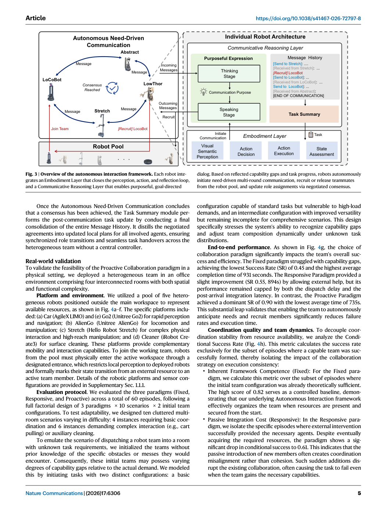
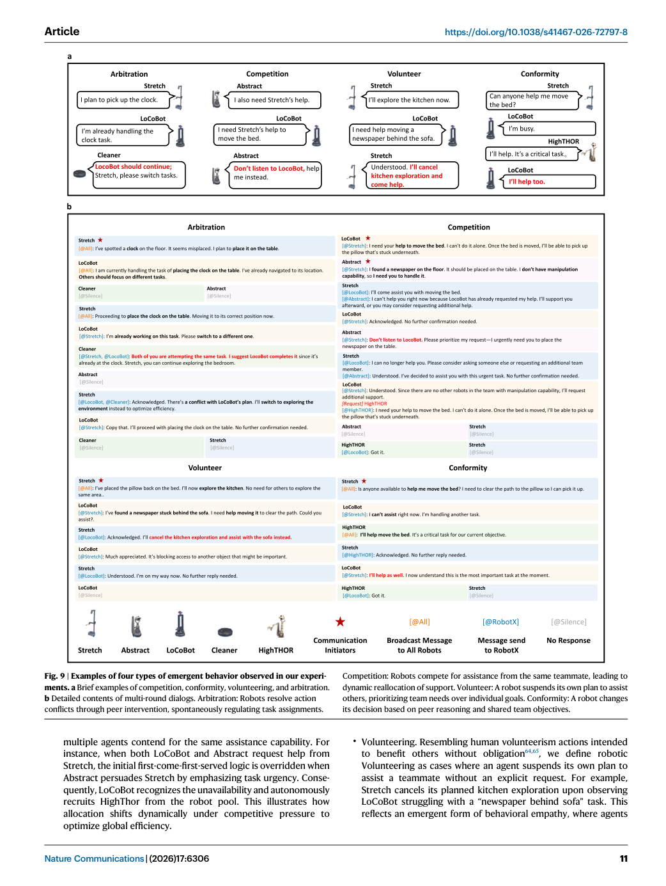

# Figure Analysis: Proactive collaboration via autonomous interaction

This companion analyses the source visuals embedded in the English Paper Card. Assets are unchanged PDF page views; no figure was regenerated.

## Figure 1

- **Argumentative role:** Comparison of multi-robot team coordination paradigms. Geometric shapes represent heterogeneous agent capabilities, while slotted blocks denote dynamic execution demands. In Fixed Collaboration, a static team lacks the resi- lience to resolve capability gaps (red cross), leading to rigid and failed execution.
- **Panel / visual logic:** Read the panel labels, axes, legends, and uncertainty marks before comparing conditions. The page view is retained so the full caption and neighbouring interpretation remain visible.
- **Reusable design:** Preserve a one-to-one mapping among workflow stage, comparison, metric, and claim.
- **Boundary:** This visual supports only the conditions and endpoints stated in the source; it does not establish transfer beyond the evaluated setting.
- **Locator:** [Paper: PDF p. 2, Figure 1]

## Figure 2

- **Argumentative role:** Four representative tasks in the real-world experiments. a A misplaced tissue should be picked up and returned to its proper place on the desk. b A misplaced bottle should be picked up and returned to its proper place in the trash can. c A bottle trapped underneath a cart. Pull the cart to free the trapped bottle, then place it in the
- **Panel / visual logic:** Read the panel labels, axes, legends, and uncertainty marks before comparing conditions. The page view is retained so the full caption and neighbouring interpretation remain visible.
- **Reusable design:** Preserve a one-to-one mapping among workflow stage, comparison, metric, and claim.
- **Boundary:** This visual supports only the conditions and endpoints stated in the source; it does not establish transfer beyond the evaluated setting.
- **Locator:** [Paper: PDF p. 4, Figure 2]

## Figure 3

- **Argumentative role:** Overview of the autonomous interaction framework. Each robot inte- grates an Embodiment Layer that closes the perception, action, and reflection loop, and a Communicative Reasoning Layer that enables purposeful, goal-directed dialog. Based on reflected capability gaps and task progress, robots autonomously
- **Panel / visual logic:** Read the panel labels, axes, legends, and uncertainty marks before comparing conditions. The page view is retained so the full caption and neighbouring interpretation remain visible.
- **Reusable design:** Preserve a one-to-one mapping among workflow stage, comparison, metric, and claim.
- **Boundary:** This visual supports only the conditions and endpoints stated in the source; it does not establish transfer beyond the evaluated setting.
- **Locator:** [Paper: PDF p. 5, Figure 3]

## Figure 4

- **Argumentative role:** Real-world experimental setup and quantitative results for collabora- tive tidying tasks. a Shared workspace containing a trapped bottle. b Top-down map of the overall environment layout. c Meeting room with a misplaced bottle. d Pantry room with both a water stain and a bottle requiring cleanup. e Robot pool
- **Panel / visual logic:** Read the panel labels, axes, legends, and uncertainty marks before comparing conditions. The page view is retained so the full caption and neighbouring interpretation remain visible.
- **Reusable design:** Preserve a one-to-one mapping among workflow stage, comparison, metric, and claim.
- **Boundary:** This visual supports only the conditions and endpoints stated in the source; it does not establish transfer beyond the evaluated setting.
- **Locator:** [Paper: PDF p. 6, Figure 4]

## Figure 5

- **Argumentative role:** Dynamic team composition throughout a single task episode. The epi- sode begins with a team composed of the Car and AlienGo robots. Upon detecting trash beneath a cart (Task Identified), the team initiates a discussion to validate the constraint (Limitation Confirmed) and proactively makes a Decision: Recruit for
- **Panel / visual logic:** Read the panel labels, axes, legends, and uncertainty marks before comparing conditions. The page view is retained so the full caption and neighbouring interpretation remain visible.
- **Reusable design:** Preserve a one-to-one mapping among workflow stage, comparison, metric, and claim.
- **Boundary:** This visual supports only the conditions and endpoints stated in the source; it does not establish transfer beyond the evaluated setting.
- **Locator:** [Paper: PDF p. 7, Figure 5]

## Figure 6

- **Argumentative role:** Temporal and visual analysis of anticipatory planning. This figure demonstrates the clear advantages of a proactive approach over a responsive one. Top: Comparison Gantt Charts. The Responsive paradigm (upper) is marked by a Failure event (t = 1: 40), where the robot physically attempts and fails to move the
- **Panel / visual logic:** Read the panel labels, axes, legends, and uncertainty marks before comparing conditions. The page view is retained so the full caption and neighbouring interpretation remain visible.
- **Reusable design:** Preserve a one-to-one mapping among workflow stage, comparison, metric, and claim.
- **Boundary:** This visual supports only the conditions and endpoints stated in the source; it does not establish transfer beyond the evaluated setting.
- **Locator:** [Paper: PDF p. 8, Figure 6]

## Figure 7

- **Argumentative role:** Simulation environments and comprehensive performance evaluation. a Scenes in the benchmark dataset. Each image shows a top-down view of a distinct house developed in our simulation environment. These feature diverse spatial layouts and object distributions to support systematic evaluation of multi-robot
- **Panel / visual logic:** Read the panel labels, axes, legends, and uncertainty marks before comparing conditions. The page view is retained so the full caption and neighbouring interpretation remain visible.
- **Reusable design:** Preserve a one-to-one mapping among workflow stage, comparison, metric, and claim.
- **Boundary:** This visual supports only the conditions and endpoints stated in the source; it does not establish transfer beyond the evaluated setting.
- **Locator:** [Paper: PDF p. 9, Figure 7]

## Figure 8

- **Argumentative role:** Failure analysis across Fixed, Responsive, and Proactive collaboration paradigms. a Real-world failure composition shows a structural shift from cap- ability deficits to coordination breakdowns, which are ultimately resolved in the Proactive paradigm. b Fine-grained decomposition in simulation corroborates this
- **Panel / visual logic:** Read the panel labels, axes, legends, and uncertainty marks before comparing conditions. The page view is retained so the full caption and neighbouring interpretation remain visible.
- **Reusable design:** Preserve a one-to-one mapping among workflow stage, comparison, metric, and claim.
- **Boundary:** This visual supports only the conditions and endpoints stated in the source; it does not establish transfer beyond the evaluated setting.
- **Locator:** [Paper: PDF p. 10, Figure 8]

## Figure 9

- **Argumentative role:** Examples of four types of emergent behavior observed in our experi- ments. a Brief examples of competition, conformity, volunteering, and arbitration. b Detailed contents of multi-round dialogs. Arbitration: Robots resolve action conflicts through peer intervention, spontaneously regulating task assignments.
- **Panel / visual logic:** Read the panel labels, axes, legends, and uncertainty marks before comparing conditions. The page view is retained so the full caption and neighbouring interpretation remain visible.
- **Reusable design:** Preserve a one-to-one mapping among workflow stage, comparison, metric, and claim.
- **Boundary:** This visual supports only the conditions and endpoints stated in the source; it does not establish transfer beyond the evaluated setting.
- **Locator:** [Paper: PDF p. 11, Figure 9]

## Figure 10

- **Argumentative role:** LowThor’s Communicative Reasoning Layer in an autonomous need- driven dialog episode. a LowThor's communicative reasoning pipeline during one episode managed by Autonomous Need-Driven Communication. Top: Pur- poseful Expression. The first utterance is generated in two stages: the Thinking
- **Panel / visual logic:** Read the panel labels, axes, legends, and uncertainty marks before comparing conditions. The page view is retained so the full caption and neighbouring interpretation remain visible.
- **Reusable design:** Preserve a one-to-one mapping among workflow stage, comparison, metric, and claim.
- **Boundary:** This visual supports only the conditions and endpoints stated in the source; it does not establish transfer beyond the evaluated setting.
- **Locator:** [Paper: PDF p. 13, Figure 10]

## Cross-figure reading rule

Read workflow figures before performance figures, then connect every visual comparison to its metric, evaluation population, and claim boundary. Visual density is evidence organisation, not independent proof of generality.