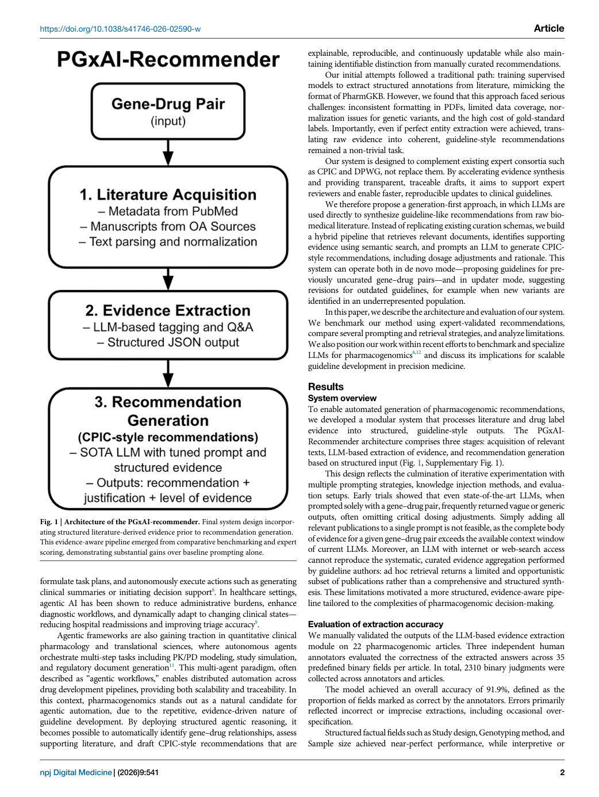
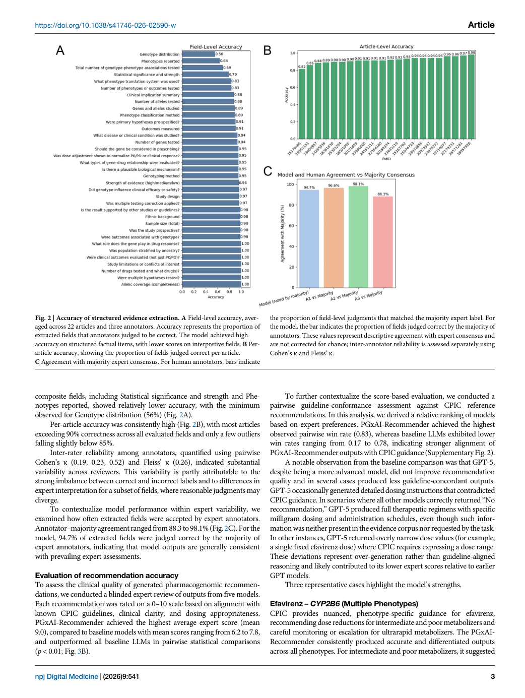
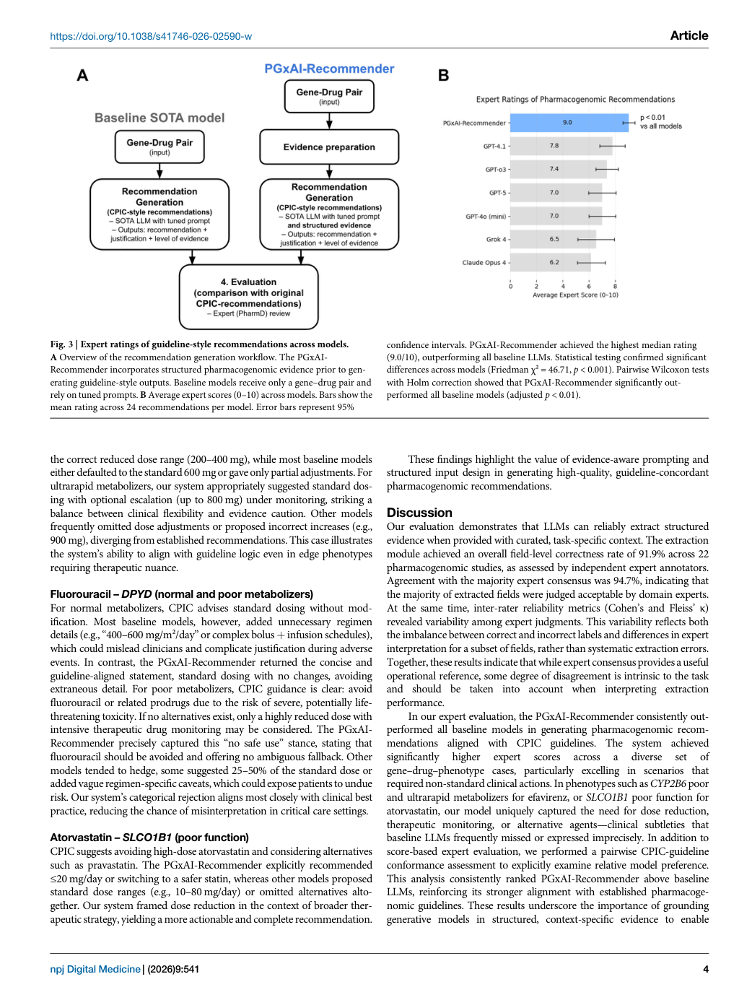

# Figure Analysis: An agentic AI system for automated pharmacogenomic recommendation generation

This companion analyses the source visuals embedded in the English Paper Card. Assets are unchanged PDF page views; no figure was regenerated.

## Figure 1

- **Argumentative role:** Architecture of the PGxAI-recommender. Final system design incorpor- ating structured literature-derived evidence prior to recommendation generation. This evidence-aware pipeline emerged from comparative benchmarking and expert scoring, demonstrating substantial gains over baseline prompting alone.
- **Panel / visual logic:** Read the panel labels, axes, legends, and uncertainty marks before comparing conditions. The page view is retained so the full caption and neighbouring interpretation remain visible.
- **Reusable design:** Preserve a one-to-one mapping among workflow stage, comparison, metric, and claim.
- **Boundary:** This visual supports only the conditions and endpoints stated in the source; it does not establish transfer beyond the evaluated setting.
- **Locator:** [Paper: PDF p. 2, Figure 1]

## Figure 2

- **Argumentative role:** Accuracy of structured evidence extraction. A Field-level accuracy, aver- aged across 22 articles and three annotators. Accuracy represents the proportion of extracted fields that annotators judged to be correct. The model achieved high accuracy on structured factual items, with lower scores on interpretive fields. B Per-
- **Panel / visual logic:** Read the panel labels, axes, legends, and uncertainty marks before comparing conditions. The page view is retained so the full caption and neighbouring interpretation remain visible.
- **Reusable design:** Preserve a one-to-one mapping among workflow stage, comparison, metric, and claim.
- **Boundary:** This visual supports only the conditions and endpoints stated in the source; it does not establish transfer beyond the evaluated setting.
- **Locator:** [Paper: PDF p. 3, Figure 2]

## Figure 3

- **Argumentative role:** Expert ratings of guideline-style recommendations across models. A Overview of the recommendation generation workflow. The PGxAI- Recommender incorporates structured pharmacogenomic evidence prior to gen- erating guideline-style outputs. Baseline models receive only a gene–drug pair and
- **Panel / visual logic:** Read the panel labels, axes, legends, and uncertainty marks before comparing conditions. The page view is retained so the full caption and neighbouring interpretation remain visible.
- **Reusable design:** Preserve a one-to-one mapping among workflow stage, comparison, metric, and claim.
- **Boundary:** This visual supports only the conditions and endpoints stated in the source; it does not establish transfer beyond the evaluated setting.
- **Locator:** [Paper: PDF p. 4, Figure 3]

## Cross-figure reading rule

Read workflow figures before performance figures, then connect every visual comparison to its metric, evaluation population, and claim boundary. Visual density is evidence organisation, not independent proof of generality.