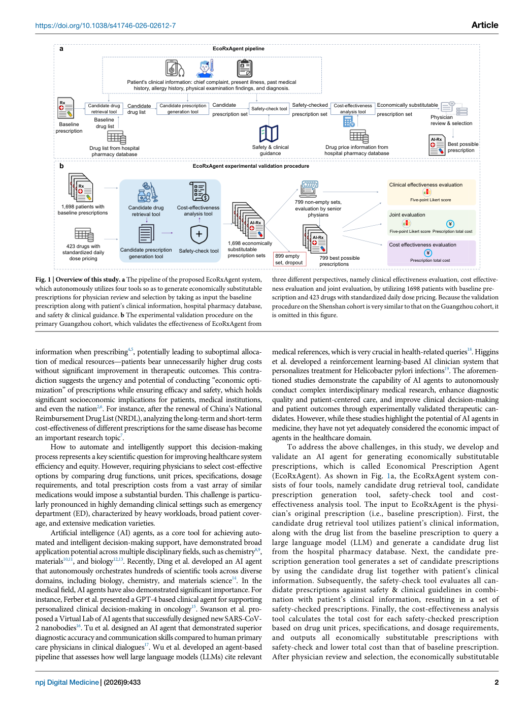
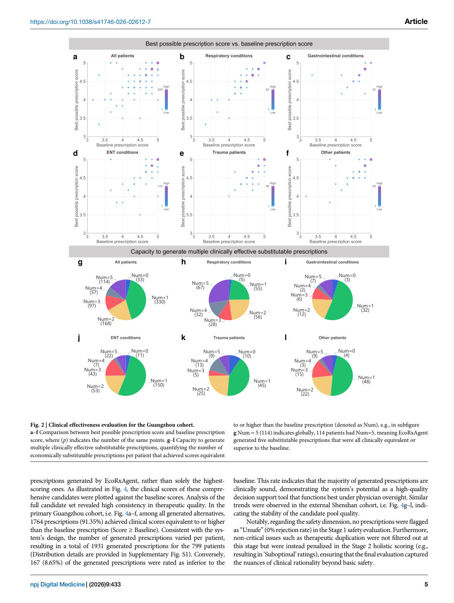
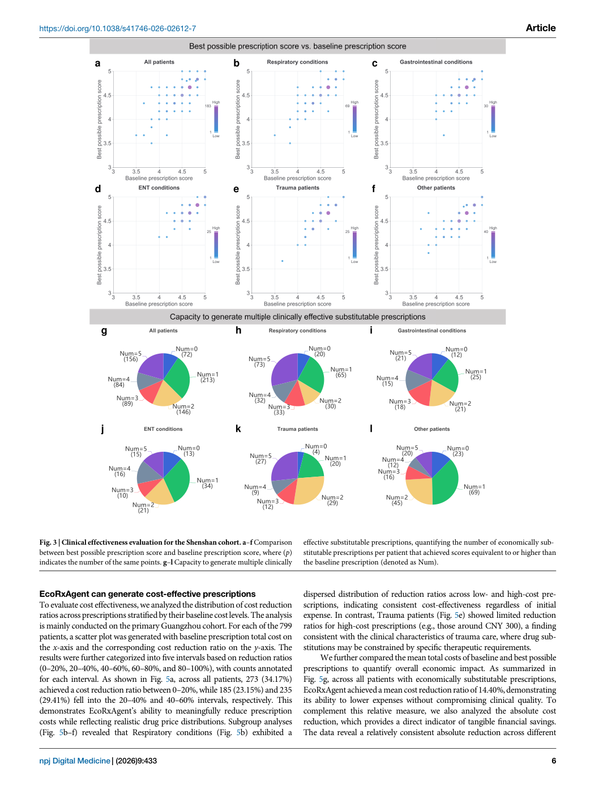
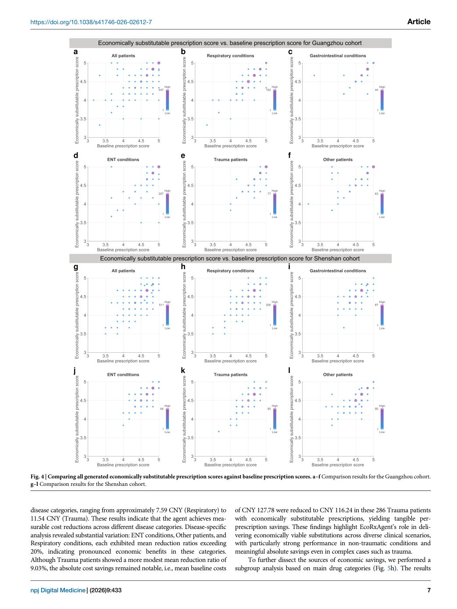
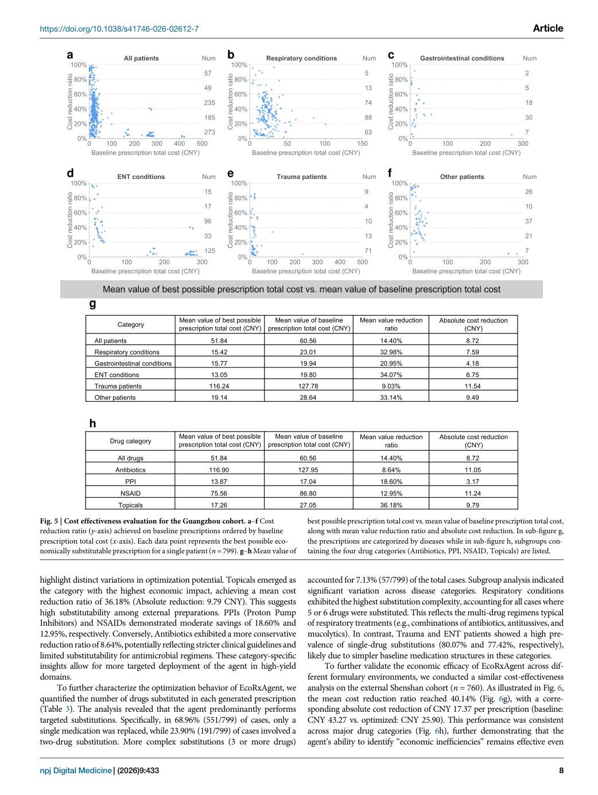
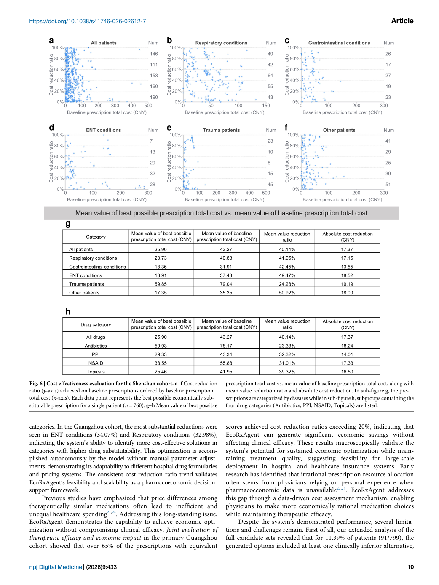
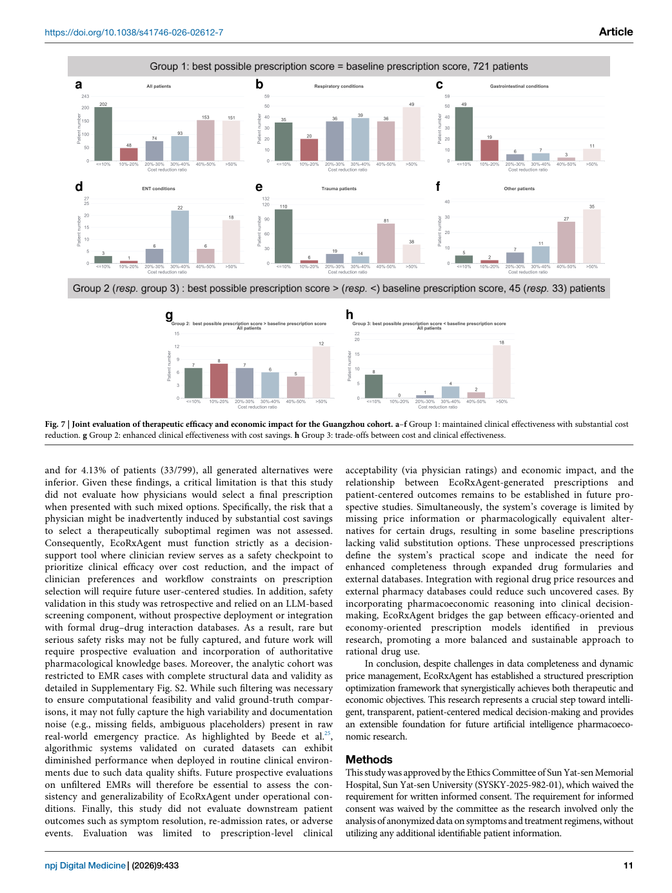
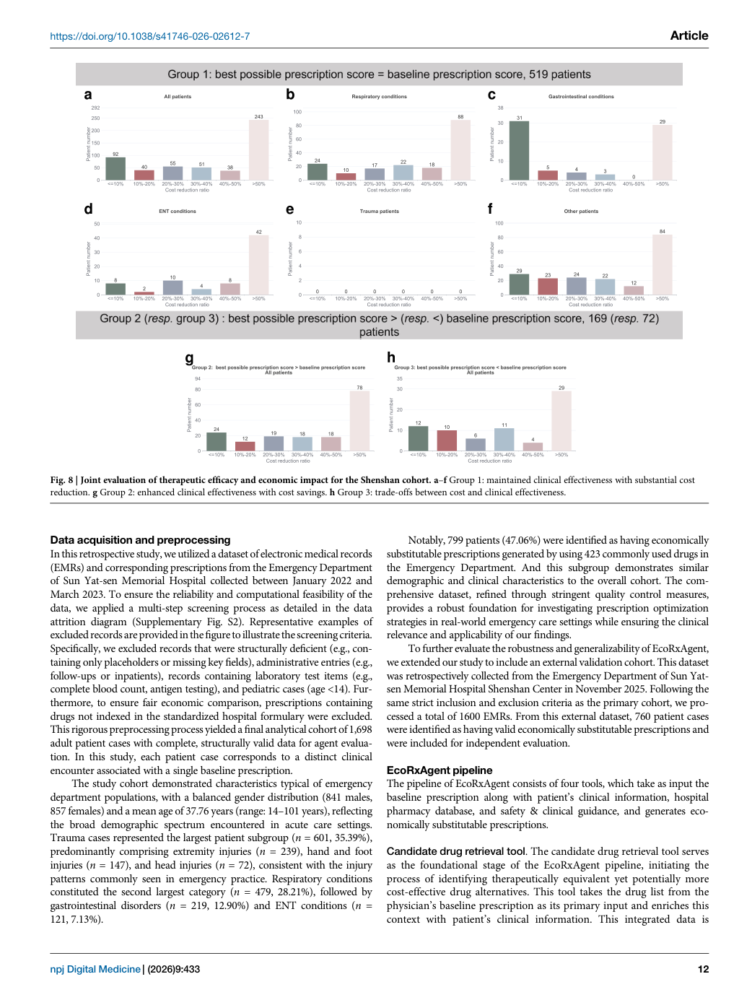
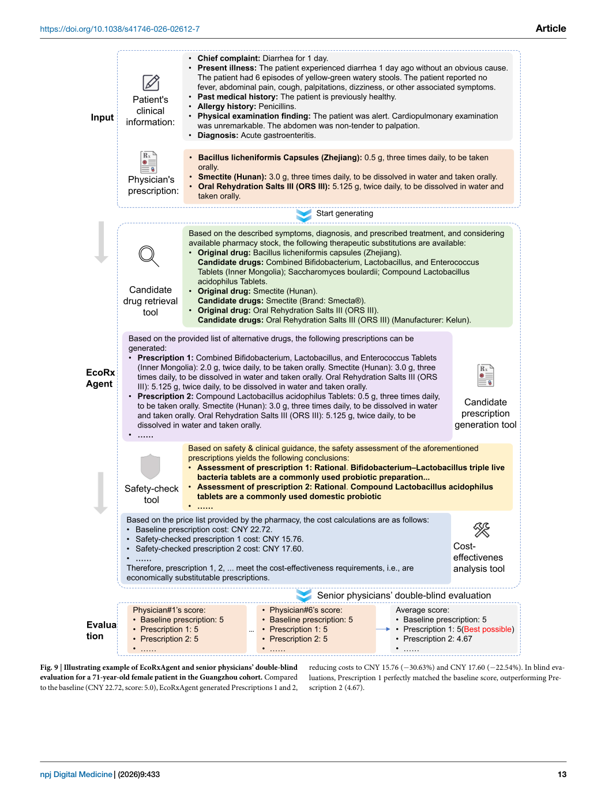

# Figure Analysis: EcoRxAgent: an AI agent for generating economically substitutable prescriptions

This companion analyses the source visuals embedded in the English Paper Card. Assets are unchanged PDF page views; no figure was regenerated.

## Figure 1

- **Argumentative role:** Overview of this study. a The pipeline of the proposed EcoRxAgent system, which autonomously utilizes four tools so as to generate economically substitutable prescriptions for physician review and selection by taking as input the baseline prescription along with patient’s clinical information, hospital pharmacy database,
- **Panel / visual logic:** Read the panel labels, axes, legends, and uncertainty marks before comparing conditions. The page view is retained so the full caption and neighbouring interpretation remain visible.
- **Reusable design:** Preserve a one-to-one mapping among workflow stage, comparison, metric, and claim.
- **Boundary:** This visual supports only the conditions and endpoints stated in the source; it does not establish transfer beyond the evaluated setting.
- **Locator:** [Paper: PDF p. 2, Figure 1]

## Figure 2

- **Argumentative role:** Clinical effectiveness evaluation for the Guangzhou cohort. a–f Comparison between best possible prescription score and baseline prescription score, where (p) indicates the number of the same points. g–l Capacity to generate multiple clinically effective substitutable prescriptions, quantifying the number of
- **Panel / visual logic:** Read the panel labels, axes, legends, and uncertainty marks before comparing conditions. The page view is retained so the full caption and neighbouring interpretation remain visible.
- **Reusable design:** Preserve a one-to-one mapping among workflow stage, comparison, metric, and claim.
- **Boundary:** This visual supports only the conditions and endpoints stated in the source; it does not establish transfer beyond the evaluated setting.
- **Locator:** [Paper: PDF p. 5, Figure 2]

## Figure 3

- **Argumentative role:** Clinical effectiveness evaluation for the Shenshan cohort. a–f Comparison between best possible prescription score and baseline prescription score, where (p) indicates the number of the same points. g–l Capacity to generate multiple clinically effective substitutable prescriptions, quantifying the number of economically sub-
- **Panel / visual logic:** Read the panel labels, axes, legends, and uncertainty marks before comparing conditions. The page view is retained so the full caption and neighbouring interpretation remain visible.
- **Reusable design:** Preserve a one-to-one mapping among workflow stage, comparison, metric, and claim.
- **Boundary:** This visual supports only the conditions and endpoints stated in the source; it does not establish transfer beyond the evaluated setting.
- **Locator:** [Paper: PDF p. 6, Figure 3]

## Figure 4

- **Argumentative role:** Comparing all generated economically substitutable prescription scores against baseline prescription scores. a–f Comparison results for the Guangzhou cohort. g–l Comparison results for the Shenshan cohort. https://doi.org/10.1038/s41746-026-02612-7
- **Panel / visual logic:** Read the panel labels, axes, legends, and uncertainty marks before comparing conditions. The page view is retained so the full caption and neighbouring interpretation remain visible.
- **Reusable design:** Preserve a one-to-one mapping among workflow stage, comparison, metric, and claim.
- **Boundary:** This visual supports only the conditions and endpoints stated in the source; it does not establish transfer beyond the evaluated setting.
- **Locator:** [Paper: PDF p. 7, Figure 4]

## Figure 5

- **Argumentative role:** Cost effectiveness evaluation for the Guangzhou cohort. a–f Cost reduction ratio (y-axis) achieved on baseline prescriptions ordered by baseline prescription total cost (x-axis). Each data point represents the best possible eco- nomically substitutable prescription for a single patient (n = 799). g–h Mean value of
- **Panel / visual logic:** Read the panel labels, axes, legends, and uncertainty marks before comparing conditions. The page view is retained so the full caption and neighbouring interpretation remain visible.
- **Reusable design:** Preserve a one-to-one mapping among workflow stage, comparison, metric, and claim.
- **Boundary:** This visual supports only the conditions and endpoints stated in the source; it does not establish transfer beyond the evaluated setting.
- **Locator:** [Paper: PDF p. 8, Figure 5]

## Figure 6

- **Argumentative role:** Cost effectiveness evaluation for the Shenshan cohort. a–f Cost reduction ratio (y-axis) achieved on baseline prescriptions ordered by baseline prescription total cost (x-axis). Each data point represents the best possible economically sub- stitutable prescription for a single patient (n = 760). g–h Mean value of best possible
- **Panel / visual logic:** Read the panel labels, axes, legends, and uncertainty marks before comparing conditions. The page view is retained so the full caption and neighbouring interpretation remain visible.
- **Reusable design:** Preserve a one-to-one mapping among workflow stage, comparison, metric, and claim.
- **Boundary:** This visual supports only the conditions and endpoints stated in the source; it does not establish transfer beyond the evaluated setting.
- **Locator:** [Paper: PDF p. 10, Figure 6]

## Figure 7

- **Argumentative role:** Joint evaluation of therapeutic efficacy and economic impact for the Guangzhou cohort. a–f Group 1: maintained clinical effectiveness with substantial cost reduction. g Group 2: enhanced clinical effectiveness with cost savings. h Group 3: trade-offs between cost and clinical effectiveness. https://doi.org/10.1038/s41746-026-02612-7
- **Panel / visual logic:** Read the panel labels, axes, legends, and uncertainty marks before comparing conditions. The page view is retained so the full caption and neighbouring interpretation remain visible.
- **Reusable design:** Preserve a one-to-one mapping among workflow stage, comparison, metric, and claim.
- **Boundary:** This visual supports only the conditions and endpoints stated in the source; it does not establish transfer beyond the evaluated setting.
- **Locator:** [Paper: PDF p. 11, Figure 7]

## Figure 8

- **Argumentative role:** Joint evaluation of therapeutic efficacy and economic impact for the Shenshan cohort. a–f Group 1: maintained clinical effectiveness with substantial cost reduction. g Group 2: enhanced clinical effectiveness with cost savings. h Group 3: trade-offs between cost and clinical effectiveness. https://doi.org/10.1038/s41746-026-02612-7
- **Panel / visual logic:** Read the panel labels, axes, legends, and uncertainty marks before comparing conditions. The page view is retained so the full caption and neighbouring interpretation remain visible.
- **Reusable design:** Preserve a one-to-one mapping among workflow stage, comparison, metric, and claim.
- **Boundary:** This visual supports only the conditions and endpoints stated in the source; it does not establish transfer beyond the evaluated setting.
- **Locator:** [Paper: PDF p. 12, Figure 8]

## Figure 9

- **Argumentative role:** Illustrating example of EcoRxAgent and senior physicians’ double-blind evaluation for a 71-year-old female patient in the Guangzhou cohort. Compared to the baseline (CNY 22.72, score: 5.0), EcoRxAgent generated Prescriptions 1 and 2, reducing costs to CNY 15.76 (−30.63%) and CNY 17.60 (−22.54%). In blind eva-
- **Panel / visual logic:** Read the panel labels, axes, legends, and uncertainty marks before comparing conditions. The page view is retained so the full caption and neighbouring interpretation remain visible.
- **Reusable design:** Preserve a one-to-one mapping among workflow stage, comparison, metric, and claim.
- **Boundary:** This visual supports only the conditions and endpoints stated in the source; it does not establish transfer beyond the evaluated setting.
- **Locator:** [Paper: PDF p. 13, Figure 9]

## Cross-figure reading rule

Read workflow figures before performance figures, then connect every visual comparison to its metric, evaluation population, and claim boundary. Visual density is evidence organisation, not independent proof of generality.