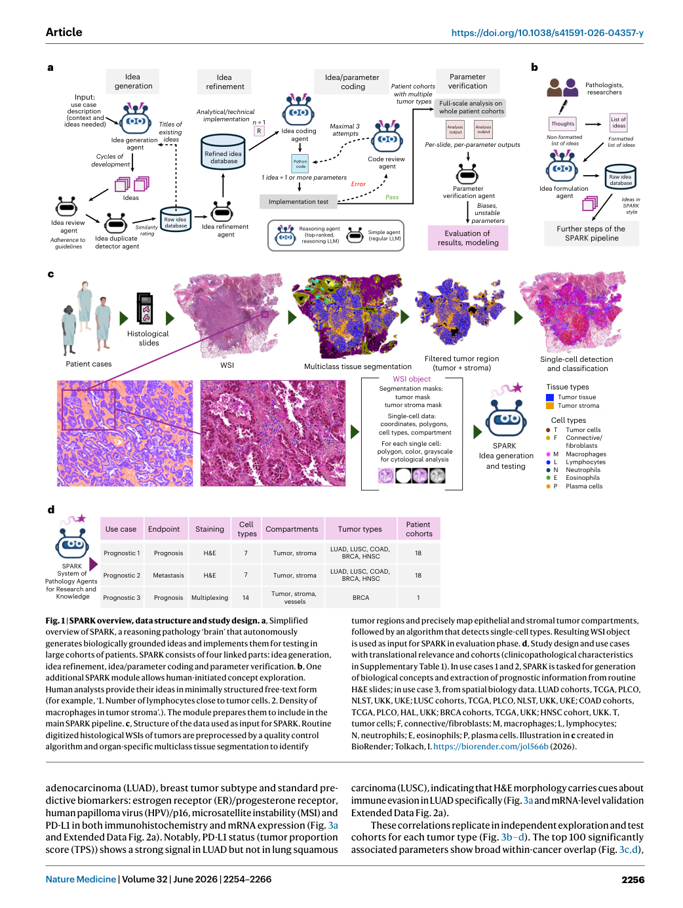
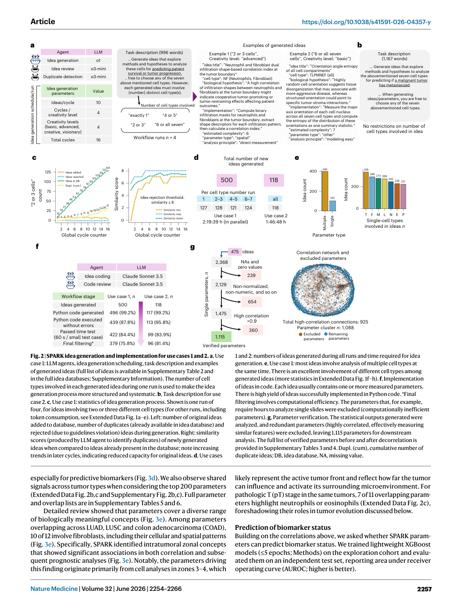
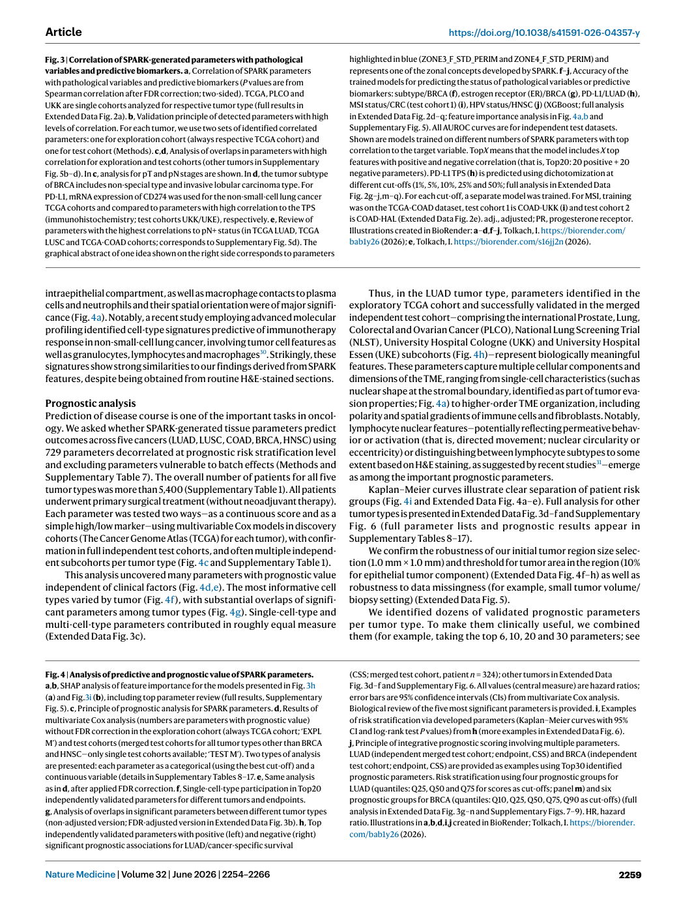
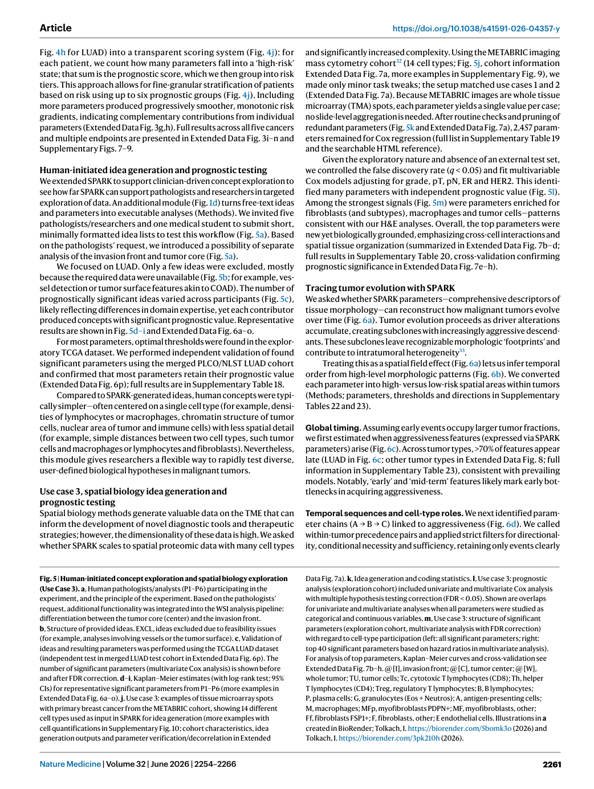
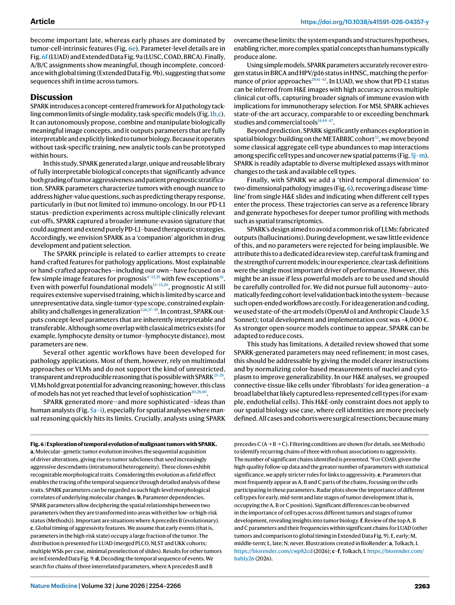

# Figure Analysis: An agentic framework for autonomous scientific discovery in cancer pathology

This companion analyses the source visuals embedded in the English Paper Card. Assets are unchanged PDF page views; no figure was regenerated.

## Figure 1

- **Argumentative role:** SPARK overview, data structure and study design. a, Simplified overview of SPARK, a reasoning pathology ‘brain’ that autonomously generates biologically grounded ideas and implements them for testing in large cohorts of patients. SPARK consists of four linked parts: idea generation,
- **Panel / visual logic:** Read the panel labels, axes, legends, and uncertainty marks before comparing conditions. The page view is retained so the full caption and neighbouring interpretation remain visible.
- **Reusable design:** Preserve a one-to-one mapping among workflow stage, comparison, metric, and claim.
- **Boundary:** This visual supports only the conditions and endpoints stated in the source; it does not establish transfer beyond the evaluated setting.
- **Locator:** [Paper: PDF p. 3, Figure 1]

## Figure 2

- **Argumentative role:** SPARK idea generation and implementation for use cases 1 and 2. a, Use case 1: LLM agents, idea generation scheduling, task description and examples of generated ideas (full list of ideas is available in Supplementary Table 2 and in the full idea databases; Supplementary Information). The number of cell
- **Panel / visual logic:** Read the panel labels, axes, legends, and uncertainty marks before comparing conditions. The page view is retained so the full caption and neighbouring interpretation remain visible.
- **Reusable design:** Preserve a one-to-one mapping among workflow stage, comparison, metric, and claim.
- **Boundary:** This visual supports only the conditions and endpoints stated in the source; it does not establish transfer beyond the evaluated setting.
- **Locator:** [Paper: PDF p. 4, Figure 2]

## Figure 3

- **Argumentative role:** Correlation of SPARK-generated parameters with pathological variables and predictive biomarkers. a, Correlation of SPARK parameters with pathological variables and predictive biomarkers (P values are from Spearman correlation after FDR correction; two-sided). TCGA, PLCO and
- **Panel / visual logic:** Read the panel labels, axes, legends, and uncertainty marks before comparing conditions. The page view is retained so the full caption and neighbouring interpretation remain visible.
- **Reusable design:** Preserve a one-to-one mapping among workflow stage, comparison, metric, and claim.
- **Boundary:** This visual supports only the conditions and endpoints stated in the source; it does not establish transfer beyond the evaluated setting.
- **Locator:** [Paper: PDF p. 6, Figure 3]

## Figure 4

- **Argumentative role:** Analysis of predictive and prognostic value of SPARK parameters. a,b, SHAP analysis of feature importance for the models presented in Fig. 3h (a) and Fig.3i (b), including top parameter review (full results, Supplementary Fig. 5). c, Principle of prognostic analysis for SPARK parameters. d, Results of
- **Panel / visual logic:** Read the panel labels, axes, legends, and uncertainty marks before comparing conditions. The page view is retained so the full caption and neighbouring interpretation remain visible.
- **Reusable design:** Preserve a one-to-one mapping among workflow stage, comparison, metric, and claim.
- **Boundary:** This visual supports only the conditions and endpoints stated in the source; it does not establish transfer beyond the evaluated setting.
- **Locator:** [Paper: PDF p. 6, Figure 4]

## Figure 5

- **Argumentative role:** Human-initiated concept exploration and spatial biology exploration (Use Case 3). a, Human pathologists/analysts (P1–P6) participating in the experiment, and the principle of the experiment. Based on the pathologists’ request, additional functionality was integrated into the WSI analysis pipeline:
- **Panel / visual logic:** Read the panel labels, axes, legends, and uncertainty marks before comparing conditions. The page view is retained so the full caption and neighbouring interpretation remain visible.
- **Reusable design:** Preserve a one-to-one mapping among workflow stage, comparison, metric, and claim.
- **Boundary:** This visual supports only the conditions and endpoints stated in the source; it does not establish transfer beyond the evaluated setting.
- **Locator:** [Paper: PDF p. 8, Figure 5]

## Figure 6

- **Argumentative role:** Exploration of temporal evolution of malignant tumors with SPARK. a, Molecular–genetic tumor evolution involves the sequential acquisition of driver alterations, giving rise to tumor subclones that seed increasingly aggressive descendants (intratumoral heterogeneity). These clones exhibit
- **Panel / visual logic:** Read the panel labels, axes, legends, and uncertainty marks before comparing conditions. The page view is retained so the full caption and neighbouring interpretation remain visible.
- **Reusable design:** Preserve a one-to-one mapping among workflow stage, comparison, metric, and claim.
- **Boundary:** This visual supports only the conditions and endpoints stated in the source; it does not establish transfer beyond the evaluated setting.
- **Locator:** [Paper: PDF p. 10, Figure 6]

## Cross-figure reading rule

Read workflow figures before performance figures, then connect every visual comparison to its metric, evaluation population, and claim boundary. Visual density is evidence organisation, not independent proof of generality.