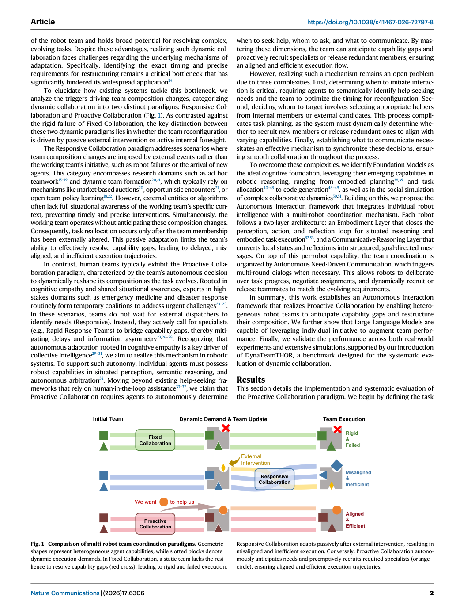
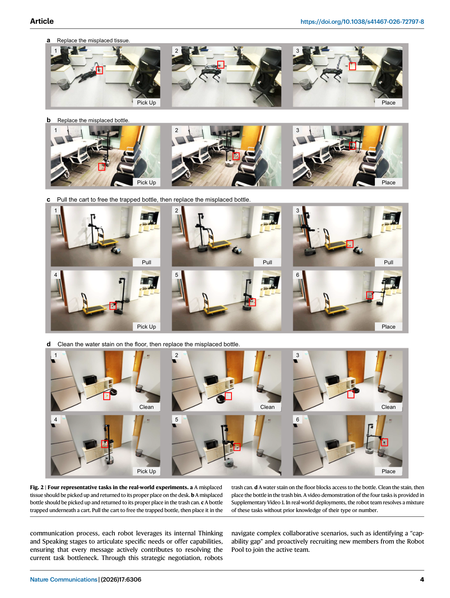
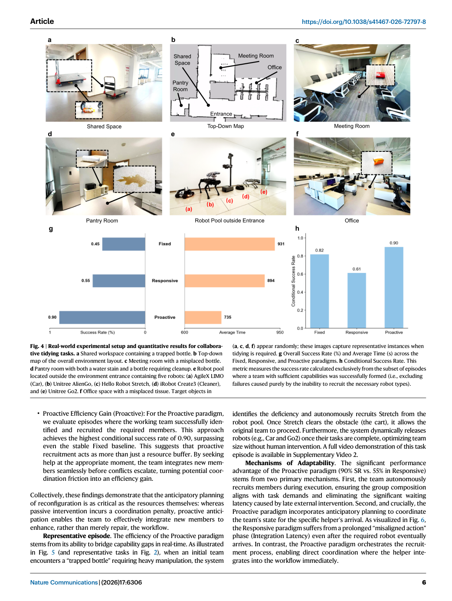
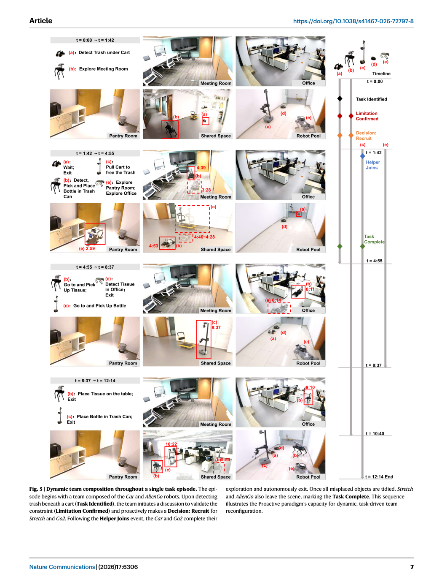
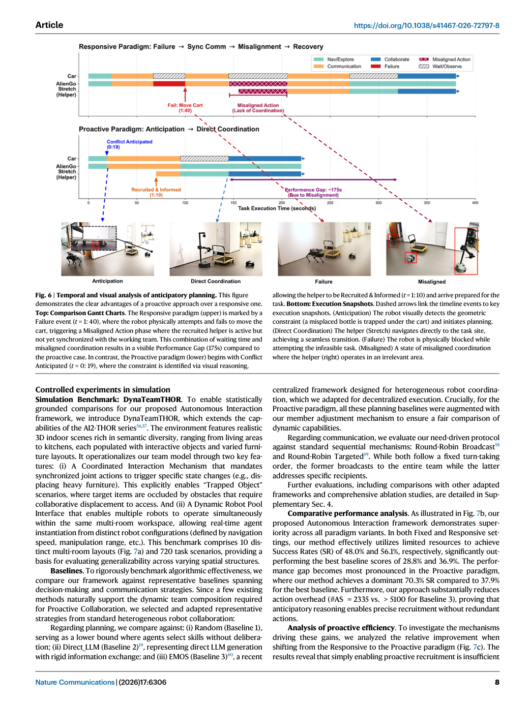
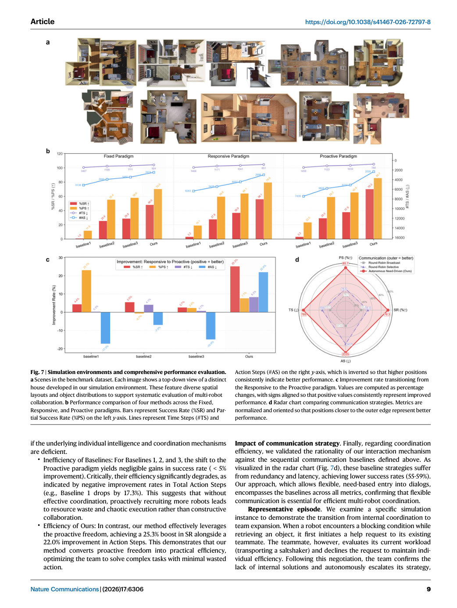
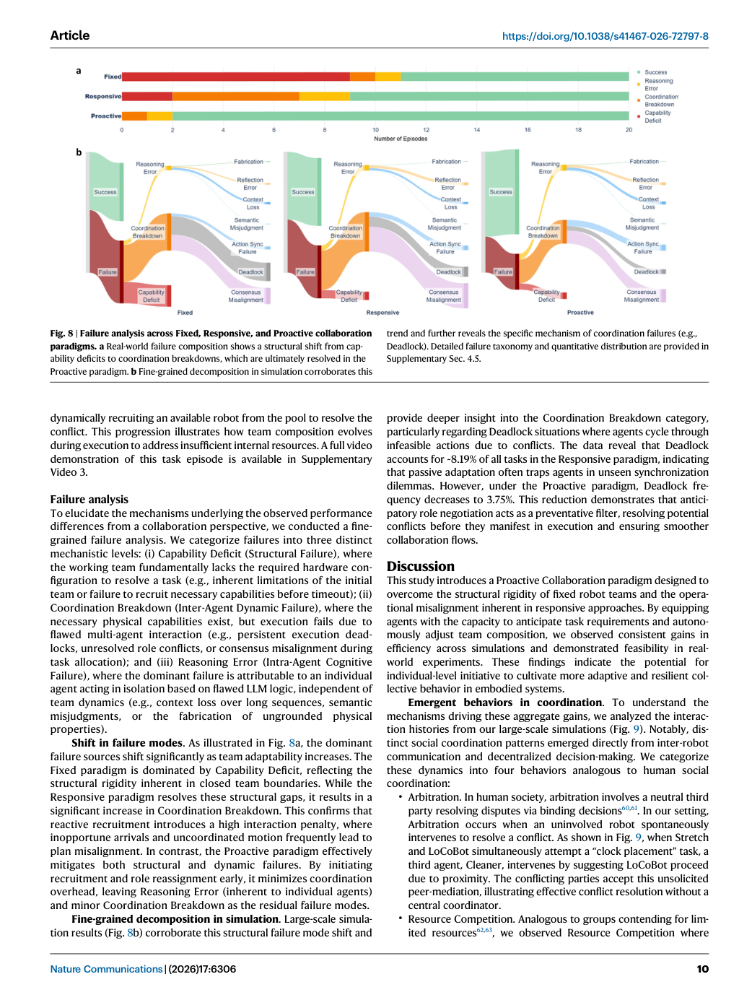
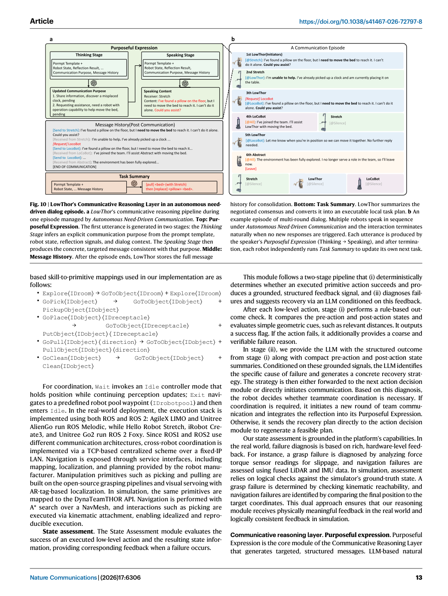

# Figure-by-figure analysis: Proactive collaboration via autonomous interaction

These are faithful full-page renders from the audited article copy. They are included to keep captions, axes, legends and neighbouring context visible. The Paper Card carries the quantitative interpretation and source pointers; a rendered page is not independent validation of the underlying claim.

## Figure 1 — faithful PDF page view

**What the page shows.** Figure 1 is embedded as an unchanged PDF page view. It contributes Comparison of multi-robot team coordination paradigms. Geometric shapes represent heterogeneous agent capabilities, while slotted blocks denote dynamic execution demands. In Fixed Collaboration, a static team lacks the resi- lience to resolve capability gaps (red cross), leading to rigid and failed execution. [Paper: PDF p. 2, Figure 1]

**Evidence role.** This page documents the reported workflow, comparison or result named in the caption and supports the corresponding source-grounded discussion in Sections 07-10 of the Paper Card.

**Boundary.** It does not by itself establish causal attribution to every module, external generalization, unrestricted autonomy, or deployment readiness. Those limits are separated in Sections 11-13.

**Reusable presentation lesson.** Preserve the original denominator, comparator, metric direction, uncertainty display and failure cases when adapting this figure type.

## Figure 2 — faithful PDF page view

**What the page shows.** Figure 2 is embedded as an unchanged PDF page view. It contributes Four representative tasks in the real-world experiments. a A misplaced tissue should be picked up and returned to its proper place on the desk. b A misplaced bottle should be picked up and returned to its proper place in the trash can. c A bottle trapped underneath a cart. Pull the cart to free the trapped bottle, then place it in the [Paper: PDF p. 4, Figure 2]

**Evidence role.** This page documents the reported workflow, comparison or result named in the caption and supports the corresponding source-grounded discussion in Sections 07-10 of the Paper Card.

**Boundary.** It does not by itself establish causal attribution to every module, external generalization, unrestricted autonomy, or deployment readiness. Those limits are separated in Sections 11-13.

**Reusable presentation lesson.** Preserve the original denominator, comparator, metric direction, uncertainty display and failure cases when adapting this figure type.

## Figure 3 — faithful PDF page view

**What the page shows.** Figure 3 is embedded as an unchanged PDF page view. It contributes Overview of the autonomous interaction framework. Each robot inte- grates an Embodiment Layer that closes the perception, action, and reflection loop, and a Communicative Reasoning Layer that enables purposeful, goal-directed dialog. Based on reflected capability gaps and task progress, robots autonomously [Paper: PDF p. 5, Figure 3]

**Evidence role.** This page documents the reported workflow, comparison or result named in the caption and supports the corresponding source-grounded discussion in Sections 07-10 of the Paper Card.

**Boundary.** It does not by itself establish causal attribution to every module, external generalization, unrestricted autonomy, or deployment readiness. Those limits are separated in Sections 11-13.

**Reusable presentation lesson.** Preserve the original denominator, comparator, metric direction, uncertainty display and failure cases when adapting this figure type.

## Figure 4 — faithful PDF page view

**What the page shows.** Figure 4 is embedded as an unchanged PDF page view. It contributes Real-world experimental setup and quantitative results for collabora- tive tidying tasks. a Shared workspace containing a trapped bottle. b Top-down map of the overall environment layout. c Meeting room with a misplaced bottle. d Pantry room with both a water stain and a bottle requiring cleanup. e Robot pool [Paper: PDF p. 6, Figure 4]

**Evidence role.** This page documents the reported workflow, comparison or result named in the caption and supports the corresponding source-grounded discussion in Sections 07-10 of the Paper Card.

**Boundary.** It does not by itself establish causal attribution to every module, external generalization, unrestricted autonomy, or deployment readiness. Those limits are separated in Sections 11-13.

**Reusable presentation lesson.** Preserve the original denominator, comparator, metric direction, uncertainty display and failure cases when adapting this figure type.

## Figure 5 — faithful PDF page view

**What the page shows.** Figure 5 is embedded as an unchanged PDF page view. It contributes Dynamic team composition throughout a single task episode. The epi- sode begins with a team composed of the Car and AlienGo robots. Upon detecting trash beneath a cart (Task Identified), the team initiates a discussion to validate the constraint (Limitation Confirmed) and proactively makes a Decision: Recruit for [Paper: PDF p. 7, Figure 5]

**Evidence role.** This page documents the reported workflow, comparison or result named in the caption and supports the corresponding source-grounded discussion in Sections 07-10 of the Paper Card.

**Boundary.** It does not by itself establish causal attribution to every module, external generalization, unrestricted autonomy, or deployment readiness. Those limits are separated in Sections 11-13.

**Reusable presentation lesson.** Preserve the original denominator, comparator, metric direction, uncertainty display and failure cases when adapting this figure type.

## Figure 6 — faithful PDF page view

**What the page shows.** Figure 6 is embedded as an unchanged PDF page view. It contributes Temporal and visual analysis of anticipatory planning. This figure demonstrates the clear advantages of a proactive approach over a responsive one. Top: Comparison Gantt Charts. The Responsive paradigm (upper) is marked by a Failure event (t = 1: 40), where the robot physically attempts and fails to move the [Paper: PDF p. 8, Figure 6]

**Evidence role.** This page documents the reported workflow, comparison or result named in the caption and supports the corresponding source-grounded discussion in Sections 07-10 of the Paper Card.

**Boundary.** It does not by itself establish causal attribution to every module, external generalization, unrestricted autonomy, or deployment readiness. Those limits are separated in Sections 11-13.

**Reusable presentation lesson.** Preserve the original denominator, comparator, metric direction, uncertainty display and failure cases when adapting this figure type.

## Figure 7 — faithful PDF page view

**What the page shows.** Figure 7 is embedded as an unchanged PDF page view. It contributes Simulation environments and comprehensive performance evaluation. a Scenes in the benchmark dataset. Each image shows a top-down view of a distinct house developed in our simulation environment. These feature diverse spatial layouts and object distributions to support systematic evaluation of multi-robot [Paper: PDF p. 9, Figure 7]

**Evidence role.** This page documents the reported workflow, comparison or result named in the caption and supports the corresponding source-grounded discussion in Sections 07-10 of the Paper Card.

**Boundary.** It does not by itself establish causal attribution to every module, external generalization, unrestricted autonomy, or deployment readiness. Those limits are separated in Sections 11-13.

**Reusable presentation lesson.** Preserve the original denominator, comparator, metric direction, uncertainty display and failure cases when adapting this figure type.

## Figure 8 — faithful PDF page view

**What the page shows.** Figure 8 is embedded as an unchanged PDF page view. It contributes Failure analysis across Fixed, Responsive, and Proactive collaboration paradigms. a Real-world failure composition shows a structural shift from cap- ability deficits to coordination breakdowns, which are ultimately resolved in the Proactive paradigm. b Fine-grained decomposition in simulation corroborates this [Paper: PDF p. 10, Figure 8]

**Evidence role.** This page documents the reported workflow, comparison or result named in the caption and supports the corresponding source-grounded discussion in Sections 07-10 of the Paper Card.

**Boundary.** It does not by itself establish causal attribution to every module, external generalization, unrestricted autonomy, or deployment readiness. Those limits are separated in Sections 11-13.

**Reusable presentation lesson.** Preserve the original denominator, comparator, metric direction, uncertainty display and failure cases when adapting this figure type.

## Figure 9 — faithful PDF page view

**What the page shows.** Figure 9 is embedded as an unchanged PDF page view. It contributes Examples of four types of emergent behavior observed in our experi- ments. a Brief examples of competition, conformity, volunteering, and arbitration. b Detailed contents of multi-round dialogs. Arbitration: Robots resolve action conflicts through peer intervention, spontaneously regulating task assignments. [Paper: PDF p. 11, Figure 9]

**Evidence role.** This page documents the reported workflow, comparison or result named in the caption and supports the corresponding source-grounded discussion in Sections 07-10 of the Paper Card.

**Boundary.** It does not by itself establish causal attribution to every module, external generalization, unrestricted autonomy, or deployment readiness. Those limits are separated in Sections 11-13.

**Reusable presentation lesson.** Preserve the original denominator, comparator, metric direction, uncertainty display and failure cases when adapting this figure type.

## Figure 10 — faithful PDF page view

**What the page shows.** Figure 10 is embedded as an unchanged PDF page view. It contributes LowThor’s Communicative Reasoning Layer in an autonomous need- driven dialog episode. a LowThor's communicative reasoning pipeline during one episode managed by Autonomous Need-Driven Communication. Top: Pur- poseful Expression. The first utterance is generated in two stages: the Thinking [Paper: PDF p. 13, Figure 10]

**Evidence role.** This page documents the reported workflow, comparison or result named in the caption and supports the corresponding source-grounded discussion in Sections 07-10 of the Paper Card.

**Boundary.** It does not by itself establish causal attribution to every module, external generalization, unrestricted autonomy, or deployment readiness. Those limits are separated in Sections 11-13.

**Reusable presentation lesson.** Preserve the original denominator, comparator, metric direction, uncertainty display and failure cases when adapting this figure type.
