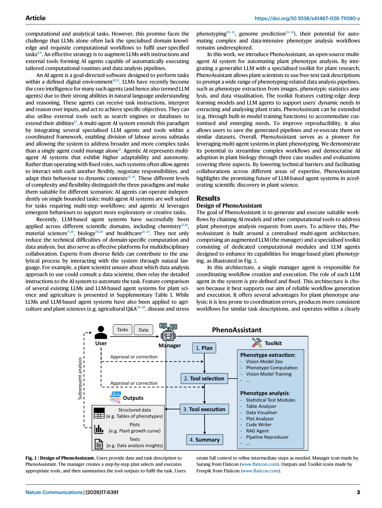
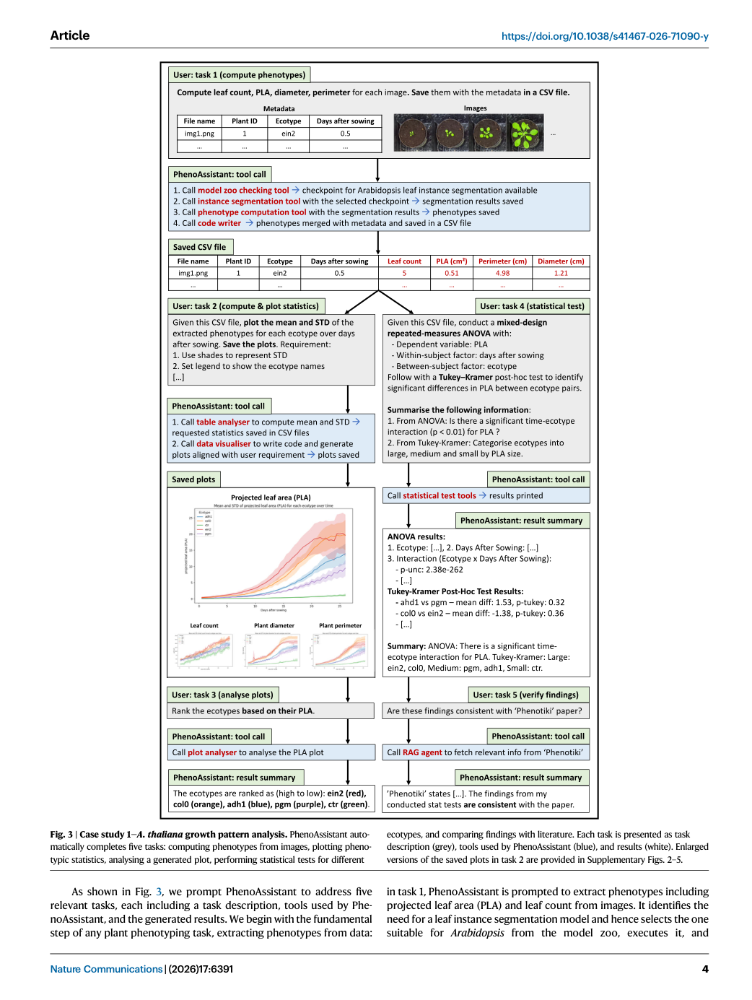
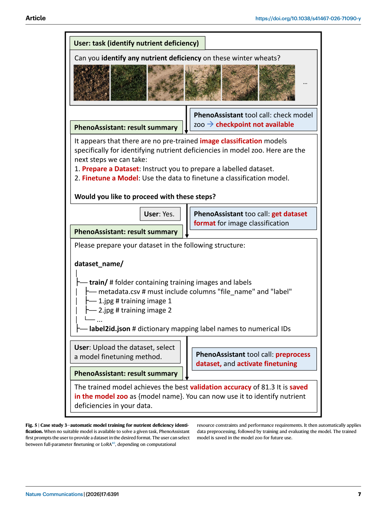

# Figure Analysis: A conversational multi-agent AI system for automated plant phenotyping

This companion analyses the source visuals embedded in the English Paper Card. Assets are unchanged PDF page views; no figure was regenerated.

## Figure 1

- **Argumentative role:** Design of PhenoAssistant. Users provide data and task description to PhenoAssistant. The manager creates a step-by-step plan selects and executes appropriate tools, and then summarises the tool outputs to fulfil the task. Users retain full control to refine intermediate steps as needed. Manager icon made by
- **Panel / visual logic:** Read the panel labels, axes, legends, and uncertainty marks before comparing conditions. The page view is retained so the full caption and neighbouring interpretation remain visible.
- **Reusable design:** Preserve a one-to-one mapping among workflow stage, comparison, metric, and claim.
- **Boundary:** This visual supports only the conditions and endpoints stated in the source; it does not establish transfer beyond the evaluated setting.
- **Locator:** [Paper: PDF p. 2, Figure 1]

## Figure 2

- **Argumentative role:** Examples of using ChatGPT 4o to extract plant phenotypes and perform computer vision tasks on a top-view image of A. thaliana. a, b ChatGPT is prompted to extract projected leaf area and leaf count in two separate attempts, but the results are incorrect and inconsistent between attempts. c ChatGPT is
- **Panel / visual logic:** Read the panel labels, axes, legends, and uncertainty marks before comparing conditions. The page view is retained so the full caption and neighbouring interpretation remain visible.
- **Reusable design:** Preserve a one-to-one mapping among workflow stage, comparison, metric, and claim.
- **Boundary:** This visual supports only the conditions and endpoints stated in the source; it does not establish transfer beyond the evaluated setting.
- **Locator:** [Paper: PDF p. 3, Figure 2]

## Figure 3

- **Argumentative role:** Case study 1—A. thaliana growth pattern analysis. PhenoAssistant auto- matically completes five tasks: computing phenotypes from images, plotting pheno- typic statistics, analysing a generated plot, performing statistical tests for different ecotypes, and comparing findings with literature. Each task is presented as task
- **Panel / visual logic:** Read the panel labels, axes, legends, and uncertainty marks before comparing conditions. The page view is retained so the full caption and neighbouring interpretation remain visible.
- **Reusable design:** Preserve a one-to-one mapping among workflow stage, comparison, metric, and claim.
- **Boundary:** This visual supports only the conditions and endpoints stated in the source; it does not establish transfer beyond the evaluated setting.
- **Locator:** [Paper: PDF p. 4, Figure 3]

## Figure 4

- **Argumentative role:** Case study 2—potato leaf area and dry weight correlation analysis. In response to the user’s requests, PhenoAssistant first extracts phenotypes from the provided data and then compares correlations between different plant-related variables.
- **Panel / visual logic:** Read the panel labels, axes, legends, and uncertainty marks before comparing conditions. The page view is retained so the full caption and neighbouring interpretation remain visible.
- **Reusable design:** Preserve a one-to-one mapping among workflow stage, comparison, metric, and claim.
- **Boundary:** This visual supports only the conditions and endpoints stated in the source; it does not establish transfer beyond the evaluated setting.
- **Locator:** [Paper: PDF p. 6, Figure 4]

## Figure 5

- **Argumentative role:** Case study 3—automatic model training for nutrient deficiency identi- fication. When no suitable model is available to solve a given task, PhenoAssistant first prompts the user to provide a dataset in the desired format. The user can select between full-parameter finetuning or LoRA40, depending on computational
- **Panel / visual logic:** Read the panel labels, axes, legends, and uncertainty marks before comparing conditions. The page view is retained so the full caption and neighbouring interpretation remain visible.
- **Reusable design:** Preserve a one-to-one mapping among workflow stage, comparison, metric, and claim.
- **Boundary:** This visual supports only the conditions and endpoints stated in the source; it does not establish transfer beyond the evaluated setting.
- **Locator:** [Paper: PDF p. 7, Figure 5]

## Cross-figure reading rule

Read workflow figures before performance figures, then connect every visual comparison to its metric, evaluation population, and claim boundary. Visual density is evidence organisation, not independent proof of generality.