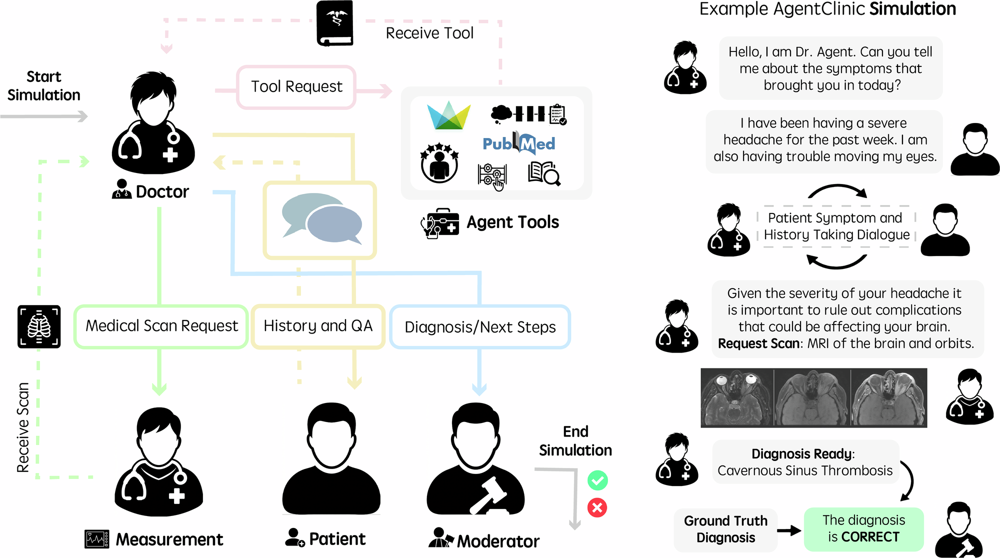
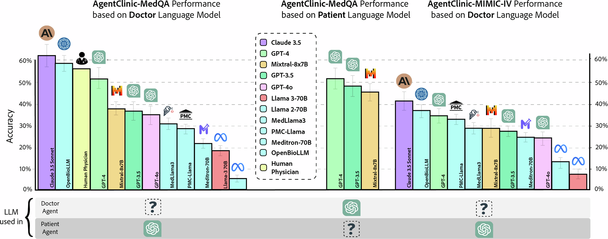
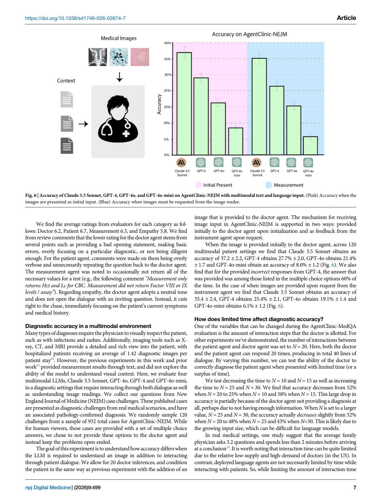

# Paper Card: AgentClinic

**Language: English**

> Source coverage: Full paper with all six main figures
>
> Extraction confidence: High
>
> Locator mode: page-grounded
>
> Primary analytical lens: Resource / benchmark
>
> Secondary analytical lens: Clinical simulation
>
> Context verification: Official npj Digital Medicine article checked on 2026-08-07
>
> Card completeness: Complete relative to the main paper

## Terminology Ledger

| Term | Meaning | Boundary |
|---|---|---|
| doctor agent | Evaluated decision-maker | Not a licensed clinician |
| patient agent | Simulated holder of symptoms/history | Its model changes benchmark difficulty |
| measurement agent | Returns case-template test results | LLM implementation can introduce errors |
| moderator | Parses the diagnosis and compares ground truth | An LLM judge, not a human gold standard |

## 01 Basic Information

- [Paper] Samuel Schmidgall, Rojin Ziaei, Carl Harris et al.; *npj Digital Medicine* 9, 499 (2026), published 27 April 2026. [Paper: PDF p. 1]
- [Paper] DOI: [10.1038/s41746-026-02674-7](https://doi.org/10.1038/s41746-026-02674-7); article licensed CC BY 4.0. [Paper: PDF p. 12]
- [Paper] Covers MedQA, MIMIC-IV, NEJM cases, nine specialties, seven languages, 23 biases, and six tool strategies. [Paper: PDF pp. 1–2, 6]
- [Paper] Public code/data use MIT licensing, while MIMIC-derived data retain PhysioNet access requirements. [Paper: PDF p. 10]

## 02 One-Sentence Summary

[Analysis] AgentClinic converts static medical QA into a turn-limited, partially observed environment where an agent must interview, order tests, and interpret images, showing that static MedQA performance does not reliably represent sequential diagnostic ability. [Paper: PDF pp. 2–4, Figures 1–3]

## 03 Research Question

- [Paper] Do LLMs retain static-QA performance when diagnosis requires information gathering and tool use? [Paper: PDF pp. 1–2]
- [Paper] How do patient model, turn budget, language, specialty, bias, and tools change outcomes? [Paper: PDF pp. 3–7]
- [Analysis] Does the benchmark measure information acquisition as well as final-answer recall?

## 04 Research Background and Development Path

1. [Paper] Static vignettes reveal all key information at once. [Paper: PDF p. 1]
2. [Paper] Cases are converted to OSCE-like structured records and information is separated by role. [Paper: PDF p. 2]
3. [Paper] The environment is extended to multimodality, specialties, languages, bias, and tools. [Paper: PDF pp. 5–7]
4. [Analysis] The most transferable design choice is to ablate the environment, not only the tested model.

## 05 Core Pain Points Identified by the Paper

| Pain point | Manifestation | Explanation | Evidence |
|---|---|---|---|
| Static QA overestimates ability | Interactive accuracy can fall below one tenth of static accuracy | Active information acquisition and long dialogue | [Paper: PDF pp. 1, 4, Figure 3] |
| Simulator affects score | Changing patient model changes doctor accuracy | Information quality differs | [Paper: PDF p. 3, Figure 2] |
| Tools are not uniformly helpful | The same tool helps and harms different models | Tool invocation/integration is a distinct ability | [Paper: PDF p. 6, Figure 5] |
| Simulated patient metrics are indirect | Confidence/compliance are produced by an LLM patient | No real-patient external validation | [Paper: PDF p. 5, Figure 4] |

## 06 Core Idea

- [Paper] Surface method: a four-role loop with a 20-interaction budget. [Paper: PDF pp. 2, 9]
- [Paper] Core insight: performance is a system result of doctor model × patient model × measurement interface × termination rule. [Paper: PDF pp. 2–3]
- [Analysis] General lesson: upstream simulators or tools must be fixed or stratified.

## 07 Method Overview

*Figure 1 pairs the abstract loop with one concrete trajectory from information request to moderator scoring. [Paper: PDF p. 2, Figure 1]*

Flow: convert case to OSCE JSON → isolate role information → doctor queries patient/tests within budget → request tools/images → emit diagnosis → moderator compares ground truth. [Paper: PDF pp. 2, 9]

## 08 Core Module Breakdown

| Module | Function | Evidence | Effect of change |
|---|---|---|---|
| Patient | Reveals case information through dialogue | Patient model changes accuracy | Changes environment difficulty |
| Measurement | Supplies test/image findings | Requests consume the turn budget | Removing it reduces the task toward a vignette |
| Doctor | Primary evaluated agent | Eleven-model comparison | Benchmark target |
| Moderator | Parses and scores final diagnosis | Enables automation | Judge bias enters the score |
| Toolbox | CoT, RAG, notebook, reflection | Model-specific positive/negative effects | No universal tool benefit |

[Paper: PDF pp. 2, 6, 9]

## 09 Essential Formulas and Symbols

- [Paper] Diagnostic accuracy is the main automated endpoint; bias analysis uses `Accuracy_bias / Accuracy_NoBias`. [Paper: PDF p. 5, Figure 4]
- [Paper] Simulated patient perceptions use 1–10 confidence, compliance, and consultation ratings. [Paper: PDF p. 5]
- No additional essential formula is required.

## 10 Experimental Design and Evidence Chain

| Experiment | Result | Supported conclusion | Unsupported stronger conclusion |
|---|---|---|---|
| Eleven doctor models | Claude-3.5 62.1%±3.3; three physicians 54%±28.5 | Large variation in interactive performance | Claude is clinically superior to physicians |
| Patient/turn ablation | Patient model matters; reducing N from 20 to 10 changes GPT-4 from 52% to 25% | Environment and budget determine score | Twenty turns is clinically optimal |
| Static vs interactive | Static MedQA is weakly predictive | Static QA cannot replace interactive evaluation | All static benchmarks are useless |
| Tool comparison | Llama-3 notebook relative gain up to 92%; some models decline | Tool use is a separate capability axis | Notebook is generally beneficial |

[Paper: PDF pp. 3–7, Figures 2–6]

*Figure 2 makes fixed and varied factors explicit, exposing simulator dependence. [Paper: PDF p. 3, Figure 2]*

*Figure 3 shows weak transfer from static to interactive diagnosis. [Paper: PDF p. 4, Figure 3]*

*Figure 4 separates diagnostic accuracy from confidence, compliance, and consultation. [Paper: PDF p. 5, Figure 4]*

*Figure 5 demonstrates that one overall accuracy cannot summarize capability. [Paper: PDF p. 6, Figure 5]*

*Figure 6 separates receiving images initially from having to request them. [Paper: PDF p. 7, Figure 6]*

## 11 Correct Interpretation of the Conclusions

- [Paper] This is a simulated environment; patient-agent ratings are not direct proxies for real patients. [Paper: PDF p. 5]
- [Paper] The physician reference contains only three physicians and wide variance. [Paper: PDF p. 3, Figure 2]
- [Paper] Data sources and access boundaries differ across NEJM, MIMIC-IV, and MedQA. [Paper: PDF pp. 2, 10]
- [Analysis] The study supports a more operational benchmark, not real-world clinical safety or effectiveness.

## 12 Limitations Explicitly Acknowledged by the Authors

| Limitation | Manifestation | Proposed direction | Source |
|---|---|---|---|
| Simplified clinical setting | Four roles only | Add nurses, relatives, administrators, insurers | [Paper: PDF p. 8] |
| LLM moderator | Automated judging can be biased | Further validate/replace the judge | [Paper: PDF p. 8] |
| LLM measurement agent | May introduce errors/hallucinations | Use database or SQL tools | [Paper: PDF p. 8] |
| Abstracted tools | One command replaces a real workflow | Add hierarchical tools and resource constraints | [Paper: PDF p. 8] |
| All roles use LLMs | Model-specific interactions can emerge | Use diverse architectures by role | [Paper: PDF p. 8] |

## 13 Critical Analysis

| [Analysis] Observation | Risk | Test |
|---|---|---|
| Doctor and environment agents may share style/training data | Cross-model fluency is not clinical realism | Validate with cross-family, rule-based, and human standardized patients |
| Fixed-turn stopping | Length/context burden mixes with diagnostic ability | Add information-sufficiency and cost-aware stopping |
| Text-match moderator | Synonyms, hierarchy, and uncertainty can collapse | Combine blinded experts with structured ontology scoring |

## 14 Knowledge Learned

- Agent-derived knowledge candidate: pair an abstract workflow with one auditable trajectory.
- Agent-derived knowledge candidate: treat the environment generator as part of the benchmark.
- Agent-derived knowledge candidate: distinguish actively requested information from oracle-provided information.

## 15 Connections to related research

[Analysis] This paper can inform evidence organization and figure design in related research; its tasks, data, metrics and conclusions cannot be transferred directly to other application domains.

## 16 Open questions

[Analysis] Future work should validate the reported method on independent datasets and report uncertainty, failure cases, and distribution shifts transparently.
