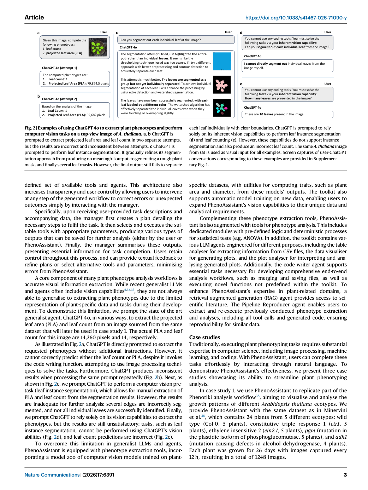
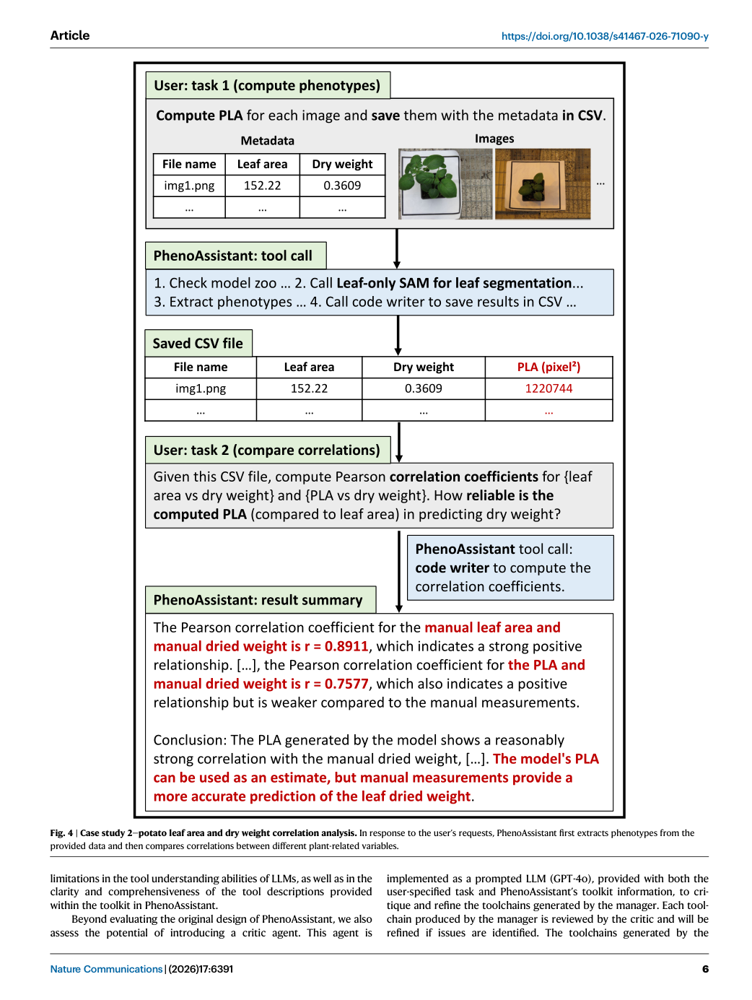

# Figure-by-figure analysis: A conversational multi-agent AI system for automated plant phenotyping

These are faithful full-page renders from the audited article copy. They are included to keep captions, axes, legends and neighbouring context visible. The Paper Card carries the quantitative interpretation and source pointers; a rendered page is not independent validation of the underlying claim.

## Figure 1 — faithful PDF page view

**What the page shows.** Figure 1 is embedded as an unchanged PDF page view. It contributes Design of PhenoAssistant. Users provide data and task description to PhenoAssistant. The manager creates a step-by-step plan selects and executes appropriate tools, and then summarises the tool outputs to fulfil the task. Users retain full control to refine intermediate steps as needed. Manager icon made by [Paper: PDF p. 2, Figure 1]

**Evidence role.** This page documents the reported workflow, comparison or result named in the caption and supports the corresponding source-grounded discussion in Sections 07-10 of the Paper Card.

**Boundary.** It does not by itself establish causal attribution to every module, external generalization, unrestricted autonomy, or deployment readiness. Those limits are separated in Sections 11-13.

**Reusable presentation lesson.** Preserve the original denominator, comparator, metric direction, uncertainty display and failure cases when adapting this figure type.

## Figure 2 — faithful PDF page view

**What the page shows.** Figure 2 is embedded as an unchanged PDF page view. It contributes Examples of using ChatGPT 4o to extract plant phenotypes and perform computer vision tasks on a top-view image of A. thaliana. a, b ChatGPT is prompted to extract projected leaf area and leaf count in two separate attempts, but the results are incorrect and inconsistent between attempts. c ChatGPT is [Paper: PDF p. 3, Figure 2]

**Evidence role.** This page documents the reported workflow, comparison or result named in the caption and supports the corresponding source-grounded discussion in Sections 07-10 of the Paper Card.

**Boundary.** It does not by itself establish causal attribution to every module, external generalization, unrestricted autonomy, or deployment readiness. Those limits are separated in Sections 11-13.

**Reusable presentation lesson.** Preserve the original denominator, comparator, metric direction, uncertainty display and failure cases when adapting this figure type.

## Figure 3 — faithful PDF page view

**What the page shows.** Figure 3 is embedded as an unchanged PDF page view. It contributes Case study 1—A. thaliana growth pattern analysis. PhenoAssistant auto- matically completes five tasks: computing phenotypes from images, plotting pheno- typic statistics, analysing a generated plot, performing statistical tests for different ecotypes, and comparing findings with literature. Each task is presented as task [Paper: PDF p. 4, Figure 3]

**Evidence role.** This page documents the reported workflow, comparison or result named in the caption and supports the corresponding source-grounded discussion in Sections 07-10 of the Paper Card.

**Boundary.** It does not by itself establish causal attribution to every module, external generalization, unrestricted autonomy, or deployment readiness. Those limits are separated in Sections 11-13.

**Reusable presentation lesson.** Preserve the original denominator, comparator, metric direction, uncertainty display and failure cases when adapting this figure type.

## Figure 4 — faithful PDF page view

**What the page shows.** Figure 4 is embedded as an unchanged PDF page view. It contributes Case study 2—potato leaf area and dry weight correlation analysis. In response to the user’s requests, PhenoAssistant first extracts phenotypes from the provided data and then compares correlations between different plant-related variables. [Paper: PDF p. 6, Figure 4]

**Evidence role.** This page documents the reported workflow, comparison or result named in the caption and supports the corresponding source-grounded discussion in Sections 07-10 of the Paper Card.

**Boundary.** It does not by itself establish causal attribution to every module, external generalization, unrestricted autonomy, or deployment readiness. Those limits are separated in Sections 11-13.

**Reusable presentation lesson.** Preserve the original denominator, comparator, metric direction, uncertainty display and failure cases when adapting this figure type.

## Figure 5 — faithful PDF page view

**What the page shows.** Figure 5 is embedded as an unchanged PDF page view. It contributes Case study 3—automatic model training for nutrient deficiency identi- fication. When no suitable model is available to solve a given task, PhenoAssistant first prompts the user to provide a dataset in the desired format. The user can select between full-parameter finetuning or LoRA40, depending on computational [Paper: PDF p. 7, Figure 5]

**Evidence role.** This page documents the reported workflow, comparison or result named in the caption and supports the corresponding source-grounded discussion in Sections 07-10 of the Paper Card.

**Boundary.** It does not by itself establish causal attribution to every module, external generalization, unrestricted autonomy, or deployment readiness. Those limits are separated in Sections 11-13.

**Reusable presentation lesson.** Preserve the original denominator, comparator, metric direction, uncertainty display and failure cases when adapting this figure type.
