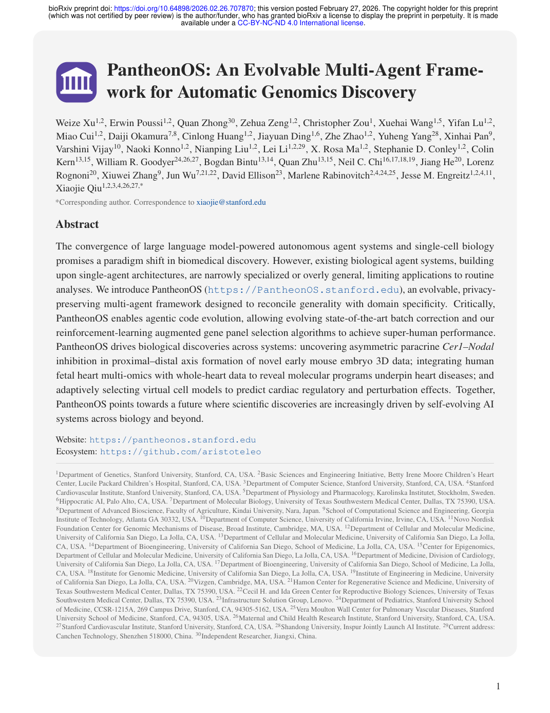

# Figure Analysis: PantheonOS: An Evolvable Multi-Agent Framework for Automatic Genomics Discovery

This companion analyses the source visuals embedded in the English Paper Card. Assets are unchanged PDF page views; no figure was regenerated.

## Visual extraction limitation

The parser did not reliably identify main figures. No reconstructed or AI-generated substitute is used. Consult the official source for the complete visual record. [Paper: PDF p. 1]

## Cross-figure reading rule

Read workflow figures before performance figures, then connect every visual comparison to its metric, evaluation population, and claim boundary. Visual density is evidence organisation, not independent proof of generality.