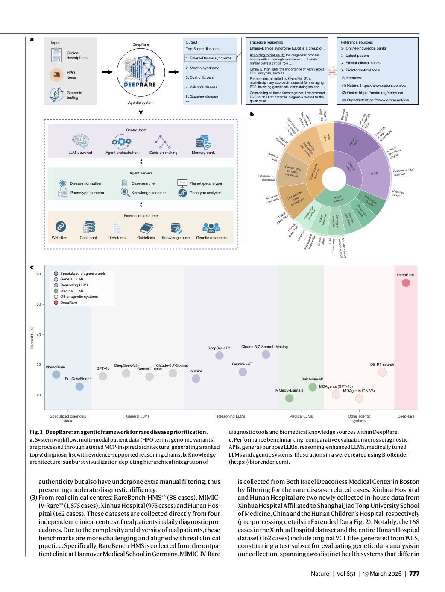
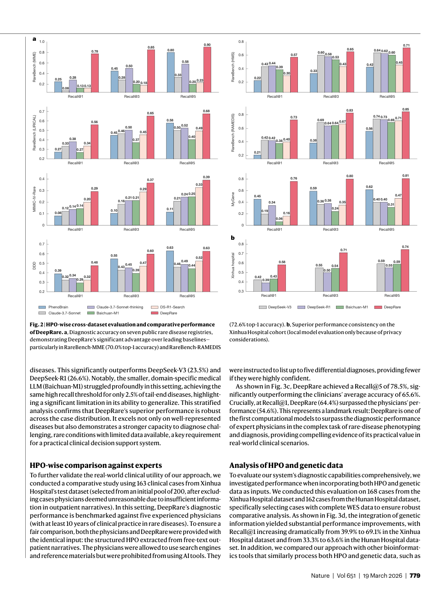
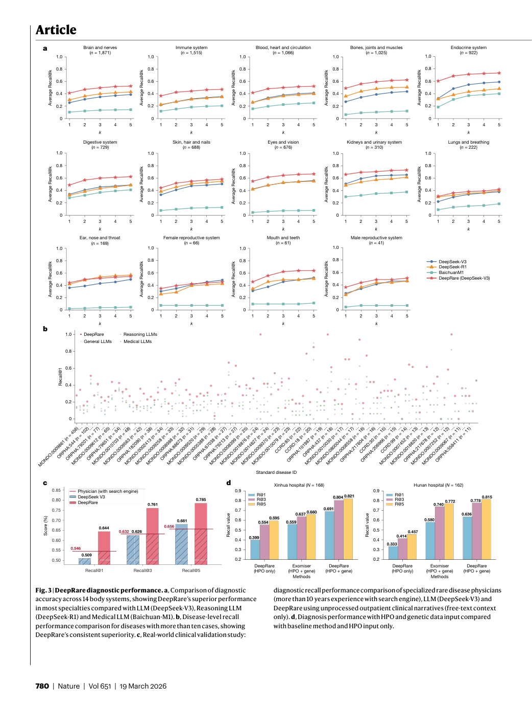
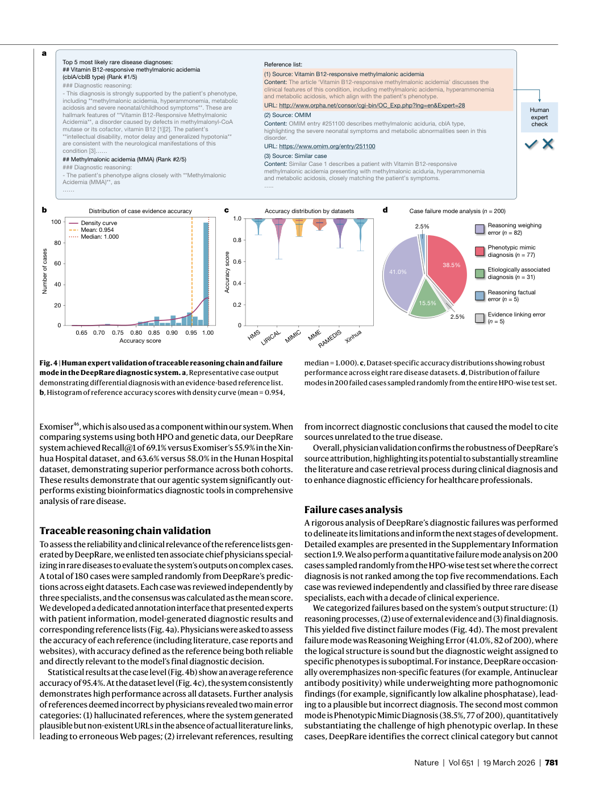
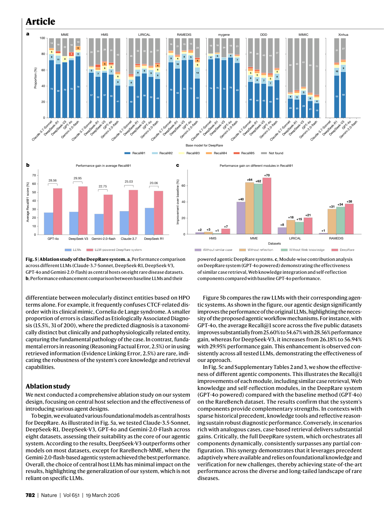

# Figure Analysis: An agentic system for rare disease diagnosis with traceable reasoning

This companion analyses the source visuals embedded in the English Paper Card. Assets are unchanged PDF page views; no figure was regenerated.

## Figure 1

- **Argumentative role:** DeepRare: an agentic framework for rare disease prioritization. a, System workflow: multi-modal patient data (HPO terms, genomic variants) are processed through a tiered MCP-inspired architecture, generating a ranked top-K diagnosis list with evidence-supported reasoning chains. b, Knowledge
- **Panel / visual logic:** Read the panel labels, axes, legends, and uncertainty marks before comparing conditions. The page view is retained so the full caption and neighbouring interpretation remain visible.
- **Reusable design:** Preserve a one-to-one mapping among workflow stage, comparison, metric, and claim.
- **Boundary:** This visual supports only the conditions and endpoints stated in the source; it does not establish transfer beyond the evaluated setting.
- **Locator:** [Paper: PDF p. 3, Figure 1]

## Figure 2

- **Argumentative role:** HPO-wise cross-dataset evaluation and comparative performance of DeepRare. a, Diagnostic accuracy on seven public rare disease registries, demonstrating DeepRare’s significant advantage over leading baselines— particularly in RareBench-MME (70.0% top-1 accuracy) and RareBench-RAMEDIS
- **Panel / visual logic:** Read the panel labels, axes, legends, and uncertainty marks before comparing conditions. The page view is retained so the full caption and neighbouring interpretation remain visible.
- **Reusable design:** Preserve a one-to-one mapping among workflow stage, comparison, metric, and claim.
- **Boundary:** This visual supports only the conditions and endpoints stated in the source; it does not establish transfer beyond the evaluated setting.
- **Locator:** [Paper: PDF p. 5, Figure 2]

## Figure 3

- **Argumentative role:** DeepRare diagnostic performance. a, Comparison of diagnostic accuracy across 14 body systems, showing DeepRare’s superior performance in most specialties compared with LLM (DeepSeek-V3), Reasoning LLM (DeepSeek-R1) and Medical LLM (Baichuan-M1). b, Disease-level recall
- **Panel / visual logic:** Read the panel labels, axes, legends, and uncertainty marks before comparing conditions. The page view is retained so the full caption and neighbouring interpretation remain visible.
- **Reusable design:** Preserve a one-to-one mapping among workflow stage, comparison, metric, and claim.
- **Boundary:** This visual supports only the conditions and endpoints stated in the source; it does not establish transfer beyond the evaluated setting.
- **Locator:** [Paper: PDF p. 6, Figure 3]

## Figure 4

- **Argumentative role:** Human expert validation of traceable reasoning chain and failure mode in the DeepRare diagnostic system. a, Representative case output demonstrating differential diagnosis with an evidence-based reference list. b, Histogram of reference accuracy scores with density curve (mean = 0.954,
- **Panel / visual logic:** Read the panel labels, axes, legends, and uncertainty marks before comparing conditions. The page view is retained so the full caption and neighbouring interpretation remain visible.
- **Reusable design:** Preserve a one-to-one mapping among workflow stage, comparison, metric, and claim.
- **Boundary:** This visual supports only the conditions and endpoints stated in the source; it does not establish transfer beyond the evaluated setting.
- **Locator:** [Paper: PDF p. 7, Figure 4]

## Figure 5

- **Argumentative role:** Ablation study of the DeepRare system. a, Performance comparison across different LLMs (Claude-3.7-Sonnet, DeepSeek-R1, DeepSeek-V3, GPT-4o and Gemini-2.0-flash) as central hosts on eight rare disease datasets. b, Performance enhancement comparison between baseline LLMs and their
- **Panel / visual logic:** Read the panel labels, axes, legends, and uncertainty marks before comparing conditions. The page view is retained so the full caption and neighbouring interpretation remain visible.
- **Reusable design:** Preserve a one-to-one mapping among workflow stage, comparison, metric, and claim.
- **Boundary:** This visual supports only the conditions and endpoints stated in the source; it does not establish transfer beyond the evaluated setting.
- **Locator:** [Paper: PDF p. 8, Figure 5]

## Cross-figure reading rule

Read workflow figures before performance figures, then connect every visual comparison to its metric, evaluation population, and claim boundary. Visual density is evidence organisation, not independent proof of generality.