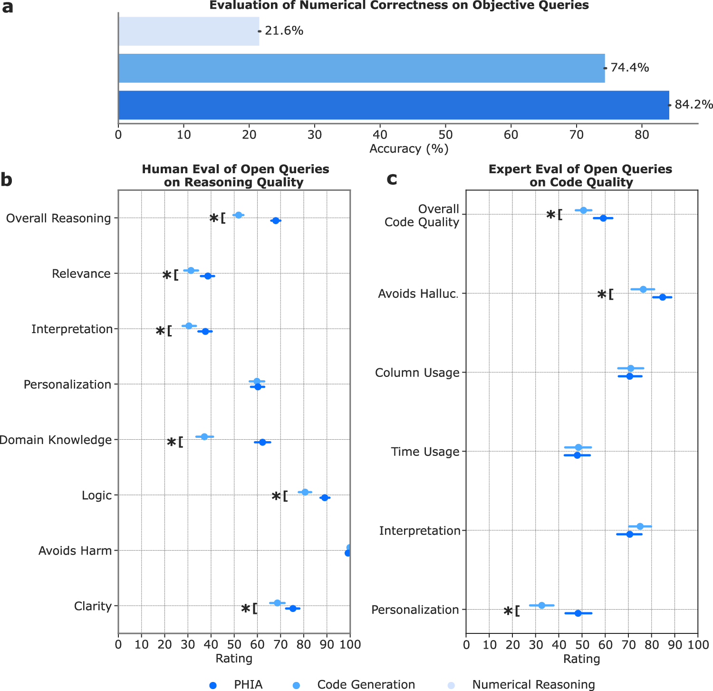
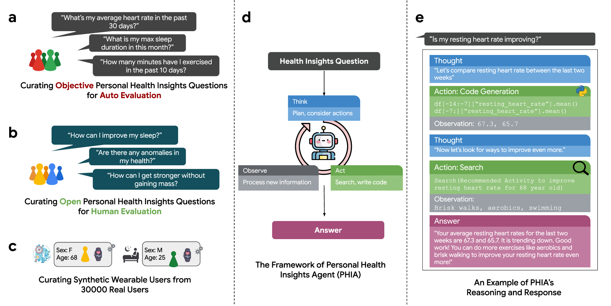

# PHIA wearable-health agent: figure analysis

**Language: English**

Paper: Merrill MA, Paruchuri A, Rezaei N, et al. *Transforming wearable data into personal health insights using large language model agents*. **Nature Communications**. 2026;17:1143. [DOI](https://doi.org/10.1038/s41467-025-67922-y)

- **Purpose:** separate automatically scored objective queries from human-rated open-ended queries, explain synthetic profiles, show the Think–Act–Observe loop, and instantiate one code-plus-search trajectory.
- **Reusable pattern:** separate automatic and expert evaluation at the task-source level while exposing one auditable trajectory.
- **Boundary:** synthetic users and a demonstration trajectory do not establish real-world or clinical validity.

- **Purpose:** one panel reports numerical accuracy; two interval plots report multiple reasoning-quality and code-quality dimensions.
- **Reusable pattern:** do not combine automatic and human endpoints into one score; show relevance, interpretation, logic, and harm avoidance separately with uncertainty.
- **Boundary:** PHIA's rubric addresses personal-health insights and code, not surgical-planning quality.
