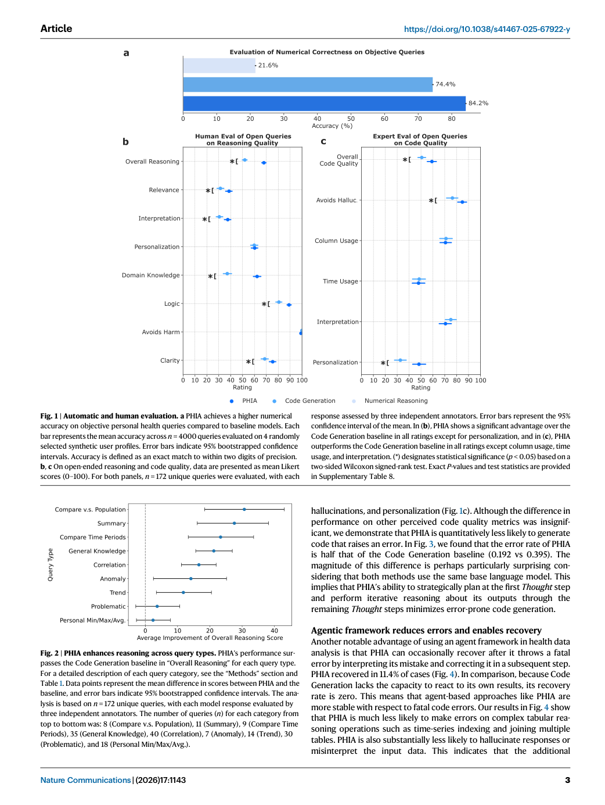
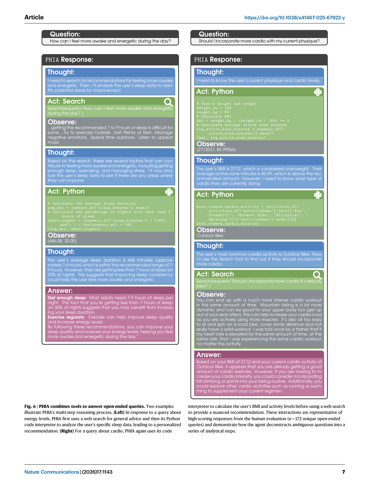

# Paper Card: Transforming wearable data into personal health insights using large language model agents (PHIA)

**Language: English**

> Source coverage: Full main paper with seven figures and two tables
>
> Extraction confidence: High
>
> Locator mode: page-grounded
>
> Primary analytical lens: Personal-health agent evaluation
>
> Secondary analytical lens: Benchmark methods / safety boundary
>
> Context verification: Official Nature Communications page checked on 2026-08-07
>
> Card completeness: Complete relative to the main paper

## Terminology Ledger

| Term | Meaning | Boundary |
|---|---|---|
| PHIA | Personal Health Insights Agent | Combines multistep reasoning, Python, and web search |
| objective queries | Questions with deterministic numerical answers | Support automatic accuracy scoring |
| open-ended queries | Questions requiring personal data plus domain knowledge | Depend on subjective human ratings |
| recovery rate | Fraction that self-correct after an initial code error | Measures agent-process recovery only |

## 01 Basic Information

- [Paper] Mike A. Merrill et al.; *Nature Communications* 17, 1143 (2026), published 12 January 2026. [Paper: PDF p. 1]
- [Paper] DOI: [10.1038/s41467-025-67922-y](https://doi.org/10.1038/s41467-025-67922-y); the paper states CC BY-NC-ND 4.0. [Paper: PDF p. 12]
- [Paper] Introduces PHIA and two benchmark datasets containing more than 4,000 personal-health-insight questions. [Paper: PDF pp. 1, 8–10]
- [Paper] Most experiments fix Gemini 1.0 Ultra to isolate the effects of the agent framework and tools rather than rank base models. [Paper: PDF pp. 6, 9]

## 02 One-Sentence Summary

[Analysis] PHIA turns wearable-data questions into planning, code execution, retrieval, and iterative correction and outperforms a strong code-generation baseline on synthetic profiles; the evidence supports benchmark response quality and recovery, not clinical efficacy, real-user benefit, or improved health outcomes. [Paper: PDF pp. 1, 3–6; Figures 1–7]

## 03 Research Question

- [Paper] Can an agent toolchain improve numerical reasoning over wearable time series? [Paper: PDF pp. 1–2]
- [Paper] Does multistep agency improve open-ended reasoning, domain knowledge, personalization, and safety? [Paper: PDF pp. 2–5]
- [Paper] Can an agent reduce code errors and recover from initial failures? [Paper: PDF pp. 3–4]

## 04 Research Background and Development Path

1. [Paper] Standard LLMs struggle with high-resolution wearable time series; prior systems often use pre-aggregated summaries. [Paper: PDF pp. 1–2]
2. [Paper] Code interpreters add numerical capability, but one-shot code generation cannot observe and repair execution. [Paper: PDF pp. 2–3]
3. [Paper] PHIA uses Thought–Action–Observation trajectories with Python and web search. [Paper: PDF pp. 6, 9]
4. [Analysis] A useful benchmark therefore needs both answer correctness and process reliability.

## 05 Core Pain Points Identified by the Paper

| Pain point | Manifestation | Evidence |
|---|---|---|
| Fragile numerical reasoning | Numerical Reasoning reaches only 22% | [Paper: PDF p. 2, Figure 1] |
| Open questions resist automatic scoring | Multidimensional human ratings are required | [Paper: PDF pp. 2–4, Figure 1] |
| One-shot code cannot self-repair | Code Generation recovery is zero | [Paper: PDF pp. 3–4, Figure 4] |
| Health advice can exceed scope | Diagnosis and harmful requests require refusal | [Paper: PDF pp. 5–6] |

## 06 Core Idea

- [Paper] Put personal wearable-data analysis, external retrieval, and iterative reasoning in one agent trajectory. [Paper: PDF pp. 6–9, Figures 6–7]
- [Paper] Pair an objective benchmark with an open-ended benchmark so automatic numerical evaluation and multidimensional human evaluation remain distinct. [Paper: PDF pp. 1–3, 8–10, Tables 1–2]
- [Analysis] Results should show error type, error rate, and recovery rather than only aggregate score.

## 07 Method Overview

Flow: synthetic wearable profiles → query type → Thought → Python / Web Search → Observation → iteration → automatic or human evaluation.

## 08 Core Module Breakdown

| Module | Function | Boundary |
|---|---|---|
| synthetic profiles | Protect real-user privacy | Not a deployment population |
| Python interpreter | Computes time-series and personal metrics | Can still produce indexing, join, and runtime errors |
| web search | Adds background and current information | Suggestion veracity was not medically adjudicated |
| ReAct trajectory | Plans, executes, observes, and corrects | Mostly tested with one base model |
| objective benchmark | 4,000 numerical questions | Two-decimal correctness rule |
| open-ended benchmark | 172 deduplicated questions | Twelve annotators; three ratings per response |

## 09 Essential Formulas and Symbols

- [Paper] An objective response is correct only when it matches the ground truth to two digits of precision. [Paper: PDF p. 10]
- [Paper] Error rate is the fraction of responses containing at least one code error; recovery rate is the fraction that repair an initial error in a later agent step. [Paper: PDF pp. 3–4, Figure 4]
- [Paper] The main paper has no numbered formula central to the benchmark; task sets, rating rubrics, and bootstrapped confidence intervals define the evaluation. [Paper: PDF pp. 2–4, 10]

## 10 Dataset and Evaluation Design

- [Paper] Objective: 4,000 queries across four randomly selected synthetic profiles, comparing PHIA with Code Generation, Numerical Reasoning, custom-prompted GPT-4, and PH-LLM. [Paper: PDF pp. 2, 10, Table 2]
- [Paper] Open-ended: about 3,000 crowdsourced questions yielded a random 200-query subset; semantic duplicates were removed to obtain 172 independent questions spanning the nine Table 1 types. [Paper: PDF p. 8, Table 1]
- [Paper] Twelve wearable-data-familiar annotators participated; three independent annotators rated each response, totaling about 650 hours. [Paper: PDF pp. 1, 10]
- [Paper] Synthetic profiles were modeled from an anonymized dataset of 30,000 consenting real wearable users. [Paper: PDF p. 8]

## 11 Main Results

*Figure 1 juxtaposes numerical accuracy and human dimensions; Figure 2 then stratifies reasoning gains by query type. [Paper: PDF p. 3, Figures 1–2]*

- [Paper] Objective accuracy: PHIA 84%, Code Generation 74%, Numerical Reasoning 22%, and custom-prompted GPT-4 53.6%; PH-LLM could not answer the objective queries. [Paper: PDF p. 2, Figure 1]
- [Paper] On open-ended queries, PHIA received 83% favorable ratings and was about twice as likely to receive the highest quality rating. [Paper: PDF p. 1]
- [Paper] PHIA scored 68% versus 52% for overall reasoning and 63% versus 38% for domain knowledge. [Paper: PDF pp. 2–3, Figure 1]

*Figure 3 decomposes code failure; Figure 4 separates error occurrence from recovery. [Paper: PDF pp. 3–4, Figures 3–4]*

- [Paper] PHIA error rate was 0.192 versus 0.395 for Code Generation; recovery was 11.4% versus zero. [Paper: PDF pp. 3–4, Figures 3–4]

*Figure 5 compares Numerical Reasoning, Code Generation, and PHIA on the same examples. [Paper: PDF p. 5, Figure 5]*

*Figure 6 exposes the tool calls and reasoning behind representative high-scoring responses. [Paper: PDF p. 7, Figure 6]*

## 12 Authors' Discussion and Interpretation

- [Paper] Lower errors under the same base model support the contribution of planning plus observation rather than a backbone swap alone. [Paper: PDF p. 3]
- [Paper] Annotator interviews indicate that concrete numbers, user context, and domain knowledge shape personalization ratings. [Paper: PDF p. 4]
- [Analysis] Holding the backbone mostly fixed strengthens the agent-versus-non-agent comparison.

## 13 Author-Stated Limitations, Risks, and Open Questions

- [Author limitation] The paper does not claim that the insights help real users understand data, change behavior, or improve health outcomes; clinical trials or user studies are needed. [Paper: PDF pp. 5–6]
- [Author limitation] Suggestion veracity was not assessed by medical experts. [Paper: PDF p. 5]
- [Author limitation] The scope is consumer-wearable-observable conditions, not complex or specialist medical questions. [Paper: PDF pp. 5–6]
- [Author limitation] There was no real-world deployment; cross-model generalization beyond Gemini 1.0 Ultra is a hypothesis, not a demonstrated claim. [Paper: PDF p. 6]
- [Analysis risk] Synthetic profiles and raters familiar with one wearable ecosystem may underrepresent deployment heterogeneity and clinical risk.

## 14 Reusable Figure and Benchmark Patterns

1. Figure 7: declare inputs, tasks, agent, tools, and scoring in one closed workflow.
2. Figure 1: place automatic and human endpoints side by side without collapsing evidence levels.
3. Figure 2: show where gains occur by task category.
4. Figures 3–4: separate failure taxonomy, incidence, and recovery.
5. Figures 5–6: explain quantitative findings with representative trajectories.

## 15 Connections to related research

[Analysis] This paper can inform evidence organization and figure design in related research; its tasks, data, metrics and conclusions cannot be transferred directly to other application domains.

## 16 Open questions

[Analysis] Future work should validate the reported method on independent datasets and report uncertainty, failure cases, and distribution shifts transparently.
