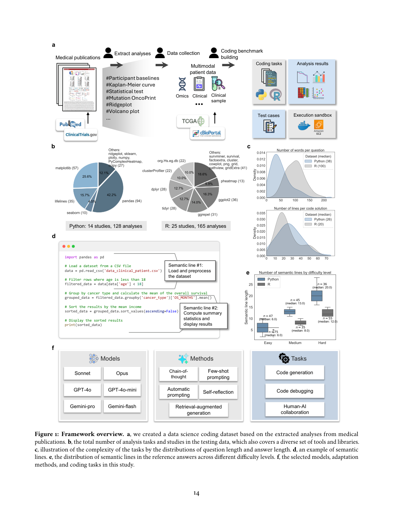
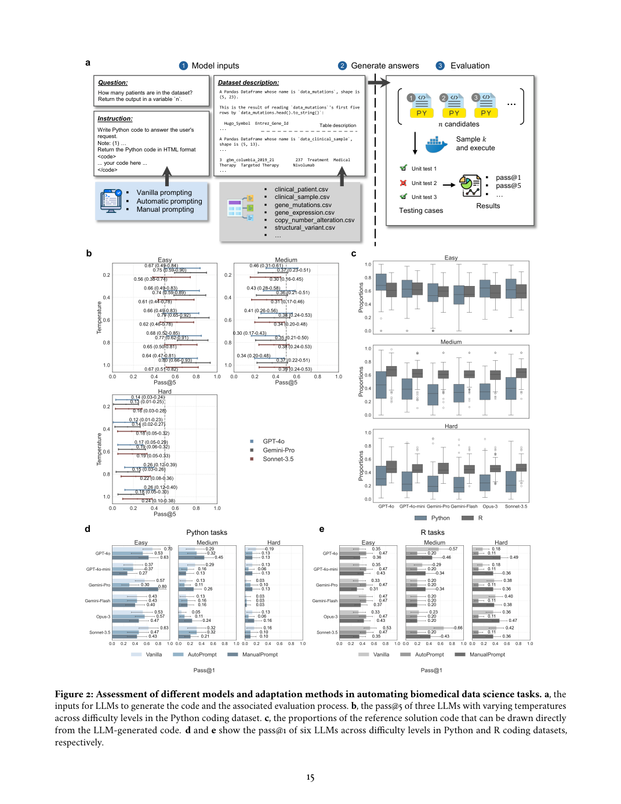
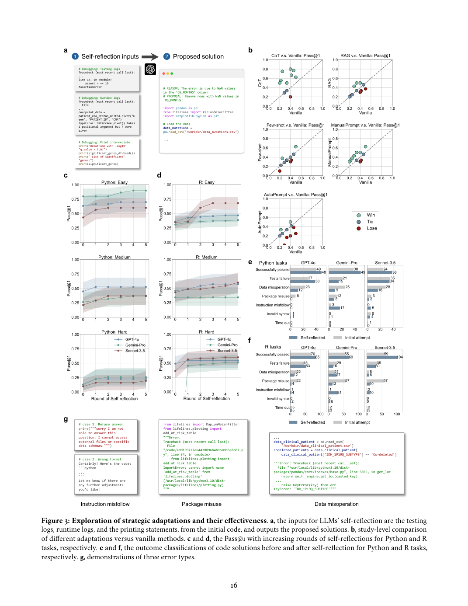
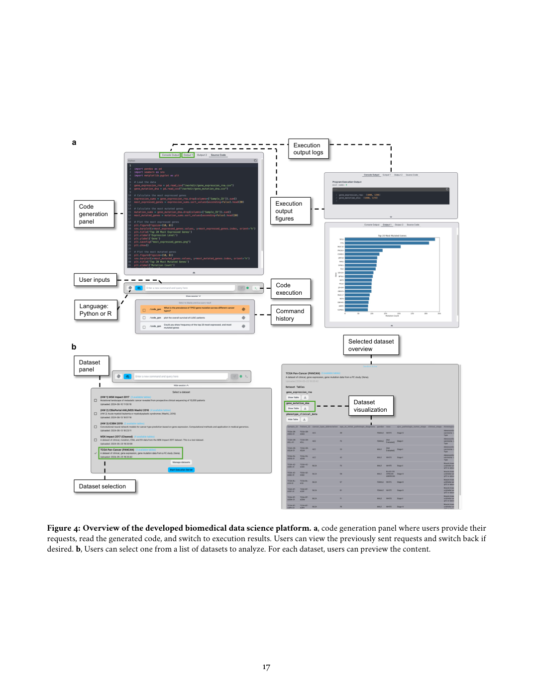
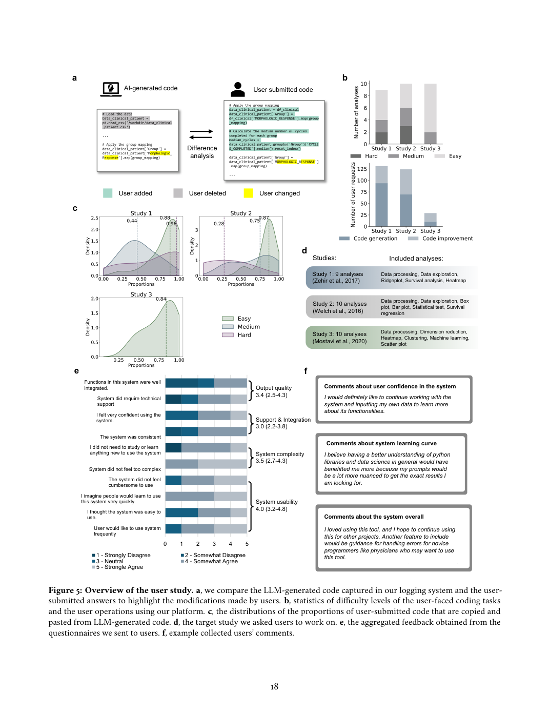

# Figure Analysis: Making large language models reliable data science programming copilots for biomedical research

This companion analyses the source visuals embedded in the English Paper Card. Assets are unchanged PDF page views; no figure was regenerated.

## Figure 1

- **Argumentative role:** Framework overview. a, we created a data science coding dataset based on the extracted analyses from medical publications. b, the total number of analysis tasks and studies in the testing data, which also covers a diverse set of tools and libraries. c, illustration of the complexity of the tasks by the distributions of question length and answer length. d, an example of semantic lines. e, the distribution of semantic lines in the reference answers across different difficulty levels. f, the selected models, adaptation
- **Panel / visual logic:** Read the panel labels, axes, legends, and uncertainty marks before comparing conditions. The page view is retained so the full caption and neighbouring interpretation remain visible.
- **Reusable design:** Preserve a one-to-one mapping among workflow stage, comparison, metric, and claim.
- **Boundary:** This visual supports only the conditions and endpoints stated in the source; it does not establish transfer beyond the evaluated setting.
- **Locator:** [Paper: PDF p. 14, Figure 1]

## Figure 2

- **Argumentative role:** Assessment of different models and adaptation methods in automating biomedical data science tasks. a, the inputs for LLMs to generate the code and the associated evaluation process. b, the pass@5 of three LLMs with varying temperatures across difficulty levels in the Python coding dataset. c, the proportions of the reference solution code that can be drawn directly from the LLM-generated code. d and e show the pass@1 of six LLMs across difficulty levels in Python and R coding datasets,
- **Panel / visual logic:** Read the panel labels, axes, legends, and uncertainty marks before comparing conditions. The page view is retained so the full caption and neighbouring interpretation remain visible.
- **Reusable design:** Preserve a one-to-one mapping among workflow stage, comparison, metric, and claim.
- **Boundary:** This visual supports only the conditions and endpoints stated in the source; it does not establish transfer beyond the evaluated setting.
- **Locator:** [Paper: PDF p. 15, Figure 2]

## Figure 3

- **Argumentative role:** Exploration of strategic adaptations and their effectiveness. a, the inputs for LLMs’ self-reflection are the testing logs, runtime logs, and the printing statements, from the initial code, and outputs the proposed solutions. b, study-level comparison of different adaptations versus vanilla methods. c and d, the Pass@1 with increasing rounds of self-reflections for Python and R tasks, respectively. e and f, the outcome classifications of code solutions before and after self-reflection for Python and R tasks,
- **Panel / visual logic:** Read the panel labels, axes, legends, and uncertainty marks before comparing conditions. The page view is retained so the full caption and neighbouring interpretation remain visible.
- **Reusable design:** Preserve a one-to-one mapping among workflow stage, comparison, metric, and claim.
- **Boundary:** This visual supports only the conditions and endpoints stated in the source; it does not establish transfer beyond the evaluated setting.
- **Locator:** [Paper: PDF p. 16, Figure 3]

## Figure 4

- **Argumentative role:** Overview of the developed biomedical data science platform. a, code generation panel where users provide their requests, read the generated code, and switch to execution results. Users can view the previously sent requests and switch back if desired. b, Users can select one from a list of datasets to analyze. For each dataset, users can preview the content. 17
- **Panel / visual logic:** Read the panel labels, axes, legends, and uncertainty marks before comparing conditions. The page view is retained so the full caption and neighbouring interpretation remain visible.
- **Reusable design:** Preserve a one-to-one mapping among workflow stage, comparison, metric, and claim.
- **Boundary:** This visual supports only the conditions and endpoints stated in the source; it does not establish transfer beyond the evaluated setting.
- **Locator:** [Paper: PDF p. 17, Figure 4]

## Figure 5

- **Argumentative role:** Overview of the user study. a, we compare the LLM-generated code captured in our logging system and the user- submitted answers to highlight the modifications made by users. b, statistics of difficulty levels of the user-faced coding tasks and the user operations using our platform. c, the distributions of the proportions of user-submitted code that are copied and pasted from LLM-generated code. d, the target study we asked users to work on. e, the aggregated feedback obtained from the
- **Panel / visual logic:** Read the panel labels, axes, legends, and uncertainty marks before comparing conditions. The page view is retained so the full caption and neighbouring interpretation remain visible.
- **Reusable design:** Preserve a one-to-one mapping among workflow stage, comparison, metric, and claim.
- **Boundary:** This visual supports only the conditions and endpoints stated in the source; it does not establish transfer beyond the evaluated setting.
- **Locator:** [Paper: PDF p. 18, Figure 5]

## Cross-figure reading rule

Read workflow figures before performance figures, then connect every visual comparison to its metric, evaluation population, and claim boundary. Visual density is evidence organisation, not independent proof of generality.