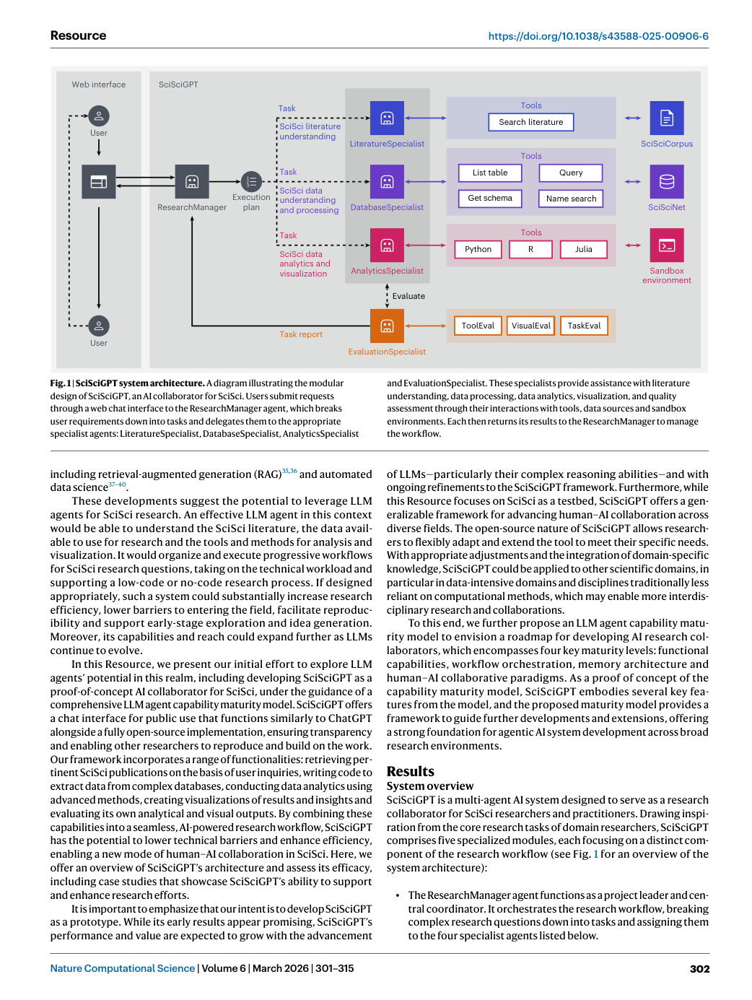
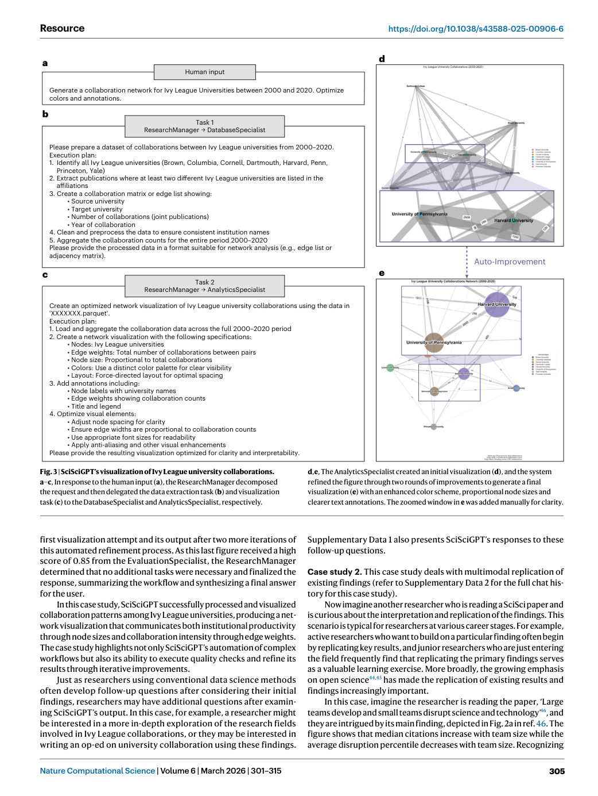
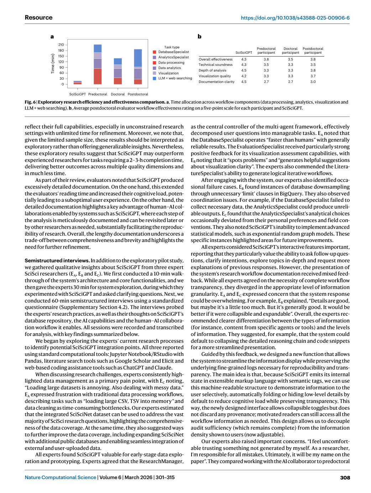

# Figure Analysis: SciSciGPT: advancing human–AI collaboration in the science of science

This companion analyses the source visuals embedded in the English Paper Card. Assets are unchanged PDF page views; no figure was regenerated.

## Figure 1

- **Argumentative role:** SciSciGPT system architecture. A diagram illustrating the modular design of SciSciGPT, an AI collaborator for SciSci. Users submit requests through a web chat interface to the ResearchManager agent, which breaks user requirements down into tasks and delegates them to the appropriate
- **Panel / visual logic:** Read the panel labels, axes, legends, and uncertainty marks before comparing conditions. The page view is retained so the full caption and neighbouring interpretation remain visible.
- **Reusable design:** Preserve a one-to-one mapping among workflow stage, comparison, metric, and claim.
- **Boundary:** This visual supports only the conditions and endpoints stated in the source; it does not establish transfer beyond the evaluated setting.
- **Locator:** [Paper: PDF p. 2, Figure 1]

## Figure 2

- **Argumentative role:** Detailed workflows of the four SciSciGPT specialist agents. a, The architecture of the LiteratureSpecialist agent for RAG in SciSci research. b, An example of the DatabaseSpecialist’s workflow for data extraction. c, An example of the AnalyticsSpecialist’s workflow for analysis and visualization. d, An example
- **Panel / visual logic:** Read the panel labels, axes, legends, and uncertainty marks before comparing conditions. The page view is retained so the full caption and neighbouring interpretation remain visible.
- **Reusable design:** Preserve a one-to-one mapping among workflow stage, comparison, metric, and claim.
- **Boundary:** This visual supports only the conditions and endpoints stated in the source; it does not establish transfer beyond the evaluated setting.
- **Locator:** [Paper: PDF p. 4, Figure 2]

## Figure 3

- **Argumentative role:** SciSciGPT’s visualization of Ivy League university collaborations. a–c, In response to the human input (a), the ResearchManager decomposed the request and then delegated the data extraction task (b) and visualization task (c) to the DatabaseSpecialist and AnalyticsSpecialist, respectively.
- **Panel / visual logic:** Read the panel labels, axes, legends, and uncertainty marks before comparing conditions. The page view is retained so the full caption and neighbouring interpretation remain visible.
- **Reusable design:** Preserve a one-to-one mapping among workflow stage, comparison, metric, and claim.
- **Boundary:** This visual supports only the conditions and endpoints stated in the source; it does not establish transfer beyond the evaluated setting.
- **Locator:** [Paper: PDF p. 5, Figure 3]

## Figure 4

- **Argumentative role:** SciSciGPT’s replication of a figure from a published paper. a, The user input includes Fig. 2a from ref. 46 and instructions to interpret the figure, redo the analysis and create a similar visualization. b,c, SciSciGPT broke the request down into tasks for the DatabaseSpecialist (b) and AnalyticsSpecialist (c).
- **Panel / visual logic:** Read the panel labels, axes, legends, and uncertainty marks before comparing conditions. The page view is retained so the full caption and neighbouring interpretation remain visible.
- **Reusable design:** Preserve a one-to-one mapping among workflow stage, comparison, metric, and claim.
- **Boundary:** This visual supports only the conditions and endpoints stated in the source; it does not establish transfer beyond the evaluated setting.
- **Locator:** [Paper: PDF p. 6, Figure 4]

## Figure 5

- **Argumentative role:** LLM agent capability maturity model. A four-level progression framework showing (1) functional capabilities, extending LLMs through specialized tools for knowledge access, data processing and methodology implementation; (2) workflow orchestration, implementing planning and
- **Panel / visual logic:** Read the panel labels, axes, legends, and uncertainty marks before comparing conditions. The page view is retained so the full caption and neighbouring interpretation remain visible.
- **Reusable design:** Preserve a one-to-one mapping among workflow stage, comparison, metric, and claim.
- **Boundary:** This visual supports only the conditions and endpoints stated in the source; it does not establish transfer beyond the evaluated setting.
- **Locator:** [Paper: PDF p. 7, Figure 5]

## Figure 6

- **Argumentative role:** Exploratory research efficiency and effectiveness comparison. a, Time allocation across workflow components (data processing, analytics, visualization and LLM + web searching). b, Average postdoctoral evaluator workflow effectiveness rating on a five-point scale for each participant and SciSciGPT.
- **Panel / visual logic:** Read the panel labels, axes, legends, and uncertainty marks before comparing conditions. The page view is retained so the full caption and neighbouring interpretation remain visible.
- **Reusable design:** Preserve a one-to-one mapping among workflow stage, comparison, metric, and claim.
- **Boundary:** This visual supports only the conditions and endpoints stated in the source; it does not establish transfer beyond the evaluated setting.
- **Locator:** [Paper: PDF p. 8, Figure 6]

## Cross-figure reading rule

Read workflow figures before performance figures, then connect every visual comparison to its metric, evaluation population, and claim boundary. Visual density is evidence organisation, not independent proof of generality.