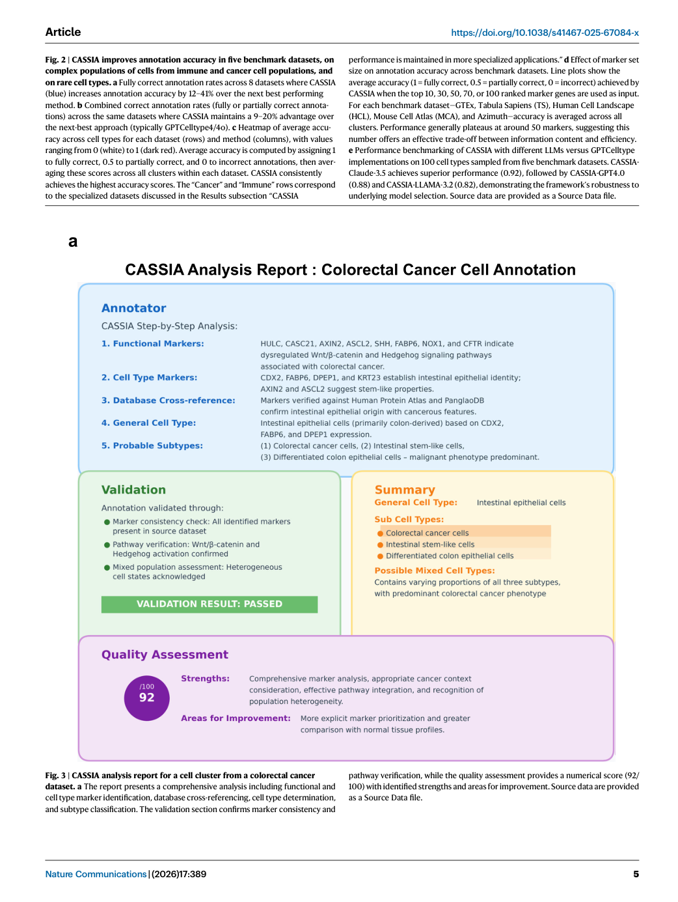
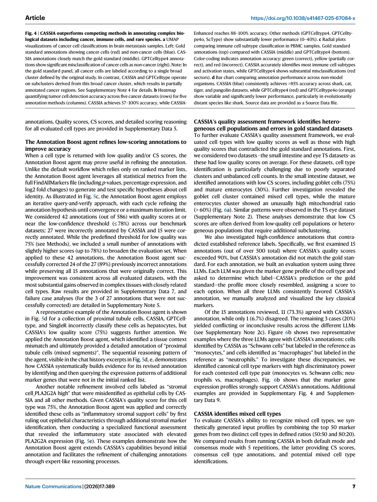

# Figure Analysis: CASSIA: a multi-agent large language model for automated and interpretable cell annotation

This companion analyses the source visuals embedded in the English Paper Card. Assets are unchanged PDF page views; no figure was regenerated.

## Figure 1

- **Argumentative role:** The multi-agent LLM system underlying CASSIA. a A user interacts directly with the Onboarding platform by specifying species, tissue type, and a collection of markers associated with cell subtypes within that tissue, if known. Any information associated with experimental conditions, interventions, or other
- **Panel / visual logic:** Read the panel labels, axes, legends, and uncertainty marks before comparing conditions. The page view is retained so the full caption and neighbouring interpretation remain visible.
- **Reusable design:** Preserve a one-to-one mapping among workflow stage, comparison, metric, and claim.
- **Boundary:** This visual supports only the conditions and endpoints stated in the source; it does not establish transfer beyond the evaluated setting.
- **Locator:** [Paper: PDF p. 3, Figure 1]

## Figure 2

- **Argumentative role:** CASSIA improves annotation accuracy in five benchmark datasets, on complex populations of cells from immune and cancer cell populations, and on rare cell types. a Fully correct annotation rates across 8 datasets where CASSIA (blue) increases annotation accuracy by 12–41% over the next best performing
- **Panel / visual logic:** Read the panel labels, axes, legends, and uncertainty marks before comparing conditions. The page view is retained so the full caption and neighbouring interpretation remain visible.
- **Reusable design:** Preserve a one-to-one mapping among workflow stage, comparison, metric, and claim.
- **Boundary:** This visual supports only the conditions and endpoints stated in the source; it does not establish transfer beyond the evaluated setting.
- **Locator:** [Paper: PDF p. 5, Figure 2]

## Figure 3

- **Argumentative role:** CASSIA analysis report for a cell cluster from a colorectal cancer dataset. a The report presents a comprehensive analysis including functional and cell type marker identification, database cross-referencing, cell type determination, and subtype classification. The validation section confirms marker consistency and
- **Panel / visual logic:** Read the panel labels, axes, legends, and uncertainty marks before comparing conditions. The page view is retained so the full caption and neighbouring interpretation remain visible.
- **Reusable design:** Preserve a one-to-one mapping among workflow stage, comparison, metric, and claim.
- **Boundary:** This visual supports only the conditions and endpoints stated in the source; it does not establish transfer beyond the evaluated setting.
- **Locator:** [Paper: PDF p. 5, Figure 3]

## Figure 4

- **Argumentative role:** CASSIA outperforms competing methods in annotating complex bio- logical datasets including cancer, immune cells, and rare species. a UMAP visualizations of cancer cell classifications in brain metastasis samples. Left: Gold standard annotations showing cancer cells (red) and non-cancer cells (blue). CAS-
- **Panel / visual logic:** Read the panel labels, axes, legends, and uncertainty marks before comparing conditions. The page view is retained so the full caption and neighbouring interpretation remain visible.
- **Reusable design:** Preserve a one-to-one mapping among workflow stage, comparison, metric, and claim.
- **Boundary:** This visual supports only the conditions and endpoints stated in the source; it does not establish transfer beyond the evaluated setting.
- **Locator:** [Paper: PDF p. 7, Figure 4]

## Figure 5

- **Argumentative role:** CASSIA’s quality assessment framework provides informative and actionable annotation scoring. a Box plots demonstrating the relationship between CASSIA’s quality scores and annotation accuracy (n = 530). Scores are higher for correct annotations, intermediate for partially correct annotations, and
- **Panel / visual logic:** Read the panel labels, axes, legends, and uncertainty marks before comparing conditions. The page view is retained so the full caption and neighbouring interpretation remain visible.
- **Reusable design:** Preserve a one-to-one mapping among workflow stage, comparison, metric, and claim.
- **Boundary:** This visual supports only the conditions and endpoints stated in the source; it does not establish transfer beyond the evaluated setting.
- **Locator:** [Paper: PDF p. 9, Figure 5]

## Figure 6

- **Argumentative role:** CASSIA’s quality assessment framework identifies gold standard annotation errors while the RAG agent enhances performance for challenging cell types. a Scatter of quality scores vs. CS scores for cell-type annotations, colored by annotation accuracy. The mature enterocyte cluster shows an abnor-
- **Panel / visual logic:** Read the panel labels, axes, legends, and uncertainty marks before comparing conditions. The page view is retained so the full caption and neighbouring interpretation remain visible.
- **Reusable design:** Preserve a one-to-one mapping among workflow stage, comparison, metric, and claim.
- **Boundary:** This visual supports only the conditions and endpoints stated in the source; it does not establish transfer beyond the evaluated setting.
- **Locator:** [Paper: PDF p. 11, Figure 6]

## Cross-figure reading rule

Read workflow figures before performance figures, then connect every visual comparison to its metric, evaluation population, and claim boundary. Visual density is evidence organisation, not independent proof of generality.