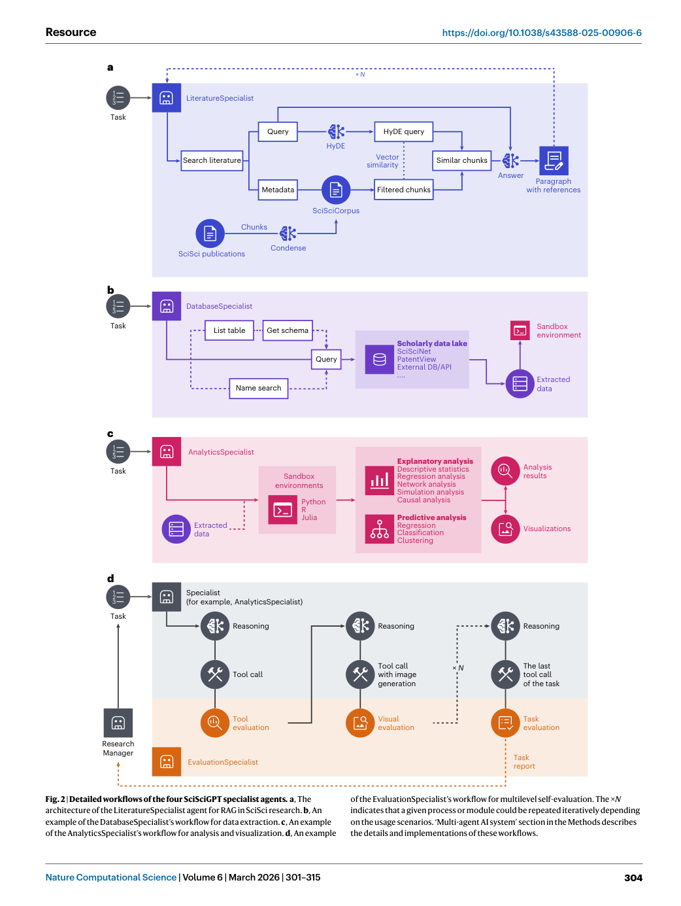
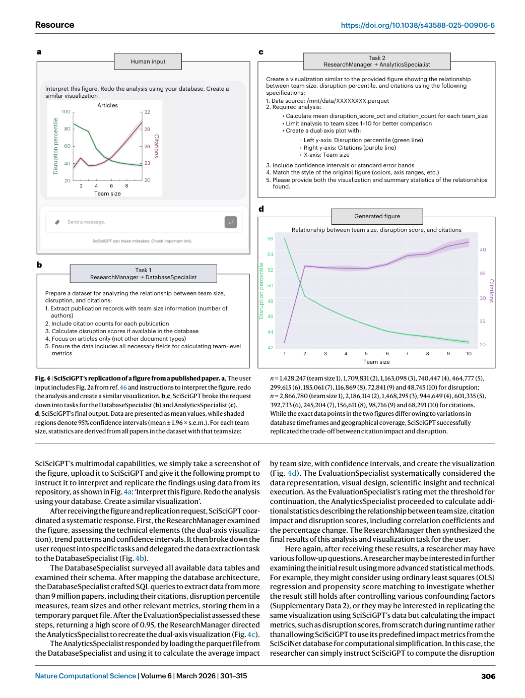
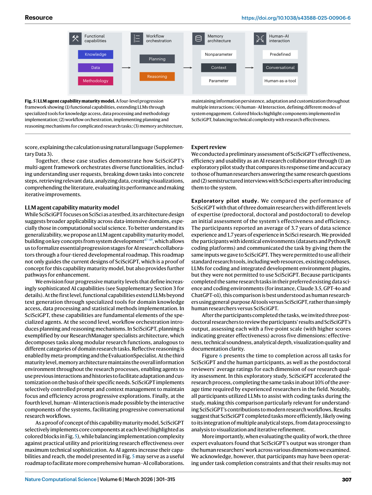

# Figure-by-figure analysis: SciSciGPT: advancing human-AI collaboration in the science of science

These are faithful full-page renders from the audited article copy. They are included to keep captions, axes, legends and neighbouring context visible. The Paper Card carries the quantitative interpretation and source pointers; a rendered page is not independent validation of the underlying claim.

## Figure 1 — faithful PDF page view

**What the page shows.** Figure 1 is embedded as an unchanged PDF page view. It contributes SciSciGPT system architecture. A diagram illustrating the modular design of SciSciGPT, an AI collaborator for SciSci. Users submit requests through a web chat interface to the ResearchManager agent, which breaks user requirements down into tasks and delegates them to the appropriate [Paper: PDF p. 2, Figure 1]

**Evidence role.** This page documents the reported workflow, comparison or result named in the caption and supports the corresponding source-grounded discussion in Sections 07-10 of the Paper Card.

**Boundary.** It does not by itself establish causal attribution to every module, external generalization, unrestricted autonomy, or deployment readiness. Those limits are separated in Sections 11-13.

**Reusable presentation lesson.** Preserve the original denominator, comparator, metric direction, uncertainty display and failure cases when adapting this figure type.

## Figure 2 — faithful PDF page view

**What the page shows.** Figure 2 is embedded as an unchanged PDF page view. It contributes Detailed workflows of the four SciSciGPT specialist agents. a, The architecture of the LiteratureSpecialist agent for RAG in SciSci research. b, An example of the DatabaseSpecialist’s workflow for data extraction. c, An example of the AnalyticsSpecialist’s workflow for analysis and visualization. d, An example [Paper: PDF p. 4, Figure 2]

**Evidence role.** This page documents the reported workflow, comparison or result named in the caption and supports the corresponding source-grounded discussion in Sections 07-10 of the Paper Card.

**Boundary.** It does not by itself establish causal attribution to every module, external generalization, unrestricted autonomy, or deployment readiness. Those limits are separated in Sections 11-13.

**Reusable presentation lesson.** Preserve the original denominator, comparator, metric direction, uncertainty display and failure cases when adapting this figure type.

## Figure 3 — faithful PDF page view

**What the page shows.** Figure 3 is embedded as an unchanged PDF page view. It contributes SciSciGPT’s visualization of Ivy League university collaborations. a–c, In response to the human input (a), the ResearchManager decomposed the request and then delegated the data extraction task (b) and visualization task (c) to the DatabaseSpecialist and AnalyticsSpecialist, respectively. [Paper: PDF p. 5, Figure 3]

**Evidence role.** This page documents the reported workflow, comparison or result named in the caption and supports the corresponding source-grounded discussion in Sections 07-10 of the Paper Card.

**Boundary.** It does not by itself establish causal attribution to every module, external generalization, unrestricted autonomy, or deployment readiness. Those limits are separated in Sections 11-13.

**Reusable presentation lesson.** Preserve the original denominator, comparator, metric direction, uncertainty display and failure cases when adapting this figure type.

## Figure 4 — faithful PDF page view

**What the page shows.** Figure 4 is embedded as an unchanged PDF page view. It contributes SciSciGPT’s replication of a figure from a published paper. a, The user input includes Fig. 2a from ref. 46 and instructions to interpret the figure, redo the analysis and create a similar visualization. b,c, SciSciGPT broke the request down into tasks for the DatabaseSpecialist (b) and AnalyticsSpecialist (c). [Paper: PDF p. 6, Figure 4]

**Evidence role.** This page documents the reported workflow, comparison or result named in the caption and supports the corresponding source-grounded discussion in Sections 07-10 of the Paper Card.

**Boundary.** It does not by itself establish causal attribution to every module, external generalization, unrestricted autonomy, or deployment readiness. Those limits are separated in Sections 11-13.

**Reusable presentation lesson.** Preserve the original denominator, comparator, metric direction, uncertainty display and failure cases when adapting this figure type.

## Figure 5 — faithful PDF page view

**What the page shows.** Figure 5 is embedded as an unchanged PDF page view. It contributes LLM agent capability maturity model. A four-level progression framework showing (1) functional capabilities, extending LLMs through specialized tools for knowledge access, data processing and methodology implementation; (2) workflow orchestration, implementing planning and [Paper: PDF p. 7, Figure 5]

**Evidence role.** This page documents the reported workflow, comparison or result named in the caption and supports the corresponding source-grounded discussion in Sections 07-10 of the Paper Card.

**Boundary.** It does not by itself establish causal attribution to every module, external generalization, unrestricted autonomy, or deployment readiness. Those limits are separated in Sections 11-13.

**Reusable presentation lesson.** Preserve the original denominator, comparator, metric direction, uncertainty display and failure cases when adapting this figure type.

## Figure 6 — faithful PDF page view

**What the page shows.** Figure 6 is embedded as an unchanged PDF page view. It contributes Exploratory research efficiency and effectiveness comparison. a, Time allocation across workflow components (data processing, analytics, visualization and LLM + web searching). b, Average postdoctoral evaluator workflow effectiveness rating on a five-point scale for each participant and SciSciGPT. [Paper: PDF p. 8, Figure 6]

**Evidence role.** This page documents the reported workflow, comparison or result named in the caption and supports the corresponding source-grounded discussion in Sections 07-10 of the Paper Card.

**Boundary.** It does not by itself establish causal attribution to every module, external generalization, unrestricted autonomy, or deployment readiness. Those limits are separated in Sections 11-13.

**Reusable presentation lesson.** Preserve the original denominator, comparator, metric direction, uncertainty display and failure cases when adapting this figure type.
