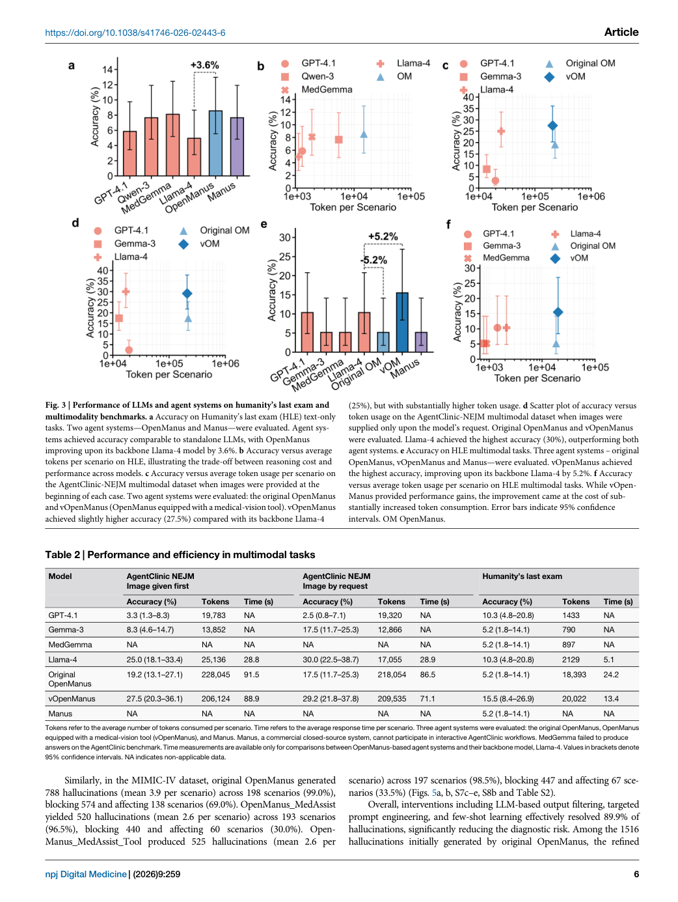
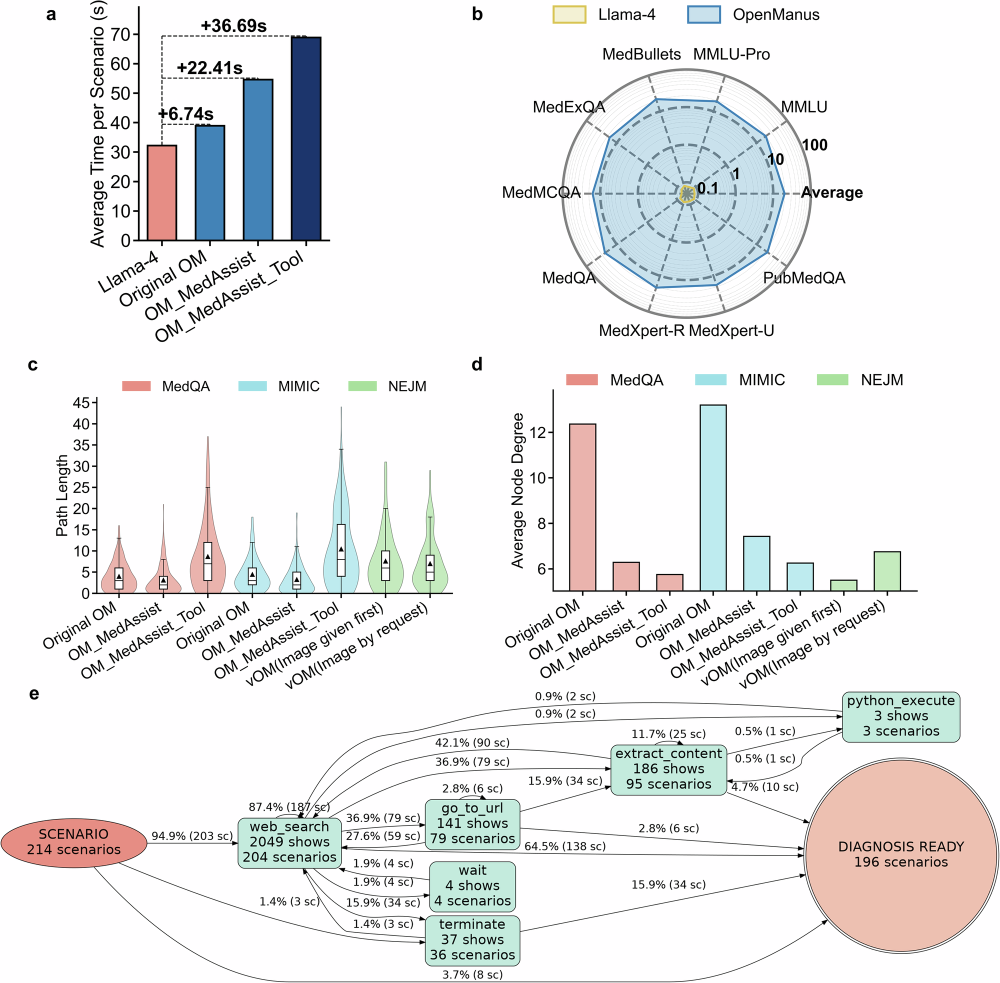
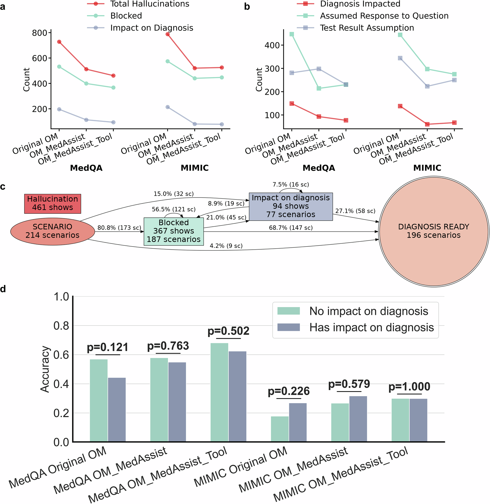

# Paper Card: Benchmarking large language model-based agent systems for clinical decision tasks

**Language: English**

> Source coverage: Full paper with five figures and two tables
>
> Extraction confidence: High
>
> Locator mode: page-grounded
>
> Primary analytical lens: Clinical evaluation
>
> Secondary analytical lens: Methods / benchmark
>
> Context verification: Official npj Digital Medicine article checked on 2026-08-07
>
> Card completeness: Complete relative to the main paper

## Terminology Ledger

| Term | Meaning | Boundary |
|---|---|---|
| OpenManus | Open Llama-4-based general agent framework | Medical-prompt and tool-encouraged variants are also tested |
| Manus | Proprietary planner–executor–verifier system | Internal details are incompletely observable |
| baseline LLM | Backbone without the agent workflow | Cost and process differ from the agent system |
| blocked hallucination | Unsupported content removed by a safeguard | Separate from errors that reach diagnosis |

## 01 Basic Information

- [Paper] Yunsong Liu, Zunamys I. Carrero, Xiaofeng Jiang et al.; *npj Digital Medicine* 9, 259 (2026), published 18 February 2026. [Paper: PDF p. 1]
- [Paper] DOI: [10.1038/s41746-026-02443-6](https://doi.org/10.1038/s41746-026-02443-6); CC BY 4.0. [Paper: PDF p. 12]
- [Paper] Compares five baseline LLMs, OpenManus variants, and proprietary Manus across AgentClinic, MedAgentsBench, and HLE. [Paper: PDF pp. 1–3]
- [Paper] Code and non-MIMIC data are public; MIMIC-IV requires PhysioNet access. [Paper: PDF p. 10]

## 02 One-Sentence Summary

[Analysis] Current general agent systems provide only modest accuracy gains across clinical-decision benchmarks while using >10× tokens and >2× latency and retaining hallucinations that can affect diagnosis, so outcome, resource use, and failure propagation must be evaluated together. [Paper: PDF pp. 1, 4–8, Figures 2–5]

## 03 Research Question

- [Paper] Are general agent systems more accurate than their baseline LLMs on clinical text and multimodal tasks? [Paper: PDF pp. 1–3]
- [Paper] Do medical prompts, tool encouragement, or a proprietary architecture improve outcomes? [Paper: PDF pp. 3–8]
- [Paper] Are gains worth token, time, workflow-complexity, and hallucination costs? [Paper: PDF pp. 4–8]

## 04 Research Background and Development Path

1. [Paper] Static medical QA scores are high, but complex dialogue and multimodal performance remain limited. [Paper: PDF pp. 1–2]
2. [Paper] Planning, tools, and multistep execution are proposed to close this gap. [Paper: PDF p. 2]
3. [Paper] This study compares endpoints and process cost across three benchmark families. [Paper: PDF pp. 2–3]
4. [Analysis] The question becomes whether the net clinical/engineering value is positive.

## 05 Core Pain Points Identified by the Paper

| Pain point | Manifestation | Evidence |
|---|---|---|
| Small, inconsistent gains | Most tasks change modestly | [Paper: PDF pp. 3–6, Figures 2–3] |
| High cost | >10× tokens, >2× latency | [Paper: PDF pp. 1, 7, Figure 4] |
| Null and incorrect differ | Different failure mechanisms | [Paper: PDF p. 4, Figure 2] |
| Hallucinations can be blocked or propagated | 89.9% filtered; some affect diagnosis | [Paper: PDF pp. 1, 8, Figure 5] |

## 06 Core Idea

- [Paper] Compare baselines and agent variants while recording accuracy, token use, time, workflow, and hallucination. [Paper: PDF p. 3, Figure 1]
- [Paper] Process complexity is a first-class evaluation endpoint. [Paper: PDF pp. 7–8]
- [Analysis] Separate failure occurrence, safeguard capture, and final-output exposure.

## 07 Method Overview

*Figure 1 declares compared systems, benchmark families, and four endpoint groups before presenting results. [Paper: PDF p. 3, Figure 1]*

Flow: baseline/agent configuration → AgentClinic, MedAgentsBench, HLE → text/multimodal tasks → correct/null/incorrect → token/time/workflow → hallucination occurrence, blocking, and diagnostic impact.

## 08 Core Module Breakdown

| Module | Function | Boundary |
|---|---|---|
| Baseline LLM | Non-agent reference | Total call budget differs |
| OpenManus | General planning/tool workflow | Llama-4-based |
| OM_MedAssist | Adds a medical prompt | Prompt and system effects mix |
| OM_MedAssist_Tool | Encourages tool calls | More tools do not ensure accuracy |
| Manus | Proprietary planner–executor–verifier | Strong reproducibility boundary |
| Hallucination filter | Removes unsupported content | Can miss diagnosis-impacting errors |

[Paper: PDF pp. 2–4, 8]

## 09 Essential Formulas and Symbols

- [Paper] Accuracy uses Wilson 95% CIs; overall comparisons use Cochran's Q and pairwise Holm-adjusted McNemar tests. [Paper: PDF p. 10]
- [Paper] Table 1 and Table 2 summarize performance and efficiency for text and multimodal tasks. [Paper: PDF pp. 5–6, Tables 1–2]
- No new formula is essential to the central conclusion.

## 10 Experimental Design and Evidence Chain

| Experiment | Result | Supported conclusion | Unsupported stronger conclusion |
|---|---|---|---|
| AgentClinic | Best agent 60.3% MedQA, 28.0% MIMIC | Selected configurations provide limited gain | Clinical diagnostic readiness |
| MedAgentsBench/HLE text | 30.3% and 8.6% | Hard-task accuracy remains low | Tools solve knowledge/reasoning limits |
| Multimodal | HLE 15.5%, AgentClinic NEJM 29.2% | Multimodal capability remains limited | Reliable image integration |
| Cost | >10× tokens, >2× latency | Gains carry substantial resource cost | Cost is negligible in deployment |
| Hallucination | 89.9% filtered, but some affect diagnosis | Safeguards reduce exposure, not risk to zero | 89.9% clinical safety rate |

[Paper: PDF pp. 1, 4–8, Figures 2–5]

*Figure 2 separates null from incorrect and places accuracy against token cost. [Paper: PDF p. 4, Figure 2]*

*Figure 3 shows small agent–baseline differences and low absolute performance on difficult tasks. [Paper: PDF p. 6, Figure 3]*

*Figure 4 explains latency through path length, graph complexity, and tool states. [Paper: PDF p. 7, Figure 4]*

*Figure 5 is the most reusable safety structure: occurrence, capture, and final impact are distinct. [Paper: PDF p. 8, Figure 5]*

## 11 Correct Interpretation of the Conclusions

- [Paper] These are public/simulated benchmarks, not real clinical deployment. [Paper: PDF pp. 2–3]
- [Paper] OpenManus and Manus differ in backbone, architecture, and observability; this is not a pure architecture ablation. [Paper: PDF pp. 2–3]
- [Paper] Filtering a hallucination does not make the original agent reliable; diagnosis-impacting leakage remains relevant. [Paper: PDF p. 8]
- [Analysis] The paper supports limited current net benefit, not a claim that all future clinical agents will fail.

## 12 Limitations Explicitly Acknowledged by the Authors

| Limitation | Manifestation | Source |
|---|---|---|
| Benchmark–clinic gap | Mostly public/simulated tasks | [Paper: PDF p. 9] |
| Proprietary reproducibility | Manus internals are incomplete | [Paper: PDF pp. 2, 9] |
| Rapid system evolution | Version-specific results can age | [Paper: PDF p. 9] |
| Platform-dependent cost | Token/latency may not transport | [Paper: PDF pp. 7, 9] |

## 13 Critical Analysis

| [Analysis] Observation | Risk | Test |
|---|---|---|
| Baseline and agent differ in model/prompt/tools | Effect sources mix | Same-backbone, same-prompt, same-tool, same-budget ablation |
| Hallucination taxonomy depends on rules/review | Misses and drift | Blinded dual-expert review with preregistered taxonomy |
| Accuracy–cost still lacks clinical utility | Small gain may not justify human burden | Add review time, harm severity, and net-benefit analysis |

## 14 Knowledge Learned

- Agent-derived knowledge candidate: report correct, incorrect, and no-output composition.
- Agent-derived knowledge candidate: pair ranking with an accuracy–cost plot.
- Agent-derived knowledge candidate: use a state flow to show where safeguards capture failures.

## 15 Connections to related research

[Analysis] This paper can inform evidence organization and figure design in related research; its tasks, data, metrics and conclusions cannot be transferred directly to other application domains.

## 16 Open questions

[Analysis] Future work should validate the reported method on independent datasets and report uncertainty, failure cases, and distribution shifts transparently.
