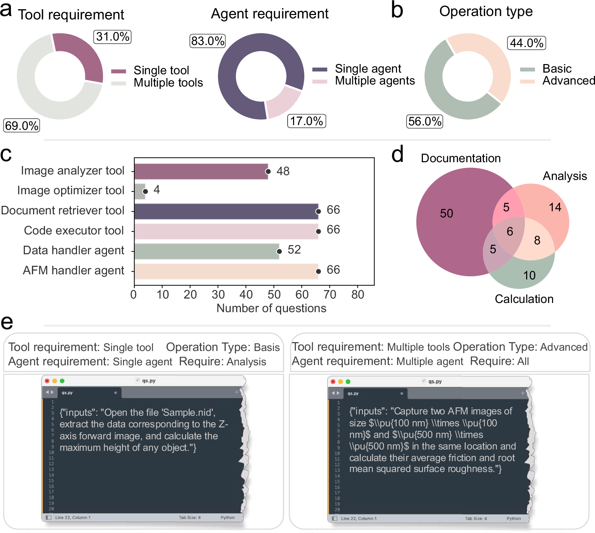
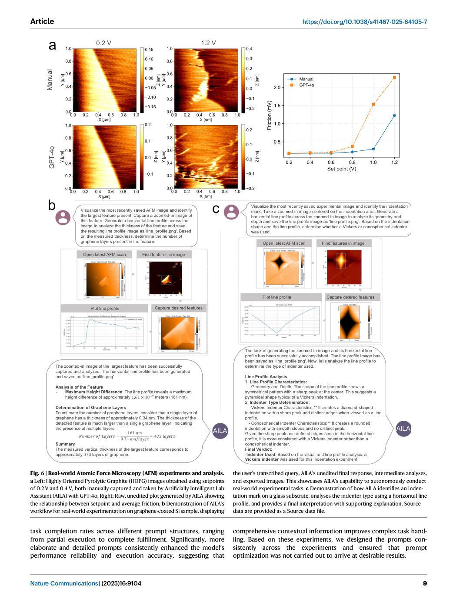

# Paper Card: Evaluating large language model agents for automation of atomic force microscopy (AFMBench / AILA)

**Language: English**

> Source coverage: Full main paper with six figures and main-text equations
>
> Extraction confidence: High; equation text extraction was incomplete and checked against the PDF pages
>
> Locator mode: page-grounded
>
> Primary analytical lens: Laboratory-agent benchmark
>
> Secondary analytical lens: Safety, coordination, and real experiments
>
> Context verification: Official Nature Communications page checked on 2026-08-07
>
> Card completeness: Complete relative to the main paper

## Terminology Ledger

| Term | Meaning | Boundary |
|---|---|---|
| AILA | Artificially Intelligent Lab Assistant | Multi-agent tool framework for atomic force microscopy |
| AFMBench | 100 expert-curated AFM tasks | Tests workflow execution, not general materials QA |
| sleepwalking | Continuing in a way that deviates from explicit instructions | Treated as a safety-alignment risk |
| multi-agent | AFM Handler and Data Handler coordination | Performance depends on model and prompt structure |

## 01 Basic Information

- [Paper] Indrajeet Mandal et al.; *Nature Communications* 16, 9104 (2025), published 14 October 2025. [Paper: PDF p. 1]
- [Paper] DOI: [10.1038/s41467-025-64105-7](https://doi.org/10.1038/s41467-025-64105-7); the paper states CC BY 4.0. [Paper: PDF p. 15]
- [Paper] Introduces AILA and AFMBench for the complete AFM workflow from experimental design to analysis. [Paper: PDF pp. 1–3]
- [Paper] Compares GPT-4o, GPT-3.5-turbo-0125, Claude-3.5-sonnet-20241022, and Llama-3.3-70B-versatile at temperature zero. [Paper: PDF pp. 3, 11]

## 02 One-Sentence Summary

[Analysis] AFMBench shows that materials-QA ability does not imply laboratory execution: all four models fail on multi-tool, cross-domain, or safety-relevant tasks, GPT-4o's multi-agent configuration performs best but remains prompt-sensitive, and the real experiments are controlled proof-of-concept demonstrations. [Paper: PDF pp. 1, 3–10; Figures 1–6]

## 03 Research Question

- [Paper] Can LLM agents perform AFM workflows spanning documentation, calculation, analysis, and instrument control? [Paper: PDF pp. 1–3]
- [Paper] How do single- and multi-agent architectures differ on coordination tasks? [Paper: PDF pp. 5–6]
- [Paper] Which errors and instruction deviations limit reliability and safety in self-driving laboratories? [Paper: PDF pp. 6–7]
- [Paper] Can AILA perform parameter optimization, friction measurement, and sample analysis on a real AFM? [Paper: PDF pp. 8–10]

## 04 Research Background and Development Path

1. [Paper] Existing automated laboratories rely on rigid protocols and miss expert adaptation in dynamic experiments. [Paper: PDF pp. 1–2]
2. [Paper] Materials-science LLM benchmarks are mainly QA and omit instrument execution, tool coordination, and online intervention. [Paper: PDF p. 2]
3. [Paper] AILA combines AFM Handler, Data Handler, document retrieval, code execution, and image tools through shared state. [Paper: PDF pp. 2, 11–13]
4. [Paper] AFMBench uses 100 tasks to cover design, coordination, decision-making, open-ended experiments, and analysis. [Paper: PDF pp. 1–3]

## 05 Core Pain Points Identified by the Paper

| Pain point | Manifestation | Evidence |
|---|---|---|
| Knowledge does not ensure execution | Claude's materials-benchmark advantage does not transfer | [Paper: PDF p. 4, Figure 3] |
| Cross-domain coordination is weak | Performance drops sharply; some models score zero | [Paper: PDF pp. 3–5, Figure 3] |
| Instruction adherence is unstable | Sleepwalking occurs | [Paper: PDF pp. 1, 6–7, Figure 4] |
| Prompt format affects outcome | Small structural changes alter completion | [Paper: PDF pp. 6, 9, 14] |
| Critical instrument actions are risky | Calibration functions remain human-only | [Paper: PDF p. 7] |

## 06 Core Idea

- [Paper] Evaluate laboratory agents using executable experiments rather than static QA. [Paper: PDF pp. 1–3]
- [Paper] Record success, agent/tool calls, tokens, latency, error type, and prompt sensitivity together. [Paper: PDF pp. 3–7, 14]
- [Paper] Connect benchmark findings to controlled real-AFM demonstrations. [Paper: PDF pp. 8–10]
- [Analysis] The narrative is coverage → model comparison → failure mechanism → architecture ablation → physical validation.

## 07 Method Overview

*Figure 1 places agents, tools, hardware, shared state, and a real trajectory in one workflow figure. [Paper: PDF p. 2, Figure 1]*

Flow: user task → supervisor/routing → AFM Handler or Data Handler → document/code/image/instrument tool → shared state → final result or continued coordination.

## 08 Core Module Breakdown

| Module | Function | Boundary |
|---|---|---|
| AFM Handler | Controls general AFM operations | Critical calibration functions are unavailable |
| Data Handler | Processes images, statistics, and plots | Dynamic code still needs safeguards |
| Document Retriever | Searches controlled instrument documents | Document scope constrains actions |
| Code Executor | Runs analysis code | Correct code does not ensure correct interpretation |
| Image tools | Segment, scan, and optimize images | Text LLMs depend on tool observations |
| Shared memory / LangGraph | Coordinates agent state | Framework and prompt both affect results |

## 09 Essential Formulas and Symbols

- [Paper] SSIM compares trace/retrace image quality and is optimized during PID tuning; the reported optimum reaches SSIM=0.818. [Paper: PDF p. 8, Figure 5]
- [Paper] Later methods pages define average friction, mean roughness, and RMS roughness; average friction uses the difference between forward and backward friction arrays. [Paper: PDF p. 13]
- [Extraction boundary] The source bundle flags Equation 1, Equation 2, Equation 3, Equation 4, Equation 5, and Equation 6, but their extracted text fields are empty. This card does not invent their verbatim forms; users should inspect the corresponding PDF methods pages before reuse. [Paper: PDF pp. 12–13]

## 10 Dataset and Evaluation Design

- [Paper] AFMBench has 100 expert-curated tasks spanning workflow design, multi-tool coordination, decision-making, open-ended experiments, and analysis. [Paper: PDF pp. 1–3]
- [Paper] The tasks are 69% multi-tool versus 31% single-tool, 83% single-agent versus 17% multi-agent, and 56% basic versus 44% advanced. [Paper: PDF pp. 2–3, Figure 2]
- [Paper] Functional domains include 50 standalone documentation, 14 analysis, and 10 calculation tasks plus intersections. [Paper: PDF p. 3, Figure 2]
- [Paper] The architecture ablation uses ten representative questions with three independent trials per question. [Paper: PDF p. 6]
- [Paper] Real experiments include PID optimization, load-dependent friction, graphene-layer analysis, and indenter-type analysis. [Paper: PDF pp. 8–10, Figures 5–6]

## 11 Main Results

*Figure 2 is a direct example of describing the entire benchmark in one figure: it declares task composition before model outcomes. [Paper: PDF p. 3, Figure 2]*

*Figure 3 combines domain and cross-domain accuracy with tokens, latency, complexity, and agent/tool strata. [Paper: PDF pp. 3–5, Figure 3]*

- [Paper] GPT-4o reaches 88.3% on documentation, 33.3% on analysis, and 56.7% on calculation; cross-domain performance is lower. [Paper: PDF pp. 3–4, Figure 3]
- [Paper] Overall task completion is about 65% for GPT-4o and 32.8% for GPT-3.5; Claude has the highest mean latency at 17.31 s and Llama the lowest at about 7 s. [Paper: PDF p. 5, Figure 3]
- [Paper] In the ten-question ablation, GPT-4o reaches 70% in multi-agent versus 58% with direct single-agent tool integration. [Paper: PDF p. 6]

*Figure 4 elevates instruction adherence, tool use, calculation, and other failure types into a main result. [Paper: PDF p. 6, Figure 4]*

*Figure 5 traces parameter iteration, SSIM convergence, and final image quality in a controlled closed loop. [Paper: PDF p. 8, Figure 5]*

*Figure 6 juxtaposes manual and AILA acquisition/analysis, but it is proof of concept rather than large external validation. [Paper: PDF pp. 9–10, Figure 6]*

## 12 Authors' Discussion and Interpretation

- [Paper] Strong materials-QA performance need not transfer to interactive experiments, so knowledge and execution require separate evaluation. [Paper: PDF pp. 4, 6]
- [Paper] Multi-agent coordination helps models capable of complex reasoning, while single-agent implementations can be computationally cheaper. [Paper: PDF p. 6]
- [Paper] More complete prompts generally improve complex-task reliability; the authors state that prompts were not optimized experiment by experiment to obtain desirable outcomes. [Paper: PDF pp. 9, 14]

## 13 Author-Stated Limitations, Risks, and Open Questions

- [Author risk] Sleepwalking shows that ethical prompting does not guarantee instruction adherence. [Paper: PDF pp. 1, 6–7]
- [Author safety boundary] Factory, laser, piezo, and thermal calibration remain inaccessible to AILA and restricted to trained experts. [Paper: PDF p. 7]
- [Author observation] Performance is sensitive to prompt structure and signaling phrases; it is not a stable property of model name alone. [Paper: PDF pp. 6, 9, 14]
- [Analysis limitation] One 100-task suite and one AFM system do not establish cross-instrument or cross-laboratory generalization.
- [Analysis limitation] Figures 5–6 establish feasibility under controlled conditions, not general autonomous-laboratory safety or reliability.

## 14 Reusable Figure and Benchmark Patterns

1. Figure 1: combine system architecture with an actual execution trajectory.
2. Figure 2: declare the complete benchmark composition using coordinated pies and bars.
3. Figure 3: stratify accuracy by domain, complexity, agent count, and tool count while also reporting cost.
4. Figure 4: make failure modes a standalone main result.
5. Figures 5–6: bridge benchmark evidence to physical-device validation with an explicit proof-of-concept boundary.

## 15 Connections to related research

[Analysis] This paper can inform evidence organization and figure design in related research; its tasks, data, metrics and conclusions cannot be transferred directly to other application domains.

## 16 Open questions

[Analysis] Future work should validate the reported method on independent datasets and report uncertainty, failure cases, and distribution shifts transparently.
