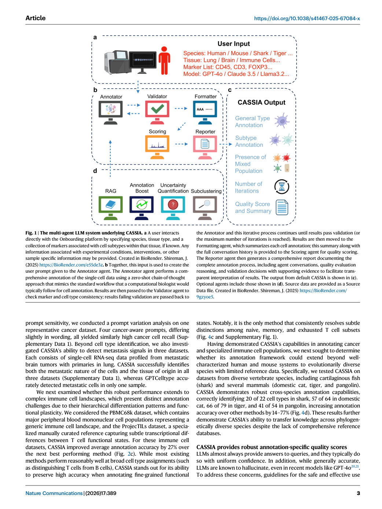
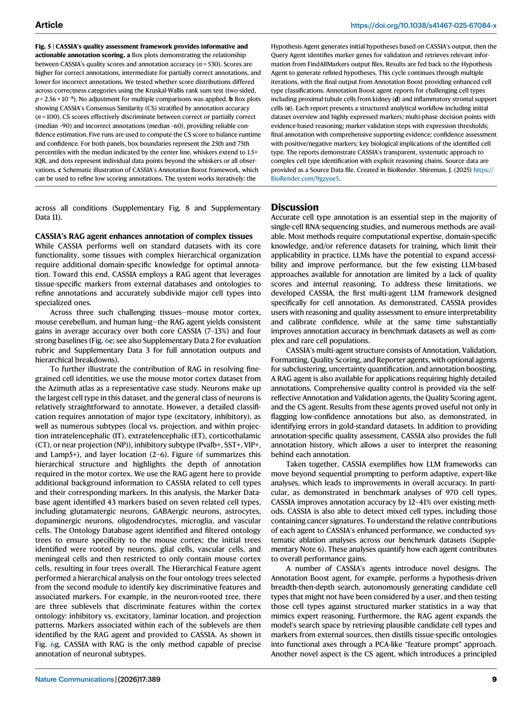
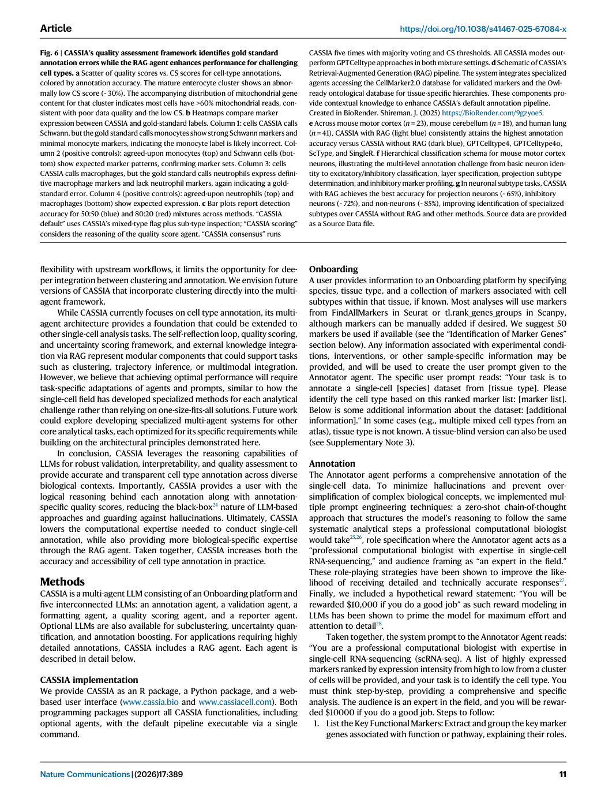

# Figure-by-figure analysis: CASSIA: a multi-agent large language model for automated and interpretable cell annotation

These are faithful full-page renders from the audited article copy. They are included to keep captions, axes, legends and neighbouring context visible. The Paper Card carries the quantitative interpretation and source pointers; a rendered page is not independent validation of the underlying claim.

## Figure 1 — faithful PDF page view

**What the page shows.** Figure 1 is embedded as an unchanged PDF page view. It contributes The multi-agent LLM system underlying CASSIA. a A user interacts directly with the Onboarding platform by specifying species, tissue type, and a collection of markers associated with cell subtypes within that tissue, if known. Any information associated with experimental conditions, interventions, or other [Paper: PDF p. 3, Figure 1]

**Evidence role.** This page documents the reported workflow, comparison or result named in the caption and supports the corresponding source-grounded discussion in Sections 07-10 of the Paper Card.

**Boundary.** It does not by itself establish causal attribution to every module, external generalization, unrestricted autonomy, or deployment readiness. Those limits are separated in Sections 11-13.

**Reusable presentation lesson.** Preserve the original denominator, comparator, metric direction, uncertainty display and failure cases when adapting this figure type.

## Figure 2 — faithful PDF page view

**What the page shows.** Figure 2 is embedded as an unchanged PDF page view. It contributes CASSIA improves annotation accuracy in five benchmark datasets, on complex populations of cells from immune and cancer cell populations, and on rare cell types. a Fully correct annotation rates across 8 datasets where CASSIA (blue) increases annotation accuracy by 12–41% over the next best performing [Paper: PDF p. 5, Figure 2]

**Evidence role.** This page documents the reported workflow, comparison or result named in the caption and supports the corresponding source-grounded discussion in Sections 07-10 of the Paper Card.

**Boundary.** It does not by itself establish causal attribution to every module, external generalization, unrestricted autonomy, or deployment readiness. Those limits are separated in Sections 11-13.

**Reusable presentation lesson.** Preserve the original denominator, comparator, metric direction, uncertainty display and failure cases when adapting this figure type.

## Figure 3 — faithful PDF page view

**What the page shows.** Figure 3 is embedded as an unchanged PDF page view. It contributes CASSIA analysis report for a cell cluster from a colorectal cancer dataset. a The report presents a comprehensive analysis including functional and cell type marker identification, database cross-referencing, cell type determination, and subtype classification. The validation section confirms marker consistency and [Paper: PDF p. 5, Figure 3]

**Evidence role.** This page documents the reported workflow, comparison or result named in the caption and supports the corresponding source-grounded discussion in Sections 07-10 of the Paper Card.

**Boundary.** It does not by itself establish causal attribution to every module, external generalization, unrestricted autonomy, or deployment readiness. Those limits are separated in Sections 11-13.

**Reusable presentation lesson.** Preserve the original denominator, comparator, metric direction, uncertainty display and failure cases when adapting this figure type.

## Figure 4 — faithful PDF page view

**What the page shows.** Figure 4 is embedded as an unchanged PDF page view. It contributes CASSIA outperforms competing methods in annotating complex bio- logical datasets including cancer, immune cells, and rare species. a UMAP visualizations of cancer cell classifications in brain metastasis samples. Left: Gold standard annotations showing cancer cells (red) and non-cancer cells (blue). CAS- [Paper: PDF p. 7, Figure 4]

**Evidence role.** This page documents the reported workflow, comparison or result named in the caption and supports the corresponding source-grounded discussion in Sections 07-10 of the Paper Card.

**Boundary.** It does not by itself establish causal attribution to every module, external generalization, unrestricted autonomy, or deployment readiness. Those limits are separated in Sections 11-13.

**Reusable presentation lesson.** Preserve the original denominator, comparator, metric direction, uncertainty display and failure cases when adapting this figure type.

## Figure 5 — faithful PDF page view

**What the page shows.** Figure 5 is embedded as an unchanged PDF page view. It contributes CASSIA’s quality assessment framework provides informative and actionable annotation scoring. a Box plots demonstrating the relationship between CASSIA’s quality scores and annotation accuracy (n = 530). Scores are higher for correct annotations, intermediate for partially correct annotations, and [Paper: PDF p. 9, Figure 5]

**Evidence role.** This page documents the reported workflow, comparison or result named in the caption and supports the corresponding source-grounded discussion in Sections 07-10 of the Paper Card.

**Boundary.** It does not by itself establish causal attribution to every module, external generalization, unrestricted autonomy, or deployment readiness. Those limits are separated in Sections 11-13.

**Reusable presentation lesson.** Preserve the original denominator, comparator, metric direction, uncertainty display and failure cases when adapting this figure type.

## Figure 6 — faithful PDF page view

**What the page shows.** Figure 6 is embedded as an unchanged PDF page view. It contributes CASSIA’s quality assessment framework identifies gold standard annotation errors while the RAG agent enhances performance for challenging cell types. a Scatter of quality scores vs. CS scores for cell-type annotations, colored by annotation accuracy. The mature enterocyte cluster shows an abnor- [Paper: PDF p. 11, Figure 6]

**Evidence role.** This page documents the reported workflow, comparison or result named in the caption and supports the corresponding source-grounded discussion in Sections 07-10 of the Paper Card.

**Boundary.** It does not by itself establish causal attribution to every module, external generalization, unrestricted autonomy, or deployment readiness. Those limits are separated in Sections 11-13.

**Reusable presentation lesson.** Preserve the original denominator, comparator, metric direction, uncertainty display and failure cases when adapting this figure type.
