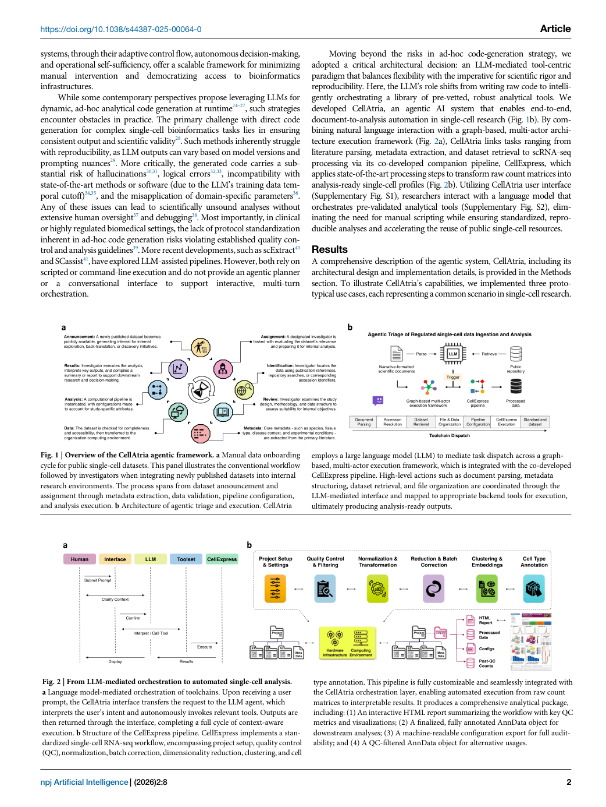

# Figure Analysis: An agentic AI framework for ingestion and standardization of single-cell RNA-seq data analysis

This companion analyses the source visuals embedded in the English Paper Card. Assets are unchanged PDF page views; no figure was regenerated.

## Figure 1

- **Argumentative role:** Overview of the CellAtria agentic framework. a Manual data onboarding cycle for public single-cell datasets. This panel illustrates the conventional workflow followed by investigators when integrating newly published datasets into internal research environments. The process spans from dataset announcement and
- **Panel / visual logic:** Read the panel labels, axes, legends, and uncertainty marks before comparing conditions. The page view is retained so the full caption and neighbouring interpretation remain visible.
- **Reusable design:** Preserve a one-to-one mapping among workflow stage, comparison, metric, and claim.
- **Boundary:** This visual supports only the conditions and endpoints stated in the source; it does not establish transfer beyond the evaluated setting.
- **Locator:** [Paper: PDF p. 2, Figure 1]

## Figure 2

- **Argumentative role:** From LLM‑mediated orchestration to automated single‑cell analysis. a Language model-mediated orchestration of toolchains. Upon receiving a user prompt, the CellAtria interface transfers the request to the LLM agent, which interprets the user’s intent and autonomously invokes relevant tools. Outputs are
- **Panel / visual logic:** Read the panel labels, axes, legends, and uncertainty marks before comparing conditions. The page view is retained so the full caption and neighbouring interpretation remain visible.
- **Reusable design:** Preserve a one-to-one mapping among workflow stage, comparison, metric, and claim.
- **Boundary:** This visual supports only the conditions and endpoints stated in the source; it does not establish transfer beyond the evaluated setting.
- **Locator:** [Paper: PDF p. 2, Figure 2]

## Cross-figure reading rule

Read workflow figures before performance figures, then connect every visual comparison to its metric, evaluation population, and claim boundary. Visual density is evidence organisation, not independent proof of generality.