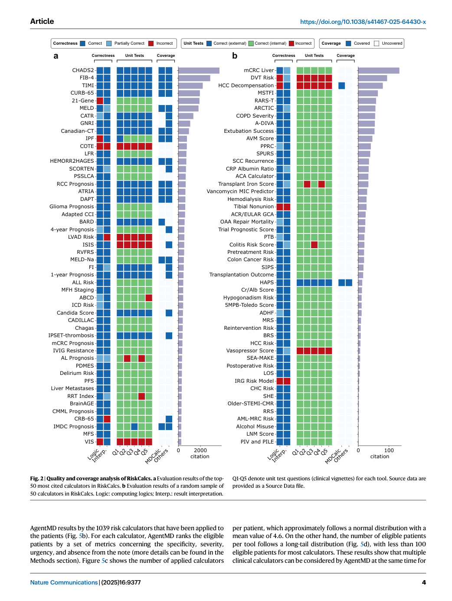
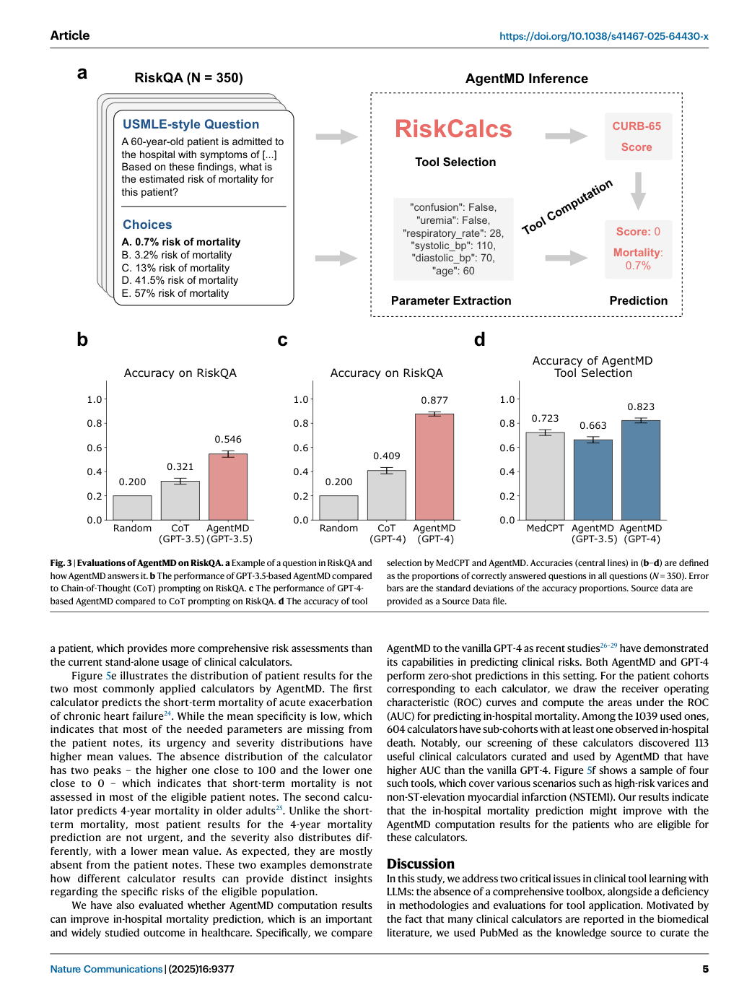

# Figure Analysis: AgentMD: Empowering language agents for risk prediction with large-scale clinical tool learning

This companion analyses the source visuals embedded in the English Paper Card. Assets are unchanged PDF page views; no figure was regenerated.

## Figure 1

- **Argumentative role:** Overview of AgentMD tool curation and using. a An example clinical calculator in the RiskCalcs toolkit curated by AgentMD, based on the title and abstract of a PubMed article on the CURB-65 risk score (PMID: 12728155). b The methodology of the AgentMD tool using, which includes tool selection, tool
- **Panel / visual logic:** Read the panel labels, axes, legends, and uncertainty marks before comparing conditions. The page view is retained so the full caption and neighbouring interpretation remain visible.
- **Reusable design:** Preserve a one-to-one mapping among workflow stage, comparison, metric, and claim.
- **Boundary:** This visual supports only the conditions and endpoints stated in the source; it does not establish transfer beyond the evaluated setting.
- **Locator:** [Paper: PDF p. 2, Figure 1]

## Figure 2

- **Argumentative role:** Quality and coverage analysis of RiskCalcs. a Evaluation results of the top- 50 most cited calculators in RiskCalcs. b Evaluation results of a random sample of 50 calculators in RiskCalcs. Logic: computing logics; Interp.: result interpretation. Q1-Q5 denote unit test questions (clinical vignettes) for each tool. Source data are
- **Panel / visual logic:** Read the panel labels, axes, legends, and uncertainty marks before comparing conditions. The page view is retained so the full caption and neighbouring interpretation remain visible.
- **Reusable design:** Preserve a one-to-one mapping among workflow stage, comparison, metric, and claim.
- **Boundary:** This visual supports only the conditions and endpoints stated in the source; it does not establish transfer beyond the evaluated setting.
- **Locator:** [Paper: PDF p. 4, Figure 2]

## Figure 3

- **Argumentative role:** Evaluations of AgentMD on RiskQA. a Example of a question in RiskQA and how AgentMD answers it. b The performance of GPT-3.5-based AgentMD compared to Chain-of-Thought (CoT) prompting on RiskQA. c The performance of GPT-4- based AgentMD compared to CoT prompting on RiskQA. d The accuracy of tool
- **Panel / visual logic:** Read the panel labels, axes, legends, and uncertainty marks before comparing conditions. The page view is retained so the full caption and neighbouring interpretation remain visible.
- **Reusable design:** Preserve a one-to-one mapping among workflow stage, comparison, metric, and claim.
- **Boundary:** This visual supports only the conditions and endpoints stated in the source; it does not establish transfer beyond the evaluated setting.
- **Locator:** [Paper: PDF p. 5, Figure 3]

## Figure 4

- **Argumentative role:** Individual-level evaluation results on the emergency department provider notes. a AgentMD is applied to emergency department provider notes from Yale Medicine with a toolkit of 16 commonly used calculators. For each cal- culator, the patients are then ranked by the overall risk, and the top 5 patients are
- **Panel / visual logic:** Read the panel labels, axes, legends, and uncertainty marks before comparing conditions. The page view is retained so the full caption and neighbouring interpretation remain visible.
- **Reusable design:** Preserve a one-to-one mapping among workflow stage, comparison, metric, and claim.
- **Boundary:** This visual supports only the conditions and endpoints stated in the source; it does not establish transfer beyond the evaluated setting.
- **Locator:** [Paper: PDF p. 6, Figure 4]

## Figure 5

- **Argumentative role:** Applying AgentMD on the MIMIC-III cohort. a AgentMD is applied to 9822 admission notes in MIMIC. b AgentMD calculation results are aggregated by the risk calculators, and patients are ranked within each tool. c The distribution of the number of selected calculators for each patient. d The distribution of the number of
- **Panel / visual logic:** Read the panel labels, axes, legends, and uncertainty marks before comparing conditions. The page view is retained so the full caption and neighbouring interpretation remain visible.
- **Reusable design:** Preserve a one-to-one mapping among workflow stage, comparison, metric, and claim.
- **Boundary:** This visual supports only the conditions and endpoints stated in the source; it does not establish transfer beyond the evaluated setting.
- **Locator:** [Paper: PDF p. 7, Figure 5]

## Cross-figure reading rule

Read workflow figures before performance figures, then connect every visual comparison to its metric, evaluation population, and claim boundary. Visual density is evidence organisation, not independent proof of generality.