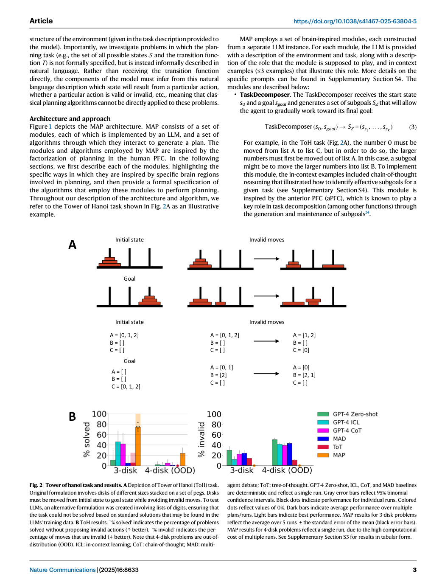
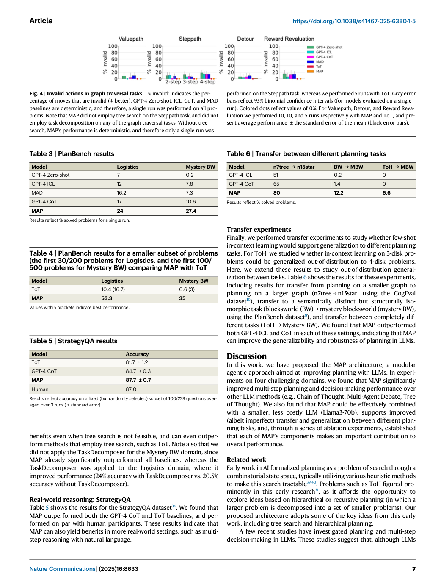

# Figure Analysis: A brain-inspired agentic architecture to improve planning with LLMs

This companion analyses the source visuals embedded in the English Paper Card. Assets are unchanged PDF page views; no figure was regenerated.

## Figure 1

- **Argumentative role:** Modular agentic planner (MAP). The agent receives states from the environment and high-level goals. These are processed by a set of specialized LLM modules. The Task Decomposer receives the current state and a high-level goal and generates a series of subgoals. The Actor generates proposed actions given a state
- **Panel / visual logic:** Read the panel labels, axes, legends, and uncertainty marks before comparing conditions. The page view is retained so the full caption and neighbouring interpretation remain visible.
- **Reusable design:** Preserve a one-to-one mapping among workflow stage, comparison, metric, and claim.
- **Boundary:** This visual supports only the conditions and endpoints stated in the source; it does not establish transfer beyond the evaluated setting.
- **Locator:** [Paper: PDF p. 2, Figure 1]

## Figure 2

- **Argumentative role:** Tower of hanoi task and results. A Depiction of Tower of Hanoi (ToH) task. Original formulation involves disks of different sizes stacked on a set of pegs. Disks must be moved from initial state to goal state while avoiding invalid moves. To test LLMs, an alternative formulation was created involving lists of digits, ensuring that
- **Panel / visual logic:** Read the panel labels, axes, legends, and uncertainty marks before comparing conditions. The page view is retained so the full caption and neighbouring interpretation remain visible.
- **Reusable design:** Preserve a one-to-one mapping among workflow stage, comparison, metric, and claim.
- **Boundary:** This visual supports only the conditions and endpoints stated in the source; it does not establish transfer beyond the evaluated setting.
- **Locator:** [Paper: PDF p. 3, Figure 2]

## Figure 3

- **Argumentative role:** Graph traversal tasks and results. A Graph traversal tasks. Steppath: Agent must identify the shortest path from a start state to a goal state. Valuepath: Agent must identify the shortest path from a start state to the state with the largest reward, while avoiding the state with the smaller reward. B Graph traversal results.
- **Panel / visual logic:** Read the panel labels, axes, legends, and uncertainty marks before comparing conditions. The page view is retained so the full caption and neighbouring interpretation remain visible.
- **Reusable design:** Preserve a one-to-one mapping among workflow stage, comparison, metric, and claim.
- **Boundary:** This visual supports only the conditions and endpoints stated in the source; it does not establish transfer beyond the evaluated setting.
- **Locator:** [Paper: PDF p. 5, Figure 3]

## Figure 4

- **Argumentative role:** Invalid actions in graph traversal tasks. % invalid' indicates the per­ centage of moves that are invalid (↓ better). GPT-4 Zero-shot, ICL, CoT, and MAD baselines are deterministic, and therefore, a single run was performed on all pro­ blems. Note that MAP did not employ tree search on the Steppath task, and did not
- **Panel / visual logic:** Read the panel labels, axes, legends, and uncertainty marks before comparing conditions. The page view is retained so the full caption and neighbouring interpretation remain visible.
- **Reusable design:** Preserve a one-to-one mapping among workflow stage, comparison, metric, and claim.
- **Boundary:** This visual supports only the conditions and endpoints stated in the source; it does not establish transfer beyond the evaluated setting.
- **Locator:** [Paper: PDF p. 7, Figure 4]

## Cross-figure reading rule

Read workflow figures before performance figures, then connect every visual comparison to its metric, evaluation population, and claim boundary. Visual density is evidence organisation, not independent proof of generality.