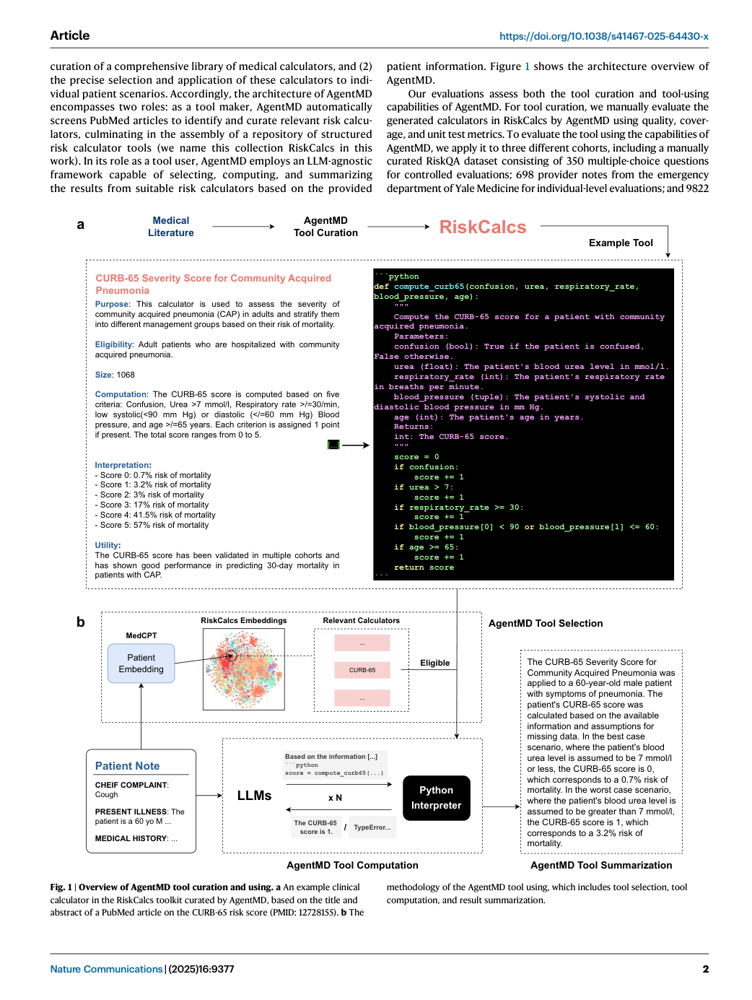
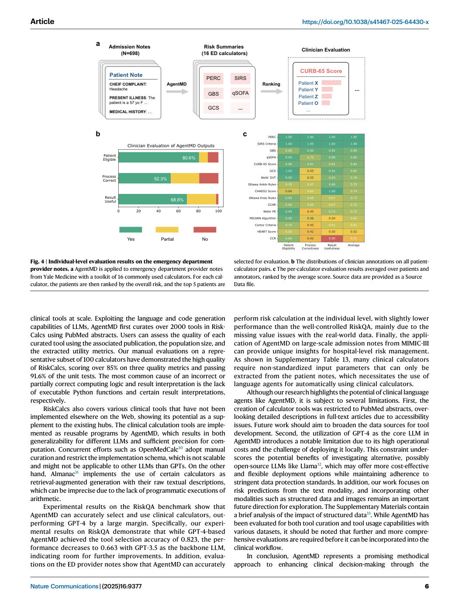
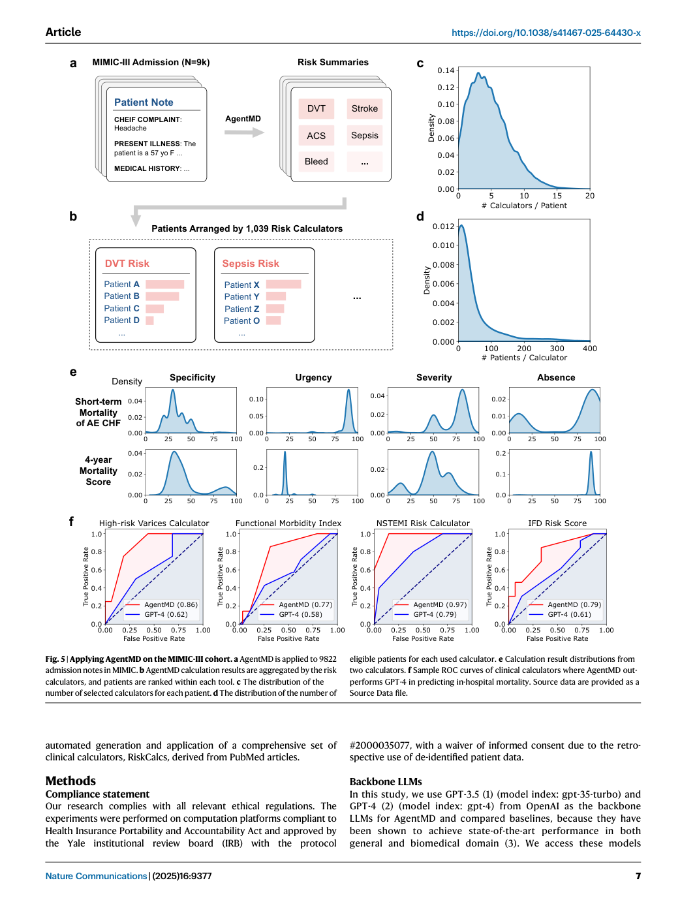

# Figure-by-figure analysis: AgentMD: Empowering language agents for risk prediction with large-scale clinical tool learning

These are faithful full-page renders from the audited article copy. They are included to keep captions, axes, legends and neighbouring context visible. The Paper Card carries the quantitative interpretation and source pointers; a rendered page is not independent validation of the underlying claim.

## Figure 1 — faithful PDF page view

**What the page shows.** Figure 1 is embedded as an unchanged PDF page view. It contributes Overview of AgentMD tool curation and using. a An example clinical calculator in the RiskCalcs toolkit curated by AgentMD, based on the title and abstract of a PubMed article on the CURB-65 risk score (PMID: 12728155). b The methodology of the AgentMD tool using, which includes tool selection, tool [Paper: PDF p. 2, Figure 1]

**Evidence role.** This page documents the reported workflow, comparison or result named in the caption and supports the corresponding source-grounded discussion in Sections 07-10 of the Paper Card.

**Boundary.** It does not by itself establish causal attribution to every module, external generalization, unrestricted autonomy, or deployment readiness. Those limits are separated in Sections 11-13.

**Reusable presentation lesson.** Preserve the original denominator, comparator, metric direction, uncertainty display and failure cases when adapting this figure type.

## Figure 2 — faithful PDF page view

**What the page shows.** Figure 2 is embedded as an unchanged PDF page view. It contributes Quality and coverage analysis of RiskCalcs. a Evaluation results of the top- 50 most cited calculators in RiskCalcs. b Evaluation results of a random sample of 50 calculators in RiskCalcs. Logic: computing logics; Interp.: result interpretation. Q1-Q5 denote unit test questions (clinical vignettes) for each tool. Source data are [Paper: PDF p. 4, Figure 2]

**Evidence role.** This page documents the reported workflow, comparison or result named in the caption and supports the corresponding source-grounded discussion in Sections 07-10 of the Paper Card.

**Boundary.** It does not by itself establish causal attribution to every module, external generalization, unrestricted autonomy, or deployment readiness. Those limits are separated in Sections 11-13.

**Reusable presentation lesson.** Preserve the original denominator, comparator, metric direction, uncertainty display and failure cases when adapting this figure type.

## Figure 3 — faithful PDF page view

**What the page shows.** Figure 3 is embedded as an unchanged PDF page view. It contributes Evaluations of AgentMD on RiskQA. a Example of a question in RiskQA and how AgentMD answers it. b The performance of GPT-3.5-based AgentMD compared to Chain-of-Thought (CoT) prompting on RiskQA. c The performance of GPT-4- based AgentMD compared to CoT prompting on RiskQA. d The accuracy of tool [Paper: PDF p. 5, Figure 3]

**Evidence role.** This page documents the reported workflow, comparison or result named in the caption and supports the corresponding source-grounded discussion in Sections 07-10 of the Paper Card.

**Boundary.** It does not by itself establish causal attribution to every module, external generalization, unrestricted autonomy, or deployment readiness. Those limits are separated in Sections 11-13.

**Reusable presentation lesson.** Preserve the original denominator, comparator, metric direction, uncertainty display and failure cases when adapting this figure type.

## Figure 4 — faithful PDF page view

**What the page shows.** Figure 4 is embedded as an unchanged PDF page view. It contributes Individual-level evaluation results on the emergency department provider notes. a AgentMD is applied to emergency department provider notes from Yale Medicine with a toolkit of 16 commonly used calculators. For each cal- culator, the patients are then ranked by the overall risk, and the top 5 patients are [Paper: PDF p. 6, Figure 4]

**Evidence role.** This page documents the reported workflow, comparison or result named in the caption and supports the corresponding source-grounded discussion in Sections 07-10 of the Paper Card.

**Boundary.** It does not by itself establish causal attribution to every module, external generalization, unrestricted autonomy, or deployment readiness. Those limits are separated in Sections 11-13.

**Reusable presentation lesson.** Preserve the original denominator, comparator, metric direction, uncertainty display and failure cases when adapting this figure type.

## Figure 5 — faithful PDF page view

**What the page shows.** Figure 5 is embedded as an unchanged PDF page view. It contributes Applying AgentMD on the MIMIC-III cohort. a AgentMD is applied to 9822 admission notes in MIMIC. b AgentMD calculation results are aggregated by the risk calculators, and patients are ranked within each tool. c The distribution of the number of selected calculators for each patient. d The distribution of the number of [Paper: PDF p. 7, Figure 5]

**Evidence role.** This page documents the reported workflow, comparison or result named in the caption and supports the corresponding source-grounded discussion in Sections 07-10 of the Paper Card.

**Boundary.** It does not by itself establish causal attribution to every module, external generalization, unrestricted autonomy, or deployment readiness. Those limits are separated in Sections 11-13.

**Reusable presentation lesson.** Preserve the original denominator, comparator, metric direction, uncertainty display and failure cases when adapting this figure type.
