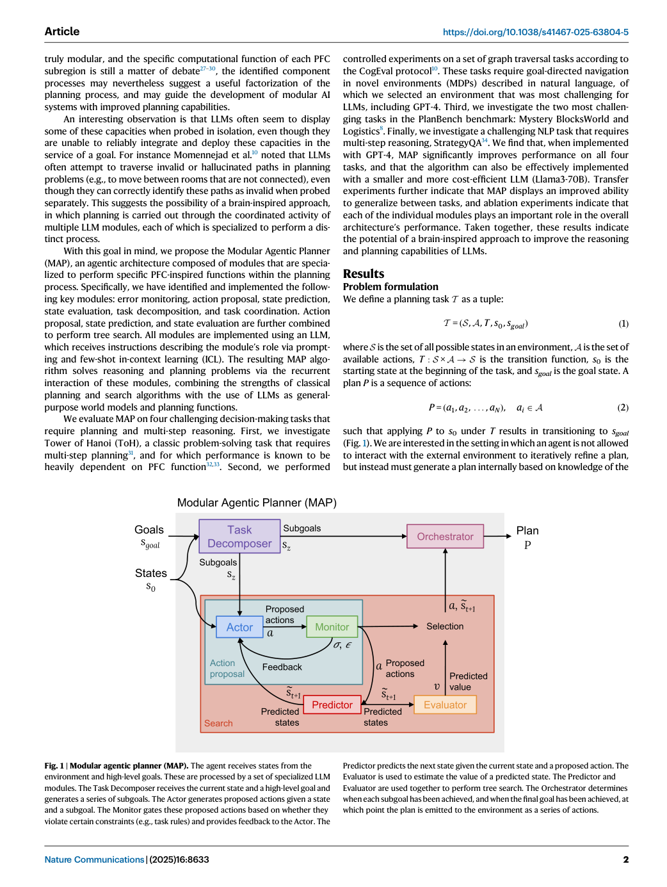
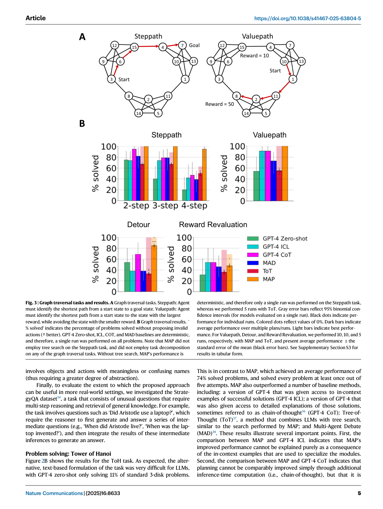

# Figure-by-figure analysis: A brain-inspired agentic architecture to improve planning with LLMs

These are faithful full-page renders from the audited article copy. They are included to keep captions, axes, legends and neighbouring context visible. The Paper Card carries the quantitative interpretation and source pointers; a rendered page is not independent validation of the underlying claim.

## Figure 1 — faithful PDF page view

**What the page shows.** Figure 1 is embedded as an unchanged PDF page view. It contributes Modular agentic planner (MAP). The agent receives states from the environment and high-level goals. These are processed by a set of specialized LLM modules. The Task Decomposer receives the current state and a high-level goal and generates a series of subgoals. The Actor generates proposed actions given a state [Paper: PDF p. 2, Figure 1]

**Evidence role.** This page documents the reported workflow, comparison or result named in the caption and supports the corresponding source-grounded discussion in Sections 07-10 of the Paper Card.

**Boundary.** It does not by itself establish causal attribution to every module, external generalization, unrestricted autonomy, or deployment readiness. Those limits are separated in Sections 11-13.

**Reusable presentation lesson.** Preserve the original denominator, comparator, metric direction, uncertainty display and failure cases when adapting this figure type.

## Figure 2 — faithful PDF page view

**What the page shows.** Figure 2 is embedded as an unchanged PDF page view. It contributes Tower of hanoi task and results. A Depiction of Tower of Hanoi (ToH) task. Original formulation involves disks of different sizes stacked on a set of pegs. Disks must be moved from initial state to goal state while avoiding invalid moves. To test LLMs, an alternative formulation was created involving lists of digits, ensuring that [Paper: PDF p. 3, Figure 2]

**Evidence role.** This page documents the reported workflow, comparison or result named in the caption and supports the corresponding source-grounded discussion in Sections 07-10 of the Paper Card.

**Boundary.** It does not by itself establish causal attribution to every module, external generalization, unrestricted autonomy, or deployment readiness. Those limits are separated in Sections 11-13.

**Reusable presentation lesson.** Preserve the original denominator, comparator, metric direction, uncertainty display and failure cases when adapting this figure type.

## Figure 3 — faithful PDF page view

**What the page shows.** Figure 3 is embedded as an unchanged PDF page view. It contributes Graph traversal tasks and results. A Graph traversal tasks. Steppath: Agent must identify the shortest path from a start state to a goal state. Valuepath: Agent must identify the shortest path from a start state to the state with the largest reward, while avoiding the state with the smaller reward. B Graph traversal results. [Paper: PDF p. 5, Figure 3]

**Evidence role.** This page documents the reported workflow, comparison or result named in the caption and supports the corresponding source-grounded discussion in Sections 07-10 of the Paper Card.

**Boundary.** It does not by itself establish causal attribution to every module, external generalization, unrestricted autonomy, or deployment readiness. Those limits are separated in Sections 11-13.

**Reusable presentation lesson.** Preserve the original denominator, comparator, metric direction, uncertainty display and failure cases when adapting this figure type.

## Figure 4 — faithful PDF page view

**What the page shows.** Figure 4 is embedded as an unchanged PDF page view. It contributes Invalid actions in graph traversal tasks. % invalid' indicates the per­ centage of moves that are invalid (↓ better). GPT-4 Zero-shot, ICL, CoT, and MAD baselines are deterministic, and therefore, a single run was performed on all pro­ blems. Note that MAP did not employ tree search on the Steppath task, and did not [Paper: PDF p. 7, Figure 4]

**Evidence role.** This page documents the reported workflow, comparison or result named in the caption and supports the corresponding source-grounded discussion in Sections 07-10 of the Paper Card.

**Boundary.** It does not by itself establish causal attribution to every module, external generalization, unrestricted autonomy, or deployment readiness. Those limits are separated in Sections 11-13.

**Reusable presentation lesson.** Preserve the original denominator, comparator, metric direction, uncertainty display and failure cases when adapting this figure type.
