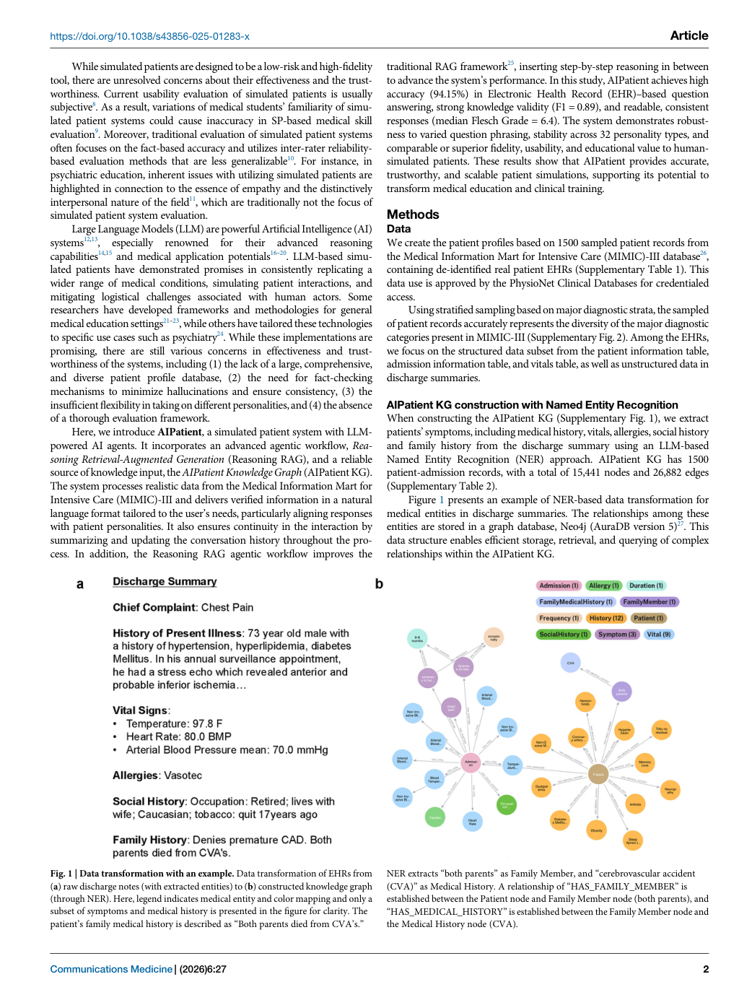
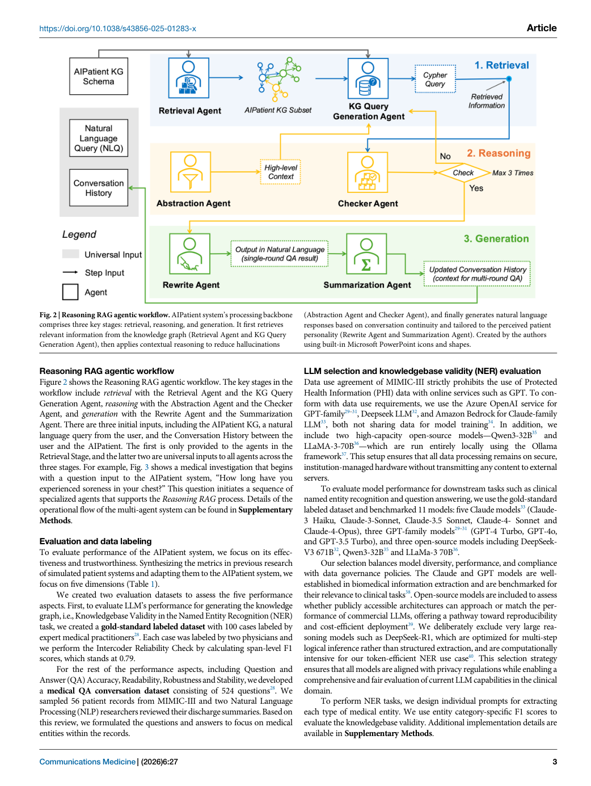
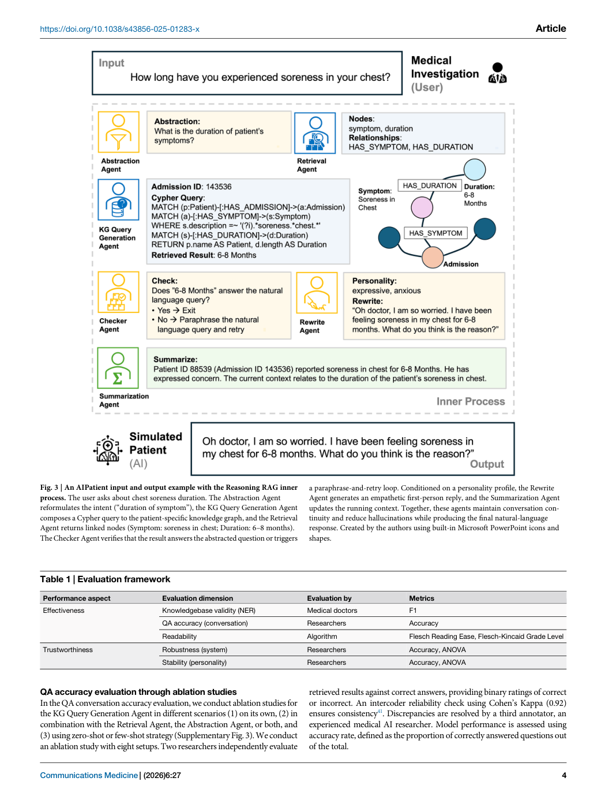
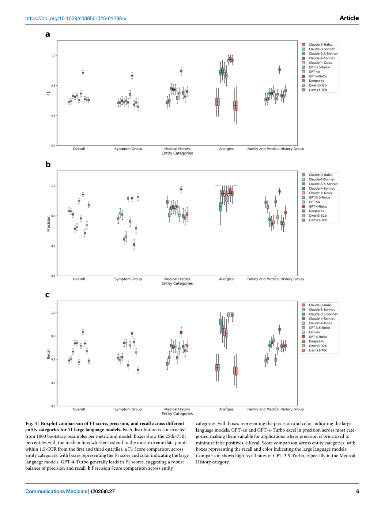
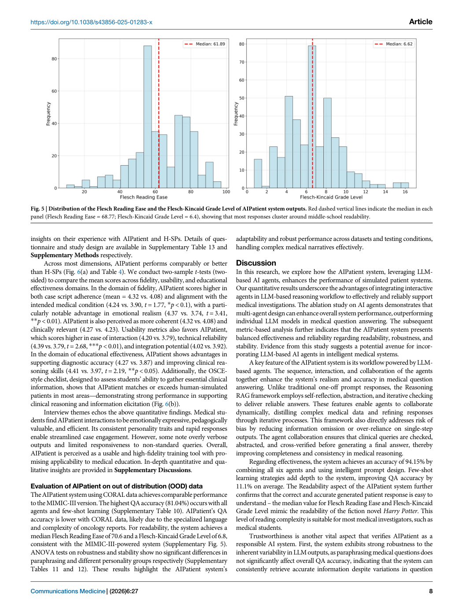
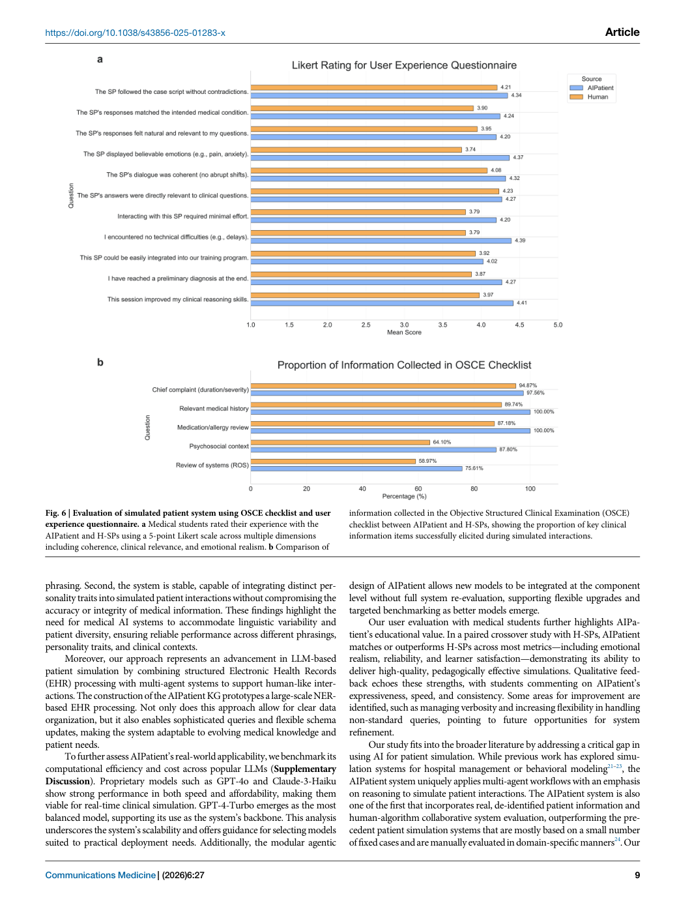

# Figure Analysis: Simulated patient systems powered by large language model-based AI agents offer potential for transforming medical education

This companion analyses the source visuals embedded in the English Paper Card. Assets are unchanged PDF page views; no figure was regenerated.

## Figure 1

- **Argumentative role:** Data transformation with an example. Data transformation of EHRs from (a) raw discharge notes (with extracted entities) to (b) constructed knowledge graph (through NER). Here, legend indicates medical entity and color mapping and only a subset of symptoms and medical history is presented in the figure for clarity. The
- **Panel / visual logic:** Read the panel labels, axes, legends, and uncertainty marks before comparing conditions. The page view is retained so the full caption and neighbouring interpretation remain visible.
- **Reusable design:** Preserve a one-to-one mapping among workflow stage, comparison, metric, and claim.
- **Boundary:** This visual supports only the conditions and endpoints stated in the source; it does not establish transfer beyond the evaluated setting.
- **Locator:** [Paper: PDF p. 2, Figure 1]

## Figure 2

- **Argumentative role:** Reasoning RAG agentic workflow. AIPatient system’s processing backbone comprises three key stages: retrieval, reasoning, and generation. It first retrieves relevant information from the knowledge graph (Retrieval Agent and KG Query Generation Agent), then applies contextual reasoning to reduce hallucinations
- **Panel / visual logic:** Read the panel labels, axes, legends, and uncertainty marks before comparing conditions. The page view is retained so the full caption and neighbouring interpretation remain visible.
- **Reusable design:** Preserve a one-to-one mapping among workflow stage, comparison, metric, and claim.
- **Boundary:** This visual supports only the conditions and endpoints stated in the source; it does not establish transfer beyond the evaluated setting.
- **Locator:** [Paper: PDF p. 3, Figure 2]

## Figure 3

- **Argumentative role:** An AIPatient input and output example with the Reasoning RAG inner process. The user asks about chest soreness duration. The Abstraction Agent reformulates the intent (“duration of symptom”), the KG Query Generation Agent composes a Cypher query to the patient-specific knowledge graph, and the Retrieval
- **Panel / visual logic:** Read the panel labels, axes, legends, and uncertainty marks before comparing conditions. The page view is retained so the full caption and neighbouring interpretation remain visible.
- **Reusable design:** Preserve a one-to-one mapping among workflow stage, comparison, metric, and claim.
- **Boundary:** This visual supports only the conditions and endpoints stated in the source; it does not establish transfer beyond the evaluated setting.
- **Locator:** [Paper: PDF p. 4, Figure 3]

## Figure 4

- **Argumentative role:** Boxplot comparison of F1 score, precision, and recall across different entity categories for 11 large language models. Each distribution is constructed from 1000 bootstrap resamples per metric and model. Boxes show the 25th–75th percentiles with the median line; whiskers extend to the most extreme data points
- **Panel / visual logic:** Read the panel labels, axes, legends, and uncertainty marks before comparing conditions. The page view is retained so the full caption and neighbouring interpretation remain visible.
- **Reusable design:** Preserve a one-to-one mapping among workflow stage, comparison, metric, and claim.
- **Boundary:** This visual supports only the conditions and endpoints stated in the source; it does not establish transfer beyond the evaluated setting.
- **Locator:** [Paper: PDF p. 6, Figure 4]

## Figure 5

- **Argumentative role:** Distribution of the Flesch Reading Ease and the Flesch-Kincaid Grade Level of AIPatient system outputs. Red dashed vertical lines indicate the median in each panel (Flesch Reading Ease = 68.77; Flesch-Kincaid Grade Level = 6.4), showing that most responses cluster around middle-school readability. https://doi.org/10.1038/s43856-025-01283-x
- **Panel / visual logic:** Read the panel labels, axes, legends, and uncertainty marks before comparing conditions. The page view is retained so the full caption and neighbouring interpretation remain visible.
- **Reusable design:** Preserve a one-to-one mapping among workflow stage, comparison, metric, and claim.
- **Boundary:** This visual supports only the conditions and endpoints stated in the source; it does not establish transfer beyond the evaluated setting.
- **Locator:** [Paper: PDF p. 8, Figure 5]

## Figure 6

- **Argumentative role:** Evaluation of simulated patient system using OSCE checklist and user experience questionnaire. a Medical students rated their experience with the AIPatient and H-SPs using a 5-point Likert scale across multiple dimensions including coherence, clinical relevance, and emotional realism. b Comparison of
- **Panel / visual logic:** Read the panel labels, axes, legends, and uncertainty marks before comparing conditions. The page view is retained so the full caption and neighbouring interpretation remain visible.
- **Reusable design:** Preserve a one-to-one mapping among workflow stage, comparison, metric, and claim.
- **Boundary:** This visual supports only the conditions and endpoints stated in the source; it does not establish transfer beyond the evaluated setting.
- **Locator:** [Paper: PDF p. 9, Figure 6]

## Cross-figure reading rule

Read workflow figures before performance figures, then connect every visual comparison to its metric, evaluation population, and claim boundary. Visual density is evidence organisation, not independent proof of generality.