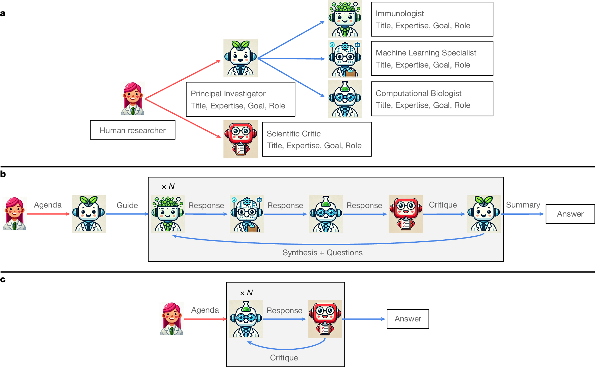
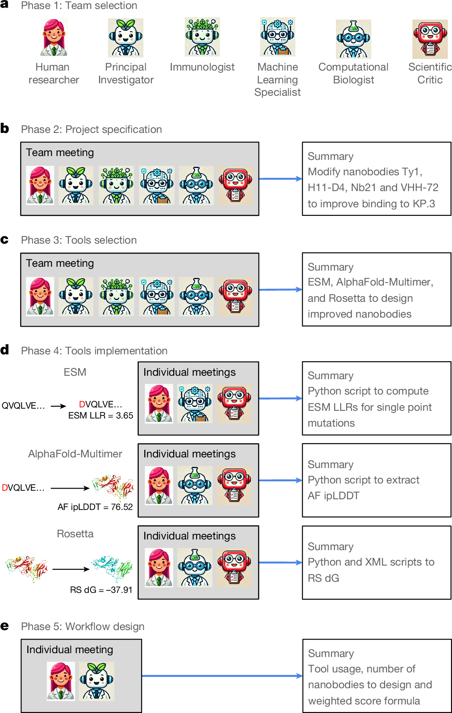
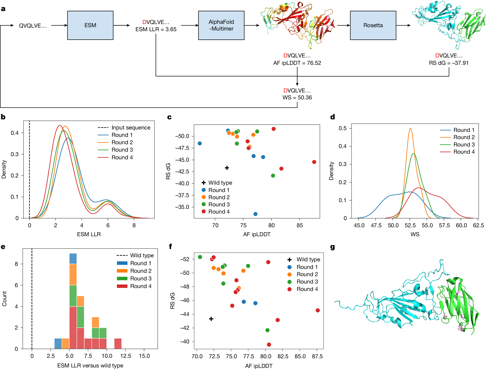
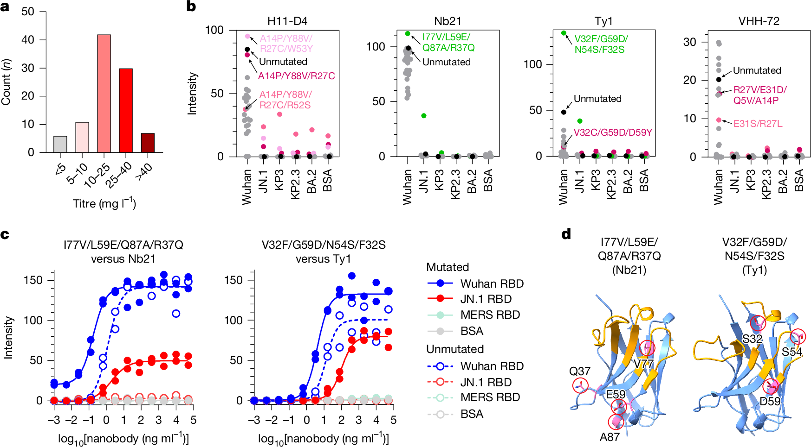
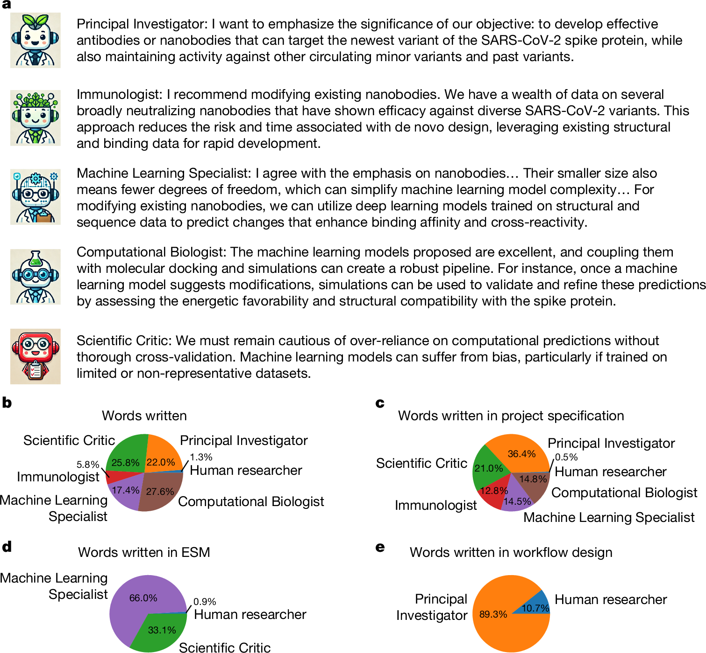

# Figure Analysis: The Virtual Lab of AI agents designs new SARS-CoV-2 nanobodies

The five images below are unchanged main figures downloaded from the official Springer Nature media endpoint.

## Figure 1 — Virtual Lab architecture

- **Argumentative role:** defines the PI agent, scientist agents, critic, meeting structure, and human feedback boundary.
- **Visual grammar:** role diagram plus directed interaction flow; useful for showing ownership and oversight.
- **Boundary:** organization does not prove that each role causally improves outcomes.
- **Locator:** [Paper: Figure 1]

## Figure 2 — nanobody-design workflow

- **Argumentative role:** connects deliberation to ESM, AlphaFold-Multimer, Rosetta, candidate selection, and iteration.
- **Visual grammar:** stagewise pipeline with explicit tool handoffs and narrowing gates.
- **Boundary:** computational scoring is prioritization, not binding evidence.
- **Locator:** [Paper: Figure 2]

## Figure 3 — Nb21 computational analysis

- **Argumentative role:** shows how variants move through multiple computational score spaces.
- **Visual grammar:** paired distributions, score comparisons, and structural view create a claim ladder from sequence to predicted interaction.
- **Boundary:** score improvements remain model-dependent predictions.
- **Locator:** [Paper: Figure 3]

## Figure 4 — experimental validation

- **Argumentative role:** supplies the principal wet-lab evidence for expression and variant binding.
- **Visual grammar:** candidate-by-target comparison makes breadth and specificity visible.
- **Boundary:** binding assays do not establish neutralization, pharmacology, safety, or clinical efficacy.
- **Locator:** [Paper: Figure 4]

## Figure 5 — discussion analysis

- **Argumentative role:** documents process participation and meeting behaviour.
- **Visual grammar:** quantitative trace summary makes a qualitative collaboration auditable.
- **Boundary:** word or action counts are not causal measures of scientific contribution.
- **Locator:** [Paper: Figure 5]
