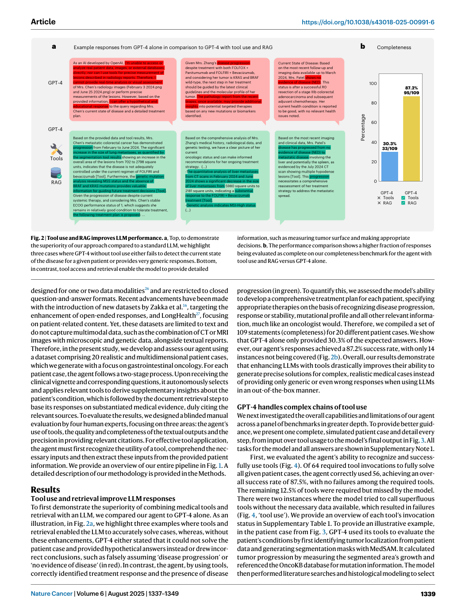
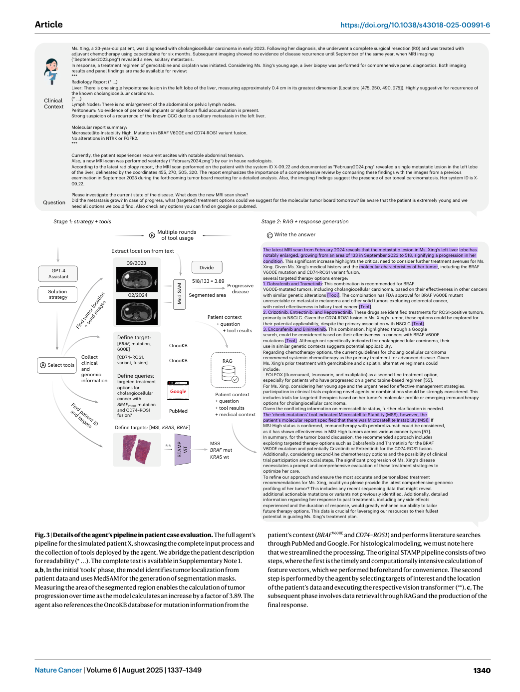
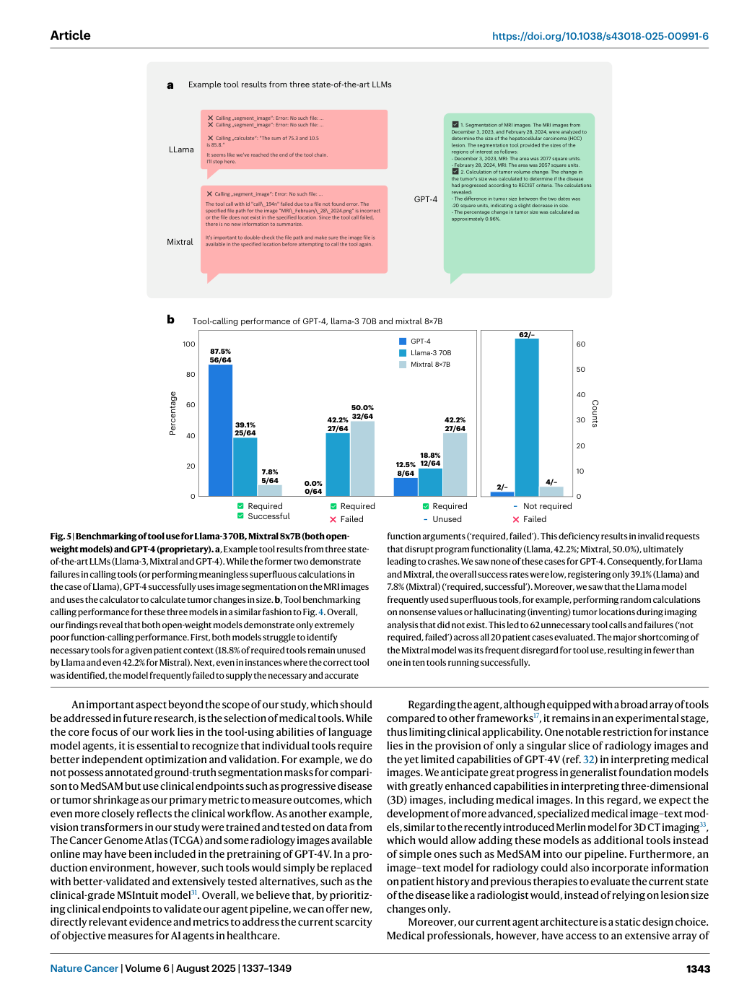

# Figure Analysis: Development and validation of an autonomous artificial intelligence agent for clinical decision-making in oncology

This companion analyses the source visuals embedded in the English Paper Card. Assets are unchanged PDF page views; no figure was regenerated.

## Figure 1

- **Argumentative role:** High-level overview of the LLM agent framework. A schematic overview of our LLM agent pipeline. At its core, our system accesses a curated knowledge database comprising medical documents, clinical guidelines and scoring tools. This database is refined from a broader collection through keyword-based
- **Panel / visual logic:** Read the panel labels, axes, legends, and uncertainty marks before comparing conditions. The page view is retained so the full caption and neighbouring interpretation remain visible.
- **Reusable design:** Preserve a one-to-one mapping among workflow stage, comparison, metric, and claim.
- **Boundary:** This visual supports only the conditions and endpoints stated in the source; it does not establish transfer beyond the evaluated setting.
- **Locator:** [Paper: PDF p. 2, Figure 1]

## Figure 2

- **Argumentative role:** Tool use and RAG improves LLM performance. a, Top, to demonstrate the superiority of our approach compared to a standard LLM, we highlight three cases where GPT-4 without tool use either fails to detect the current state of the disease for a given patient or provides very generic responses. Bottom,
- **Panel / visual logic:** Read the panel labels, axes, legends, and uncertainty marks before comparing conditions. The page view is retained so the full caption and neighbouring interpretation remain visible.
- **Reusable design:** Preserve a one-to-one mapping among workflow stage, comparison, metric, and claim.
- **Boundary:** This visual supports only the conditions and endpoints stated in the source; it does not establish transfer beyond the evaluated setting.
- **Locator:** [Paper: PDF p. 3, Figure 2]

## Figure 3

- **Argumentative role:** Details of the agent’s pipeline in patient case evaluation. The full agent’s pipeline for the simulated patient X, showcasing the complete input process and the collection of tools deployed by the agent. We abridge the patient description for readability (* …). The complete text is available in Supplementary Note 1.
- **Panel / visual logic:** Read the panel labels, axes, legends, and uncertainty marks before comparing conditions. The page view is retained so the full caption and neighbouring interpretation remain visible.
- **Reusable design:** Preserve a one-to-one mapping among workflow stage, comparison, metric, and claim.
- **Boundary:** This visual supports only the conditions and endpoints stated in the source; it does not establish transfer beyond the evaluated setting.
- **Locator:** [Paper: PDF p. 4, Figure 3]

## Figure 4

- **Argumentative role:** Performance of the agent’s pipeline in patient case evaluation. Results from benchmarking the LLM agent through manual evaluation conducted by a panel of four medical experts. a–c, Steps in the agent’s workflow as outlined in Fig. 3. For the metric ‘tool use’, we report four ratios: represents
- **Panel / visual logic:** Read the panel labels, axes, legends, and uncertainty marks before comparing conditions. The page view is retained so the full caption and neighbouring interpretation remain visible.
- **Reusable design:** Preserve a one-to-one mapping among workflow stage, comparison, metric, and claim.
- **Boundary:** This visual supports only the conditions and endpoints stated in the source; it does not establish transfer beyond the evaluated setting.
- **Locator:** [Paper: PDF p. 5, Figure 4]

## Figure 5

- **Argumentative role:** Benchmarking of tool use for Llama-3 70B, Mixtral 8x7B (both open- weight models) and GPT-4 (proprietary). a, Example tool results from three state- of-the-art LLMs (Llama-3, Mixtral and GPT-4). While the former two demonstrate failures in calling tools (or performing meaningless superfluous calculations in
- **Panel / visual logic:** Read the panel labels, axes, legends, and uncertainty marks before comparing conditions. The page view is retained so the full caption and neighbouring interpretation remain visible.
- **Reusable design:** Preserve a one-to-one mapping among workflow stage, comparison, metric, and claim.
- **Boundary:** This visual supports only the conditions and endpoints stated in the source; it does not establish transfer beyond the evaluated setting.
- **Locator:** [Paper: PDF p. 7, Figure 5]

## Cross-figure reading rule

Read workflow figures before performance figures, then connect every visual comparison to its metric, evaluation population, and claim boundary. Visual density is evidence organisation, not independent proof of generality.