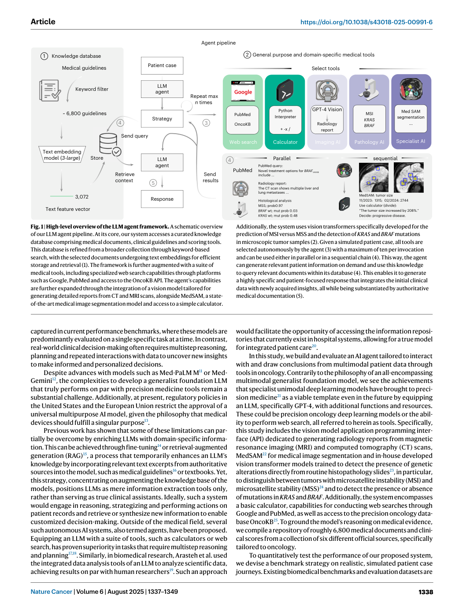
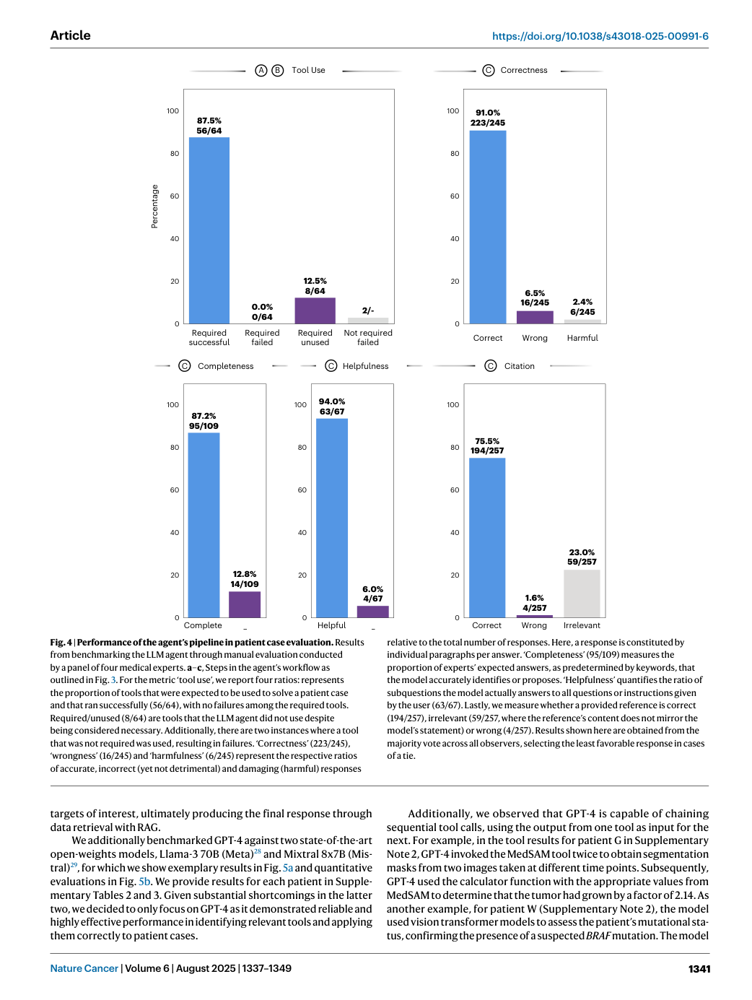

# Figure-by-figure analysis: Development and validation of an autonomous artificial intelligence agent for clinical decision-making in oncology

These are faithful full-page renders from the audited article copy. They are included to keep captions, axes, legends and neighbouring context visible. The Paper Card carries the quantitative interpretation and source pointers; a rendered page is not independent validation of the underlying claim.

## Figure 1 — faithful PDF page view

**What the page shows.** Figure 1 is embedded as an unchanged PDF page view. It contributes High-level overview of the LLM agent framework. A schematic overview of our LLM agent pipeline. At its core, our system accesses a curated knowledge database comprising medical documents, clinical guidelines and scoring tools. This database is refined from a broader collection through keyword-based [Paper: PDF p. 2, Figure 1]

**Evidence role.** This page documents the reported workflow, comparison or result named in the caption and supports the corresponding source-grounded discussion in Sections 07-10 of the Paper Card.

**Boundary.** It does not by itself establish causal attribution to every module, external generalization, unrestricted autonomy, or deployment readiness. Those limits are separated in Sections 11-13.

**Reusable presentation lesson.** Preserve the original denominator, comparator, metric direction, uncertainty display and failure cases when adapting this figure type.

## Figure 2 — faithful PDF page view

**What the page shows.** Figure 2 is embedded as an unchanged PDF page view. It contributes Tool use and RAG improves LLM performance. a, Top, to demonstrate the superiority of our approach compared to a standard LLM, we highlight three cases where GPT-4 without tool use either fails to detect the current state of the disease for a given patient or provides very generic responses. Bottom, [Paper: PDF p. 3, Figure 2]

**Evidence role.** This page documents the reported workflow, comparison or result named in the caption and supports the corresponding source-grounded discussion in Sections 07-10 of the Paper Card.

**Boundary.** It does not by itself establish causal attribution to every module, external generalization, unrestricted autonomy, or deployment readiness. Those limits are separated in Sections 11-13.

**Reusable presentation lesson.** Preserve the original denominator, comparator, metric direction, uncertainty display and failure cases when adapting this figure type.

## Figure 3 — faithful PDF page view

**What the page shows.** Figure 3 is embedded as an unchanged PDF page view. It contributes Details of the agent’s pipeline in patient case evaluation. The full agent’s pipeline for the simulated patient X, showcasing the complete input process and the collection of tools deployed by the agent. We abridge the patient description for readability (* …). The complete text is available in Supplementary Note 1. [Paper: PDF p. 4, Figure 3]

**Evidence role.** This page documents the reported workflow, comparison or result named in the caption and supports the corresponding source-grounded discussion in Sections 07-10 of the Paper Card.

**Boundary.** It does not by itself establish causal attribution to every module, external generalization, unrestricted autonomy, or deployment readiness. Those limits are separated in Sections 11-13.

**Reusable presentation lesson.** Preserve the original denominator, comparator, metric direction, uncertainty display and failure cases when adapting this figure type.

## Figure 4 — faithful PDF page view

**What the page shows.** Figure 4 is embedded as an unchanged PDF page view. It contributes Performance of the agent’s pipeline in patient case evaluation. Results from benchmarking the LLM agent through manual evaluation conducted by a panel of four medical experts. a–c, Steps in the agent’s workflow as outlined in Fig. 3. For the metric ‘tool use’, we report four ratios: represents [Paper: PDF p. 5, Figure 4]

**Evidence role.** This page documents the reported workflow, comparison or result named in the caption and supports the corresponding source-grounded discussion in Sections 07-10 of the Paper Card.

**Boundary.** It does not by itself establish causal attribution to every module, external generalization, unrestricted autonomy, or deployment readiness. Those limits are separated in Sections 11-13.

**Reusable presentation lesson.** Preserve the original denominator, comparator, metric direction, uncertainty display and failure cases when adapting this figure type.

## Figure 5 — faithful PDF page view

**What the page shows.** Figure 5 is embedded as an unchanged PDF page view. It contributes Benchmarking of tool use for Llama-3 70B, Mixtral 8x7B (both open- weight models) and GPT-4 (proprietary). a, Example tool results from three state- of-the-art LLMs (Llama-3, Mixtral and GPT-4). While the former two demonstrate failures in calling tools (or performing meaningless superfluous calculations in [Paper: PDF p. 7, Figure 5]

**Evidence role.** This page documents the reported workflow, comparison or result named in the caption and supports the corresponding source-grounded discussion in Sections 07-10 of the Paper Card.

**Boundary.** It does not by itself establish causal attribution to every module, external generalization, unrestricted autonomy, or deployment readiness. Those limits are separated in Sections 11-13.

**Reusable presentation lesson.** Preserve the original denominator, comparator, metric direction, uncertainty display and failure cases when adapting this figure type.
