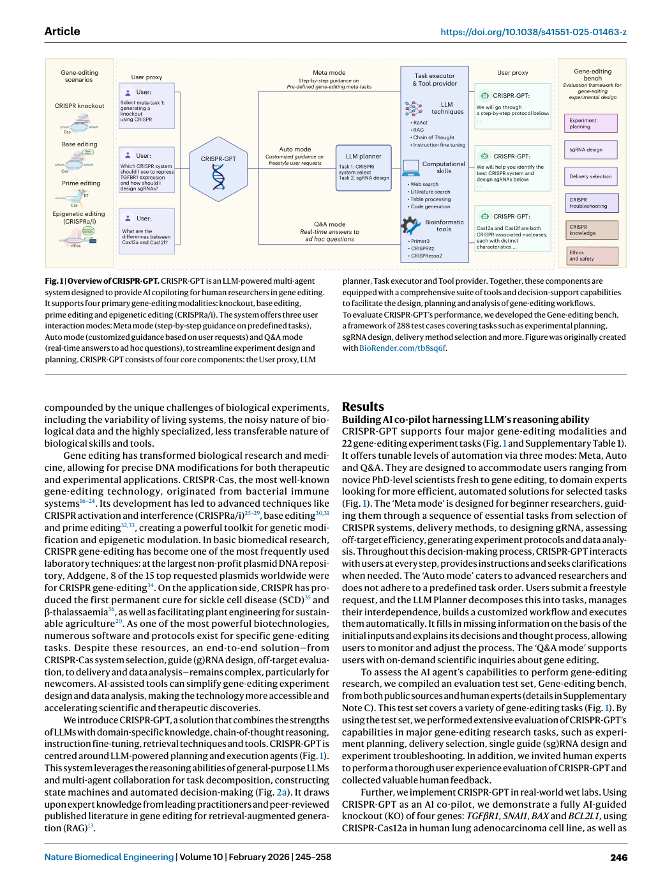
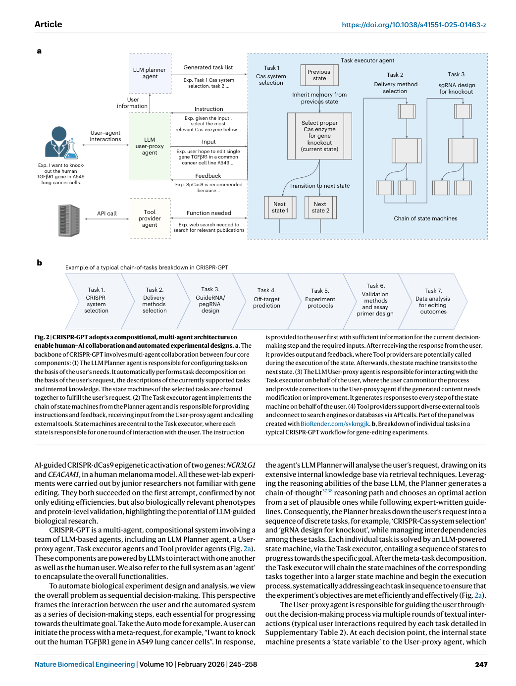
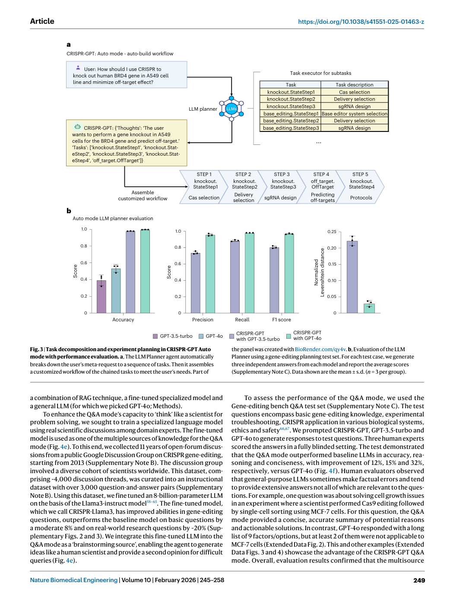
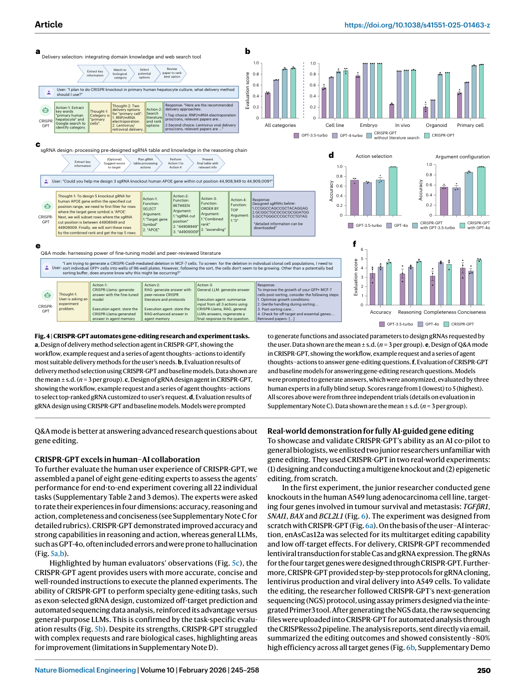
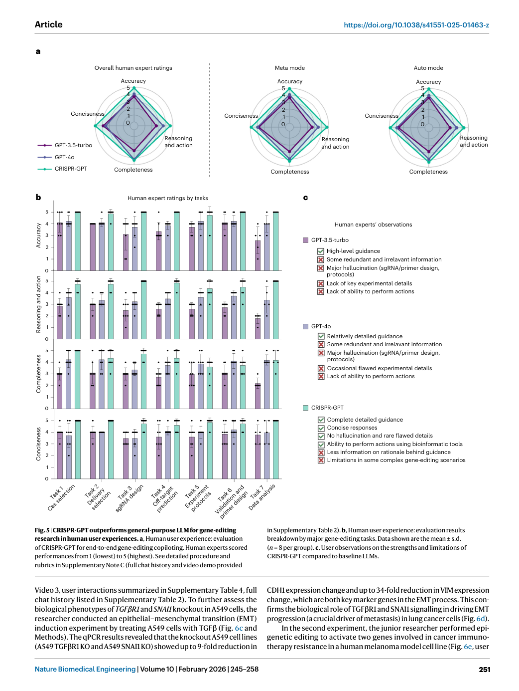
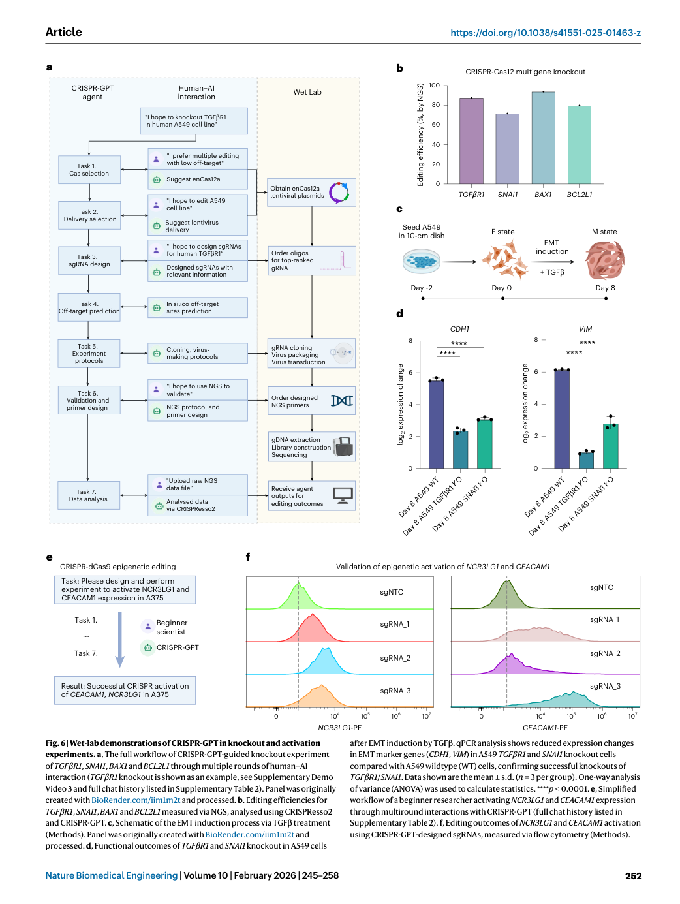

# Figure Analysis: CRISPR-GPT for agentic automation of gene-editing experiments

This companion analyses the source visuals embedded in the English Paper Card. Assets are unchanged PDF page views; no figure was regenerated.

## Figure 1

- **Argumentative role:** Overview of CRISPR-GPT. CRISPR-GPT is an LLM-powered multi-agent system designed to provide AI copiloting for human researchers in gene editing. It supports four primary gene-editing modalities: knockout, base editing, prime editing and epigenetic editing (CRISPRa/i). The system offers three user
- **Panel / visual logic:** Read the panel labels, axes, legends, and uncertainty marks before comparing conditions. The page view is retained so the full caption and neighbouring interpretation remain visible.
- **Reusable design:** Preserve a one-to-one mapping among workflow stage, comparison, metric, and claim.
- **Boundary:** This visual supports only the conditions and endpoints stated in the source; it does not establish transfer beyond the evaluated setting.
- **Locator:** [Paper: PDF p. 2, Figure 1]

## Figure 2

- **Argumentative role:** CRISPR-GPT adopts a compositional, multi-agent architecture to enable human–AI collaboration and automated experimental designs. a, The backbone of CRISPR-GPT involves multi-agent collaboration between four core components: (1) The LLM Planner agent is responsible for configuring tasks on
- **Panel / visual logic:** Read the panel labels, axes, legends, and uncertainty marks before comparing conditions. The page view is retained so the full caption and neighbouring interpretation remain visible.
- **Reusable design:** Preserve a one-to-one mapping among workflow stage, comparison, metric, and claim.
- **Boundary:** This visual supports only the conditions and endpoints stated in the source; it does not establish transfer beyond the evaluated setting.
- **Locator:** [Paper: PDF p. 3, Figure 2]

## Figure 3

- **Argumentative role:** Task decomposition and experiment planning in CRISPR-GPT Auto mode with performance evaluation. a, The LLM Planner agent automatically breaks down the user’s meta-request to a sequence of tasks. Then it assembles a customized workflow of the chained tasks to meet the user’s needs. Part of
- **Panel / visual logic:** Read the panel labels, axes, legends, and uncertainty marks before comparing conditions. The page view is retained so the full caption and neighbouring interpretation remain visible.
- **Reusable design:** Preserve a one-to-one mapping among workflow stage, comparison, metric, and claim.
- **Boundary:** This visual supports only the conditions and endpoints stated in the source; it does not establish transfer beyond the evaluated setting.
- **Locator:** [Paper: PDF p. 5, Figure 3]

## Figure 4

- **Argumentative role:** CRISPR-GPT automates gene-editing research and experiment tasks. a, Design of delivery method selection agent in CRISPR-GPT, showing the workflow, example request and a series of agent thoughts–actions to identify most suitable delivery methods for the user’s needs. b, Evaluation results of
- **Panel / visual logic:** Read the panel labels, axes, legends, and uncertainty marks before comparing conditions. The page view is retained so the full caption and neighbouring interpretation remain visible.
- **Reusable design:** Preserve a one-to-one mapping among workflow stage, comparison, metric, and claim.
- **Boundary:** This visual supports only the conditions and endpoints stated in the source; it does not establish transfer beyond the evaluated setting.
- **Locator:** [Paper: PDF p. 6, Figure 4]

## Figure 5

- **Argumentative role:** CRISPR-GPT outperforms general-purpose LLM for gene-editing research in human user experiences. a, Human user experience: evaluation of CRISPR-GPT for end-to-end gene-editing copiloting. Human experts scored performances from 1 (lowest) to 5 (highest). See detailed procedure and
- **Panel / visual logic:** Read the panel labels, axes, legends, and uncertainty marks before comparing conditions. The page view is retained so the full caption and neighbouring interpretation remain visible.
- **Reusable design:** Preserve a one-to-one mapping among workflow stage, comparison, metric, and claim.
- **Boundary:** This visual supports only the conditions and endpoints stated in the source; it does not establish transfer beyond the evaluated setting.
- **Locator:** [Paper: PDF p. 7, Figure 5]

## Figure 6

- **Argumentative role:** Wet-lab demonstrations of CRISPR-GPT in knockout and activation experiments. a, The full workflow of CRISPR-GPT-guided knockout experiment of TGFβR1, SNAI1, BAX1 and BCL2L1 through multiple rounds of human–AI interaction (TGFβR1 knockout is shown as an example, see Supplementary Demo
- **Panel / visual logic:** Read the panel labels, axes, legends, and uncertainty marks before comparing conditions. The page view is retained so the full caption and neighbouring interpretation remain visible.
- **Reusable design:** Preserve a one-to-one mapping among workflow stage, comparison, metric, and claim.
- **Boundary:** This visual supports only the conditions and endpoints stated in the source; it does not establish transfer beyond the evaluated setting.
- **Locator:** [Paper: PDF p. 8, Figure 6]

## Cross-figure reading rule

Read workflow figures before performance figures, then connect every visual comparison to its metric, evaluation population, and claim boundary. Visual density is evidence organisation, not independent proof of generality.