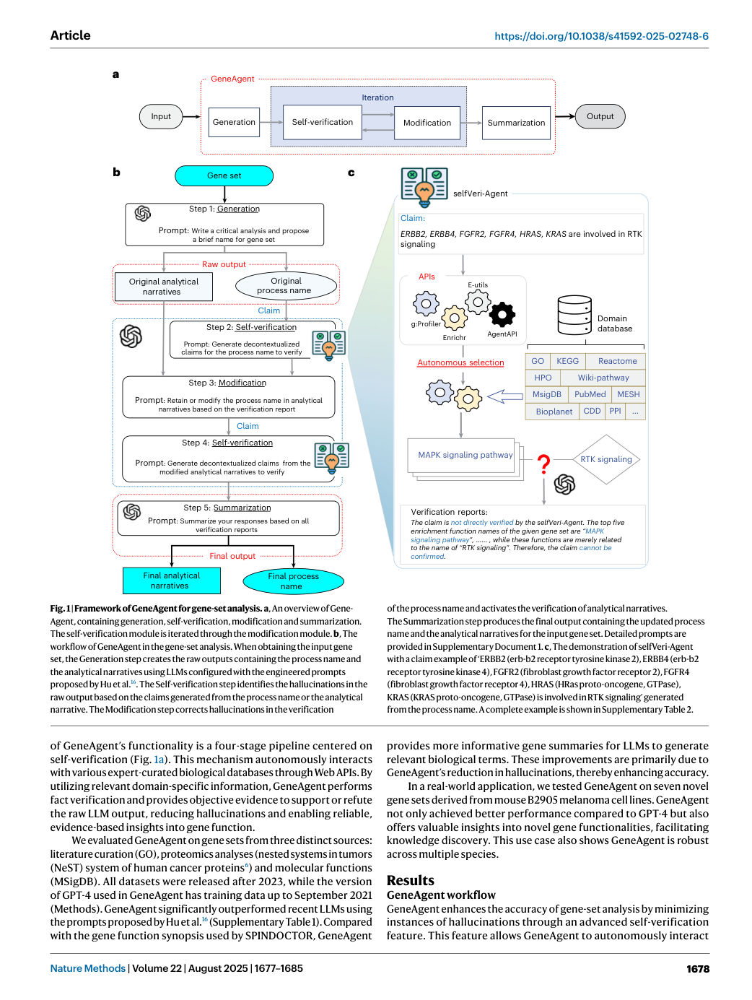
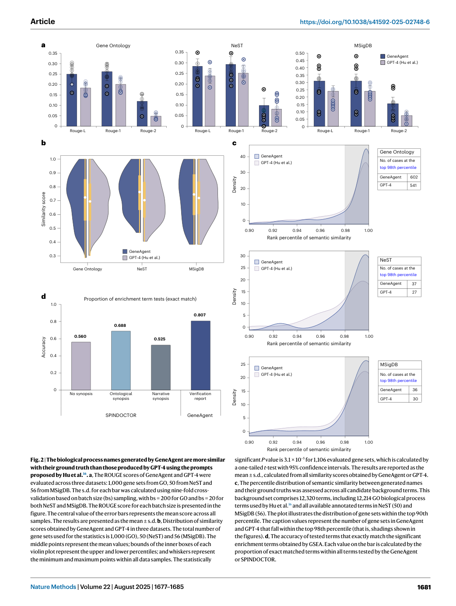
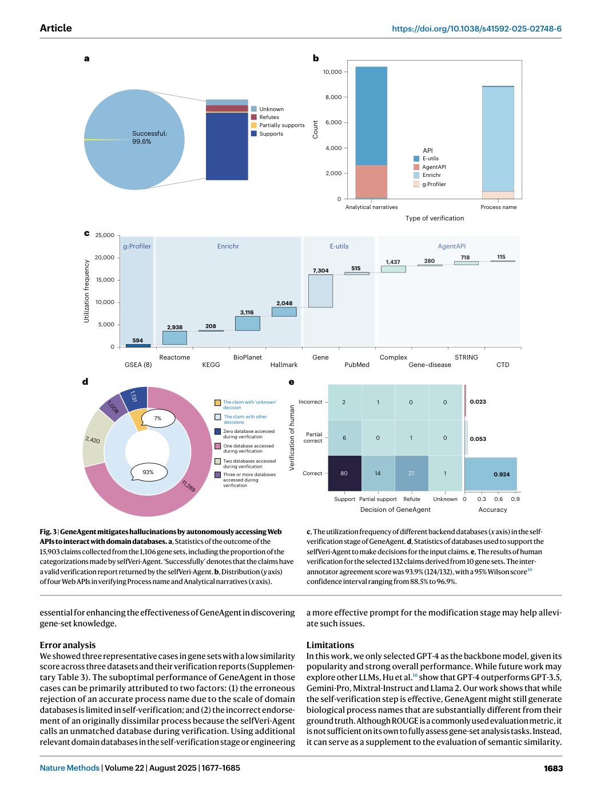

# Figure Analysis: GeneAgent: self-verification language agent for gene-set analysis using domain databases

This companion analyses the source visuals embedded in the English Paper Card. Assets are unchanged PDF page views; no figure was regenerated.

## Figure 1

- **Argumentative role:** Framework of GeneAgent for gene-set analysis. a, An overview of Gene­ Agent, containing generation, self-verification, modification and summarization. The self-verification module is iterated through the modification module. b, The workflow of GeneAgent in the gene-set analysis. When obtaining the input gene
- **Panel / visual logic:** Read the panel labels, axes, legends, and uncertainty marks before comparing conditions. The page view is retained so the full caption and neighbouring interpretation remain visible.
- **Reusable design:** Preserve a one-to-one mapping among workflow stage, comparison, metric, and claim.
- **Boundary:** This visual supports only the conditions and endpoints stated in the source; it does not establish transfer beyond the evaluated setting.
- **Locator:** [Paper: PDF p. 2, Figure 1]

## Figure 2

- **Argumentative role:** The biological process names generated by GeneAgent are more similar with their ground truth than those produced by GPT-4 using the prompts proposed by Hu et al.16. a, The ROUGE scores of GeneAgent and GPT-4 were evaluated across three datasets: 1,000 gene sets from GO, 50 from NeST and
- **Panel / visual logic:** Read the panel labels, axes, legends, and uncertainty marks before comparing conditions. The page view is retained so the full caption and neighbouring interpretation remain visible.
- **Reusable design:** Preserve a one-to-one mapping among workflow stage, comparison, metric, and claim.
- **Boundary:** This visual supports only the conditions and endpoints stated in the source; it does not establish transfer beyond the evaluated setting.
- **Locator:** [Paper: PDF p. 5, Figure 2]

## Figure 3

- **Argumentative role:** GeneAgent mitigates hallucinations by autonomously accessing Web APIs to interact with domain databases. a, Statistics of the outcome of the 15,903 claims collected from the 1,106 gene sets, including the proportion of the categorizations made by selfVeri-Agent. ‘Successfully’ denotes that the claims have
- **Panel / visual logic:** Read the panel labels, axes, legends, and uncertainty marks before comparing conditions. The page view is retained so the full caption and neighbouring interpretation remain visible.
- **Reusable design:** Preserve a one-to-one mapping among workflow stage, comparison, metric, and claim.
- **Boundary:** This visual supports only the conditions and endpoints stated in the source; it does not establish transfer beyond the evaluated setting.
- **Locator:** [Paper: PDF p. 7, Figure 3]

## Cross-figure reading rule

Read workflow figures before performance figures, then connect every visual comparison to its metric, evaluation population, and claim boundary. Visual density is evidence organisation, not independent proof of generality.