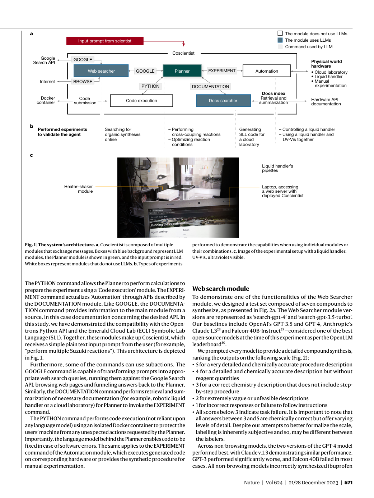
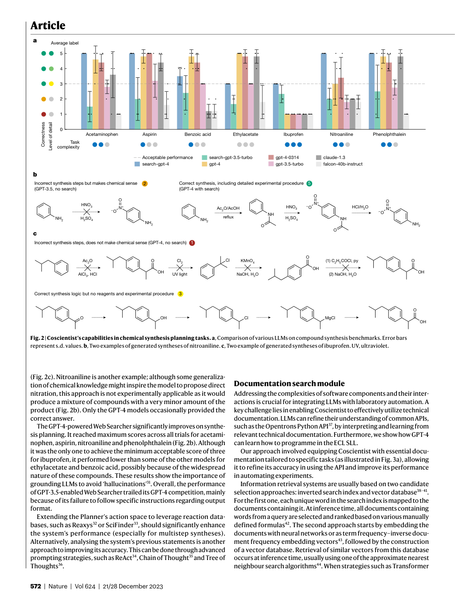
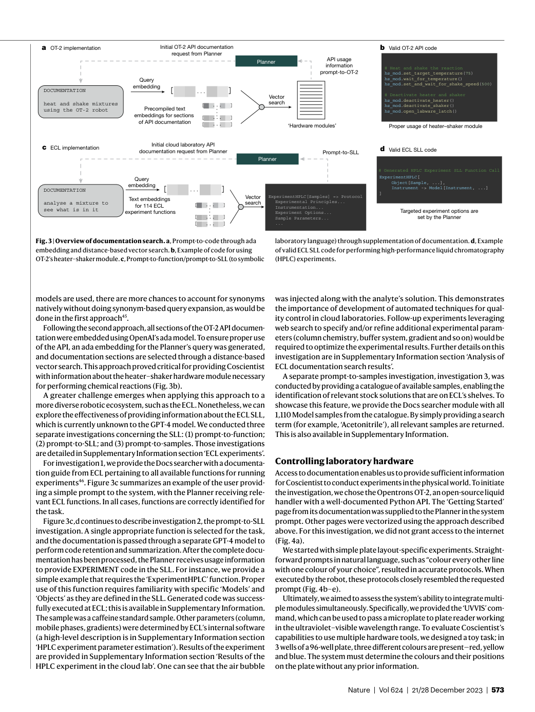
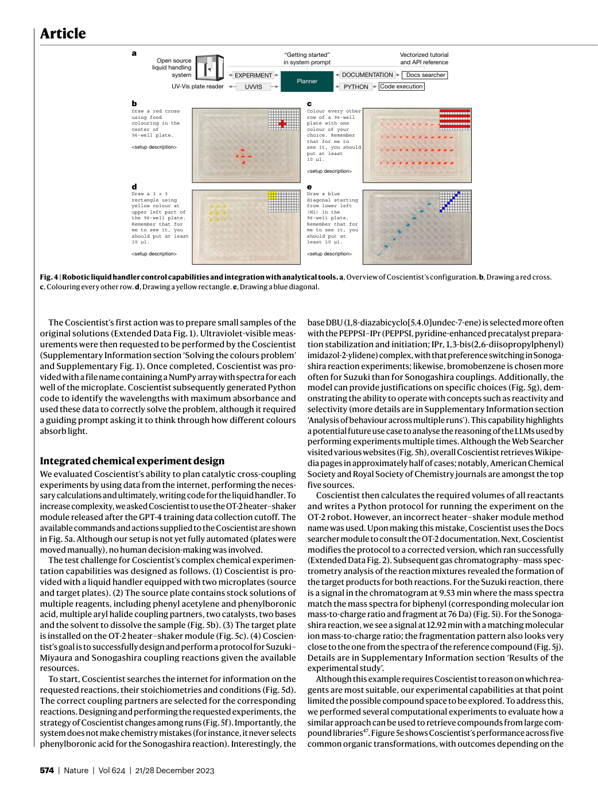
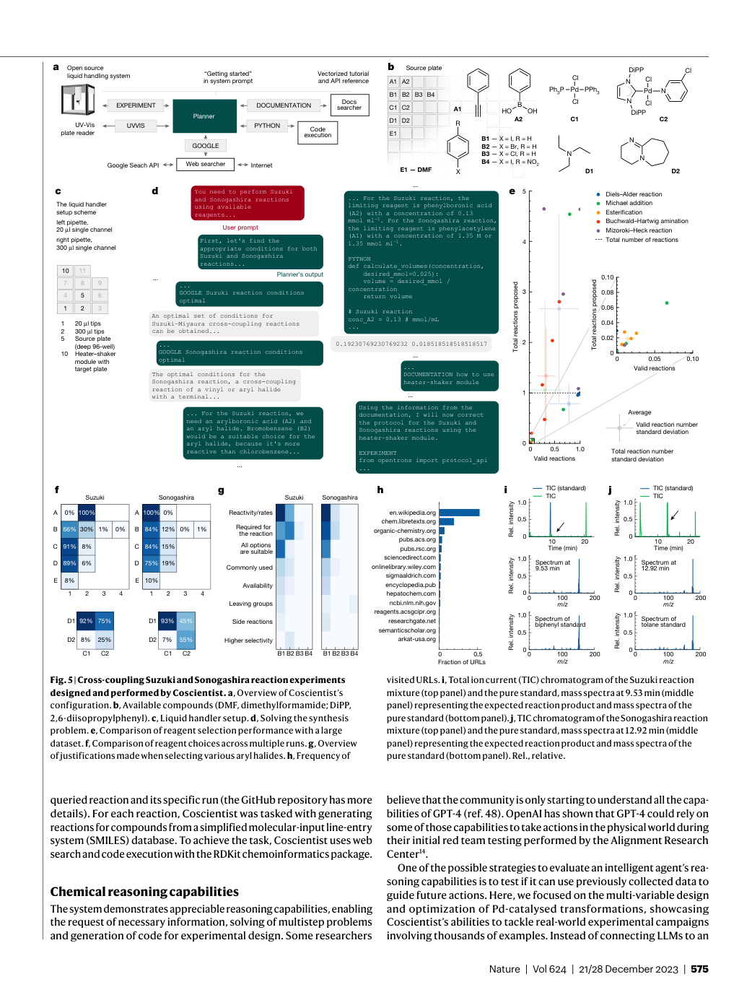
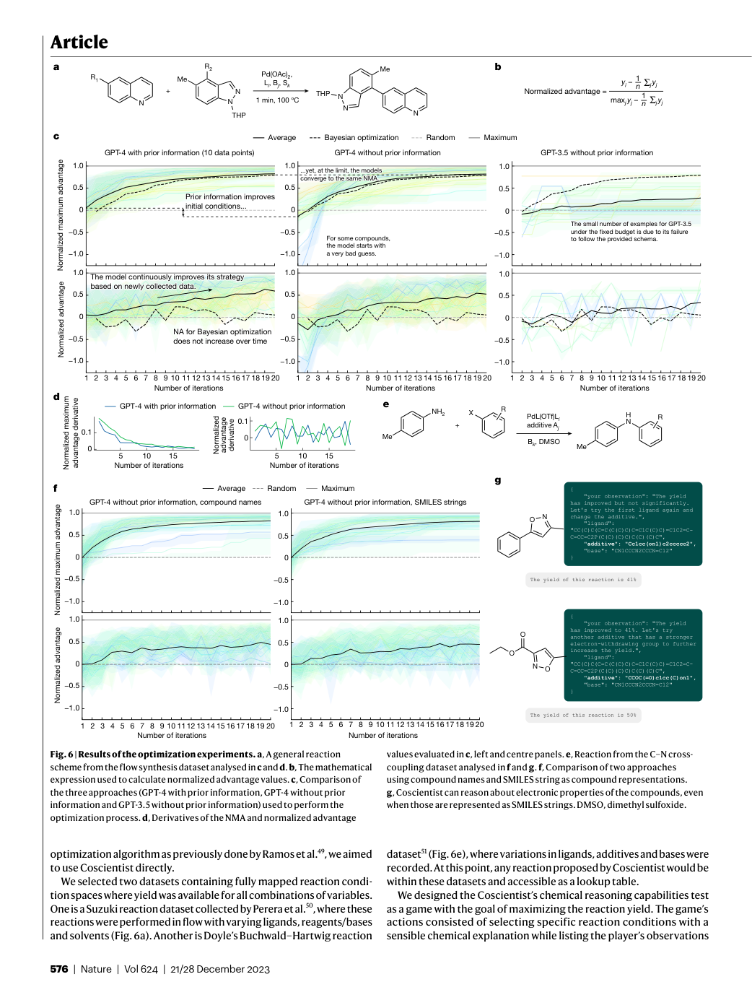

# Figure Analysis: Autonomous chemical research with large language models

This companion analyses the source visuals embedded in the English Paper Card. Assets are unchanged PDF page views; no figure was regenerated.

## Figure 1

- **Argumentative role:** The system’s architecture. a, Coscientist is composed of multiple modules that exchange messages. Boxes with blue background represent LLM modules, the Planner module is shown in green, and the input prompt is in red. White boxes represent modules that do not use LLMs. b, Types of experiments
- **Panel / visual logic:** Read the panel labels, axes, legends, and uncertainty marks before comparing conditions. The page view is retained so the full caption and neighbouring interpretation remain visible.
- **Reusable design:** Preserve a one-to-one mapping among workflow stage, comparison, metric, and claim.
- **Boundary:** This visual supports only the conditions and endpoints stated in the source; it does not establish transfer beyond the evaluated setting.
- **Locator:** [Paper: PDF p. 2, Figure 1]

## Figure 2

- **Argumentative role:** Coscientist’s capabilities in chemical synthesis planning tasks. a, Comparison of various LLMs on compound synthesis benchmarks. Error bars represent s.d. values. b, Two examples of generated syntheses of nitroaniline. c, Two example of generated syntheses of ibuprofen. UV, ultraviolet.
- **Panel / visual logic:** Read the panel labels, axes, legends, and uncertainty marks before comparing conditions. The page view is retained so the full caption and neighbouring interpretation remain visible.
- **Reusable design:** Preserve a one-to-one mapping among workflow stage, comparison, metric, and claim.
- **Boundary:** This visual supports only the conditions and endpoints stated in the source; it does not establish transfer beyond the evaluated setting.
- **Locator:** [Paper: PDF p. 3, Figure 2]

## Figure 3

- **Argumentative role:** Overview of documentation search. a, Prompt-to-code through ada embedding and distance-based vector search. b, Example of code for using OT-2’s heater–shaker module. c, Prompt-to-function/prompt-to-SLL (to symbolic laboratory language) through supplementation of documentation. d, Example
- **Panel / visual logic:** Read the panel labels, axes, legends, and uncertainty marks before comparing conditions. The page view is retained so the full caption and neighbouring interpretation remain visible.
- **Reusable design:** Preserve a one-to-one mapping among workflow stage, comparison, metric, and claim.
- **Boundary:** This visual supports only the conditions and endpoints stated in the source; it does not establish transfer beyond the evaluated setting.
- **Locator:** [Paper: PDF p. 4, Figure 3]

## Figure 4

- **Argumentative role:** Robotic liquid handler control capabilities and integration with analytical tools. a, Overview of Coscientist’s configuration. b, Drawing a red cross. c, Colouring every other row. d, Drawing a yellow rectangle. e, Drawing a blue diagonal.
- **Panel / visual logic:** Read the panel labels, axes, legends, and uncertainty marks before comparing conditions. The page view is retained so the full caption and neighbouring interpretation remain visible.
- **Reusable design:** Preserve a one-to-one mapping among workflow stage, comparison, metric, and claim.
- **Boundary:** This visual supports only the conditions and endpoints stated in the source; it does not establish transfer beyond the evaluated setting.
- **Locator:** [Paper: PDF p. 5, Figure 4]

## Figure 5

- **Argumentative role:** Cross-coupling Suzuki and Sonogashira reaction experiments designed and performed by Coscientist. a, Overview of Coscientist’s configuration. b, Available compounds (DMF, dimethylformamide; DiPP, 2,6-diisopropylphenyl). c, Liquid handler setup. d, Solving the synthesis
- **Panel / visual logic:** Read the panel labels, axes, legends, and uncertainty marks before comparing conditions. The page view is retained so the full caption and neighbouring interpretation remain visible.
- **Reusable design:** Preserve a one-to-one mapping among workflow stage, comparison, metric, and claim.
- **Boundary:** This visual supports only the conditions and endpoints stated in the source; it does not establish transfer beyond the evaluated setting.
- **Locator:** [Paper: PDF p. 6, Figure 5]

## Figure 6

- **Argumentative role:** Results of the optimization experiments. a, A general reaction scheme from the flow synthesis dataset analysed in c and d. b, The mathematical expression used to calculate normalized advantage values. c, Comparison of the three approaches (GPT-4 with prior information, GPT-4 without prior
- **Panel / visual logic:** Read the panel labels, axes, legends, and uncertainty marks before comparing conditions. The page view is retained so the full caption and neighbouring interpretation remain visible.
- **Reusable design:** Preserve a one-to-one mapping among workflow stage, comparison, metric, and claim.
- **Boundary:** This visual supports only the conditions and endpoints stated in the source; it does not establish transfer beyond the evaluated setting.
- **Locator:** [Paper: PDF p. 7, Figure 6]

## Cross-figure reading rule

Read workflow figures before performance figures, then connect every visual comparison to its metric, evaluation population, and claim boundary. Visual density is evidence organisation, not independent proof of generality.